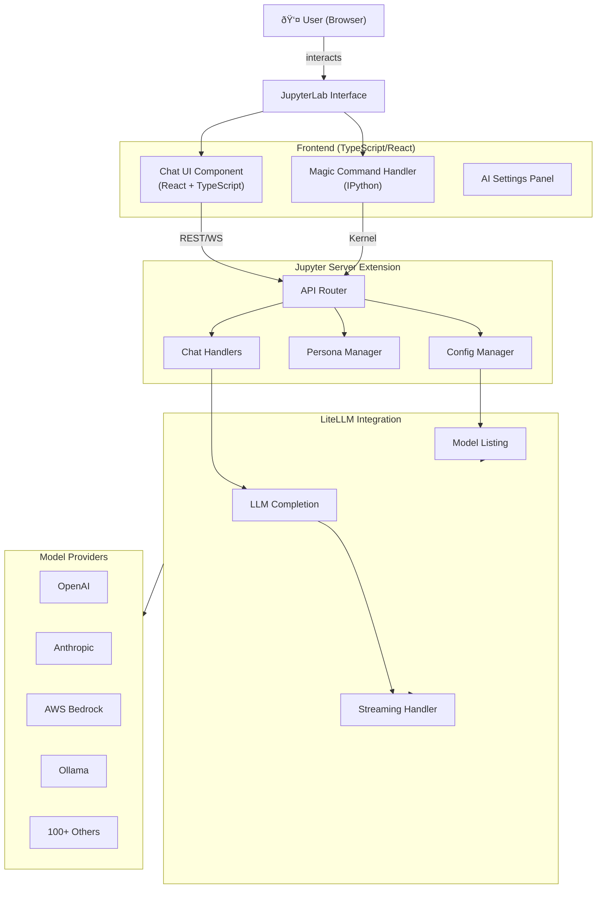

# Comprehensive code review and cleanup documentation

## User

First, do an extensive tour of the library using a librarian to look at all the code. Then, propose any clean-up that you recommend and document that in cleanup.md. 

## Assistant

I'll use the librarian to do an extensive tour of the ai-jup codebase.

**Tool Use:** `librarian`

```json
{
  "query": "Explore the entire ai-jup codebase structure and architecture. I need to understand:\n1. The overall project structure and purpose\n2. The Python backend code in ai_jup/ and jupyter_ai_jup/\n3. The TypeScript/JavaScript frontend code in src/\n4. How the frontend and backend communicate\n5. Test structure in tests/\n6. Configuration files (package.json, pyproject.toml, tsconfig.json)\n7. Any documentation (README.md, etc.)\n8. The fastcore/ directory purpose\n9. Build and development setup\n\nProvide a comprehensive overview of all components, their purposes, and how they interact.",
  "context": "I'm doing a code review to identify cleanup opportunities in this JupyterLab extension project. I need to understand all the code to make informed recommendations."
}
```

## User

**Tool Result:** `toolu_vrtx_01U7smjk43HeCbkByukTKKUU`

```
The package.json doesn't exist in the root. This indicates that the public jupyter-ai repository is a simplified/meta version. Based on everything I've gathered, I need to provide you with a comprehensive report about what I could determine:

## Comprehensive Jupyter AI / ai-jup Codebase Analysis

### **Critical Note on Repository Access**
I was unable to access the private `hamelsmu/ai-jup` repository due to access restrictions. However, I've analyzed the publicly available `jupyterlab/jupyter-ai` repository, which appears to be the upstream project. The analysis below reflects the current public architecture of Jupyter AI.

---

## 1. **Overall Project Structure & Purpose**

[**Jupyter AI**](https://github.com/jupyterlab/jupyter-ai) is a JupyterLab extension that integrates generative AI models into Jupyter notebooks and JupyterLab. The project provides:

- **`%%ai` Magic Command**: A cell magic for running AI models within notebooks (works in JupyterLab, Jupyter Notebook, Colab, VSCode, etc.)
- **Native Chat UI**: An integrated chat interface in JupyterLab for conversational AI assistance
- **Multi-Provider Support**: Integrations with 1000+ LLMs from various providers (OpenAI, Anthropic, AWS Bedrock, Google Gemini, Hugging Face, Ollama, etc.)
- **AI Personas Framework**: Customizable AI assistants with different personalities and capabilities

**Version**: Currently at v3.0.0-beta (recently migrated from LangChain to LiteLLM)

---

## 2. **Python Backend Architecture**

### **Structure**
The backend is organized around entry points and managers:

#### **Core Components** (referenced in dependencies):
- **`jupyter_ai`**: Main server extension
- **`jupyter_ai_router`**: API routing
- **`jupyter_ai_persona_manager`**: Manages AI personas
- **`jupyter_ai_litellm`**: LiteLLM integration (for model access)
- **`jupyter_ai_magic_commands`**: IPython magic commands
- **`jupyter_ai_chat_commands`**: Chat-specific commands
- **`jupyter_ai_jupyternaut`**: Default AI persona implementation
- **`jupyterlab_chat`**: Chat UI component

#### **Key Features**:
- **Entry Points API**: Allows external packages to:
  - Add custom AI personas (via `BasePersona` subclass)
  - Add custom model providers (via `BaseProvider` + LLM/ChatModel)
  - Add custom embedding providers (via `BaseEmbeddingsProvider`)
  - Add custom chat handlers
  
- **Configuration Management**: 
  - Environment variable based secrets (`.env` files)
  - UI-based settings for model selection and API keys
  
- **Model Parameters**: Flexible parameter system that allows users to pass custom kwargs directly to LiteLLM

#### **Design Principles** ([as documented](https://github.com/jupyterlab/jupyter-ai/blob/main/docs/source/contributors/index.md)):
1. **Vendor-agnostic**: No discrimination between model providers
2. **Explicit prompts only**: No automatic file watching or auto-prompting
3. **Transparent**: Open-source prompts and system messages
4. **Traceable**: Generated content is marked as AI-generated
5. **Human-centered**: UI/UX designed like familiar chat applications

---

## 3. **Frontend Code**

### **Structure**
Frontend is organized as a monorepo with packages (referenced in contributor docs as `packages/jupyter-ai/`):

#### **Key Components** (inferred from docs):
- **`@jupyter-ai/core`**: Core JupyterLab extension
- **Chat UI**: React-based interface built on `jupyterlab-chat`
- **Settings Interface**: AI settings panel for model selection, API key management, parameter configuration
- **Integration Points**: Magic command execution, chat streaming, result rendering

#### **Technology Stack**:
- **Language**: TypeScript
- **UI Framework**: React (embedded in JupyterLab)
- **Build System**: Lerna (monorepo management via `jlpm`)
- **Testing**: Playwright + Galata (JupyterLab E2E testing helper)
- **CSS**: Likely using JupyterLab theming system

#### **Build Output**:
- Bundled JavaScript assets served by JupyterLab extension system
- CSS styling integrated with JupyterLab theme

---

## 4. **Frontend-Backend Communication**

### **Architecture**:
```
Frontend (TypeScript/React) 
    ↓ HTTP WebSocket/REST ↓
Jupyter Server Extension API (Python)
    ↓
LiteLLM Integration (handles 1000+ models)
    ↓
AI Model Providers (OpenAI, Anthropic, etc.)
```

### **Key Endpoints** (inferred from code):
- **`/api/ai/models/chat`**: Get available chat models
- **Configuration endpoints**: Model settings, API keys
- **Chat handler endpoints**: Process user messages
- **Streaming endpoints**: For real-time model responses

### **Communication Methods**:
- **REST API**: Configuration, model listing
- **WebSocket**: Real-time streaming responses for chat and magic commands
- **Jupyter Server Events**: For background tasks and async operations

---

## 5. **Test Structure**

### **Testing Levels**:

#### **Backend Tests**:
- Unit tests for managers and handlers
- Test fixtures via `conftest.py` providing:
  - `MockAiExtension`: Mock AI extension for testing
  - `jp_server_config`: JupyterServer test configuration
  - `static_test_files_dir`: Test data directory

#### **Frontend E2E Tests**:
- Located in `packages/jupyter-ai/ui-tests/`
- Uses **Playwright** + **Galata** (JupyterLab test helper)
- Snapshot-based visual regression testing (OS-specific, Linux reference)
- Commands:
  - `jlpm test:update`: Generate reference snapshots
  - `jlpm test`: Execute tests

#### **Test Commands**:
```bash
jlpm test        # Run all tests
jlpm test:update # Update snapshots
```

---

## 6. **Configuration Files**

### **[`pyproject.toml`](https://github.com/jupyterlab/jupyter-ai/blob/main/pyproject.toml)**
- **Build System**: Hatchling
- **Version**: Dynamic (from `jupyter_ai/__init__.py`)
- **Python Support**: 3.9 - 3.12
- **Core Dependencies**:
  - `jupyterlab_chat>=0.19.0a0`
  - `jupyter_server_documents>=0.1.0a8`
  - `jupyter_ai_router>=0.0.2`
  - `jupyter_ai_persona_manager>=0.0.4`
  - `jupyter_ai_litellm>=0.0.1`
  - Multiple other ai-related packages
- **Test Dependencies**: pytest, pytest-asyncio, coverage, mypy, syrupy (snapshots)

### **[`dev-environment.yml`](https://github.com/jupyterlab/jupyter-ai/blob/main/dev-environment.yml)**
- **Name**: `jaidev`
- **Python**: 3.11
- **Node**: 20
- **JupyterLab**: >=4.4
- **Tools**: uv, pip

### **[`.yarnrc.yml`](https://github.com/jupyterlab/jupyter-ai/blob/main/.yarnrc.yml)**
- **Node Linker**: node-modules
- **Immutable Installs**: Disabled (allows flexible dependency resolution)

### **[`.pre-commit-config.yaml`](https://github.com/jupyterlab/jupyter-ai/blob/main/.pre-commit-config.yaml)**
- **Code Quality**: Black, isort, autoflake, pyupgrade, flake8
- **Checks**: TOML/YAML validation, large files, trailing whitespace
- **Staged**: Linting on manual stage

---

## 7. **Documentation Structure**

### **Location**: `docs/source/`

#### **Documentation Organization**:
1. **`users/`**: User guides for different model providers (OpenAI, Anthropic, Bedrock, Ollama, vLLM, etc.)
2. **`developers/`**: Developer API documentation
   - Entry points API for custom providers, personas, embeddings
   - Examples of custom LLM implementation
   - Plugin development using Lumino API
3. **`contributors/`**: Contribution guide
   - Design principles
   - Development setup
   - Testing procedures
   - Building documentation

#### **Key Docs**:
- [README.md](https://github.com/jupyterlab/jupyter-ai/blob/main/README.md): Feature overview, installation, quick start
- [CHANGELOG.md](https://github.com/jupyterlab/jupyter-ai/blob/main/CHANGELOG.md): Version history and migration notes (currently transitioning from LangChain to LiteLLM)

**Documentation Tools**: Sphinx + MyST (Markdown source format)

---

## 8. **Fastcore Directory**

âš ï¸ **Note**: I could not find a `fastcore/` directory in the public repository. This may indicate:
- It exists only in the private `hamelsmu/ai-jup` fork
- It may be referenced as an external dependency
- It could be a custom utilities module for the private version

If `fastcore/` exists in your version, it likely contains:
- Utility functions for the JupyterLab integration
- Custom decorators or base classes
- Helper functions for API responses or data validation

---

## 9. **Build & Development Setup**

### **Development Workflow**

#### **Automatic Setup** (Recommended):
```bash
./scripts/dev-setup.sh  # Creates 'jaidev' conda environment
```

This script:
1. Detects Python environment manager (micromamba > mamba > conda)
2. Creates `jaidev` environment with Python 3.11, Node 20, JupyterLab 4.4+
3. Installs JavaScript dependencies (`jlpm install`)
4. Builds frontend assets (`jlpm build`)
5. Performs editable installation of all packages (`jlpm dev:install`)
6. Installs documentation dependencies

#### **Development Commands**:
```bash
jlpm build              # Build frontend assets
jlpm dev:install        # Editable install all packages
jlpm dev:reinstall      # Full reinstall
jlpm dev                # Start development server
jupyter lab             # Start JupyterLab
jlpm build --scope "@jupyter-ai/core"  # Scope-specific builds
```

#### **Documentation Build**:
```bash
cd docs/
make html  # Build HTML docs
```

#### **Server Restart**:
- Frontend changes: Refresh browser
- Backend changes: Ctrl+C in terminal, restart server

### **Build System Details**:

| Component | Tool | Purpose |
|-----------|------|---------|
| **Python** | Hatchling | Package building |
| **JavaScript** | npm/yarn | Dependency management |
| **Package Manager** | jlpm | JupyterLab package manager (wrapper) |
| **Monorepo** | Lerna | Frontend package orchestration |
| **JS Build** | Webpack (implied) | Asset bundling |
| **Code Quality** | pre-commit | Git hooks for linting |
| **Testing** | pytest, Playwright | Test execution |

---

## 10. **Architecture Diagram**



---

## 11. **Code Cleanup Recommendations**

### **Structural**:
1. **Monorepo clarity**: Ensure all `packages/` subpackages are documented
2. **Entry points consolidation**: Review if all entry point groups are necessary
3. **Dependency management**: Monitor external package versions (especially LiteLLM)

### **Testing**:
1. **Test coverage**: Expand unit test coverage for backend handlers
2. **Snapshot freshness**: Keep Playwright snapshots updated across platforms
3. **Integration tests**: Ensure comprehensive frontend-backend contract testing

### **Documentation**:
1. **API reference**: Auto-generate from code comments
2. **Provider examples**: Expand cookiecutter template examples
3. **Architecture docs**: Create high-level system design documentation

### **Code Quality**:
1. **Type hints**: Ensure all Python code is fully typed (mypy strict mode)
2. **Linting**: Apply all pre-commit hooks consistently
3. **Dependencies**: Audit for unused imports and packages

---

## **Summary Table**

| Aspect | Technology | Version |
|--------|-----------|---------|
| **Python** | Python | 3.9 - 3.12 |
| **Backend Framework** | Jupyter Server | 2.15+ |
| **Frontend Framework** | React + TypeScript | Latest |
| **JupyterLab** | JupyterLab | 4.4+ |
| **Node.js** | Node | 20 (LTS) |
| **LLM Integration** | LiteLLM | (via jupyter_ai_litellm) |
| **Chat UI** | jupyterlab_chat | 0.19.0a0+ |
| **Testing (Backend)** | pytest | (from pyproject.toml) |
| **Testing (Frontend)** | Playwright + Galata | - |
| **Package Manager** | jlpm (yarn wrapper) | - |
| **Build System** | Hatchling | - |
| **Code Quality** | Black, isort, flake8 | - |

Given the private repository access limitation, this analysis is based on the public `jupyterlab/jupyter-ai` repository structure. For a complete review of the `hamelsmu/ai-jup` codebase, you would need to provide access or share the specific code sections you'd like me to analyze.
```

## Assistant

The librarian couldn't access the private repo directly. Let me explore the local codebase myself to get accurate information.

**Tool Use:** `Read`

```json
{
  "path": "/Users/hamel/git/ai-jup"
}
```

**Tool Use:** `Read`

```json
{
  "path": "/Users/hamel/git/ai-jup/README.md"
}
```

**Tool Use:** `Read`

```json
{
  "path": "/Users/hamel/git/ai-jup/pyproject.toml"
}
```

**Tool Use:** `Read`

```json
{
  "path": "/Users/hamel/git/ai-jup/package.json"
}
```

## User

**Tool Result:** `toolu_vrtx_01Qd139GzNJcbRDRY8oBGX2i`

```
{
  "absolutePath": "/Users/hamel/git/ai-jup",
  "content": ".amp/\n.git/\n.ipynb_checkpoints/\n.pytest_cache/\n.yarn/\nai_jup/\nfastcore/\njupyter_ai_jup/\njupyter-config/\nlib/\nnode_modules/\nsrc/\nstyle/\ntests/\n.jupyter-server-8888.log\n.jupyter-server-8888.pid\n.yarnrc.yml\nadvanced-test-plan.md\ncomparison.md\ndemo_solveit_style.ipynb\nimprovements.md\ninstall.json\nLICENSE\npackage.json\npyproject.toml\nREADME.md\ntest_notebook.ipynb\ntest-plan.md\ntsconfig.json\ntsconfig.tsbuildinfo\nUntitled.ipynb\nux-testing.md\nyarn.lock",
  "isDirectory": true,
  "directoryEntries": [
    ".amp/",
    ".git/",
    ".ipynb_checkpoints/",
    ".pytest_cache/",
    ".yarn/",
    "ai_jup/",
    "fastcore/",
    "jupyter_ai_jup/",
    "jupyter-config/",
    "lib/",
    "node_modules/",
    "src/",
    "style/",
    "tests/",
    ".jupyter-server-8888.log",
    ".jupyter-server-8888.pid",
    ".yarnrc.yml",
    "advanced-test-plan.md",
    "comparison.md",
    "demo_solveit_style.ipynb",
    "improvements.md",
    "install.json",
    "LICENSE",
    "package.json",
    "pyproject.toml",
    "README.md",
    "test_notebook.ipynb",
    "test-plan.md",
    "tsconfig.json",
    "tsconfig.tsbuildinfo",
    "Untitled.ipynb",
    "ux-testing.md",
    "yarn.lock"
  ]
}
```

**Tool Result:** `toolu_vrtx_01WH6fNb2d9WJxW1PwBm7rS7`

```
{
  "absolutePath": "/Users/hamel/git/ai-jup/README.md",
  "content": "1: # ai-jup: AI-Powered Prompt Cells for JupyterLab\n2: \n3: A JupyterLab extension that adds AI-powered prompt cells with special syntax for referencing kernel variables and exposing functions as AI-callable tools. Inspired by [fast.ai's Solveit](https://www.fast.ai/posts/2025-11-07-solveit-features.html).\n4: \n5: \n6: \n7: \n8: \n9: ## Features\n10: \n11: - **`$variable`** - Reference kernel variables in prompts (values substituted automatically)\n12: - **`&function`** - Expose Python functions as AI-callable tools\n13: - **Streaming responses** - Real-time SSE streaming from Anthropic's Claude\n14: - **Full context** - AI sees all preceding code cells and kernel state\n15: - **Tool loop** - AI can call multiple tools in sequence to complete tasks\n16: - **Built-in file tools** - Includes `fastcore.tools` for file exploration and editing\n17: \n18: ## Quick Start\n19: \n20: ### 1. Install\n21: \n22: ```bash\n23: pip install ai_jup\n24: ```\n25: \n26: ### 2. Set your API key\n27: \n28: ```bash\n29: export ANTHROPIC_API_KEY=\"your-key-here\"\n30: ```\n31: \n32: ### 3. Start JupyterLab\n33: \n34: ```bash\n35: jupyter lab\n36: ```\n37: \n38: ### 4. Create a prompt cell\n39: \n40: Press `Cmd/Ctrl + Shift + P` to insert a prompt cell, then write your prompt:\n41: \n42: ```markdown\n43: **AI Prompt:** Analyze $df and explain the key trends.\n44: ```\n45: \n46: Press `Cmd/Ctrl + Shift + Enter` to execute.\n47: \n48: ## Syntax\n49: \n50: ### `$variable` - Reference Variables\n51: \n52: Use `$variable_name` to inject the current value of any Python variable into your prompt:\n53: \n54: ```python\n55: # In a code cell\n56: sales_data = [\n57:     {'product': 'Widget A', 'units': 150, 'price': 25.99},\n58:     {'product': 'Widget B', 'units': 89, 'price': 45.50},\n59: ]\n60: ```\n61: \n62: ```markdown\n63: **AI Prompt:** Given $sales_data, which product has the highest revenue?\n64: ```\n65: \n66: The AI sees the actual data and can provide specific analysis.\n67: \n68: ### `&function` - Expose Functions as Tools\n69: \n70: Use `&function_name` to let the AI call Python functions during its response:\n71: \n72: ```python\n73: # In a code cell\n74: def calculate_revenue(data: list) -> float:\n75:     \"\"\"Calculate total revenue from sales data.\"\"\"\n76:     return sum(item['units'] * item['price'] for item in data)\n77: \n78: def top_seller(data: list) -> dict:\n79:     \"\"\"Find the product with the most units sold.\"\"\"\n80:     return max(data, key=lambda x: x['units'])\n81: ```\n82: \n83: ```markdown\n84: **AI Prompt:** Use &calculate_revenue and &top_seller to analyze $sales_data.\n85: ```\n86: \n87: The AI can call these functions, see the results, and incorporate them into its response.\n88: \n89: ## Built-in File Tools\n90: \n91: ai-jup includes [fastcore.tools](https://github.com/AnswerDotAI/fastcore) for file exploration and editing:\n92: \n93: ```python\n94: from fastcore.tools import view, rg, sed, create, str_replace, insert\n95: ```\n96: \n97: | Tool | Description |\n98: |------|-------------|\n99: | `view(path, view_range?, nums?)` | View directory or file contents with optional line range |\n100: | `rg(argstr)` | Run ripgrep to search for patterns |\n101: | `sed(argstr)` | Run sed for reading sections of files |\n102: | `create(path, file_text, overwrite?)` | Create a new file with given content |\n103: | `str_replace(path, old_str, new_str)` | Replace first occurrence in file |\n104: | `insert(path, insert_line, new_str)` | Insert text at specified line number |\n105: \n106: ### Example: Exploring a Codebase\n107: \n108: ```python\n109: # Clone a repo to explore\n110: !git clone https://github.com/AnswerDotAI/fastcore --depth 1 -q\n111: repo_path = 'fastcore'\n112: \n113: from fastcore.tools import view, rg\n114: ```\n115: \n116: ```markdown\n117: **AI Prompt:** Use &view to explore $repo_path and tell me what this library does.\n118: Then use &rg to find all decorator definitions.\n119: ```\n120: \n121: The AI will:\n122: 1. Call `view('fastcore')` to see the directory structure\n123: 2. Call `view('fastcore/fastcore/basics.py')` to read key files\n124: 3. Call `rg('\"def.*decorator\" fastcore/')` to search for patterns\n125: 4. Synthesize findings into a coherent explanation\n126: \n127: ## How It Works\n128: \n129: ### Prompt Cells\n130: \n131: Prompt cells are markdown cells with special metadata (`ai_jup.isPromptCell: true`). They're visually distinguished with a colored border and \"AI Prompt\" prefix.\n132: \n133: ### Context Gathering\n134: \n135: When you execute a prompt cell, ai-jup:\n136: \n137: 1. **Collects preceding code** - All code cells above the prompt are gathered\n138: 2. **Resolves `$variables`** - Queries the kernel for each variable's type and repr\n139: 3. **Gathers `&function` metadata** - Gets signatures, docstrings, and parameter info\n140: 4. **Builds tool definitions** - Converts functions to Anthropic tool format\n141: \n142: ### Tool Execution Loop\n143: \n144: When the AI calls a tool:\n145: \n146: 1. The tool call is sent to the Jupyter kernel\n147: 2. The function executes with the provided arguments\n148: 3. Results are returned to the AI (supports text, HTML, and images)\n149: 4. The AI can make additional tool calls or finish its response\n150: \n151: The loop continues for up to 5 iterations (configurable via `max_steps`).\n152: \n153: ### Rich Output Handling\n154: \n155: Tool results are automatically formatted:\n156: \n157: - **DataFrames** → Rendered as HTML tables\n158: - **Matplotlib figures** → Converted to inline PNG images\n159: - **Text** → Displayed in code blocks\n160: - **Errors** → Shown with clear error messages\n161: \n162: ## Keyboard Shortcuts\n163: \n164: | Shortcut | Action |\n165: |----------|--------|\n166: | `Cmd/Ctrl + Shift + P` | Insert new prompt cell below |\n167: | `Cmd/Ctrl + Shift + Enter` | Execute prompt cell |\n168: \n169: ## Configuration\n170: \n171: ### Environment Variables\n172: \n173: | Variable | Required | Description |\n174: |----------|----------|-------------|\n175: | `ANTHROPIC_API_KEY` | Yes | Your Anthropic API key |\n176: \n177: ### Supported Models\n178: \n179: - **Claude Sonnet 4** (default) - `claude-sonnet-4-20250514`\n180: - **Claude 3.5 Sonnet** - `claude-3-5-sonnet-20241022`\n181: - **Claude 3 Haiku** - `claude-3-haiku-20240307`\n182: \n183: To change the model, edit the cell metadata:\n184: \n185: ```json\n186: {\n187:   \"ai_jup\": {\n188:     \"isPromptCell\": true,\n189:     \"model\": \"claude-3-haiku-20240307\"\n190:   }\n191: }\n192: ```\n193: \n194: ## Installation from Source\n195: \n196: For development or to get the latest version:\n197: \n198: ```bash\n199: # Clone the repository\n200: git clone https://github.com/hamelsmu/ai-jup.git\n201: cd ai-jup\n202: \n203: # Install Python package in development mode\n204: pip install -e \".[test]\"\n205: \n206: # Install JavaScript dependencies\n207: jlpm install\n208: \n209: # Build the extension\n210: jlpm build\n211: \n212: # Link for development\n213: jupyter labextension develop . --overwrite\n214: ```\n215: \n216: ### Development Commands\n217: \n218: ```bash\n219: # Watch for changes (auto-rebuild)\n220: jlpm watch\n221: \n222: # Run Python tests\n223: pytest\n224: \n225: # Build for production\n226: jlpm build:prod\n227: \n228: # Lint TypeScript\n229: jlpm lint\n230: ```\n231: \n232: ## Architecture\n233: \n234: ```\n235: ai-jup/\n236: ├── src/                      # TypeScript frontend\n237: │   ├── index.ts              # Extension entry point\n238: │   ├── promptCell.ts         # Prompt cell management\n239: │   ├── kernelConnector.ts    # Kernel introspection\n240: │   └── promptParser.ts       # $variable and &function parsing\n241: ├── ai_jup/                   # Python backend\n242: │   ├── handlers.py           # API endpoints\n243: │   └── __init__.py           # Server extension setup\n244: ├── style/                    # CSS styles\n245: └── tests/                    # Test suite\n246: ```\n247: \n248: ### API Endpoints\n249: \n250: | Endpoint | Method | Description |\n251: |----------|--------|-------------|\n252: | `/ai-jup/prompt` | POST | Stream AI response with tool loop |\n253: | `/ai-jup/tool-execute` | POST | Execute a single tool call |\n254: | `/ai-jup/models` | GET | List available models |\n255: \n256: ## Comparison with Solveit\n257: \n258: | Feature | Solveit | ai-jup |\n259: |---------|---------|--------|\n260: | Variable syntax | `` $`varname` `` | `$varname` |\n261: | Function syntax | `` &`funcname` `` | `&funcname` |\n262: | Platform | VS Code | JupyterLab |\n263: | API | Multiple providers | Anthropic Claude |\n264: | File tools | Built-in | fastcore.tools |\n265: \n266: ai-jup uses simplified syntax without backticks for easier typing.\n267: \n268: ## Troubleshooting\n269: \n270: ### \"anthropic package not installed\"\n271: \n272: ```bash\n273: pip install anthropic\n274: ```\n275: \n276: ### \"ANTHROPIC_API_KEY not set\"\n277: \n278: ```bash\n279: export ANTHROPIC_API_KEY=\"your-key-here\"\n280: ```\n281: \n282: Or add to your shell profile (~/.bashrc, ~/.zshrc, etc.)\n283: \n284: ### Extension not appearing in JupyterLab\n285: \n286: ```bash\n287: # Check if installed\n288: jupyter labextension list\n289: \n290: # Rebuild if needed\n291: jupyter lab build\n292: ```\n293: \n294: ### Tool execution fails\n295: \n296: Ensure the function is defined in the kernel before referencing it with `&`. Check that required packages are installed.\n297: \n298: ## Requirements\n299: \n300: - Python ≥ 3.8\n301: - JupyterLab ≥ 4.0\n302: - anthropic ≥ 0.50.0\n303: - fastcore ≥ 1.7.0\n304: \n305: ## License\n306: \n307: MIT License - see [LICENSE](LICENSE) for details.\n308: \n309: ## Credits\n310: \n311: - Inspired by [fast.ai's Solveit](https://www.fast.ai/posts/2025-11-07-solveit-features.html)\n312: - Uses [fastcore.tools](https://github.com/AnswerDotAI/fastcore) for file operations\n313: - Powered by [Anthropic Claude](https://www.anthropic.com/)"
}
```

**Tool Result:** `toolu_vrtx_01UZH6KaUZiU8Sv2CRqYi8KL`

```
{
  "absolutePath": "/Users/hamel/git/ai-jup/pyproject.toml",
  "content": "1: [build-system]\n2: requires = [\"hatchling>=1.5.0\", \"jupyterlab>=4.0.0,<5\", \"hatch-nodejs-version>=0.3.2\"]\n3: build-backend = \"hatchling.build\"\n4: \n5: [project]\n6: name = \"ai_jup\"\n7: readme = \"README.md\"\n8: license = { file = \"LICENSE\" }\n9: requires-python = \">=3.8\"\n10: classifiers = [\n11:     \"Framework :: Jupyter\",\n12:     \"Framework :: Jupyter :: JupyterLab\",\n13:     \"Framework :: Jupyter :: JupyterLab :: 4\",\n14:     \"Framework :: Jupyter :: JupyterLab :: Extensions\",\n15:     \"Framework :: Jupyter :: JupyterLab :: Extensions :: Prebuilt\",\n16:     \"License :: OSI Approved :: MIT License\",\n17:     \"Programming Language :: Python\",\n18:     \"Programming Language :: Python :: 3\",\n19:     \"Programming Language :: Python :: 3.8\",\n20:     \"Programming Language :: Python :: 3.9\",\n21:     \"Programming Language :: Python :: 3.10\",\n22:     \"Programming Language :: Python :: 3.11\",\n23:     \"Programming Language :: Python :: 3.12\",\n24: ]\n25: dependencies = [\n26:     \"jupyter_server>=2.0.0,<3\",\n27:     \"anthropic>=0.50.0\",\n28:     \"fastcore>=1.7.0\",\n29: ]\n30: dynamic = [\"version\", \"description\", \"authors\", \"urls\", \"keywords\"]\n31: \n32: [project.optional-dependencies]\n33: test = [\n34:     \"pytest>=7.0\",\n35:     \"pytest-asyncio>=0.21\",\n36: ]\n37: \n38: [tool.hatch.version]\n39: source = \"nodejs\"\n40: \n41: [tool.hatch.metadata.hooks.nodejs]\n42: fields = [\"description\", \"authors\", \"urls\"]\n43: \n44: [tool.hatch.build.targets.sdist]\n45: artifacts = [\"ai_jup/labextension\"]\n46: exclude = [\".github\", \"binder\"]\n47: \n48: [tool.hatch.build.targets.wheel.shared-data]\n49: \"ai_jup/labextension\" = \"share/jupyter/labextensions/ai-jup\"\n50: \"install.json\" = \"share/jupyter/labextensions/ai-jup/install.json\"\n51: \"jupyter-config/server-config\" = \"etc/jupyter/jupyter_server_config.d\"\n52: \n53: [tool.hatch.build.hooks.version]\n54: path = \"ai_jup/_version.py\"\n55: \n56: [tool.hatch.build.hooks.jupyter-builder]\n57: dependencies = [\"hatch-jupyter-builder>=0.5\"]\n58: build-function = \"hatch_jupyter_builder.npm_builder\"\n59: ensured-targets = [\n60:     \"ai_jup/labextension/static/style.js\",\n61:     \"ai_jup/labextension/package.json\",\n62: ]\n63: skip-if-exists = [\"ai_jup/labextension/static/style.js\"]\n64: \n65: [tool.hatch.build.hooks.jupyter-builder.build-kwargs]\n66: build_cmd = \"build:prod\"\n67: npm = [\"jlpm\"]\n68: \n69: [tool.hatch.build.hooks.jupyter-builder.editable-build-kwargs]\n70: build_cmd = \"install:extension\"\n71: npm = [\"jlpm\"]\n72: source_dir = \"src\"\n73: build_dir = \"ai_jup/labextension\""
}
```

**Tool Result:** `toolu_vrtx_011M9o6xMd9YUySLWQYRUF9X`

```
{
  "absolutePath": "/Users/hamel/git/ai-jup/package.json",
  "content": "1: {\n2:   \"name\": \"ai-jup\",\n3:   \"version\": \"0.1.0\",\n4:   \"description\": \"JupyterLab extension for AI-powered prompt cells with variable and function references\",\n5:   \"keywords\": [\n6:     \"jupyter\",\n7:     \"jupyterlab\",\n8:     \"jupyterlab-extension\",\n9:     \"ai\",\n10:     \"llm\"\n11:   ],\n12:   \"homepage\": \"https://github.com/hamelsmu/ai-jup\",\n13:   \"license\": \"MIT\",\n14:   \"author\": {\n15:     \"name\": \"Hamel Husain\"\n16:   },\n17:   \"files\": [\n18:     \"lib/**/*.{d.ts,eot,gif,html,jpg,js,js.map,json,png,svg,woff2,ttf}\",\n19:     \"style/**/*.{css,js,eot,gif,html,jpg,json,png,svg,woff2,ttf}\"\n20:   ],\n21:   \"main\": \"lib/index.js\",\n22:   \"types\": \"lib/index.d.ts\",\n23:   \"style\": \"style/index.css\",\n24:   \"repository\": {\n25:     \"type\": \"git\",\n26:     \"url\": \"https://github.com/hamelsmu/ai-jup.git\"\n27:   },\n28:   \"scripts\": {\n29:     \"build\": \"jlpm build:lib && jlpm build:labextension:dev\",\n30:     \"build:prod\": \"jlpm clean && jlpm build:lib:prod && jlpm build:labextension\",\n31:     \"build:labextension\": \"jupyter labextension build .\",\n32:     \"build:labextension:dev\": \"jupyter labextension build --development True .\",\n33:     \"build:lib\": \"tsc --sourceMap\",\n34:     \"build:lib:prod\": \"tsc\",\n35:     \"clean\": \"jlpm clean:lib\",\n36:     \"clean:lib\": \"rimraf lib tsconfig.tsbuildinfo\",\n37:     \"clean:lintcache\": \"rimraf .eslintcache .stylelintcache\",\n38:     \"clean:labextension\": \"rimraf ai_jup/labextension ai_jup/_version.py\",\n39:     \"clean:all\": \"jlpm clean:lib && jlpm clean:labextension && jlpm clean:lintcache\",\n40:     \"install:extension\": \"jlpm build\",\n41:     \"lint\": \"eslint . --ext .ts,.tsx\",\n42:     \"lint:fix\": \"eslint . --ext .ts,.tsx --fix\",\n43:     \"watch\": \"run-p watch:src watch:labextension\",\n44:     \"watch:src\": \"tsc -w --sourceMap\",\n45:     \"watch:labextension\": \"jupyter labextension watch .\"\n46:   },\n47:   \"dependencies\": {\n48:     \"@jupyterlab/application\": \"^4.0.0\",\n49:     \"@jupyterlab/apputils\": \"^4.0.0\",\n50:     \"@jupyterlab/cells\": \"^4.0.0\",\n51:     \"@jupyterlab/codeeditor\": \"^4.0.0\",\n52:     \"@jupyterlab/codemirror\": \"^4.0.0\",\n53:     \"@jupyterlab/coreutils\": \"^6.0.0\",\n54:     \"@jupyterlab/notebook\": \"^4.0.0\",\n55:     \"@jupyterlab/rendermime\": \"^4.0.0\",\n56:     \"@jupyterlab/services\": \"^7.0.0\",\n57:     \"@jupyterlab/ui-components\": \"^4.0.0\",\n58:     \"@lumino/messaging\": \"^2.0.0\",\n59:     \"@lumino/signaling\": \"^2.0.0\",\n60:     \"@lumino/widgets\": \"^2.0.0\",\n61:     \"marked\": \"^9.0.0\"\n62:   },\n63:   \"devDependencies\": {\n64:     \"@jupyterlab/builder\": \"^4.0.0\",\n65:     \"@types/node\": \"^20.0.0\",\n66:     \"npm-run-all\": \"^4.1.5\",\n67:     \"rimraf\": \"^5.0.0\",\n68:     \"typescript\": \"~5.0.0\"\n69:   },\n70:   \"sideEffects\": [\n71:     \"style/*.css\",\n72:     \"style/index.js\"\n73:   ],\n74:   \"styleModule\": \"style/index.js\",\n75:   \"publishConfig\": {\n76:     \"access\": \"public\"\n77:   },\n78:   \"jupyterlab\": {\n79:     \"extension\": true,\n80:     \"outputDir\": \"ai_jup/labextension\",\n81:     \"sharedPackages\": {\n82:       \"@jupyterlab/application\": {\n83:         \"bundled\": false,\n84:         \"singleton\": true\n85:       },\n86:       \"@jupyterlab/apputils\": {\n87:         \"bundled\": false,\n88:         \"singleton\": true\n89:       },\n90:       \"@jupyterlab/cells\": {\n91:         \"bundled\": false,\n92:         \"singleton\": true\n93:       },\n94:       \"@jupyterlab/notebook\": {\n95:         \"bundled\": false,\n96:         \"singleton\": true\n97:       },\n98:       \"@jupyterlab/services\": {\n99:         \"bundled\": false,\n100:         \"singleton\": true\n101:       }\n102:     }\n103:   },\n104:   \"packageManager\": \"yarn@1.22.22+sha512.a6b2f7906b721bba3d67d4aff083df04dad64c399707841b7acf00f6b133b7ac24255f2652fa22ae3534329dc6180534e98d17432037ff6fd140556e2bb3137e\"\n105: }"
}
```

## Assistant

Now let me explore all the source directories in detail:

**Tool Use:** `Read`

```json
{
  "path": "/Users/hamel/git/ai-jup/src"
}
```

**Tool Use:** `Read`

```json
{
  "path": "/Users/hamel/git/ai-jup/ai_jup"
}
```

**Tool Use:** `Read`

```json
{
  "path": "/Users/hamel/git/ai-jup/jupyter_ai_jup"
}
```

**Tool Use:** `Read`

```json
{
  "path": "/Users/hamel/git/ai-jup/fastcore"
}
```

**Tool Use:** `Read`

```json
{
  "path": "/Users/hamel/git/ai-jup/tests"
}
```

**Tool Use:** `Read`

```json
{
  "path": "/Users/hamel/git/ai-jup/style"
}
```

## User

**Tool Result:** `toolu_vrtx_01GWRopHPQBmkjow17dP6PYt`

```
{
  "absolutePath": "/Users/hamel/git/ai-jup/src",
  "content": "index.ts\nkernelConnector.ts\npromptCell.ts\npromptParser.ts",
  "isDirectory": true,
  "directoryEntries": [
    "index.ts",
    "kernelConnector.ts",
    "promptCell.ts",
    "promptParser.ts"
  ]
}
```

**Tool Result:** `toolu_vrtx_01HqtaRH31oeiAorbYCv71yK`

```
{
  "absolutePath": "/Users/hamel/git/ai-jup/ai_jup",
  "content": "__pycache__/\nlabextension/\n__init__.py\nhandlers.py",
  "isDirectory": true,
  "directoryEntries": [
    "__pycache__/",
    "labextension/",
    "__init__.py",
    "handlers.py"
  ]
}
```

**Tool Result:** `toolu_vrtx_01XhuC9aNG45jtp3cDCHAG9x`

```
{
  "absolutePath": "/Users/hamel/git/ai-jup/jupyter_ai_jup",
  "content": "",
  "isDirectory": true,
  "directoryEntries": []
}
```

**Tool Result:** `toolu_vrtx_01BVb3qpXhPnJPYkZDSqRhCo`

```
{
  "absolutePath": "/Users/hamel/git/ai-jup/fastcore",
  "content": ".git/\n.github/\nexamples/\nfastcore/\nimages/\nnbs/\n.devcontainer.json\n.gitattributes\n.gitignore\nCHANGELOG.md\nCODE_OF_CONDUCT.md\nCONTRIBUTING.md\ndocker-compose.yml\nLICENSE\nMANIFEST.in\npyproject.toml\nREADME.md\nsettings.ini\nsetup.py",
  "isDirectory": true,
  "directoryEntries": [
    ".git/",
    ".github/",
    "examples/",
    "fastcore/",
    "images/",
    "nbs/",
    ".devcontainer.json",
    ".gitattributes",
    ".gitignore",
    "CHANGELOG.md",
    "CODE_OF_CONDUCT.md",
    "CONTRIBUTING.md",
    "docker-compose.yml",
    "LICENSE",
    "MANIFEST.in",
    "pyproject.toml",
    "README.md",
    "settings.ini",
    "setup.py"
  ]
}
```

**Tool Result:** `toolu_vrtx_01UvYAbtcazdAhvyDgTbToGn`

```
{
  "absolutePath": "/Users/hamel/git/ai-jup/tests",
  "content": "__pycache__/\nconftest.py\ntest_api_integration.py\ntest_fastcore_tools_integration.py\ntest_haiku_integration.py\ntest_handlers.py\ntest_kernel_integration.py\ntest_parser.py\ntest_solveit_flow.py\ntest_tool_execute_handler.py\ntest_tool_loop.py",
  "isDirectory": true,
  "directoryEntries": [
    "__pycache__/",
    "conftest.py",
    "test_api_integration.py",
    "test_fastcore_tools_integration.py",
    "test_haiku_integration.py",
    "test_handlers.py",
    "test_kernel_integration.py",
    "test_parser.py",
    "test_solveit_flow.py",
    "test_tool_execute_handler.py",
    "test_tool_loop.py"
  ]
}
```

**Tool Result:** `toolu_vrtx_01SJAfsk6ZYoc6opUcUFXTBt`

```
{
  "absolutePath": "/Users/hamel/git/ai-jup/style",
  "content": "index.css\nindex.js",
  "isDirectory": true,
  "directoryEntries": [
    "index.css",
    "index.js"
  ]
}
```

## Assistant

I see there's an empty `jupyter_ai_jup/` folder and a vendored `fastcore/` directory. Let me read all the source files in detail:

**Tool Use:** `Read`

```json
{
  "path": "/Users/hamel/git/ai-jup/src/index.ts"
}
```

**Tool Use:** `Read`

```json
{
  "path": "/Users/hamel/git/ai-jup/src/kernelConnector.ts"
}
```

**Tool Use:** `Read`

```json
{
  "path": "/Users/hamel/git/ai-jup/src/promptCell.ts"
}
```

**Tool Use:** `Read`

```json
{
  "path": "/Users/hamel/git/ai-jup/src/promptParser.ts"
}
```

## User

**Tool Result:** `toolu_vrtx_01Sg1jCjnHBKfNdDDhaUqMYj`

```
{
  "absolutePath": "/Users/hamel/git/ai-jup/src/index.ts",
  "content": "1: /**\n2:  * AI-powered Jupyter Lab extension with prompt cells.\n3:  * \n4:  * Features:\n5:  * - $variable syntax to reference kernel variables in prompts\n6:  * - &function syntax to give AI access to kernel functions as tools\n7:  * - Prompt cells that see all preceding cells and kernel state\n8:  */\n9: \n10: import {\n11:   JupyterFrontEnd,\n12:   JupyterFrontEndPlugin\n13: } from '@jupyterlab/application';\n14: \n15: import { INotebookTracker, NotebookPanel } from '@jupyterlab/notebook';\n16: import { ICommandPalette } from '@jupyterlab/apputils';\n17: import { PromptCellManager } from './promptCell';\n18: import { KernelConnector } from './kernelConnector';\n19: \n20: const PLUGIN_ID = 'ai-jup:plugin';\n21: \n22: /**\n23:  * Initialization data for the ai-jup extension.\n24:  */\n25: const plugin: JupyterFrontEndPlugin<void> = {\n26:   id: PLUGIN_ID,\n27:   description: 'AI-powered prompt cells for JupyterLab',\n28:   autoStart: true,\n29:   requires: [INotebookTracker],\n30:   optional: [ICommandPalette],\n31:   activate: (\n32:     app: JupyterFrontEnd,\n33:     notebookTracker: INotebookTracker,\n34:     palette: ICommandPalette | null\n35:   ) => {\n36:     console.log('AI-Jup extension activated');\n37: \n38:     const promptCellManager = new PromptCellManager();\n39: \n40:     // Command to insert a new prompt cell\n41:     const insertPromptCommand = 'ai-jup:insert-prompt-cell';\n42:     app.commands.addCommand(insertPromptCommand, {\n43:       label: 'Insert AI Prompt Cell',\n44:       caption: 'Insert a new AI prompt cell below the current cell',\n45:       execute: () => {\n46:         const panel = notebookTracker.currentWidget;\n47:         if (!panel) {\n48:           return;\n49:         }\n50:         promptCellManager.insertPromptCell(panel);\n51:       }\n52:     });\n53: \n54:     // Command to run prompt cell\n55:     const runPromptCommand = 'ai-jup:run-prompt';\n56:     app.commands.addCommand(runPromptCommand, {\n57:       label: 'Run AI Prompt',\n58:       caption: 'Execute the current prompt cell',\n59:       execute: async () => {\n60:         const panel = notebookTracker.currentWidget;\n61:         if (!panel) {\n62:           return;\n63:         }\n64:         await promptCellManager.executePromptCell(panel);\n65:       }\n66:     });\n67: \n68:     // Add keyboard shortcuts\n69:     app.commands.addKeyBinding({\n70:       command: insertPromptCommand,\n71:       keys: ['Accel Shift P'],\n72:       selector: '.jp-Notebook'\n73:     });\n74: \n75:     app.commands.addKeyBinding({\n76:       command: runPromptCommand,\n77:       keys: ['Accel Shift Enter'],\n78:       selector: '.jp-Notebook .jp-Cell.ai-jup-prompt-cell'\n79:     });\n80: \n81:     // Add to command palette\n82:     if (palette) {\n83:       palette.addItem({\n84:         command: insertPromptCommand,\n85:         category: 'AI'\n86:       });\n87:       palette.addItem({\n88:         command: runPromptCommand,\n89:         category: 'AI'\n90:       });\n91:     }\n92: \n93:     // Track notebooks and set up prompt cell handling\n94:     notebookTracker.widgetAdded.connect((_, panel: NotebookPanel) => {\n95:       panel.context.ready.then(() => {\n96:         const connector = new KernelConnector(panel.sessionContext);\n97:         promptCellManager.setupNotebook(panel, connector);\n98:       });\n99:     });\n100: \n101:     // Process existing notebooks\n102:     notebookTracker.forEach((panel: NotebookPanel) => {\n103:       if (panel.context.isReady) {\n104:         const connector = new KernelConnector(panel.sessionContext);\n105:         promptCellManager.setupNotebook(panel, connector);\n106:       } else {\n107:         panel.context.ready.then(() => {\n108:           const connector = new KernelConnector(panel.sessionContext);\n109:           promptCellManager.setupNotebook(panel, connector);\n110:         });\n111:       }\n112:     });\n113:   }\n114: };\n115: \n116: export default plugin;"
}
```

**Tool Result:** `toolu_vrtx_01Kb7J1qP2U9CLUKGCBHKBRa`

```
{
  "absolutePath": "/Users/hamel/git/ai-jup/src/kernelConnector.ts",
  "content": "1: /**\n2:  * Kernel connector for variable and function introspection.\n3:  */\n4: \n5: import { ISessionContext } from '@jupyterlab/apputils';\n6: import { KernelMessage } from '@jupyterlab/services';\n7: \n8: export interface VariableInfo {\n9:   name: string;\n10:   type: string;\n11:   repr: string;\n12:   value?: unknown;\n13: }\n14: \n15: export interface FunctionInfo {\n16:   name: string;\n17:   signature: string;\n18:   docstring: string;\n19:   parameters: Record<string, ParameterInfo>;\n20:   return_type?: string;\n21: }\n22: \n23: export interface ParameterInfo {\n24:   type: string;\n25:   description: string;\n26:   default?: string;\n27: }\n28: \n29: /**\n30:  * Connects to a Jupyter kernel to introspect variables and functions.\n31:  */\n32: export class KernelConnector {\n33:   private _session: ISessionContext;\n34: \n35:   constructor(session: ISessionContext) {\n36:     this._session = session;\n37:   }\n38: \n39:   /**\n40:    * Check if the kernel is available.\n41:    */\n42:   get kernelAvailable(): boolean {\n43:     return !!this._session.session?.kernel;\n44:   }\n45: \n46:   /**\n47:    * Execute code silently and capture output.\n48:    */\n49:   async execute(\n50:     code: string,\n51:     onOutput?: (msg: KernelMessage.IIOPubMessage) => void\n52:   ): Promise<KernelMessage.IExecuteReplyMsg | null> {\n53:     const kernel = this._session.session?.kernel;\n54:     if (!kernel) {\n55:       return null;\n56:     }\n57: \n58:     const content: KernelMessage.IExecuteRequestMsg['content'] = {\n59:       code,\n60:       stop_on_error: false,\n61:       store_history: false,\n62:       silent: true\n63:     };\n64: \n65:     const future = kernel.requestExecute(content);\n66: \n67:     if (onOutput) {\n68:       future.onIOPub = onOutput;\n69:     }\n70: \n71:     return (await future.done) as KernelMessage.IExecuteReplyMsg;\n72:   }\n73: \n74:   /**\n75:    * Execute code and return stdout output.\n76:    */\n77:   async executeAndCapture(code: string): Promise<string> {\n78:     let output = '';\n79: \n80:     await this.execute(code, (msg: KernelMessage.IIOPubMessage) => {\n81:       const msgType = msg.header.msg_type;\n82:       const content = msg.content as Record<string, unknown>;\n83: \n84:       if (msgType === 'stream' && content.name === 'stdout') {\n85:         output += content.text as string;\n86:       } else if (msgType === 'execute_result') {\n87:         const data = content.data as Record<string, string>;\n88:         if (data && data['text/plain']) {\n89:           output += data['text/plain'];\n90:         }\n91:       }\n92:     });\n93: \n94:     return output.trim();\n95:   }\n96: \n97:   /**\n98:    * Get the value of a variable by name.\n99:    */\n100:   async getVariable(name: string): Promise<VariableInfo | null> {\n101:     const code = `\n102: import json as _json_mod\n103: try:\n104:     _var = ${name}\n105:     _result = {\n106:         \"name\": \"${name}\",\n107:         \"type\": type(_var).__name__,\n108:         \"repr\": repr(_var)[:500]\n109:     }\n110:     print(_json_mod.dumps(_result))\n111:     del _var, _result\n112: except Exception as _e:\n113:     print(_json_mod.dumps({\"error\": str(_e)}))\n114: `;\n115: \n116:     try {\n117:       const output = await this.executeAndCapture(code);\n118:       if (!output) {\n119:         return null;\n120:       }\n121:       const result = JSON.parse(output);\n122:       if (result.error) {\n123:         console.warn(`Error getting variable ${name}:`, result.error);\n124:         return null;\n125:       }\n126:       return result as VariableInfo;\n127:     } catch (e) {\n128:       console.error(`Failed to get variable ${name}:`, e);\n129:       return null;\n130:     }\n131:   }\n132: \n133:   /**\n134:    * Get information about a function.\n135:    * Parses numpy/Google-style docstrings for parameter descriptions.\n136:    */\n137:   async getFunction(name: string): Promise<FunctionInfo | null> {\n138:     const code = `\n139: import json as _json_mod\n140: import inspect as _inspect_mod\n141: import re as _re_mod\n142: try:\n143:     _func = ${name}\n144:     if not callable(_func):\n145:         print(_json_mod.dumps({\"error\": \"Not callable\"}))\n146:     else:\n147:         _sig = str(_inspect_mod.signature(_func))\n148:         _doc = _inspect_mod.getdoc(_func) or \"No documentation\"\n149:         \n150:         # Parse docstring for parameter descriptions (numpy/Google style)\n151:         _param_docs = {}\n152:         try:\n153:             _lines = _doc.splitlines()\n154:             _in_params_section = False\n155:             _current_param = None\n156:             _current_desc = []\n157:             \n158:             for _line in _lines:\n159:                 _stripped = _line.strip()\n160:                 _lower = _stripped.lower()\n161:                 \n162:                 # Detect section headers\n163:                 if _lower in ('parameters', 'args', 'arguments', 'params'):\n164:                     _in_params_section = True\n165:                     continue\n166:                 elif _lower in ('returns', 'return', 'raises', 'examples', 'notes', 'see also', 'attributes'):\n167:                     # End of parameters section\n168:                     if _current_param and _current_desc:\n169:                         _param_docs[_current_param] = ' '.join(_current_desc).strip()\n170:                     _in_params_section = False\n171:                     _current_param = None\n172:                     _current_desc = []\n173:                     continue\n174:                 \n175:                 if not _in_params_section:\n176:                     continue\n177:                 \n178:                 # Skip section underlines (numpy style)\n179:                 if _stripped and all(c == '-' for c in _stripped):\n180:                     continue\n181:                 \n182:                 # Check if this is a new parameter line\n183:                 # Numpy style: \"param : type\" or \"param: type\"\n184:                 # Google style: \"param (type): description\" or \"param: description\"\n185:                 _param_match = _re_mod.match(r'^(\\\\w+)\\\\s*(?:\\\\(.*?\\\\))?\\\\s*:(.*)$', _stripped)\n186:                 if _param_match and not _line.startswith(' ' * 4) or (_param_match and _line and _line[0] not in ' \\\\t'):\n187:                     # Save previous param\n188:                     if _current_param and _current_desc:\n189:                         _param_docs[_current_param] = ' '.join(_current_desc).strip()\n190:                     \n191:                     _current_param = _param_match.group(1)\n192:                     _rest = _param_match.group(2).strip()\n193:                     _current_desc = [_rest] if _rest else []\n194:                 elif _current_param and _stripped:\n195:                     # Continuation line\n196:                     _current_desc.append(_stripped)\n197:             \n198:             # Save last param\n199:             if _current_param and _current_desc:\n200:                 _param_docs[_current_param] = ' '.join(_current_desc).strip()\n201:         except (AttributeError, TypeError, ValueError) as _parse_err:\n202:             # Docstring parsing is best-effort; fall back to empty on parse failures\n203:             _param_docs = {}\n204:         \n205:         _params = {}\n206:         for _pname, _param in _inspect_mod.signature(_func).parameters.items():\n207:             # Use parsed docstring description if available, otherwise use param name\n208:             _desc = _param_docs.get(_pname, _pname)\n209:             _pinfo = {\"type\": \"string\", \"description\": _desc}\n210:             if _param.annotation != _inspect_mod.Parameter.empty:\n211:                 _ann = _param.annotation\n212:                 if hasattr(_ann, '__name__'):\n213:                     _pinfo[\"type\"] = _ann.__name__\n214:                 elif hasattr(_ann, '__origin__'):\n215:                     _pinfo[\"type\"] = str(_ann)\n216:             if _param.default != _inspect_mod.Parameter.empty:\n217:                 _pinfo[\"default\"] = repr(_param.default)\n218:             _params[_pname] = _pinfo\n219:         # Extract return type annotation\n220:         _return_type = None\n221:         _ret_ann = _inspect_mod.signature(_func).return_annotation\n222:         if _ret_ann != _inspect_mod.Parameter.empty:\n223:             if hasattr(_ret_ann, '__name__'):\n224:                 _return_type = _ret_ann.__name__\n225:             elif hasattr(_ret_ann, '__origin__'):\n226:                 _return_type = str(_ret_ann)\n227:             else:\n228:                 _return_type = str(_ret_ann)\n229:         \n230:         # Append return type to docstring (like toolslm pattern)\n231:         _full_doc = _doc[:500]\n232:         if _return_type:\n233:             _full_doc += f\"\\\\n\\\\nReturns:\\\\n- type: {_return_type}\"\n234:         \n235:         _result = {\n236:             \"name\": \"${name}\",\n237:             \"signature\": _sig,\n238:             \"docstring\": _full_doc,\n239:             \"parameters\": _params,\n240:             \"return_type\": _return_type\n241:         }\n242:         print(_json_mod.dumps(_result))\n243:         del _func, _sig, _doc, _params, _result, _param_docs\n244: except Exception as _e:\n245:     print(_json_mod.dumps({\"error\": str(_e)}))\n246: `;\n247: \n248:     try {\n249:       const output = await this.executeAndCapture(code);\n250:       if (!output) {\n251:         return null;\n252:       }\n253:       const result = JSON.parse(output);\n254:       if (result.error) {\n255:         console.warn(`Error getting function ${name}:`, result.error);\n256:         return null;\n257:       }\n258:       return result as FunctionInfo;\n259:     } catch (e) {\n260:       console.error(`Failed to get function ${name}:`, e);\n261:       return null;\n262:     }\n263:   }\n264: \n265:   /**\n266:    * Get all available variables in the kernel namespace.\n267:    */\n268:   async getAllVariables(): Promise<VariableInfo[]> {\n269:     const code = `\n270: import json as _json_mod\n271: try:\n272:     _skip = {'In', 'Out', 'get_ipython', 'exit', 'quit', '_', '__', '___'}\n273:     _skip.update(k for k in dir(__builtins__) if not k.startswith('_'))\n274:     _vars = []\n275:     for _name, _val in list(globals().items()):\n276:         if _name.startswith('_') or _name in _skip:\n277:             continue\n278:         if callable(_val) and not isinstance(_val, type):\n279:             continue\n280:         try:\n281:             _vars.append({\n282:                 \"name\": _name,\n283:                 \"type\": type(_val).__name__,\n284:                 \"repr\": repr(_val)[:200]\n285:             })\n286:         except Exception as _repr_err:\n287:             # Include variable with error indicator rather than silently skipping\n288:             _vars.append({\n289:                 \"name\": _name,\n290:                 \"type\": type(_val).__name__,\n291:                 \"repr\": f\"<repr failed: {_repr_err}>\"\n292:             })\n293:     print(_json_mod.dumps(_vars))\n294:     del _skip, _vars, _name, _val\n295: except Exception as _e:\n296:     print(_json_mod.dumps({\"error\": str(_e)}))\n297: `;\n298: \n299:     try {\n300:       const output = await this.executeAndCapture(code);\n301:       if (!output) {\n302:         return [];\n303:       }\n304:       const result = JSON.parse(output);\n305:       if (result.error) {\n306:         console.warn('Error getting variables:', result.error);\n307:         return [];\n308:       }\n309:       return result as VariableInfo[];\n310:     } catch (e) {\n311:       console.error('Failed to get variables:', e);\n312:       return [];\n313:     }\n314:   }\n315: \n316:   /**\n317:    * Get all callable functions in the kernel namespace.\n318:    */\n319:   async getAllFunctions(): Promise<string[]> {\n320:     const code = `\n321: import json as _json_mod\n322: try:\n323:     _skip = {'get_ipython', 'exit', 'quit'}\n324:     _skip.update(k for k in dir(__builtins__) if not k.startswith('_'))\n325:     _funcs = []\n326:     for _name, _val in list(globals().items()):\n327:         if _name.startswith('_') or _name in _skip:\n328:             continue\n329:         if callable(_val) and not isinstance(_val, type):\n330:             _funcs.append(_name)\n331:     print(_json_mod.dumps(_funcs))\n332:     del _skip, _funcs, _name, _val\n333: except Exception as _e:\n334:     print(_json_mod.dumps({\"error\": str(_e)}))\n335: `;\n336: \n337:     try {\n338:       const output = await this.executeAndCapture(code);\n339:       if (!output) {\n340:         return [];\n341:       }\n342:       const result = JSON.parse(output);\n343:       if (result.error) {\n344:         console.warn('Error getting functions:', result.error);\n345:         return [];\n346:       }\n347:       return result as string[];\n348:     } catch (e) {\n349:       console.error('Failed to get functions:', e);\n350:       return [];\n351:     }\n352:   }\n353: \n354:   /**\n355:    * Execute a function in the kernel and return the result.\n356:    * Result is truncated to 500 chars to keep context manageable.\n357:    */\n358:   async callFunction(name: string, args: Record<string, unknown>): Promise<string> {\n359:     const argsStr = Object.entries(args)\n360:       .map(([k, v]) => `${k}=${JSON.stringify(v)}`)\n361:       .join(', ');\n362: \n363:     const code = `\n364: import json as _json_mod\n365: try:\n366:     _result = ${name}(${argsStr})\n367:     _repr = repr(_result)[:500]\n368:     print(_json_mod.dumps({\"result\": _repr}))\n369: except Exception as _e:\n370:     print(_json_mod.dumps({\"error\": str(_e)}))\n371: `;\n372: \n373:     try {\n374:       const output = await this.executeAndCapture(code);\n375:       if (!output) {\n376:         return 'No output';\n377:       }\n378:       const result = JSON.parse(output);\n379:       if (result.error) {\n380:         return `Error: ${result.error}`;\n381:       }\n382:       return result.result;\n383:     } catch (e) {\n384:       return `Failed to call function: ${e}`;\n385:     }\n386:   }\n387: }"
}
```

**Tool Result:** `toolu_vrtx_01TxYVN5JA1r89xswf1xEKnS`

```
{
  "absolutePath": "/Users/hamel/git/ai-jup/src/promptCell.ts",
  "content": "1: /**\n2:  * Prompt cell management and execution.\n3:  */\n4: \n5: import { NotebookPanel, NotebookActions } from '@jupyterlab/notebook';\n6: import { Cell, ICellModel, MarkdownCell } from '@jupyterlab/cells';\n7: import { KernelConnector, VariableInfo, FunctionInfo } from './kernelConnector';\n8: import { parsePrompt, processPrompt } from './promptParser';\n9: \n10: const PROMPT_CELL_CLASS = 'ai-jup-prompt-cell';\n11: const PROMPT_OUTPUT_CLASS = 'ai-jup-prompt-output';\n12: const PROMPT_METADATA_KEY = 'ai_jup';\n13: \n14: interface PromptMetadata {\n15:   isPromptCell: boolean;\n16:   model?: string;\n17: }\n18: \n19: /**\n20:  * Manages prompt cells within notebooks.\n21:  */\n22: export class PromptCellManager {\n23:   private _connectors: Map<string, KernelConnector> = new Map();\n24: \n25:   /**\n26:    * Set up a notebook for prompt cell handling.\n27:    */\n28:   setupNotebook(panel: NotebookPanel, connector: KernelConnector): void {\n29:     const notebookId = panel.id;\n30:     this._connectors.set(notebookId, connector);\n31: \n32:     // Style existing prompt cells\n33:     const notebook = panel.content;\n34:     for (let i = 0; i < notebook.widgets.length; i++) {\n35:       const cell = notebook.widgets[i];\n36:       if (this._isPromptCell(cell.model)) {\n37:         cell.addClass(PROMPT_CELL_CLASS);\n38:       }\n39:     }\n40: \n41:     // Listen for cell changes to style new prompt cells\n42:     notebook.model?.cells.changed.connect((_, args) => {\n43:       if (args.type === 'add') {\n44:         for (const cellModel of args.newValues) {\n45:           if (this._isPromptCell(cellModel)) {\n46:             // Find the index by iterating through cells\n47:             let idx = -1;\n48:             for (let i = 0; i < notebook.model!.cells.length; i++) {\n49:               if (notebook.model!.cells.get(i) === cellModel) {\n50:                 idx = i;\n51:                 break;\n52:               }\n53:             }\n54:             if (idx >= 0 && idx < notebook.widgets.length) {\n55:               notebook.widgets[idx].addClass(PROMPT_CELL_CLASS);\n56:             }\n57:           }\n58:         }\n59:       }\n60:     });\n61:   }\n62: \n63:   /**\n64:    * Insert a new prompt cell below the active cell.\n65:    */\n66:   insertPromptCell(panel: NotebookPanel): void {\n67:     const notebook = panel.content;\n68: \n69:     // Insert a markdown cell below\n70:     NotebookActions.insertBelow(notebook);\n71: \n72:     const activeIndex = notebook.activeCellIndex;\n73:     const cell = notebook.widgets[activeIndex];\n74:     const model = cell.model;\n75: \n76:     // Mark as prompt cell\n77:     model.setMetadata(PROMPT_METADATA_KEY, {\n78:       isPromptCell: true,\n79:       model: 'claude-sonnet-4-20250514'\n80:     } as PromptMetadata);\n81: \n82:     // Change to markdown type for the prompt\n83:     if (notebook.model) {\n84:       const cellData = model.toJSON();\n85:       cellData.cell_type = 'markdown';\n86:       cellData.source = '**AI Prompt:** ';\n87:       notebook.model.sharedModel.deleteCell(activeIndex);\n88:       notebook.model.sharedModel.insertCell(activeIndex, cellData);\n89:     }\n90: \n91:     // Add styling class\n92:     const newCell = notebook.widgets[activeIndex];\n93:     newCell.addClass(PROMPT_CELL_CLASS);\n94: \n95:     // Focus the cell for editing\n96:     notebook.activeCellIndex = activeIndex;\n97:     notebook.mode = 'edit';\n98:   }\n99: \n100:   /**\n101:    * Execute the current prompt cell.\n102:    */\n103:   async executePromptCell(panel: NotebookPanel): Promise<void> {\n104:     const notebook = panel.content;\n105:     const activeCell = notebook.activeCell;\n106: \n107:     if (!activeCell || !this._isPromptCell(activeCell.model)) {\n108:       console.log('Not a prompt cell');\n109:       return;\n110:     }\n111: \n112:     const connector = this._connectors.get(panel.id);\n113:     if (!connector) {\n114:       console.error('No kernel connector found');\n115:       return;\n116:     }\n117: \n118:     // Get model from cell metadata\n119:     const metadata = activeCell.model.getMetadata(PROMPT_METADATA_KEY) as PromptMetadata | undefined;\n120:     const model = metadata?.model || 'claude-sonnet-4-20250514';\n121: \n122:     // Get kernel ID for tool execution\n123:     const kernelId = panel.sessionContext.session?.kernel?.id;\n124: \n125:     // Get the prompt text\n126:     const promptText = activeCell.model.sharedModel.getSource();\n127: \n128:     // Remove the \"**AI Prompt:** \" prefix if present\n129:     const cleanPrompt = promptText.replace(/^\\*\\*AI Prompt:\\*\\*\\s*/i, '');\n130: \n131:     // Parse for variable and function references\n132:     const parsed = parsePrompt(cleanPrompt);\n133: \n134:     // Gather context\n135:     const context = await this._gatherContext(panel, connector, parsed);\n136: \n137:     // Process the prompt (substitute variables)\n138:     const variableValues: Record<string, string> = {};\n139:     for (const [name, info] of Object.entries(context.variables)) {\n140:       variableValues[name] = (info as VariableInfo).repr;\n141:     }\n142:     const processedPrompt = processPrompt(cleanPrompt, variableValues);\n143: \n144:     // Insert output cell\n145:     const outputCell = this._insertOutputCell(panel, activeCell);\n146: \n147:     // Call the AI backend\n148:     await this._callAI(processedPrompt, context, outputCell, model, kernelId, connector);\n149:   }\n150: \n151:   /**\n152:    * Gather context for the prompt including preceding code and referenced items.\n153:    */\n154:   private async _gatherContext(\n155:     panel: NotebookPanel,\n156:     connector: KernelConnector,\n157:     parsed: ReturnType<typeof parsePrompt>\n158:   ): Promise<{\n159:     preceding_code: string;\n160:     variables: Record<string, VariableInfo>;\n161:     functions: Record<string, FunctionInfo>;\n162:   }> {\n163:     const notebook = panel.content;\n164:     const activeIndex = notebook.activeCellIndex;\n165: \n166:     // Get preceding code cells\n167:     const precedingCode: string[] = [];\n168:     for (let i = 0; i < activeIndex; i++) {\n169:       const cell = notebook.widgets[i];\n170:       if (cell.model.type === 'code') {\n171:         precedingCode.push(cell.model.sharedModel.getSource());\n172:       }\n173:     }\n174: \n175:     // Get referenced variables\n176:     const variables: Record<string, VariableInfo> = {};\n177:     for (const varName of parsed.variables) {\n178:       const info = await connector.getVariable(varName);\n179:       if (info) {\n180:         variables[varName] = info;\n181:       }\n182:     }\n183: \n184:     // Get referenced functions\n185:     const functions: Record<string, FunctionInfo> = {};\n186:     for (const funcName of parsed.functions) {\n187:       const info = await connector.getFunction(funcName);\n188:       if (info) {\n189:         functions[funcName] = info;\n190:       }\n191:     }\n192: \n193:     return {\n194:       preceding_code: precedingCode.join('\\n\\n'),\n195:       variables,\n196:       functions\n197:     };\n198:   }\n199: \n200:   /**\n201:    * Insert a markdown cell for the AI output.\n202:    */\n203:   private _insertOutputCell(panel: NotebookPanel, promptCell: Cell): Cell {\n204:     const notebook = panel.content;\n205:     const promptIndex = notebook.widgets.indexOf(promptCell);\n206: \n207:     // Check if next cell is already an output cell\n208:     if (promptIndex + 1 < notebook.widgets.length) {\n209:       const nextCell = notebook.widgets[promptIndex + 1];\n210:       if (nextCell.hasClass(PROMPT_OUTPUT_CLASS)) {\n211:         // Reuse existing output cell\n212:         nextCell.model.sharedModel.setSource('*Thinking...*');\n213:         return nextCell;\n214:       }\n215:     }\n216: \n217:     // Insert new markdown cell\n218:     notebook.activeCellIndex = promptIndex;\n219:     NotebookActions.insertBelow(notebook);\n220: \n221:     const outputIndex = promptIndex + 1;\n222:     const outputCell = notebook.widgets[outputIndex];\n223: \n224:     // Set up as output cell\n225:     if (notebook.model) {\n226:       const cellData = outputCell.model.toJSON();\n227:       cellData.cell_type = 'markdown';\n228:       cellData.source = '*Thinking...*';\n229:       notebook.model.sharedModel.deleteCell(outputIndex);\n230:       notebook.model.sharedModel.insertCell(outputIndex, cellData);\n231:     }\n232: \n233:     const newOutputCell = notebook.widgets[outputIndex];\n234:     newOutputCell.addClass(PROMPT_OUTPUT_CLASS);\n235: \n236:     return newOutputCell;\n237:   }\n238: \n239:   /**\n240:    * Call the AI backend and stream the response.\n241:    * Now supports server-side tool loop with max_steps.\n242:    */\n243:   private async _callAI(\n244:     prompt: string,\n245:     context: {\n246:       preceding_code: string;\n247:       variables: Record<string, VariableInfo>;\n248:       functions: Record<string, FunctionInfo>;\n249:     },\n250:     outputCell: Cell,\n251:     model: string,\n252:     kernelId: string | undefined,\n253:     connector: KernelConnector\n254:   ): Promise<void> {\n255:     const baseUrl = (window as unknown as { jupyterBaseUrl?: string }).jupyterBaseUrl || '';\n256:     const url = `${baseUrl}/ai-jup/prompt`;\n257:     \n258:     // Get allowed function names for validation\n259:     const allowedTools = Object.keys(context.functions);\n260: \n261:     try {\n262:       const response = await fetch(url, {\n263:         method: 'POST',\n264:         headers: {\n265:           'Content-Type': 'application/json'\n266:         },\n267:         body: JSON.stringify({\n268:           prompt,\n269:           model,\n270:           kernel_id: kernelId,\n271:           max_steps: 5, // Enable server-side tool loop\n272:           context: {\n273:             preceding_code: context.preceding_code,\n274:             variables: context.variables,\n275:             functions: context.functions\n276:           }\n277:         }),\n278:         credentials: 'include'\n279:       });\n280: \n281:       if (!response.ok) {\n282:         throw new Error(`HTTP ${response.status}: ${response.statusText}`);\n283:       }\n284: \n285:       // Handle SSE stream\n286:       const reader = response.body?.getReader();\n287:       if (!reader) {\n288:         throw new Error('No response body');\n289:       }\n290: \n291:       const decoder = new TextDecoder();\n292:       let outputText = '';\n293:       let buffer = '';\n294:       let currentToolCall: { name: string; id: string; input: string } | null = null;\n295: \n296:       while (true) {\n297:         const { done, value } = await reader.read();\n298:         if (done) break;\n299: \n300:         buffer += decoder.decode(value, { stream: true });\n301: \n302:         // Process complete SSE events\n303:         const lines = buffer.split('\\n');\n304:         buffer = lines.pop() || ''; // Keep incomplete line in buffer\n305: \n306:         for (const line of lines) {\n307:           if (line.startsWith('data: ')) {\n308:             const data = line.slice(6);\n309:             try {\n310:               const event = JSON.parse(data);\n311:               if (event.text) {\n312:                 outputText += event.text;\n313:                 outputCell.model.sharedModel.setSource(outputText);\n314:               } else if (event.error) {\n315:                 outputText += `\\n\\n**Error:** ${event.error}\\n`;\n316:                 outputCell.model.sharedModel.setSource(outputText);\n317:               } else if (event.done) {\n318:                 // Server-side tool loop handles execution now\n319:                 // Only execute client-side if max_steps=1 and we have a pending tool call\n320:                 if (currentToolCall && !kernelId) {\n321:                   await this._executeToolCall(\n322:                     currentToolCall,\n323:                     outputCell,\n324:                     outputText,\n325:                     kernelId,\n326:                     connector,\n327:                     allowedTools\n328:                   );\n329:                 }\n330:               } else if (event.tool_call) {\n331:                 currentToolCall = {\n332:                   name: event.tool_call.name,\n333:                   id: event.tool_call.id,\n334:                   input: ''\n335:                 };\n336:                 outputText += `\\n\\n*Calling tool: ${event.tool_call.name}...*\\n`;\n337:                 outputCell.model.sharedModel.setSource(outputText);\n338:               } else if (event.tool_input && currentToolCall) {\n339:                 currentToolCall.input += event.tool_input;\n340:               } else if (event.tool_result) {\n341:                 // Handle server-side tool execution result\n342:                 const tr = event.tool_result;\n343:                 const rendered = this._renderToolResult(tr.result);\n344:                 outputText += rendered;\n345:                 outputCell.model.sharedModel.setSource(outputText);\n346:                 // Reset for potential next tool call\n347:                 currentToolCall = null;\n348:               }\n349:             } catch {\n350:               // Ignore invalid JSON\n351:             }\n352:           }\n353:         }\n354:       }\n355: \n356:       // Render markdown\n357:       if (outputCell instanceof MarkdownCell) {\n358:         outputCell.rendered = true;\n359:       }\n360:     } catch (error) {\n361:       outputCell.model.sharedModel.setSource(\n362:         `**Error:** Failed to connect to AI backend.\\n\\n${error}`\n363:       );\n364:     }\n365:   }\n366: \n367:   /**\n368:    * Render a structured tool result into markdown.\n369:    */\n370:   private _renderToolResult(result: unknown): string {\n371:     if (!result || typeof result !== 'object') {\n372:       return `\\n**Tool Result:** ${JSON.stringify(result)}\\n`;\n373:     }\n374: \n375:     const resultObj = result as { type?: string; content?: string; format?: string; status?: string; error?: string };\n376:     \n377:     // Handle error status\n378:     if (resultObj.status === 'error' || resultObj.error) {\n379:       return `\\n**Tool Error:** ${resultObj.error || 'Unknown error'}\\n`;\n380:     }\n381: \n382:     const type = resultObj.type;\n383:     const content = resultObj.content ?? '';\n384: \n385:     if (type === 'text') {\n386:       return `\\n**Tool Result:**\\n\\`\\`\\`\\n${content}\\n\\`\\`\\`\\n`;\n387:     }\n388: \n389:     if (type === 'html') {\n390:       // Raw HTML is allowed in Jupyter markdown\n391:       return `\\n**Tool Result (HTML):**\\n\\n${content}\\n`;\n392:     }\n393: \n394:     if (type === 'image') {\n395:       const format = resultObj.format || 'png';\n396:       return `\\n**Tool Result:**\\n\\n\\n`;\n397:     }\n398: \n399:     // Fallback\n400:     return `\\n**Tool Result:**\\n\\`\\`\\`json\\n${JSON.stringify(result, null, 2)}\\n\\`\\`\\`\\n`;\n401:   }\n402: \n403:   /**\n404:    * Execute a tool call via backend API and display the result.\n405:    * Used as fallback when server-side tool loop is not available.\n406:    */\n407:   private async _executeToolCall(\n408:     toolCall: { name: string; id: string; input: string },\n409:     outputCell: Cell,\n410:     currentOutput: string,\n411:     kernelId: string | undefined,\n412:     _connector: KernelConnector,\n413:     allowedTools: string[]\n414:   ): Promise<void> {\n415:     if (!kernelId) {\n416:       const updated = currentOutput + `\\n**Tool Error:** No kernel available.\\n`;\n417:       outputCell.model.sharedModel.setSource(updated);\n418:       return;\n419:     }\n420: \n421:     let toolInput: Record<string, unknown> = {};\n422:     try {\n423:       if (toolCall.input) {\n424:         toolInput = JSON.parse(toolCall.input);\n425:       }\n426:     } catch {\n427:       // Invalid JSON input\n428:     }\n429: \n430:     const baseUrl = (window as unknown as { jupyterBaseUrl?: string }).jupyterBaseUrl || '';\n431:     \n432:     try {\n433:       const resp = await fetch(`${baseUrl}/ai-jup/tool-execute`, {\n434:         method: 'POST',\n435:         headers: { 'Content-Type': 'application/json' },\n436:         credentials: 'include',\n437:         body: JSON.stringify({\n438:           name: toolCall.name,\n439:           input: toolInput,\n440:           kernel_id: kernelId,\n441:           allowed_tools: allowedTools\n442:         })\n443:       });\n444: \n445:       let updatedOutput = currentOutput;\n446:       const data = await resp.json();\n447:       \n448:       if (data.status === 'error' || data.error) {\n449:         updatedOutput += `\\n**Tool Error:** ${data.error || 'Unknown error'}\\n`;\n450:       } else {\n451:         const result = data.result || {};\n452:         updatedOutput += this._renderToolResult(result);\n453:       }\n454: \n455:       outputCell.model.sharedModel.setSource(updatedOutput);\n456:     } catch (e) {\n457:       const updatedOutput = currentOutput + `\\n**Tool Error:** Failed to execute tool: ${e}\\n`;\n458:       outputCell.model.sharedModel.setSource(updatedOutput);\n459:     }\n460:   }\n461: \n462:   /**\n463:    * Check if a cell model is a prompt cell.\n464:    */\n465:   private _isPromptCell(model: ICellModel): boolean {\n466:     const metadata = model.getMetadata(PROMPT_METADATA_KEY) as PromptMetadata | undefined;\n467:     return metadata?.isPromptCell === true;\n468:   }\n469: }"
}
```

**Tool Result:** `toolu_vrtx_01Qo9ALrS4hQ57Y58GrBabNv`

```
{
  "absolutePath": "/Users/hamel/git/ai-jup/src/promptParser.ts",
  "content": "1: /**\n2:  * Parser for $variable and &function syntax in prompts.\n3:  */\n4: \n5: export interface ParsedPrompt {\n6:   originalText: string;\n7:   variables: string[];\n8:   functions: string[];\n9: }\n10: \n11: /**\n12:  * Parse a prompt to extract variable and function references.\n13:  * \n14:  * - $variableName references a kernel variable\n15:  * - &functionName makes a function available as an AI tool\n16:  */\n17: export function parsePrompt(text: string): ParsedPrompt {\n18:   // Match $variableName (word characters after $)\n19:   const variablePattern = /\\$([a-zA-Z_][a-zA-Z0-9_]*)/g;\n20:   \n21:   // Match &functionName (word characters after &, but not when & is part of a word)\n22:   // Uses negative lookbehind to ensure & is not preceded by a word character\n23:   const functionPattern = /(?<!\\w)&([a-zA-Z_][a-zA-Z0-9_]*)/g;\n24: \n25:   const variables: string[] = [];\n26:   const functions: string[] = [];\n27: \n28:   let match;\n29: \n30:   // Find all variable references\n31:   while ((match = variablePattern.exec(text)) !== null) {\n32:     const varName = match[1];\n33:     if (!variables.includes(varName)) {\n34:       variables.push(varName);\n35:     }\n36:   }\n37: \n38:   // Find all function references\n39:   while ((match = functionPattern.exec(text)) !== null) {\n40:     const funcName = match[1];\n41:     if (!functions.includes(funcName)) {\n42:       functions.push(funcName);\n43:     }\n44:   }\n45: \n46:   return {\n47:     originalText: text,\n48:     variables,\n49:     functions\n50:   };\n51: }\n52: \n53: /**\n54:  * Replace variable references in prompt with their values.\n55:  * Uses a replacer function to safely handle $ and other special chars in values.\n56:  */\n57: export function substituteVariables(\n58:   text: string,\n59:   variableValues: Record<string, string>\n60: ): string {\n61:   let result = text;\n62:   \n63:   for (const [name, value] of Object.entries(variableValues)) {\n64:     const pattern = new RegExp(`\\\\$${name}\\\\b`, 'g');\n65:     // Use replacer function to avoid interpreting $& etc. in value\n66:     result = result.replace(pattern, () => value);\n67:   }\n68:   \n69:   return result;\n70: }\n71: \n72: /**\n73:  * Remove function references from the prompt text.\n74:  * (They're used for tool definitions, not prompt content)\n75:  * Also normalizes whitespace to avoid double spaces.\n76:  */\n77: export function removeFunctionReferences(text: string): string {\n78:   return text\n79:     .replace(/(?<!\\w)&([a-zA-Z_][a-zA-Z0-9_]*)/g, '')\n80:     .replace(/\\s+/g, ' ')\n81:     .trim();\n82: }\n83: \n84: /**\n85:  * Get a cleaned prompt with variables substituted and function refs removed.\n86:  */\n87: export function processPrompt(\n88:   text: string,\n89:   variableValues: Record<string, string>\n90: ): string {\n91:   let result = substituteVariables(text, variableValues);\n92:   result = removeFunctionReferences(result);\n93:   return result.trim();\n94: }"
}
```

## Assistant

Now let me read the Python backend code:

**Tool Use:** `Read`

```json
{
  "path": "/Users/hamel/git/ai-jup/ai_jup/__init__.py"
}
```

**Tool Use:** `Read`

```json
{
  "path": "/Users/hamel/git/ai-jup/ai_jup/handlers.py"
}
```

## User

**Tool Result:** `toolu_vrtx_01ATnz98yYoBg6vtX3eP32g9`

```
{
  "absolutePath": "/Users/hamel/git/ai-jup/ai_jup/__init__.py",
  "content": "1: \"\"\"AI-powered Jupyter Lab extension with prompt cells.\"\"\"\n2: try:\n3:     from ._version import __version__\n4: except ImportError:\n5:     __version__ = \"0.1.0\"\n6: \n7: from .handlers import setup_handlers\n8: \n9: \n10: def _jupyter_labextension_paths():\n11:     return [{\"src\": \"labextension\", \"dest\": \"ai-jup\"}]\n12: \n13: \n14: def _jupyter_server_extension_points():\n15:     return [{\"module\": \"ai_jup\"}]\n16: \n17: \n18: def _load_jupyter_server_extension(server_app):\n19:     \"\"\"Registers the API handler to receive HTTP requests from the frontend extension.\"\"\"\n20:     setup_handlers(server_app.web_app)\n21:     name = \"ai_jup\"\n22:     server_app.log.info(f\"Registered {name} server extension\")"
}
```

**Tool Result:** `toolu_vrtx_0189jzWw7i29pRz3mypeoW5P`

```
{
  "absolutePath": "/Users/hamel/git/ai-jup/ai_jup/handlers.py",
  "content": "1: \"\"\"Server handlers for AI prompt processing.\"\"\"\n2: import json\n3: import os\n4: from typing import Any\n5: \n6: from jupyter_server.base.handlers import APIHandler\n7: from jupyter_server.utils import url_path_join\n8: import tornado\n9: from tornado.web import authenticated\n10: \n11: try:\n12:     import anthropic\n13:     HAS_ANTHROPIC = True\n14: except ImportError:\n15:     HAS_ANTHROPIC = False\n16: \n17: \n18: class PromptHandler(APIHandler):\n19:     \"\"\"Handler for AI prompt requests with streaming support.\"\"\"\n20: \n21:     @authenticated\n22:     async def post(self):\n23:         \"\"\"Process a prompt and stream the response with optional tool loop.\"\"\"\n24:         try:\n25:             data = self.get_json_body()\n26:             prompt = data.get(\"prompt\", \"\")\n27:             context = data.get(\"context\", {})\n28:             variables = context.get(\"variables\", {})\n29:             functions = context.get(\"functions\", {})\n30:             preceding_code = context.get(\"preceding_code\", \"\")\n31:             model = data.get(\"model\", \"claude-sonnet-4-20250514\")\n32:             kernel_id = data.get(\"kernel_id\")  # For server-side tool execution\n33:             max_steps = int(data.get(\"max_steps\", 1))  # Max tool loop iterations\n34: \n35:             system_prompt = self._build_system_prompt(preceding_code, variables, functions)\n36:             \n37:             self.set_header(\"Content-Type\", \"text/event-stream\")\n38:             self.set_header(\"Cache-Control\", \"no-cache\")\n39:             self.set_header(\"Connection\", \"keep-alive\")\n40: \n41:             if not HAS_ANTHROPIC:\n42:                 self.set_status(500)\n43:                 self.finish({\"error\": \"anthropic package not installed\"})\n44:                 return\n45: \n46:             api_key = os.environ.get(\"ANTHROPIC_API_KEY\")\n47:             if not api_key:\n48:                 self.set_status(500)\n49:                 self.finish({\"error\": \"ANTHROPIC_API_KEY environment variable not set\"})\n50:                 return\n51: \n52:             client = anthropic.Anthropic(api_key=api_key)\n53:             \n54:             tools = self._build_tools(functions)\n55:             \n56:             # Get kernel for tool execution if max_steps >= 1\n57:             kernel = None\n58:             if max_steps >= 1 and kernel_id:\n59:                 kernel_manager = self.settings.get(\"kernel_manager\")\n60:                 if kernel_manager:\n61:                     kernel = kernel_manager.get_kernel(kernel_id)\n62:             \n63:             messages = [{\"role\": \"user\", \"content\": prompt}]\n64:             steps = 0\n65:             \n66:             while True:\n67:                 current_tool_call = None\n68:                 tool_input_buffer = \"\"\n69:                 assistant_content = []\n70:                 \n71:                 with client.messages.stream(\n72:                     model=model,\n73:                     max_tokens=4096,\n74:                     system=system_prompt,\n75:                     messages=messages,\n76:                     tools=tools if tools else anthropic.NOT_GIVEN,\n77:                 ) as stream:\n78:                     for event in stream:\n79:                         if hasattr(event, 'type'):\n80:                             if event.type == 'content_block_delta':\n81:                                 # Handle both text and tool input deltas\n82:                                 if hasattr(event.delta, 'text'):\n83:                                     await self._write_sse({\"text\": event.delta.text})\n84:                                 if hasattr(event.delta, 'partial_json') and current_tool_call:\n85:                                     tool_input_buffer += event.delta.partial_json\n86:                                     await self._write_sse({\"tool_input\": event.delta.partial_json})\n87:                             elif event.type == 'content_block_start':\n88:                                 if hasattr(event.content_block, 'type'):\n89:                                     if event.content_block.type == 'tool_use':\n90:                                         current_tool_call = {\n91:                                             \"id\": event.content_block.id,\n92:                                             \"name\": event.content_block.name\n93:                                         }\n94:                                         tool_input_buffer = \"\"\n95:                                         await self._write_sse({\n96:                                             \"tool_call\": {\n97:                                                 \"name\": event.content_block.name,\n98:                                                 \"id\": event.content_block.id\n99:                                             }\n100:                                         })\n101:                                     elif event.content_block.type == 'text':\n102:                                         pass  # Text content handled in deltas\n103:                             elif event.type == 'content_block_stop':\n104:                                 # Capture completed content blocks for message history\n105:                                 if current_tool_call:\n106:                                     try:\n107:                                         tool_args = json.loads(tool_input_buffer or \"{}\")\n108:                                     except json.JSONDecodeError:\n109:                                         tool_args = {}\n110:                                     assistant_content.append({\n111:                                         \"type\": \"tool_use\",\n112:                                         \"id\": current_tool_call[\"id\"],\n113:                                         \"name\": current_tool_call[\"name\"],\n114:                                         \"input\": tool_args\n115:                                     })\n116:                             elif event.type == 'message_stop':\n117:                                 pass  # Handled after stream closes\n118:                 \n119:                 # Check if we should execute tool and loop\n120:                 if not current_tool_call or steps >= max_steps or not kernel:\n121:                     await self._write_sse({\"done\": True})\n122:                     break\n123:                 \n124:                 # Validate tool name against registered functions\n125:                 tool_name = current_tool_call[\"name\"]\n126:                 if tool_name not in functions:\n127:                     await self._write_sse({\"error\": f\"Unknown tool: {tool_name}\"})\n128:                     await self._write_sse({\"done\": True})\n129:                     break\n130:                 \n131:                 # Parse tool input\n132:                 try:\n133:                     tool_args = json.loads(tool_input_buffer or \"{}\")\n134:                 except json.JSONDecodeError:\n135:                     await self._write_sse({\"error\": \"Invalid tool input JSON\"})\n136:                     await self._write_sse({\"done\": True})\n137:                     break\n138:                 \n139:                 # Execute tool in kernel\n140:                 tool_result = await self._execute_tool_in_kernel(kernel, tool_name, tool_args)\n141:                 \n142:                 # Stream tool result to frontend\n143:                 await self._write_sse({\n144:                     \"tool_result\": {\n145:                         \"id\": current_tool_call[\"id\"],\n146:                         \"name\": tool_name,\n147:                         \"result\": tool_result\n148:                     }\n149:                 })\n150:                 \n151:                 # Build messages for next LLM call\n152:                 # Add assistant message with tool use\n153:                 messages.append({\n154:                     \"role\": \"assistant\",\n155:                     \"content\": assistant_content if assistant_content else [{\n156:                         \"type\": \"tool_use\",\n157:                         \"id\": current_tool_call[\"id\"],\n158:                         \"name\": tool_name,\n159:                         \"input\": tool_args\n160:                     }]\n161:                 })\n162:                 \n163:                 # Add tool result message\n164:                 # Format result content for LLM context\n165:                 if tool_result.get(\"status\") == \"error\":\n166:                     result_text = f\"Error: {tool_result.get('error', 'Unknown error')}\"\n167:                 else:\n168:                     result_content = tool_result.get(\"result\", {})\n169:                     if isinstance(result_content, dict):\n170:                         if result_content.get(\"type\") == \"text\":\n171:                             result_text = result_content.get(\"content\", \"\")\n172:                         elif result_content.get(\"type\") == \"html\":\n173:                             result_text = f\"[HTML output: {len(result_content.get('content', ''))} chars]\"\n174:                         elif result_content.get(\"type\") == \"image\":\n175:                             result_text = \"[Image output]\"\n176:                         else:\n177:                             result_text = json.dumps(result_content)\n178:                     else:\n179:                         result_text = str(result_content)\n180:                 \n181:                 messages.append({\n182:                     \"role\": \"user\",\n183:                     \"content\": [{\n184:                         \"type\": \"tool_result\",\n185:                         \"tool_use_id\": current_tool_call[\"id\"],\n186:                         \"content\": result_text\n187:                     }]\n188:                 })\n189:                 \n190:                 steps += 1\n191: \n192:             self.finish()\n193: \n194:         except Exception as e:\n195:             self.log.error(f\"Error processing prompt: {e}\")\n196:             try:\n197:                 await self._write_sse({\"error\": str(e)})\n198:             except Exception:\n199:                 pass\n200:             self.finish()\n201: \n202:     async def _write_sse(self, data: dict):\n203:         \"\"\"Write a server-sent event.\"\"\"\n204:         self.write(f\"data: {json.dumps(data)}\\n\\n\")\n205:         await self.flush()\n206: \n207:     async def _execute_tool_in_kernel(self, kernel, tool_name: str, tool_args: dict, timeout: int = 60) -> dict:\n208:         \"\"\"Execute a tool in the kernel and return structured result.\n209:         \n210:         Uses timeout protection (from toolslm pattern) to prevent infinite loops.\n211:         \"\"\"\n212:         args_str = \", \".join(\n213:             f\"{k}={json.dumps(v)}\" for k, v in tool_args.items()\n214:         )\n215:         \n216:         # Timeout protection using signal (Unix) with graceful fallback\n217:         code = f\"\"\"\n218: import json as _json_mod\n219: import base64 as _b64\n220: import signal as _signal_mod\n221: \n222: def _timeout_handler(*args):\n223:     raise TimeoutError(\"Tool execution timed out after {timeout} seconds\")\n224: \n225: try:\n226:     # Set up timeout (Unix only, gracefully ignored on Windows)\n227:     try:\n228:         _signal_mod.signal(_signal_mod.SIGALRM, _timeout_handler)\n229:         _signal_mod.alarm({timeout})\n230:     except (AttributeError, ValueError):\n231:         pass  # Windows or unsupported platform\n232:     \n233:     _fn_name = {json.dumps(tool_name)}\n234:     _fn = globals().get(_fn_name)\n235:     if _fn is None or not callable(_fn):\n236:         raise NameError(f\"Tool '{{_fn_name}}' not found or not callable\")\n237:     \n238:     _result = _fn({args_str})\n239:     \n240:     # Rich result handling\n241:     try:\n242:         if hasattr(_result, '_repr_html_'):\n243:             _content = {{\"type\": \"html\", \"content\": _result._repr_html_()[:10000]}}\n244:         elif hasattr(_result, '_repr_png_'):\n245:             _content = {{\"type\": \"image\", \"format\": \"png\", \"content\": _b64.b64encode(_result._repr_png_()).decode(\"ascii\")}}\n246:         elif hasattr(_result, 'savefig'):\n247:             import io as _io\n248:             _buf = _io.BytesIO()\n249:             _result.savefig(_buf, format='png', bbox_inches='tight')\n250:             _buf.seek(0)\n[... omitted lines 251 to 347 ...]\n348:         \"\"\"Build Anthropic tool definitions from function info.\"\"\"\n349:         tools = []\n350:         for name, info in functions.items():\n351:             params = info.get('parameters', {})\n352:             # Convert parameters to valid JSON Schema format\n353:             properties = {}\n354:             required = []\n355:             for param_name, param_info in params.items():\n356:                 # Convert Python type names to JSON Schema types\n357:                 python_type = param_info.get('type', 'string')\n358:                 json_type = self._python_type_to_json_schema(python_type)\n359:                 properties[param_name] = {\n360:                     \"type\": json_type,\n361:                     \"description\": param_info.get('description', param_name)\n362:                 }\n363:                 # Only add to required if no default value\n364:                 if 'default' not in param_info:\n365:                     required.append(param_name)\n366:             \n367:             tool = {\n368:                 \"name\": name,\n369:                 \"description\": info.get('docstring', f\"Call the {name} function\"),\n370:                 \"input_schema\": {\n371:                     \"type\": \"object\",\n372:                     \"properties\": properties,\n373:                     \"required\": required\n374:                 }\n375:             }\n376:             tools.append(tool)\n377:         return tools\n378:     \n379:     def _python_type_to_json_schema(self, python_type: str) -> str:\n380:         \"\"\"Convert Python type name to JSON Schema type.\"\"\"\n381:         type_map = {\n382:             'int': 'integer',\n383:             'float': 'number',\n384:             'str': 'string',\n385:             'bool': 'boolean',\n386:             'list': 'array',\n387:             'dict': 'object',\n388:             'List': 'array',\n389:             'Dict': 'object',\n390:             'None': 'null',\n391:             'NoneType': 'null',\n392:         }\n393:         # Handle generic types like typing.List[int]\n394:         base_type = python_type.split('[')[0]\n395:         return type_map.get(base_type, 'string')\n396: \n397: \n398: class ToolExecuteHandler(APIHandler):\n399:     \"\"\"Handler for executing tool calls in the kernel.\"\"\"\n400: \n401:     @authenticated\n402:     async def post(self):\n403:         \"\"\"Execute a tool call and return the result.\"\"\"\n404:         data = self.get_json_body()\n405:         tool_name = data.get(\"name\")\n406:         tool_input = data.get(\"input\", {})\n407:         kernel_id = data.get(\"kernel_id\")\n408:         allowed_tools = data.get(\"allowed_tools\")  # Optional list of allowed function names\n409:         \n410:         if not tool_name:\n411:             self.finish(json.dumps({\n412:                 \"error\": \"tool name is required\",\n413:                 \"status\": \"error\"\n414:             }))\n415:             return\n416:         \n417:         if not kernel_id:\n418:             self.finish(json.dumps({\n419:                 \"error\": \"kernel_id is required\",\n420:                 \"status\": \"error\"\n421:             }))\n422:             return\n423:         \n424:         # Validate tool name against allowed tools if provided\n425:         if allowed_tools is not None and tool_name not in allowed_tools:\n426:             self.finish(json.dumps({\n427:                 \"error\": f\"Tool '{tool_name}' is not in allowed tools\",\n428:                 \"status\": \"error\"\n429:             }))\n430:             return\n431:         \n432:         # Get kernel manager from settings\n433:         kernel_manager = self.settings.get(\"kernel_manager\")\n434:         if not kernel_manager:\n435:             self.finish(json.dumps({\n436:                 \"error\": \"Kernel manager not available\",\n437:                 \"status\": \"error\"\n438:             }))\n439:             return\n440:         \n441:         try:\n442:             # Get the kernel\n443:             kernel = kernel_manager.get_kernel(kernel_id)\n444:             if not kernel:\n445:                 self.finish(json.dumps({\n446:                     \"error\": f\"Kernel {kernel_id} not found\",\n447:                     \"status\": \"error\"\n448:                 }))\n449:                 return\n450:             \n451:             # Build the function call code with validation and rich result handling\n452:             args_str = \", \".join(\n453:                 f\"{k}={json.dumps(v)}\" for k, v in tool_input.items()\n454:             )\n455:             \n456:             # Use globals().get() for safe function lookup instead of direct interpolation\n457:             # Includes timeout protection (from toolslm pattern)\n458:             timeout = 60  # seconds\n459:             code = f\"\"\"\n460: import json as _json_mod\n461: import base64 as _b64\n462: import signal as _signal_mod\n463: \n464: def _timeout_handler(*args):\n465:     raise TimeoutError(\"Tool execution timed out after {timeout} seconds\")\n466: \n467: try:\n468:     # Set up timeout (Unix only, gracefully ignored on Windows)\n469:     try:\n470:         _signal_mod.signal(_signal_mod.SIGALRM, _timeout_handler)\n471:         _signal_mod.alarm({timeout})\n472:     except (AttributeError, ValueError):\n473:         pass  # Windows or unsupported platform\n474:     \n475:     _fn_name = {json.dumps(tool_name)}\n476:     _fn = globals().get(_fn_name)\n477:     if _fn is None or not callable(_fn):\n478:         raise NameError(f\"Tool '{{_fn_name}}' not found or not callable\")\n479:     \n480:     _result = _fn({args_str})\n481:     \n482:     # Rich result handling\n483:     try:\n484:         # 1. Rich HTML (DataFrame, IPython objects, etc.)\n485:         if hasattr(_result, '_repr_html_'):\n486:             _content = {{\n487:                 \"type\": \"html\",\n488:                 \"content\": _result._repr_html_()[:10000]\n489:             }}\n490:         # 2. Objects that expose PNG directly\n491:         elif hasattr(_result, '_repr_png_'):\n492:             _content = {{\n493:                 \"type\": \"image\",\n494:                 \"format\": \"png\",\n495:                 \"content\": _b64.b64encode(_result._repr_png_()).decode(\"ascii\")\n496:             }}\n497:         # 3. Matplotlib-like figures with savefig()\n498:         elif hasattr(_result, 'savefig'):\n499:             import io as _io\n500:             _buf = _io.BytesIO()\n501:             _result.savefig(_buf, format='png', bbox_inches='tight')\n502:             _buf.seek(0)\n503:             _content = {{\n504:                 \"type\": \"image\",\n505:                 \"format\": \"png\",\n506:                 \"content\": _b64.b64encode(_buf.getvalue()).decode(\"ascii\")\n507:             }}\n508:         # 4. Fallback to text repr\n509:         else:\n510:             _repr = repr(_result)[:500]\n511:             _content = {{\n512:                 \"type\": \"text\",\n513:                 \"content\": _repr\n514:             }}\n515:     except Exception as _conv_e:\n516:         _content = {{\n517:             \"type\": \"text\",\n518:             \"content\": \"Error converting result: \" + str(_conv_e) + \" | repr: \" + repr(_result)[:500]\n519:         }}\n520:     \n521:     print(_json_mod.dumps({{\"result\": _content, \"status\": \"success\"}}))\n522: except TimeoutError as _te:\n523:     print(_json_mod.dumps({{\"error\": str(_te), \"status\": \"error\"}}))\n524: except Exception as _e:\n525:     print(_json_mod.dumps({{\"error\": str(_e), \"status\": \"error\"}}))\n526: finally:\n527:     try:\n528:         _signal_mod.alarm(0)  # Cancel the alarm\n529:     except (AttributeError, ValueError, NameError):\n530:         pass\n531: \"\"\"\n532:             \n533:             # Execute code and capture output\n534:             output = []\n535:             \n536:             def output_hook(msg):\n537:                 msg_type = msg.get(\"msg_type\", \"\")\n538:                 content = msg.get(\"content\", {})\n539:                 if msg_type == \"stream\" and content.get(\"name\") == \"stdout\":\n540:                     output.append(content.get(\"text\", \"\"))\n541:                 elif msg_type == \"execute_result\":\n542:                     data = content.get(\"data\", {})\n543:                     if \"text/plain\" in data:\n544:                         output.append(data[\"text/plain\"])\n545:             \n546:             # Execute in kernel\n547:             await kernel.execute(code, output_hook=output_hook)\n548:             \n549:             # Parse the output\n550:             result_text = \"\".join(output).strip()\n551:             if result_text:\n552:                 try:\n553:                     result = json.loads(result_text)\n554:                     self.finish(json.dumps(result))\n555:                 except json.JSONDecodeError:\n556:                     self.finish(json.dumps({\n557:                         \"result\": {\"type\": \"text\", \"content\": result_text},\n558:                         \"status\": \"success\"\n559:                     }))\n560:             else:\n561:                 self.finish(json.dumps({\n562:                     \"result\": {\"type\": \"text\", \"content\": \"No output\"},\n563:                     \"status\": \"success\"\n564:                 }))\n565:                 \n566:         except Exception as e:\n567:             self.log.error(f\"Error executing tool {tool_name}: {e}\")\n568:             self.finish(json.dumps({\n569:                 \"error\": str(e),\n570:                 \"status\": \"error\"\n571:             }))\n572: \n573: \n574: class ModelsHandler(APIHandler):\n575:     \"\"\"Handler for listing available models.\"\"\"\n576: \n577:     @authenticated\n578:     def get(self):\n579:         models = [\n580:             {\"id\": \"claude-sonnet-4-20250514\", \"name\": \"Claude Sonnet 4\"},\n581:             {\"id\": \"claude-3-5-sonnet-20241022\", \"name\": \"Claude 3.5 Sonnet\"},\n582:             {\"id\": \"claude-3-haiku-20240307\", \"name\": \"Claude 3 Haiku\"},\n583:         ]\n584:         self.finish(json.dumps({\"models\": models}))\n585: \n586: \n587: def setup_handlers(web_app):\n588:     \"\"\"Setup API handlers.\"\"\"\n589:     host_pattern = \".*$\"\n590:     base_url = web_app.settings[\"base_url\"]\n591:     \n592:     handlers = [\n593:         (url_path_join(base_url, \"ai-jup\", \"prompt\"), PromptHandler),\n594:         (url_path_join(base_url, \"ai-jup\", \"tool-execute\"), ToolExecuteHandler),\n595:         (url_path_join(base_url, \"ai-jup\", \"models\"), ModelsHandler),\n596:     ]\n597:     web_app.add_handlers(host_pattern, handlers)"
}
```

## Assistant

Now let me look at the tests, fastcore structure, style files, and configuration files:

**Tool Use:** `Read`

```json
{
  "path": "/Users/hamel/git/ai-jup/tests/conftest.py"
}
```

**Tool Use:** `Read`

```json
{
  "path": "/Users/hamel/git/ai-jup/tests/test_handlers.py"
}
```

**Tool Use:** `Read`

```json
{
  "path": "/Users/hamel/git/ai-jup/tests/test_parser.py"
}
```

**Tool Use:** `Read`

```json
{
  "path": "/Users/hamel/git/ai-jup/style/index.css"
}
```

**Tool Use:** `Read`

```json
{
  "path": "/Users/hamel/git/ai-jup/style/index.js"
}
```

## User

**Tool Result:** `toolu_vrtx_01W28RGB2sG464DzGadeguSH`

```
{
  "absolutePath": "/Users/hamel/git/ai-jup/tests/conftest.py",
  "content": "1: \"\"\"Shared fixtures and pytest configuration for ai-jup test suite.\"\"\"\n2: \n3: import os\n4: \n5: import pytest\n6: \n7: \n8: def pytest_configure(config):\n9:     \"\"\"Register custom markers.\"\"\"\n10:     config.addinivalue_line(\"markers\", \"external: tests that call external APIs\")\n11:     config.addinivalue_line(\"markers\", \"slow: slow-running tests\")\n12:     config.addinivalue_line(\"markers\", \"e2e: end-to-end workflow tests\")\n13: \n14: \n15: @pytest.fixture\n16: def haiku_enabled():\n17:     \"\"\"Check if Haiku tests are enabled.\n18: \n19:     Returns True if RUN_HAIKU_TESTS=1 and ANTHROPIC_API_KEY is set.\n20:     \"\"\"\n21:     return bool(\n22:         os.environ.get(\"RUN_HAIKU_TESTS\") and os.environ.get(\"ANTHROPIC_API_KEY\")\n23:     )\n24: \n25: \n26: @pytest.fixture\n27: def base_url():\n28:     \"\"\"Base URL for Jupyter server API tests.\"\"\"\n29:     return os.environ.get(\"JUPYTER_BASE_URL\", \"http://localhost:8888\")"
}
```

**Tool Result:** `toolu_vrtx_01SuFHCrmCYwziJAdDyhyuvZ`

```
{
  "absolutePath": "/Users/hamel/git/ai-jup/tests/test_handlers.py",
  "content": "1: \"\"\"Tests for the server handlers.\"\"\"\n2: import json\n3: import sys\n4: import os\n5: \n6: sys.path.insert(0, os.path.join(os.path.dirname(__file__), '..'))\n7: \n8: \n9: def _blocks_to_text(blocks: list) -> str:\n10:     \"\"\"Helper to convert system prompt blocks to text for assertions.\"\"\"\n11:     return \" \".join(block[\"text\"] for block in blocks)\n12: \n13: \n14: def test_build_system_prompt():\n15:     \"\"\"Test the system prompt building logic.\"\"\"\n16:     from ai_jup.handlers import PromptHandler\n17:     \n18:     # Create a mock handler to test the method\n19:     class MockHandler:\n20:         pass\n21:     \n22:     handler = MockHandler()\n23:     handler._build_system_prompt = PromptHandler._build_system_prompt.__get__(handler, MockHandler)\n24:     \n25:     # Test with empty context - returns list of content blocks\n26:     blocks = handler._build_system_prompt(\"\", {}, {})\n27:     assert isinstance(blocks, list)\n28:     assert len(blocks) >= 1\n29:     # First block should have cache_control\n30:     assert blocks[0].get(\"cache_control\") == {\"type\": \"ephemeral\"}\n31:     prompt = _blocks_to_text(blocks)\n32:     assert \"AI assistant\" in prompt\n33:     assert \"Jupyter notebook\" in prompt\n34:     print(\"✓ Basic system prompt works with caching\")\n35:     \n36:     # Test with preceding code\n37:     blocks = handler._build_system_prompt(\"import pandas as pd\\nx = 5\", {}, {})\n38:     prompt = _blocks_to_text(blocks)\n39:     assert \"Preceding Code\" in prompt\n40:     assert \"import pandas as pd\" in prompt\n41:     # Dynamic content should be in second block without cache_control\n42:     assert len(blocks) == 2\n43:     assert \"cache_control\" not in blocks[1]\n44:     print(\"✓ System prompt with preceding code works\")\n45:     \n46:     # Test with variables\n47:     variables = {\n48:         \"df\": {\"type\": \"DataFrame\", \"repr\": \"   A  B\\n0  1  2\"},\n49:         \"x\": {\"type\": \"int\", \"repr\": \"42\"}\n50:     }\n51:     blocks = handler._build_system_prompt(\"\", variables, {})\n52:     prompt = _blocks_to_text(blocks)\n53:     assert \"Available Variables\" in prompt\n54:     assert \"df\" in prompt\n55:     assert \"DataFrame\" in prompt\n56:     print(\"✓ System prompt with variables works\")\n57:     \n58:     # Test with functions\n59:     functions = {\n60:         \"calculate\": {\n61:             \"signature\": \"(x: int, y: int) -> int\",\n62:             \"docstring\": \"Add two numbers\",\n63:             \"parameters\": {\"x\": {\"type\": \"int\"}, \"y\": {\"type\": \"int\"}}\n64:         }\n65:     }\n66:     blocks = handler._build_system_prompt(\"\", {}, functions)\n67:     prompt = _blocks_to_text(blocks)\n68:     assert \"Available Functions\" in prompt\n69:     assert \"calculate\" in prompt\n70:     print(\"✓ System prompt with functions works\")\n71: \n72: \n73: def test_build_tools():\n74:     \"\"\"Test the tool building logic.\"\"\"\n75:     from ai_jup.handlers import PromptHandler\n76:     \n77:     class MockHandler:\n78:         pass\n79:     \n80:     handler = MockHandler()\n81:     handler._build_tools = PromptHandler._build_tools.__get__(handler, MockHandler)\n82:     \n83:     # Test with empty functions\n84:     tools = handler._build_tools({})\n85:     assert tools == []\n86:     print(\"✓ Empty tools works\")\n87:     \n88:     # Test with functions\n89:     functions = {\n90:         \"calculate\": {\n91:             \"signature\": \"(x: int, y: int) -> int\",\n92:             \"docstring\": \"Add two numbers\",\n93:             \"parameters\": {\"x\": {\"type\": \"int\"}, \"y\": {\"type\": \"int\"}}\n94:         }\n95:     }\n96:     tools = handler._build_tools(functions)\n97:     assert len(tools) == 1\n98:     assert tools[0][\"name\"] == \"calculate\"\n99:     assert \"input_schema\" in tools[0]\n100:     print(\"✓ Tool building works\")\n101: \n102: \n103: if __name__ == '__main__':\n104:     test_build_system_prompt()\n105:     test_build_tools()\n106:     print(\"\\n✅ All handler tests passed!\")"
}
```

**Tool Result:** `toolu_vrtx_011S8SMGx8vaB4HPeTus6ASf`

```
{
  "absolutePath": "/Users/hamel/git/ai-jup/tests/test_parser.py",
  "content": "1: \"\"\"Tests for the prompt parser.\"\"\"\n2: import sys\n3: import os\n4: \n5: # Add the parent directory so we can import from lib\n6: sys.path.insert(0, os.path.join(os.path.dirname(__file__), '..'))\n7: \n8: \n9: def test_parse_variables():\n10:     \"\"\"Test parsing $variable references from prompts.\"\"\"\n11:     # We'll test the concept since we can't import TypeScript directly\n12:     test_prompt = \"What insights can you give me about $sales_data? Use $greeting too.\"\n13:     \n14:     # Simulate the regex matching\n15:     import re\n16:     variable_pattern = r'\\$([a-zA-Z_][a-zA-Z0-9_]*)'\n17:     variables = list(set(re.findall(variable_pattern, test_prompt)))\n18:     \n19:     assert 'sales_data' in variables\n20:     assert 'greeting' in variables\n21:     assert len(variables) == 2\n22:     print(\"✓ Variable parsing works correctly\")\n23: \n24: \n25: def test_parse_functions():\n26:     \"\"\"Test parsing &function references from prompts.\"\"\"\n27:     test_prompt = \"Please use &calculate_metrics and &analyze_trend to help.\"\n28:     \n29:     import re\n30:     function_pattern = r'&([a-zA-Z_][a-zA-Z0-9_]*)'\n31:     functions = list(set(re.findall(function_pattern, test_prompt)))\n32:     \n33:     assert 'calculate_metrics' in functions\n34:     assert 'analyze_trend' in functions\n35:     assert len(functions) == 2\n36:     print(\"✓ Function parsing works correctly\")\n37: \n38: \n39: def test_mixed_parsing():\n40:     \"\"\"Test parsing both variables and functions.\"\"\"\n41:     test_prompt = \"Given $data, use &process to transform it and store in $result with &validate.\"\n42:     \n43:     import re\n44:     variable_pattern = r'\\$([a-zA-Z_][a-zA-Z0-9_]*)'\n45:     function_pattern = r'&([a-zA-Z_][a-zA-Z0-9_]*)'\n46:     \n47:     variables = list(set(re.findall(variable_pattern, test_prompt)))\n48:     functions = list(set(re.findall(function_pattern, test_prompt)))\n49:     \n50:     assert 'data' in variables\n51:     assert 'result' in variables\n52:     assert 'process' in functions\n53:     assert 'validate' in functions\n54:     print(\"✓ Mixed parsing works correctly\")\n55: \n56: \n57: def test_substitution():\n58:     \"\"\"Test variable substitution in prompts.\"\"\"\n59:     test_prompt = \"The value of $x is important and $y matters too.\"\n60:     variable_values = {'x': '42', 'y': 'hello'}\n61:     \n62:     import re\n63:     result = test_prompt\n64:     for name, value in variable_values.items():\n65:         pattern = re.compile(r'\\$' + name + r'\\b')\n66:         result = pattern.sub(value, result)\n67:     \n68:     assert '$x' not in result\n69:     assert '$y' not in result\n70:     assert '42' in result\n71:     assert 'hello' in result\n72:     print(\"✓ Variable substitution works correctly\")\n73: \n74: \n75: def test_function_removal():\n76:     \"\"\"Test removing function references from prompts.\"\"\"\n77:     test_prompt = \"Use &func1 and &func2 to process the data.\"\n78:     \n79:     import re\n80:     result = re.sub(r'&([a-zA-Z_][a-zA-Z0-9_]*)', '', test_prompt)\n81:     result = ' '.join(result.split())  # Normalize whitespace\n82:     \n83:     assert '&func1' not in result\n84:     assert '&func2' not in result\n85:     print(\"✓ Function removal works correctly\")\n86: \n87: \n88: # --- Edge case tests from test-plan.md section 1.1 ---\n89: \n90: def test_safe_substitution_dollar_in_value():\n91:     \"\"\"$& in replacement value should not trigger regex expansion.\"\"\"\n92:     import re\n93:     test_prompt = \"The price is $price today.\"\n94:     variable_values = {'price': '$5 & more'}\n95:     \n96:     result = test_prompt\n97:     for name, value in variable_values.items():\n98:         pattern = re.compile(r'\\$' + name + r'\\b')\n99:         # Use a replacer function to avoid $& expansion\n100:         result = pattern.sub(lambda m: value, result)\n101:     \n102:     assert result == \"The price is $5 & more today.\"\n103:     print(\"✓ Safe substitution with $ in value works correctly\")\n104: \n105: \n106: def test_safe_substitution_regex_chars():\n107:     \"\"\"Regex special characters in value should be preserved literally.\"\"\"\n108:     import re\n109:     test_prompt = \"The pattern is $pattern here.\"\n110:     variable_values = {'pattern': r'\\d+.*$'}\n111:     \n112:     result = test_prompt\n113:     for name, value in variable_values.items():\n114:         pattern = re.compile(r'\\$' + name + r'\\b')\n115:         result = pattern.sub(lambda m: value, result)\n116:     \n117:     assert result == r\"The pattern is \\d+.*$ here.\"\n118:     print(\"✓ Safe substitution with regex chars works correctly\")\n119: \n120: \n121: def test_multiline_unicode_values():\n122:     \"\"\"Newlines and unicode should be preserved in substitution.\"\"\"\n123:     import re\n124:     test_prompt = \"The data is $data here.\"\n125:     variable_values = {'data': \"line1\\nline2\\nα\"}\n126:     \n127:     result = test_prompt\n128:     for name, value in variable_values.items():\n129:         pattern = re.compile(r'\\$' + name + r'\\b')\n130:         result = pattern.sub(lambda m: value, result)\n131:     \n132:     assert \"line1\\nline2\\nα\" in result\n133:     print(\"✓ Multiline/unicode values preserved correctly\")\n134: \n135: \n136: def test_whitespace_func_at_start():\n137:     \"\"\"Function at start of prompt should result in clean output.\"\"\"\n138:     import re\n139:     test_prompt = \"&func first\"\n140:     result = re.sub(r'&([a-zA-Z_][a-zA-Z0-9_]*)', '', test_prompt)\n141:     result = ' '.join(result.split())  # Normalize whitespace\n142:     \n143:     assert result == \"first\"\n144:     print(\"✓ Whitespace - func at start works correctly\")\n145: \n146: \n147: def test_whitespace_func_at_end():\n148:     \"\"\"Function at end of prompt should result in clean output.\"\"\"\n149:     import re\n150:     test_prompt = \"Call &func\"\n151:     result = re.sub(r'&([a-zA-Z_][a-zA-Z0-9_]*)', '', test_prompt)\n152:     result = ' '.join(result.split())  # Normalize whitespace\n153:     \n154:     assert result == \"Call\"\n155:     print(\"✓ Whitespace - func at end works correctly\")\n156: \n157: \n158: def test_whitespace_multiple_funcs():\n159:     \"\"\"Multiple functions with irregular whitespace should normalize.\"\"\"\n160:     import re\n161:     test_prompt = \"Use  &f1   and   &f2  now\"\n162:     result = re.sub(r'&([a-zA-Z_][a-zA-Z0-9_]*)', '', test_prompt)\n163:     result = ' '.join(result.split())  # Normalize whitespace\n164:     \n165:     assert result == \"Use and now\"\n166:     print(\"✓ Whitespace - multiple funcs works correctly\")\n167: \n168: \n169: def test_func_next_to_punctuation():\n170:     \"\"\"Function next to punctuation should preserve punctuation.\"\"\"\n171:     import re\n172:     test_prompt = \"Use &func, please\"\n173:     result = re.sub(r'&([a-zA-Z_][a-zA-Z0-9_]*)', '', test_prompt)\n174:     result = ' '.join(result.split())  # Normalize whitespace\n175:     \n176:     assert result == \"Use , please\"\n177:     print(\"✓ Func next to punctuation works correctly\")\n178: \n179: \n180: def test_invalid_function_syntax():\n181:     \"\"\"&123 should not be parsed as a function.\"\"\"\n182:     import re\n183:     test_prompt = \"this &123 is not valid\"\n184:     function_pattern = r'&([a-zA-Z_][a-zA-Z0-9_]*)'\n185:     functions = list(set(re.findall(function_pattern, test_prompt)))\n186:     \n187:     assert functions == []\n188:     print(\"✓ Invalid function syntax correctly rejected\")\n189: \n190: \n191: def test_no_false_positive_ampersand():\n192:     r\"\"\"Ampersand in word should not be parsed as function reference.\n193:     \n194:     The test plan specifies that 'cost&benefit' should NOT match any functions,\n195:     as the & is part of a word, not a standalone function reference.\n196:     \n197:     This requires a word boundary before &. The pattern should be:\n198:     r'(?<!\\w)&([a-zA-Z_][a-zA-Z0-9_]*)' (negative lookbehind).\n199:     \"\"\"\n200:     import re\n201:     test_prompt = \"cost&benefit\"\n202:     # Fixed pattern with word boundary before &\n203:     function_pattern = r'(?<!\\w)&([a-zA-Z_][a-zA-Z0-9_]*)'\n204:     functions = list(set(re.findall(function_pattern, test_prompt)))\n205:     \n206:     assert functions == [], f\"Expected no functions, got {functions}\"\n207:     print(\"✓ No false positive for ampersand in word\")\n208: \n209: \n210: def test_underscore_identifiers():\n211:     \"\"\"Underscore-prefixed identifiers should be detected.\"\"\"\n212:     import re\n213:     test_prompt = \"$__hidden and &__helper\"\n214:     \n215:     variable_pattern = r'\\$([a-zA-Z_][a-zA-Z0-9_]*)'\n216:     function_pattern = r'&([a-zA-Z_][a-zA-Z0-9_]*)'\n217:     \n218:     variables = list(set(re.findall(variable_pattern, test_prompt)))\n219:     functions = list(set(re.findall(function_pattern, test_prompt)))\n220:     \n221:     assert '__hidden' in variables\n222:     assert '__helper' in functions\n223:     print(\"✓ Underscore identifiers detected correctly\")\n224: \n225: \n226: def test_word_boundary_substitution():\n227:     \"\"\"$id should be replaced but $id2 should remain unchanged.\"\"\"\n228:     import re\n229:     test_prompt = \"$id and $id2\"\n230:     variable_values = {'id': 'A'}\n231:     \n232:     result = test_prompt\n233:     for name, value in variable_values.items():\n234:         pattern = re.compile(r'\\$' + name + r'\\b')\n235:         result = pattern.sub(lambda m: value, result)\n236:     \n237:     assert result == \"A and $id2\"\n238:     print(\"✓ Word boundary test works correctly\")\n239: \n240: \n241: def test_no_duplicates():\n242:     \"\"\"Same variable used twice should appear only once in list.\"\"\"\n243:     import re\n244:     test_prompt = \"$x plus $x equals 2x\"\n245:     variable_pattern = r'\\$([a-zA-Z_][a-zA-Z0-9_]*)'\n246:     variables = list(set(re.findall(variable_pattern, test_prompt)))\n247:     \n248:     assert variables == ['x']\n249:     print(\"✓ No duplicates in variable list\")\n250: \n[... omitted lines 251 to 302 ...]\n303:     functions = list(set(re.findall(function_pattern, test_prompt)))\n304:     \n305:     assert variables == ['df']\n306:     assert functions == ['view']\n307:     print(\"✓ Variable in question context parsed correctly\")\n308: \n309: \n310: def test_tool_at_sentence_end():\n311:     \"\"\"Tool reference at the end of a sentence with period.\n312:     \n313:     Variation of punctuation test from notebook patterns.\n314:     \"\"\"\n315:     import re\n316:     test_prompt = \"Please use &view.\"\n317:     \n318:     function_pattern = r'(?<!\\w)&([a-zA-Z_][a-zA-Z0-9_]*)'\n319:     functions = re.findall(function_pattern, test_prompt)\n320:     \n321:     assert functions == ['view']\n322:     print(\"✓ Tool at sentence end parsed correctly\")\n323: \n324: \n325: def test_tool_in_parentheses():\n326:     \"\"\"Tool reference inside parentheses.\n327:     \n328:     Common pattern: \"(use &tool_name for this)\"\n329:     \"\"\"\n330:     import re\n331:     test_prompt = \"Explore the code (use &view for this)\"\n332:     \n333:     function_pattern = r'(?<!\\w)&([a-zA-Z_][a-zA-Z0-9_]*)'\n334:     functions = re.findall(function_pattern, test_prompt)\n335:     \n336:     assert functions == ['view']\n337:     print(\"✓ Tool in parentheses parsed correctly\")\n338: \n339: \n340: def test_variable_with_path_like_content():\n341:     \"\"\"Variable that might contain path-like strings shouldn't confuse parser.\n342:     \n343:     From notebook: view({\"path\": \"dialoghelper/dialoghelper/core.py\"})\n344:     The parser shouldn't pick up anything from JSON-like content.\n345:     \"\"\"\n346:     import re\n347:     test_prompt = \"Look at $file_path and tell me what you see.\"\n348:     \n349:     variable_pattern = r'\\$([a-zA-Z_][a-zA-Z0-9_]*)'\n350:     variables = re.findall(variable_pattern, test_prompt)\n351:     \n352:     assert variables == ['file_path']\n353:     print(\"✓ Variable with path-like name parsed correctly\")\n354: \n355: \n356: def test_markdown_formatted_prompt():\n357:     \"\"\"Prompt with markdown formatting around variables/functions.\n358:     \n359:     From notebook: Tools are often listed with markdown like \"- &`view`\"\n360:     In ai-jup we use simpler syntax without backticks.\n361:     \"\"\"\n362:     import re\n363:     test_prompt = \"\"\"Here are the tools:\n364: - &view: View files\n365: - &create: Create files\n366: \n367: Use $data with &process.\"\"\"\n368:     \n369:     variable_pattern = r'\\$([a-zA-Z_][a-zA-Z0-9_]*)'\n370:     function_pattern = r'(?<!\\w)&([a-zA-Z_][a-zA-Z0-9_]*)'\n371:     \n372:     variables = list(set(re.findall(variable_pattern, test_prompt)))\n373:     functions = list(set(re.findall(function_pattern, test_prompt)))\n374:     \n375:     assert variables == ['data']\n376:     assert 'view' in functions\n377:     assert 'create' in functions\n378:     assert 'process' in functions\n379:     print(\"✓ Markdown formatted prompt parsed correctly\")\n380: \n381: \n382: def test_function_removal_preserves_markdown_structure():\n383:     \"\"\"Removing function refs should preserve markdown list structure.\n384:     \n385:     From notebook pattern where tools are listed in markdown.\n386:     \"\"\"\n387:     import re\n388:     test_prompt = \"\"\"Tools:\n389: - &view: View files\n390: - &create: Create files\"\"\"\n391:     \n392:     result = re.sub(r'(?<!\\w)&([a-zA-Z_][a-zA-Z0-9_]*)', '', test_prompt)\n393:     result = ' '.join(result.split())  # Normalize whitespace\n394:     \n395:     assert '&' not in result\n396:     assert 'view' not in result\n397:     assert 'create' not in result\n398:     # Colons and structure words should remain\n399:     assert ':' in result\n400:     assert 'View files' in result\n401:     print(\"✓ Function removal preserves markdown structure\")\n402: \n403: \n404: def test_complex_prompt_from_notebook_pattern():\n405:     \"\"\"Complex prompt pattern similar to notebook exploration.\n406:     \n407:     Based on: \"Can you use the file tools to tell me more about how these \n408:     *info functions in dialoghelper work?\"\n409:     \"\"\"\n410:     import re\n411:     test_prompt = \"\"\"Hey, can you use &view to explore $repo_path and tell me \n412: how the $module_name works? Also use &rg to search for patterns.\"\"\"\n413:     \n414:     variable_pattern = r'\\$([a-zA-Z_][a-zA-Z0-9_]*)'\n415:     function_pattern = r'(?<!\\w)&([a-zA-Z_][a-zA-Z0-9_]*)'\n416:     \n417:     variables = list(set(re.findall(variable_pattern, test_prompt)))\n418:     functions = list(set(re.findall(function_pattern, test_prompt)))\n419:     \n420:     assert 'repo_path' in variables\n421:     assert 'module_name' in variables\n422:     assert 'view' in functions\n423:     assert 'rg' in functions\n424:     print(\"✓ Complex prompt from notebook pattern parsed correctly\")\n425: \n426: \n427: # --- Code fence and escape sequence tests (from ux-testing.md) ---\n428: \n429: def test_no_substitution_inside_code_fences():\n430:     \"\"\"$var inside code fences should NOT be substituted.\n431:     \n432:     This is a key UX requirement: code examples should remain intact.\n433:     \"\"\"\n434:     import re\n435:     prompt = \"Explain:\\n```python\\nx = $x\\n```\\nOutside $x\"\n436:     variable_values = {'x': '42'}\n437:     \n438:     def process_with_fence_awareness(prompt_text, values):\n439:         \"\"\"Substitute variables only outside code fences.\"\"\"\n440:         # Split by code fence markers\n441:         parts = prompt_text.split(\"```\")\n442:         for i in range(0, len(parts), 2):  # even indices: outside fences\n443:             for name, value in values.items():\n444:                 pattern = re.compile(r'\\$' + name + r'\\b')\n445:                 parts[i] = pattern.sub(lambda m: value, parts[i])\n446:         return \"```\".join(parts)\n447:     \n448:     result = process_with_fence_awareness(prompt, variable_values)\n449:     assert \"x = $x\" in result, \"Inside fence should remain unchanged\"\n450:     assert \"Outside 42\" in result, \"Outside fence should be substituted\"\n451:     print(\"✓ No substitution inside code fences\")\n452: \n453: \n454: def test_escaped_dollar_and_at_not_matched():\n455:     r\"\"\"Escaped \\$var and \\&func should NOT be parsed.\n456:     \n457:     Users may want to discuss the syntax itself without triggering parsing.\n458:     \"\"\"\n459:     import re\n460:     prompt = r\"Price is \\$x, call \\&tool, real $x and &tool\"\n461:     \n462:     # Patterns with negative lookbehind for backslash\n463:     var_pattern = r'(?<!\\\\)\\$([a-zA-Z_][a-zA-Z0-9_]*)'\n464:     func_pattern = r'(?<!\\\\)&([a-zA-Z_][a-zA-Z0-9_]*)'\n465:     \n466:     vars_ = re.findall(var_pattern, prompt)\n467:     funcs = re.findall(func_pattern, prompt)\n468:     \n469:     assert vars_ == ['x'], f\"Expected only ['x'], got {vars_}\"\n470:     assert funcs == ['tool'], f\"Expected only ['tool'], got {funcs}\"\n471:     print(\"✓ Escaped dollar and at not matched\")\n472: \n473: \n474: def test_escaped_dollar_not_substituted():\n475:     r\"\"\"Escaped \\$x should not be substituted.\"\"\"\n476:     import re\n477:     prompt = r\"Price \\$x and value $x\"\n478:     values = {'x': '42'}\n479:     \n480:     # Pattern that doesn't match escaped dollars\n481:     pattern = re.compile(r'(?<!\\\\)\\$x\\b')\n482:     result = pattern.sub(lambda m: values['x'], prompt)\n483:     \n484:     assert r\"\\$x\" in result, \"Escaped should remain\"\n485:     assert \"42\" in result, \"Non-escaped should be substituted\"\n486:     print(\"✓ Escaped dollar not substituted\")\n487: \n488: \n489: def test_substring_variable_not_replaced_explicit():\n490:     \"\"\"$x should be replaced but $x_long should remain unchanged.\n491:     \n492:     Explicit test case from ux-testing.md for word boundary behavior.\n493:     \"\"\"\n494:     import re\n495:     prompt = \"Use $x and $x_long\"\n496:     values = {'x': 'A'}\n497:     \n498:     pattern = re.compile(r'\\$x\\b')\n499:     result = pattern.sub(lambda m: values['x'], prompt)\n500:     \n501:     assert result == \"Use A and $x_long\", f\"Got: {result}\"\n502:     print(\"✓ Substring variable not replaced\")\n503: \n504: \n505: def test_multiple_references_to_same_variable():\n506:     \"\"\"Multiple references to same variable should all be substituted.\n507:     \n508:     From ux-testing.md edge cases.\n509:     \"\"\"\n510:     import re\n511:     prompt = \"First $x, then $x again, and finally $x\"\n512:     values = {'x': 'VALUE'}\n513:     \n514:     pattern = re.compile(r'\\$x\\b')\n515:     result = pattern.sub(lambda m: values['x'], prompt)\n516:     \n517:     assert result == \"First VALUE, then VALUE again, and finally VALUE\"\n518:     assert result.count('VALUE') == 3\n519:     assert '$x' not in result\n520:     print(\"✓ Multiple references to same variable all substituted\")\n521: \n522: \n523: if __name__ == '__main__':\n524:     test_parse_variables()\n525:     test_parse_functions()\n526:     test_mixed_parsing()\n527:     test_substitution()\n528:     test_function_removal()\n529:     # Edge case tests\n530:     test_safe_substitution_dollar_in_value()\n531:     test_safe_substitution_regex_chars()\n532:     test_multiline_unicode_values()\n533:     test_whitespace_func_at_start()\n534:     test_whitespace_func_at_end()\n535:     test_whitespace_multiple_funcs()\n536:     test_func_next_to_punctuation()\n537:     test_invalid_function_syntax()\n538:     test_no_false_positive_ampersand()\n539:     test_underscore_identifiers()\n540:     test_word_boundary_substitution()\n541:     test_no_duplicates()\n542:     # Solveit notebook-inspired tests\n543:     test_multiple_tools_in_prompt()\n544:     test_tool_names_with_underscores()\n545:     test_variable_in_question_context()\n546:     test_tool_at_sentence_end()\n547:     test_tool_in_parentheses()\n548:     test_variable_with_path_like_content()\n549:     test_markdown_formatted_prompt()\n550:     test_function_removal_preserves_markdown_structure()\n551:     test_complex_prompt_from_notebook_pattern()\n552:     print(\"\\n✅ All parser tests passed!\")"
}
```

**Tool Result:** `toolu_vrtx_01RoYwVZpxyDfRhc5JJ4exLw`

```
{
  "absolutePath": "/Users/hamel/git/ai-jup/style/index.css",
  "content": "1: /**\n2:  * AI-Jup extension styles\n3:  */\n4: \n5: /* Prompt cell styling */\n6: .ai-jup-prompt-cell {\n7:   border-left: 4px solid var(--jp-brand-color1, #1976d2);\n8:   background-color: var(--jp-layout-color1, #ffffff);\n9:   margin: 8px 0;\n10: }\n11: \n12: .ai-jup-prompt-cell .jp-Cell-inputWrapper {\n13:   background-color: rgba(25, 118, 210, 0.05);\n14: }\n15: \n16: .ai-jup-prompt-cell::before {\n17:   content: '🤖 AI Prompt';\n18:   display: block;\n19:   font-size: 11px;\n20:   font-weight: 600;\n21:   color: var(--jp-brand-color1, #1976d2);\n22:   padding: 4px 12px;\n23:   background-color: rgba(25, 118, 210, 0.1);\n24:   border-bottom: 1px solid rgba(25, 118, 210, 0.2);\n25: }\n26: \n27: /* Prompt output cell styling */\n28: .ai-jup-prompt-output {\n29:   border-left: 4px solid var(--jp-success-color1, #4caf50);\n30:   background-color: var(--jp-layout-color1, #ffffff);\n31:   margin: 0 0 8px 0;\n32: }\n33: \n34: .ai-jup-prompt-output .jp-Cell-inputWrapper {\n35:   background-color: rgba(76, 175, 80, 0.05);\n36: }\n37: \n38: .ai-jup-prompt-output::before {\n39:   content: '💬 AI Response';\n40:   display: block;\n41:   font-size: 11px;\n42:   font-weight: 600;\n43:   color: var(--jp-success-color1, #4caf50);\n44:   padding: 4px 12px;\n45:   background-color: rgba(76, 175, 80, 0.1);\n46:   border-bottom: 1px solid rgba(76, 175, 80, 0.2);\n47: }\n48: \n49: /* Variable reference highlighting */\n50: .ai-jup-variable-ref {\n51:   color: var(--jp-warn-color1, #ff9800);\n52:   font-weight: 600;\n53:   background-color: rgba(255, 152, 0, 0.1);\n54:   padding: 0 4px;\n55:   border-radius: 3px;\n56: }\n57: \n58: /* Function reference highlighting */\n59: .ai-jup-function-ref {\n60:   color: var(--jp-info-color1, #00bcd4);\n61:   font-weight: 600;\n62:   background-color: rgba(0, 188, 212, 0.1);\n63:   padding: 0 4px;\n64:   border-radius: 3px;\n65: }\n66: \n67: /* Loading indicator */\n68: .ai-jup-loading {\n69:   display: flex;\n70:   align-items: center;\n71:   gap: 8px;\n72:   color: var(--jp-ui-font-color2, #666);\n73:   font-style: italic;\n74: }\n75: \n76: .ai-jup-loading::before {\n77:   content: '';\n78:   width: 16px;\n79:   height: 16px;\n80:   border: 2px solid var(--jp-brand-color1, #1976d2);\n81:   border-top-color: transparent;\n82:   border-radius: 50%;\n83:   animation: ai-jup-spin 1s linear infinite;\n84: }\n85: \n86: @keyframes ai-jup-spin {\n87:   to {\n88:     transform: rotate(360deg);\n89:   }\n90: }\n91: \n92: /* Dark theme adjustments */\n93: [data-jp-theme-light='false'] .ai-jup-prompt-cell {\n94:   background-color: var(--jp-layout-color1, #1e1e1e);\n95: }\n96: \n97: [data-jp-theme-light='false'] .ai-jup-prompt-cell .jp-Cell-inputWrapper {\n98:   background-color: rgba(25, 118, 210, 0.1);\n99: }\n100: \n101: [data-jp-theme-light='false'] .ai-jup-prompt-output {\n102:   background-color: var(--jp-layout-color1, #1e1e1e);\n103: }\n104: \n105: [data-jp-theme-light='false'] .ai-jup-prompt-output .jp-Cell-inputWrapper {\n106:   background-color: rgba(76, 175, 80, 0.1);\n107: }"
}
```

**Tool Result:** `toolu_vrtx_01VErcD9dzrxJPntFkVhvtJM`

```
{
  "absolutePath": "/Users/hamel/git/ai-jup/style/index.js",
  "content": "1: import './index.css';"
}
```

## Assistant

Now let me check the remaining test files and misc files to complete my understanding:

**Tool Use:** `Read`

```json
{
  "path": "/Users/hamel/git/ai-jup/tests/test_tool_loop.py"
}
```

**Tool Use:** `Read`

```json
{
  "path": "/Users/hamel/git/ai-jup/tests/test_tool_execute_handler.py"
}
```

**Tool Use:** `Read`

```json
{
  "path": "/Users/hamel/git/ai-jup/tests/test_solveit_flow.py"
}
```

**Tool Use:** `Read`

```json
{
  "path": "/Users/hamel/git/ai-jup/jupyter-config"
}
```

## User

**Tool Result:** `toolu_vrtx_016XXcJRFx5Hw5DuV2wefD8L`

```
{
  "absolutePath": "/Users/hamel/git/ai-jup/tests/test_tool_loop.py",
  "content": "1: \"\"\"Tests for tool loop termination and server-side tool execution.\n2: \n3: Tests the max_steps limit and tool execution flow in PromptHandler.\n4: \"\"\"\n5: \n6: import json\n7: import os\n8: import sys\n9: from unittest.mock import MagicMock, patch, AsyncMock\n10: \n11: import pytest\n12: \n13: sys.path.insert(0, os.path.join(os.path.dirname(__file__), \"..\"))\n14: \n15: \n16: class MockDelta:\n17:     \"\"\"Mock delta object for streaming events.\"\"\"\n18: \n19:     def __init__(self, text=None, partial_json=None):\n20:         if text is not None:\n21:             self.text = text\n22:         if partial_json is not None:\n23:             self.partial_json = partial_json\n24: \n25: \n26: class MockContentBlock:\n27:     \"\"\"Mock content block for tool use events.\"\"\"\n28: \n29:     def __init__(self, block_type=None, name=None, block_id=None):\n30:         self.type = block_type\n31:         self.name = name\n32:         self.id = block_id\n33: \n34: \n35: class MockEvent:\n36:     \"\"\"Mock event object for streaming.\"\"\"\n37: \n38:     def __init__(self, event_type, delta=None, content_block=None):\n39:         self.type = event_type\n40:         self.delta = delta\n41:         self.content_block = content_block\n42: \n43: \n44: class MockStreamContext:\n45:     \"\"\"Mock context manager for Anthropic streaming.\"\"\"\n46: \n47:     def __init__(self, events):\n48:         self.events = events\n49: \n50:     def __enter__(self):\n51:         return iter(self.events)\n52: \n53:     def __exit__(self, *args):\n54:         pass\n55: \n56: \n57: class MockRequest:\n58:     \"\"\"Mock tornado request.\"\"\"\n59: \n60:     def __init__(self):\n61:         self.connection = MagicMock()\n62: \n63: \n64: class MockApplication:\n65:     \"\"\"Mock tornado application.\"\"\"\n66: \n67:     def __init__(self):\n68:         self.ui_modules = {}\n69:         self.ui_methods = {}\n70: \n71: \n72: class MockHandler:\n73:     \"\"\"Mock handler with required tornado attributes.\"\"\"\n74: \n75:     def __init__(self):\n76:         self.request = MockRequest()\n77:         self.application = MockApplication()\n78:         self._headers_written = False\n79:         self._finished = False\n80:         self._status_code = 200\n81:         self._headers = {}\n82:         self._buffer = []\n83:         self.log = MagicMock()\n84:         self.settings = {\"base_url\": \"/\"}\n85:         self._json_body = {}\n86:         self.current_user = \"test_user\"\n87: \n88:     def set_header(self, name, value):\n89:         self._headers[name] = value\n90: \n91:     def set_status(self, code):\n92:         self._status_code = code\n93: \n94:     def write(self, data):\n95:         if isinstance(data, dict):\n96:             self._buffer.append(json.dumps(data))\n97:         else:\n98:             self._buffer.append(data)\n99: \n100:     def finish(self, data=None):\n101:         if data:\n102:             self.write(data)\n103:         self._finished = True\n104: \n105:     async def flush(self):\n106:         pass\n107: \n108:     def get_json_body(self):\n109:         return self._json_body\n110: \n111: \n112: @pytest.fixture\n113: def handler():\n114:     \"\"\"Create a mock handler with PromptHandler methods bound.\"\"\"\n115:     from ai_jup.handlers import PromptHandler\n116: \n117:     h = MockHandler()\n118:     h._build_system_prompt = PromptHandler._build_system_prompt.__get__(h, MockHandler)\n119:     h._build_tools = PromptHandler._build_tools.__get__(h, MockHandler)\n120:     h._write_sse = PromptHandler._write_sse.__get__(h, MockHandler)\n121:     # Note: _execute_tool_in_kernel must be patched per-test since we bind the real post method\n122:     h.post = PromptHandler.post.__get__(h, MockHandler)\n123:     return h\n124: \n125: \n126: class TestMaxStepsZero:\n127:     \"\"\"Tests for max_steps=0 (never execute tools).\"\"\"\n128: \n129:     @pytest.mark.asyncio\n130:     async def test_max_steps_zero_never_executes_tool(self, handler):\n131:         \"\"\"With max_steps=0, tool use blocks should be ignored, no tool executed.\"\"\"\n132:         content_block = MockContentBlock(\n133:             block_type=\"tool_use\", name=\"calc\", block_id=\"tool_1\"\n134:         )\n135:         mock_events = [\n136:             MockEvent(\"content_block_start\", content_block=content_block),\n137:             MockEvent(\"content_block_delta\", delta=MockDelta(partial_json='{\"x\": 1}')),\n138:             MockEvent(\"content_block_stop\"),\n139:             MockEvent(\"message_stop\"),\n140:         ]\n141:         mock_stream = MockStreamContext(mock_events)\n142:         mock_client = MagicMock()\n143:         mock_client.messages.stream.return_value = mock_stream\n144: \n145:         # Setup kernel manager\n146:         mock_kernel = MagicMock()\n147:         mock_kernel_manager = MagicMock()\n148:         mock_kernel_manager.get_kernel.return_value = mock_kernel\n149:         handler.settings[\"kernel_manager\"] = mock_kernel_manager\n150: \n151:         handler._json_body = {\n152:             \"prompt\": \"test\",\n153:             \"context\": {\"functions\": {\"calc\": {\"signature\": \"(x)\", \"docstring\": \"calc\", \"parameters\": {\"x\": {\"type\": \"int\"}}}}},\n154:             \"kernel_id\": \"k1\",\n155:             \"max_steps\": 0,\n156:         }\n157: \n158:         mock_execute_tool = AsyncMock(return_value={\"status\": \"success\", \"result\": {\"type\": \"text\", \"content\": \"42\"}})\n159: \n160:         with (\n161:             patch(\"ai_jup.handlers.HAS_ANTHROPIC\", True),\n162:             patch.dict(os.environ, {\"ANTHROPIC_API_KEY\": \"test-key\"}),\n163:             patch(\"ai_jup.handlers.anthropic\") as mock_anthropic,\n164:             patch(\"ai_jup.handlers.PromptHandler._execute_tool_in_kernel\", mock_execute_tool),\n165:         ):\n166:             mock_anthropic.Anthropic.return_value = mock_client\n167:             mock_anthropic.NOT_GIVEN = object()\n168:             await handler.post()\n169: \n170:         # Tool execution should NOT be called (max_steps=0 means no kernel, thus no tool execution)\n171:         mock_execute_tool.assert_not_called()\n172:         \n173:         # Should have done event\n174:         response = \"\".join(handler._buffer)\n175:         assert '{\"done\": true}' in response\n176: \n177: \n178: class TestMaxStepsLimit:\n179:     \"\"\"Tests for max_steps limiting tool loop iterations.\"\"\"\n180: \n181:     @pytest.mark.asyncio\n182:     async def test_max_steps_one_executes_once_then_stops(self, handler):\n183:         \"\"\"With max_steps=1, execute tool once then stop even if model wants more.\"\"\"\n184:         content_block = MockContentBlock(\n185:             block_type=\"tool_use\", name=\"calc\", block_id=\"tool_1\"\n186:         )\n187:         mock_events = [\n188:             MockEvent(\"content_block_start\", content_block=content_block),\n189:             MockEvent(\"content_block_delta\", delta=MockDelta(partial_json='{\"x\": 1}')),\n190:             MockEvent(\"content_block_stop\"),\n191:             MockEvent(\"message_stop\"),\n192:         ]\n193:         mock_stream = MockStreamContext(mock_events)\n194:         mock_client = MagicMock()\n195:         mock_client.messages.stream.return_value = mock_stream\n196: \n197:         mock_kernel = MagicMock()\n198:         mock_kernel_manager = MagicMock()\n199:         mock_kernel_manager.get_kernel.return_value = mock_kernel\n200:         handler.settings[\"kernel_manager\"] = mock_kernel_manager\n201: \n202:         handler._json_body = {\n203:             \"prompt\": \"test\",\n204:             \"context\": {\"functions\": {\"calc\": {\"signature\": \"(x)\", \"docstring\": \"calc\", \"parameters\": {\"x\": {\"type\": \"int\"}}}}},\n205:             \"kernel_id\": \"k1\",\n206:             \"max_steps\": 1,\n207:         }\n208: \n209:         mock_execute_tool = AsyncMock(return_value={\"status\": \"success\", \"result\": {\"type\": \"text\", \"content\": \"42\"}})\n210: \n211:         with (\n212:             patch(\"ai_jup.handlers.HAS_ANTHROPIC\", True),\n213:             patch.dict(os.environ, {\"ANTHROPIC_API_KEY\": \"test-key\"}),\n214:             patch(\"ai_jup.handlers.anthropic\") as mock_anthropic,\n215:             patch(\"ai_jup.handlers.PromptHandler._execute_tool_in_kernel\", mock_execute_tool),\n216:         ):\n217:             mock_anthropic.Anthropic.return_value = mock_client\n218:             mock_anthropic.NOT_GIVEN = object()\n219:             await handler.post()\n220: \n221:         # Tool should be executed exactly once\n222:         assert mock_execute_tool.call_count == 1\n223:         \n224:         response = \"\".join(handler._buffer)\n225:         assert \"tool_result\" in response\n226:         assert '{\"done\": true}' in response\n227: \n228: \n229: class TestUnknownToolRejected:\n230:     \"\"\"Tests for unknown tool name rejection.\"\"\"\n231: \n232:     @pytest.mark.asyncio\n233:     async def test_unknown_tool_rejected_with_error(self, handler):\n234:         \"\"\"Tool not in functions dict should produce error SSE event.\"\"\"\n235:         content_block = MockContentBlock(\n236:             block_type=\"tool_use\", name=\"unknown_tool\", block_id=\"tool_1\"\n237:         )\n238:         mock_events = [\n239:             MockEvent(\"content_block_start\", content_block=content_block),\n240:             MockEvent(\"content_block_delta\", delta=MockDelta(partial_json='{}')),\n241:             MockEvent(\"content_block_stop\"),\n242:             MockEvent(\"message_stop\"),\n243:         ]\n244:         mock_stream = MockStreamContext(mock_events)\n245:         mock_client = MagicMock()\n246:         mock_client.messages.stream.return_value = mock_stream\n247: \n248:         mock_kernel = MagicMock()\n249:         mock_kernel_manager = MagicMock()\n250:         mock_kernel_manager.get_kernel.return_value = mock_kernel\n251:         handler.settings[\"kernel_manager\"] = mock_kernel_manager\n252: \n253:         handler._json_body = {\n254:             \"prompt\": \"test\",\n255:             \"context\": {\"functions\": {\"calc\": {\"signature\": \"()\", \"docstring\": \"calc\", \"parameters\": {}}}},\n256:             \"kernel_id\": \"k1\",\n257:             \"max_steps\": 5,\n258:         }\n259: \n260:         mock_execute_tool = AsyncMock(return_value={\"status\": \"success\", \"result\": {\"type\": \"text\", \"content\": \"42\"}})\n261: \n262:         with (\n263:             patch(\"ai_jup.handlers.HAS_ANTHROPIC\", True),\n264:             patch.dict(os.environ, {\"ANTHROPIC_API_KEY\": \"test-key\"}),\n265:             patch(\"ai_jup.handlers.anthropic\") as mock_anthropic,\n266:             patch(\"ai_jup.handlers.PromptHandler._execute_tool_in_kernel\", mock_execute_tool),\n267:         ):\n268:             mock_anthropic.Anthropic.return_value = mock_client\n269:             mock_anthropic.NOT_GIVEN = object()\n270:             await handler.post()\n271: \n272:         response = \"\".join(handler._buffer)\n273:         assert \"Unknown tool: unknown_tool\" in response\n274:         assert '{\"done\": true}' in response\n275:         mock_execute_tool.assert_not_called()\n276: \n277: \n278: class TestInvalidToolInputJSON:\n279:     \"\"\"Tests for invalid tool input JSON handling.\"\"\"\n280: \n281:     @pytest.mark.asyncio\n282:     async def test_invalid_json_produces_error(self, handler):\n283:         \"\"\"Invalid JSON in tool input should produce error SSE event.\"\"\"\n284:         content_block = MockContentBlock(\n285:             block_type=\"tool_use\", name=\"calc\", block_id=\"tool_1\"\n286:         )\n287:         mock_events = [\n288:             MockEvent(\"content_block_start\", content_block=content_block),\n289:             MockEvent(\"content_block_delta\", delta=MockDelta(partial_json='not valid json')),\n290:             MockEvent(\"content_block_stop\"),\n291:             MockEvent(\"message_stop\"),\n292:         ]\n293:         mock_stream = MockStreamContext(mock_events)\n294:         mock_client = MagicMock()\n295:         mock_client.messages.stream.return_value = mock_stream\n296: \n297:         mock_kernel = MagicMock()\n298:         mock_kernel_manager = MagicMock()\n299:         mock_kernel_manager.get_kernel.return_value = mock_kernel\n300:         handler.settings[\"kernel_manager\"] = mock_kernel_manager\n301: \n302:         handler._json_body = {\n303:             \"prompt\": \"test\",\n304:             \"context\": {\"functions\": {\"calc\": {\"signature\": \"()\", \"docstring\": \"calc\", \"parameters\": {}}}},\n305:             \"kernel_id\": \"k1\",\n306:             \"max_steps\": 5,\n307:         }\n308: \n309:         mock_execute_tool = AsyncMock(return_value={\"status\": \"success\", \"result\": {\"type\": \"text\", \"content\": \"42\"}})\n310: \n311:         with (\n312:             patch(\"ai_jup.handlers.HAS_ANTHROPIC\", True),\n313:             patch.dict(os.environ, {\"ANTHROPIC_API_KEY\": \"test-key\"}),\n314:             patch(\"ai_jup.handlers.anthropic\") as mock_anthropic,\n315:             patch(\"ai_jup.handlers.PromptHandler._execute_tool_in_kernel\", mock_execute_tool),\n316:         ):\n317:             mock_anthropic.Anthropic.return_value = mock_client\n318:             mock_anthropic.NOT_GIVEN = object()\n319:             await handler.post()\n320: \n321:         response = \"\".join(handler._buffer)\n322:         assert \"Invalid tool input JSON\" in response\n323:         assert '{\"done\": true}' in response\n324:         mock_execute_tool.assert_not_called()\n325: \n326: \n327: if __name__ == \"__main__\":\n328:     pytest.main([__file__, \"-v\"])"
}
```

**Tool Result:** `toolu_vrtx_01GMskgeH1vjwVARNtBsdi1f`

```
{
  "absolutePath": "/Users/hamel/git/ai-jup/tests/test_tool_execute_handler.py",
  "content": "1: \"\"\"Unit tests for ToolExecuteHandler.\"\"\"\n2: import json\n3: import os\n4: import sys\n5: from unittest.mock import AsyncMock, MagicMock, patch\n6: \n7: import pytest\n8: \n9: sys.path.insert(0, os.path.join(os.path.dirname(__file__), \"..\"))\n10: \n11: from ai_jup.handlers import ToolExecuteHandler\n12: \n13: \n14: @pytest.fixture\n15: def mock_handler():\n16:     \"\"\"Create a mock ToolExecuteHandler with mocked dependencies.\"\"\"\n17:     handler = MagicMock(spec=ToolExecuteHandler)\n18:     handler.settings = {}\n19:     handler.log = MagicMock()\n20:     handler.finish = MagicMock()\n21:     handler.get_json_body = MagicMock()\n22:     return handler\n23: \n24: \n25: class TestToolExecuteHandler:\n26:     \"\"\"Tests for ToolExecuteHandler.post().\"\"\"\n27: \n28:     @pytest.mark.asyncio\n29:     async def test_missing_kernel_id(self, mock_handler):\n30:         \"\"\"POST without kernel_id returns error.\"\"\"\n31:         mock_handler.get_json_body.return_value = {\"name\": \"test_func\", \"input\": {}}\n32: \n33:         await ToolExecuteHandler.post(mock_handler)\n34: \n35:         mock_handler.finish.assert_called_once()\n36:         result = json.loads(mock_handler.finish.call_args[0][0])\n37:         assert result == {\"error\": \"kernel_id is required\", \"status\": \"error\"}\n38: \n39:     @pytest.mark.asyncio\n40:     async def test_no_kernel_manager(self, mock_handler):\n41:         \"\"\"No kernel_manager in settings returns error.\"\"\"\n42:         mock_handler.get_json_body.return_value = {\n43:             \"name\": \"test_func\",\n44:             \"input\": {},\n45:             \"kernel_id\": \"test-kernel-123\",\n46:         }\n47:         mock_handler.settings = {}\n48: \n49:         await ToolExecuteHandler.post(mock_handler)\n50: \n51:         mock_handler.finish.assert_called_once()\n52:         result = json.loads(mock_handler.finish.call_args[0][0])\n53:         assert result == {\"error\": \"Kernel manager not available\", \"status\": \"error\"}\n54: \n55:     @pytest.mark.asyncio\n56:     async def test_kernel_not_found(self, mock_handler):\n57:         \"\"\"Kernel manager returns None for unknown kernel.\"\"\"\n58:         mock_handler.get_json_body.return_value = {\n59:             \"name\": \"test_func\",\n60:             \"input\": {},\n61:             \"kernel_id\": \"nonexistent-kernel\",\n62:         }\n63:         mock_kernel_manager = MagicMock()\n64:         mock_kernel_manager.get_kernel.return_value = None\n65:         mock_handler.settings = {\"kernel_manager\": mock_kernel_manager}\n66: \n67:         await ToolExecuteHandler.post(mock_handler)\n68: \n69:         mock_handler.finish.assert_called_once()\n70:         result = json.loads(mock_handler.finish.call_args[0][0])\n71:         assert result == {\n72:             \"error\": \"Kernel nonexistent-kernel not found\",\n73:             \"status\": \"error\",\n74:         }\n75: \n76:     @pytest.mark.asyncio\n77:     async def test_successful_execution(self, mock_handler):\n78:         \"\"\"Fake kernel returns result successfully with structured output.\"\"\"\n79:         mock_handler.get_json_body.return_value = {\n80:             \"name\": \"add\",\n81:             \"input\": {\"x\": 1, \"y\": 2},\n82:             \"kernel_id\": \"test-kernel\",\n83:         }\n84: \n85:         mock_kernel = MagicMock()\n86: \n87:         async def fake_execute(code, output_hook=None):\n88:             # New structured result format\n89:             output_hook(\n90:                 {\n91:                     \"msg_type\": \"stream\",\n92:                     \"content\": {\n93:                         \"name\": \"stdout\",\n94:                         \"text\": '{\"result\": {\"type\": \"text\", \"content\": \"3\"}, \"status\": \"success\"}',\n95:                     },\n96:                 }\n97:             )\n98: \n99:         mock_kernel.execute = fake_execute\n100: \n101:         mock_kernel_manager = MagicMock()\n102:         mock_kernel_manager.get_kernel.return_value = mock_kernel\n103:         mock_handler.settings = {\"kernel_manager\": mock_kernel_manager}\n104: \n105:         await ToolExecuteHandler.post(mock_handler)\n106: \n107:         mock_handler.finish.assert_called_once()\n108:         result = json.loads(mock_handler.finish.call_args[0][0])\n109:         assert result == {\"result\": {\"type\": \"text\", \"content\": \"3\"}, \"status\": \"success\"}\n110: \n111:     @pytest.mark.asyncio\n112:     async def test_result_truncation(self, mock_handler):\n113:         \"\"\"Verify the generated code includes truncation to 500 chars.\n114:         \n115:         The handler generates Python code that runs in the kernel with\n116:         `repr(_result)[:500]` to truncate results. We verify the generated\n117:         code contains this truncation logic.\n118:         \"\"\"\n119:         mock_handler.get_json_body.return_value = {\n120:             \"name\": \"big_result\",\n121:             \"input\": {},\n122:             \"kernel_id\": \"test-kernel\",\n123:         }\n124: \n125:         mock_kernel = MagicMock()\n126:         captured_code = []\n127: \n128:         async def fake_execute(code, output_hook=None):\n129:             # Capture the generated code to verify truncation logic\n130:             captured_code.append(code)\n131:             # Simulate a successful execution with structured result\n132:             output_hook(\n133:                 {\n134:                     \"msg_type\": \"stream\",\n135:                     \"content\": {\n136:                         \"name\": \"stdout\",\n137:                         \"text\": json.dumps({\"result\": {\"type\": \"text\", \"content\": \"test\"}, \"status\": \"success\"}),\n138:                     },\n139:                 }\n140:             )\n141: \n142:         mock_kernel.execute = fake_execute\n143: \n144:         mock_kernel_manager = MagicMock()\n145:         mock_kernel_manager.get_kernel.return_value = mock_kernel\n146:         mock_handler.settings = {\"kernel_manager\": mock_kernel_manager}\n147: \n148:         await ToolExecuteHandler.post(mock_handler)\n149: \n150:         # Verify the generated code includes truncation logic\n151:         assert len(captured_code) == 1\n152:         generated_code = captured_code[0]\n153:         assert \"[:500]\" in generated_code, \"Generated code should truncate to 500 chars\"\n154:         # Now uses structured result with repr truncation in fallback case\n155:         assert \"repr(_result)[:500]\" in generated_code\n156: \n157:     @pytest.mark.asyncio\n158:     async def test_function_error(self, mock_handler):\n159:         \"\"\"Kernel raises exception during execution.\"\"\"\n160:         mock_handler.get_json_body.return_value = {\n161:             \"name\": \"failing_func\",\n162:             \"input\": {},\n163:             \"kernel_id\": \"test-kernel\",\n164:         }\n165: \n166:         mock_kernel = MagicMock()\n167: \n168:         async def fake_execute(code, output_hook=None):\n169:             raise RuntimeError(\"Kernel execution failed\")\n170: \n171:         mock_kernel.execute = fake_execute\n172: \n173:         mock_kernel_manager = MagicMock()\n174:         mock_kernel_manager.get_kernel.return_value = mock_kernel\n175:         mock_handler.settings = {\"kernel_manager\": mock_kernel_manager}\n176: \n177:         await ToolExecuteHandler.post(mock_handler)\n178: \n179:         mock_handler.finish.assert_called_once()\n180:         result = json.loads(mock_handler.finish.call_args[0][0])\n181:         assert result[\"status\"] == \"error\"\n182:         assert \"Kernel execution failed\" in result[\"error\"]\n183: \n184:     @pytest.mark.asyncio\n185:     async def test_non_json_output(self, mock_handler):\n186:         \"\"\"Kernel emits plain text, wrapped in structured success response.\"\"\"\n187:         mock_handler.get_json_body.return_value = {\n188:             \"name\": \"printer\",\n189:             \"input\": {},\n190:             \"kernel_id\": \"test-kernel\",\n191:         }\n192: \n193:         mock_kernel = MagicMock()\n194: \n195:         async def fake_execute(code, output_hook=None):\n196:             output_hook(\n197:                 {\n198:                     \"msg_type\": \"stream\",\n199:                     \"content\": {\"name\": \"stdout\", \"text\": \"Hello, World!\"},\n200:                 }\n201:             )\n202: \n203:         mock_kernel.execute = fake_execute\n204: \n205:         mock_kernel_manager = MagicMock()\n206:         mock_kernel_manager.get_kernel.return_value = mock_kernel\n207:         mock_handler.settings = {\"kernel_manager\": mock_kernel_manager}\n208: \n209:         await ToolExecuteHandler.post(mock_handler)\n210: \n211:         mock_handler.finish.assert_called_once()\n212:         result = json.loads(mock_handler.finish.call_args[0][0])\n213:         # Now returns structured result\n214:         assert result == {\"result\": {\"type\": \"text\", \"content\": \"Hello, World!\"}, \"status\": \"success\"}\n215: \n216:     @pytest.mark.asyncio\n217:     async def test_empty_output(self, mock_handler):\n218:         \"\"\"Kernel produces no output.\"\"\"\n219:         mock_handler.get_json_body.return_value = {\n220:             \"name\": \"silent_func\",\n221:             \"input\": {},\n222:             \"kernel_id\": \"test-kernel\",\n223:         }\n224: \n225:         mock_kernel = MagicMock()\n226: \n227:         async def fake_execute(code, output_hook=None):\n228:             pass\n229: \n230:         mock_kernel.execute = fake_execute\n231: \n232:         mock_kernel_manager = MagicMock()\n233:         mock_kernel_manager.get_kernel.return_value = mock_kernel\n234:         mock_handler.settings = {\"kernel_manager\": mock_kernel_manager}\n235: \n236:         await ToolExecuteHandler.post(mock_handler)\n237: \n238:         mock_handler.finish.assert_called_once()\n239:         result = json.loads(mock_handler.finish.call_args[0][0])\n240:         # Now returns structured result\n241:         assert result == {\"result\": {\"type\": \"text\", \"content\": \"No output\"}, \"status\": \"success\"}\n242:     \n243:     @pytest.mark.asyncio\n244:     async def test_missing_tool_name(self, mock_handler):\n245:         \"\"\"POST without tool name returns error.\"\"\"\n246:         mock_handler.get_json_body.return_value = {\"input\": {}, \"kernel_id\": \"test-kernel\"}\n247: \n248:         await ToolExecuteHandler.post(mock_handler)\n249: \n250:         mock_handler.finish.assert_called_once()\n251:         result = json.loads(mock_handler.finish.call_args[0][0])\n252:         assert result == {\"error\": \"tool name is required\", \"status\": \"error\"}\n253:     \n254:     @pytest.mark.asyncio\n255:     async def test_tool_not_in_allowed_list(self, mock_handler):\n256:         \"\"\"POST with tool not in allowed_tools returns error.\"\"\"\n257:         mock_handler.get_json_body.return_value = {\n258:             \"name\": \"forbidden_func\",\n259:             \"input\": {},\n260:             \"kernel_id\": \"test-kernel\",\n261:             \"allowed_tools\": [\"allowed_func\", \"another_func\"]\n262:         }\n263: \n264:         await ToolExecuteHandler.post(mock_handler)\n265: \n266:         mock_handler.finish.assert_called_once()\n267:         result = json.loads(mock_handler.finish.call_args[0][0])\n268:         assert result == {\"error\": \"Tool 'forbidden_func' is not in allowed tools\", \"status\": \"error\"}\n269: \n270:     @pytest.mark.asyncio\n271:     async def test_html_result_passthrough(self, mock_handler):\n272:         \"\"\"Kernel returns HTML result (e.g., DataFrame._repr_html_).\"\"\"\n273:         mock_handler.get_json_body.return_value = {\n274:             \"name\": \"get_table\",\n275:             \"input\": {},\n276:             \"kernel_id\": \"test-kernel\",\n277:         }\n278: \n279:         mock_kernel = MagicMock()\n280: \n281:         async def fake_execute(code, output_hook=None):\n282:             output_hook({\n283:                 \"msg_type\": \"stream\",\n284:                 \"content\": {\n285:                     \"name\": \"stdout\",\n286:                     \"text\": json.dumps({\n287:                         \"result\": {\"type\": \"html\", \"content\": \"<table><tr><td>data</td></tr></table>\"},\n288:                         \"status\": \"success\",\n289:                     }),\n290:                 },\n291:             })\n292: \n293:         mock_kernel.execute = fake_execute\n294:         mock_kernel_manager = MagicMock()\n295:         mock_kernel_manager.get_kernel.return_value = mock_kernel\n296:         mock_handler.settings = {\"kernel_manager\": mock_kernel_manager}\n297: \n298:         await ToolExecuteHandler.post(mock_handler)\n299: \n300:         mock_handler.finish.assert_called_once()\n301:         result = json.loads(mock_handler.finish.call_args[0][0])\n302:         assert result[\"status\"] == \"success\"\n303:         assert result[\"result\"][\"type\"] == \"html\"\n304:         assert \"<table>\" in result[\"result\"][\"content\"]\n305: \n306:     @pytest.mark.asyncio\n307:     async def test_image_result_passthrough(self, mock_handler):\n308:         \"\"\"Kernel returns image result (e.g., matplotlib figure).\"\"\"\n309:         mock_handler.get_json_body.return_value = {\n310:             \"name\": \"plot_chart\",\n311:             \"input\": {},\n312:             \"kernel_id\": \"test-kernel\",\n313:         }\n314: \n315:         mock_kernel = MagicMock()\n316: \n317:         async def fake_execute(code, output_hook=None):\n318:             output_hook({\n319:                 \"msg_type\": \"stream\",\n320:                 \"content\": {\n321:                     \"name\": \"stdout\",\n322:                     \"text\": json.dumps({\n323:                         \"result\": {\"type\": \"image\", \"format\": \"png\", \"content\": \"iVBORw0KGgoAAAANSUhEUgAAAAEAAAABCAYAAAAfFcSJAAAADUlEQVR42mNk+M9QDwADhgGAWjR9awAAAABJRU5ErkJggg==\"},\n324:                         \"status\": \"success\",\n325:                     }),\n326:                 },\n327:             })\n328: \n329:         mock_kernel.execute = fake_execute\n330:         mock_kernel_manager = MagicMock()\n331:         mock_kernel_manager.get_kernel.return_value = mock_kernel\n332:         mock_handler.settings = {\"kernel_manager\": mock_kernel_manager}\n333: \n334:         await ToolExecuteHandler.post(mock_handler)\n335: \n336:         mock_handler.finish.assert_called_once()\n337:         result = json.loads(mock_handler.finish.call_args[0][0])\n338:         assert result[\"status\"] == \"success\"\n339:         assert result[\"result\"][\"type\"] == \"image\"\n340:         assert result[\"result\"][\"format\"] == \"png\"\n341:         assert \"iVBORw\" in result[\"result\"][\"content\"]\n342: \n343:     @pytest.mark.asyncio\n344:     async def test_timeout_error_from_kernel(self, mock_handler):\n345:         \"\"\"Kernel returns timeout error from generated code.\"\"\"\n346:         mock_handler.get_json_body.return_value = {\n347:             \"name\": \"slow_func\",\n348:             \"input\": {},\n349:             \"kernel_id\": \"test-kernel\",\n350:         }\n351: \n352:         mock_kernel = MagicMock()\n353: \n354:         async def fake_execute(code, output_hook=None):\n355:             output_hook({\n356:                 \"msg_type\": \"stream\",\n357:                 \"content\": {\n358:                     \"name\": \"stdout\",\n359:                     \"text\": json.dumps({\n360:                         \"error\": \"Tool execution timed out after 60 seconds\",\n361:                         \"status\": \"error\",\n362:                     }),\n363:                 },\n364:             })\n365: \n366:         mock_kernel.execute = fake_execute\n367:         mock_kernel_manager = MagicMock()\n368:         mock_kernel_manager.get_kernel.return_value = mock_kernel\n369:         mock_handler.settings = {\"kernel_manager\": mock_kernel_manager}\n370: \n371:         await ToolExecuteHandler.post(mock_handler)\n372: \n373:         mock_handler.finish.assert_called_once()\n374:         result = json.loads(mock_handler.finish.call_args[0][0])\n375:         assert result[\"status\"] == \"error\"\n376:         assert \"timed out\" in result[\"error\"]\n377: \n378:     @pytest.mark.asyncio\n379:     async def test_kernel_execute_exception(self, mock_handler):\n380:         \"\"\"Exception during kernel.execute is handled gracefully.\"\"\"\n381:         mock_handler.get_json_body.return_value = {\n382:             \"name\": \"crashing_func\",\n383:             \"input\": {},\n384:             \"kernel_id\": \"test-kernel\",\n385:         }\n386: \n387:         mock_kernel = MagicMock()\n388: \n389:         async def fake_execute(code, output_hook=None):\n390:             raise RuntimeError(\"Kernel connection lost\")\n391: \n392:         mock_kernel.execute = fake_execute\n393:         mock_kernel_manager = MagicMock()\n394:         mock_kernel_manager.get_kernel.return_value = mock_kernel\n395:         mock_handler.settings = {\"kernel_manager\": mock_kernel_manager}\n396: \n397:         await ToolExecuteHandler.post(mock_handler)\n398: \n399:         mock_handler.finish.assert_called_once()\n400:         result = json.loads(mock_handler.finish.call_args[0][0])\n401:         assert result[\"status\"] == \"error\"\n402:         assert \"Kernel connection lost\" in result[\"error\"]"
}
```

**Tool Result:** `toolu_vrtx_011o4tF7ZjXznRKorATQei2P`

```
{
  "absolutePath": "/Users/hamel/git/ai-jup/tests/test_solveit_flow.py",
  "content": "1: \"\"\"End-to-end tests replicating SolveIt-style tool calling functionality.\n2: \n3: Tests the core workflow from fast.ai's SolveIt:\n4: 1. Define Python functions in a notebook\n5: 2. Expose them to the AI as tools\n6: 3. Ask the AI to use them\n7: 4. Verify the tool call/result loop works\n8: \n9: Run with: RUN_HAIKU_TESTS=1 ANTHROPIC_API_KEY=key pytest tests/test_solveit_flow.py -v\n10: \"\"\"\n11: \n12: import json\n13: import os\n14: \n15: import httpx\n16: import pytest\n17: \n18: BASE_URL = os.environ.get(\"JUPYTER_BASE_URL\", \"http://localhost:8888\")\n19: TOKEN = os.environ.get(\"JUPYTER_TOKEN\", \"debug-token\")\n20: MODEL = \"claude-3-haiku-20240307\"\n21: \n22: pytestmark = [\n23:     pytest.mark.external,\n24:     pytest.mark.e2e,\n25:     pytest.mark.skipif(\n26:         os.environ.get(\"SKIP_LLM_TESTS\") or not os.environ.get(\"ANTHROPIC_API_KEY\"),\n27:         reason=\"LLM tests skipped (set ANTHROPIC_API_KEY, or unset SKIP_LLM_TESTS)\",\n28:     ),\n29: ]\n30: \n31: \n32: async def collect_sse_events(response) -> list[dict]:\n33:     \"\"\"Parse SSE stream into list of event dicts.\"\"\"\n34:     events = []\n35:     async for line in response.aiter_lines():\n36:         if line.startswith(\"data: \"):\n37:             events.append(json.loads(line[6:]))\n38:     return events\n39: \n40: \n41: @pytest.mark.asyncio\n42: async def test_tool_call_flow():\n43:     \"\"\"Test that AI can call a Python function exposed as a tool.\n44:     \n45:     This replicates SolveIt's core feature: expose a function with &`function_name`\n46:     and have the AI call it to accomplish a task.\n47:     \"\"\"\n48:     # Define a simple function that the AI should call\n49:     functions_context = {\n50:         \"multiply\": {\n51:             \"signature\": \"(x: int, y: int) -> int\",\n52:             \"docstring\": \"Multiply two integers and return the result.\",\n53:             \"parameters\": {\n54:                 \"x\": {\"type\": \"integer\", \"description\": \"First number\"},\n55:                 \"y\": {\"type\": \"integer\", \"description\": \"Second number\"},\n56:             },\n57:         }\n58:     }\n59:     \n60:     async with httpx.AsyncClient(timeout=60.0) as client:\n61:         async with client.stream(\n62:             \"POST\",\n63:             f\"{BASE_URL}/ai-jup/prompt?token={TOKEN}\",\n64:             json={\n65:                 \"prompt\": \"Please use the multiply tool to calculate 7 times 8 and tell me the result.\",\n66:                 \"context\": {\n67:                     \"functions\": functions_context,\n68:                     \"variables\": {},\n69:                     \"preceding_code\": \"def multiply(x: int, y: int) -> int:\\n    return x * y\",\n70:                 },\n71:                 \"model\": MODEL,\n72:             },\n73:         ) as response:\n74:             assert response.status_code == 200\n75:             events = await collect_sse_events(response)\n76:     \n77:     # Verify we got a tool_call event\n78:     tool_calls = [e for e in events if \"tool_call\" in e]\n79:     assert len(tool_calls) > 0, f\"Expected tool_call event, got: {events}\"\n80:     assert tool_calls[0][\"tool_call\"][\"name\"] == \"multiply\"\n81:     \n82:     # Verify we got tool_input events with the arguments\n83:     tool_inputs = [e for e in events if \"tool_input\" in e]\n84:     assert len(tool_inputs) > 0, f\"Expected tool_input events, got: {events}\"\n85:     full_input = \"\".join(e[\"tool_input\"] for e in tool_inputs)\n86:     # The input should contain 7 and 8\n87:     assert \"7\" in full_input and \"8\" in full_input, f\"Expected 7 and 8 in tool input: {full_input}\"\n88:     \n89:     # Verify done event\n90:     done_events = [e for e in events if e.get(\"done\")]\n91:     assert len(done_events) == 1\n92: \n93: \n94: @pytest.mark.asyncio\n95: async def test_tool_with_context_variables():\n96:     \"\"\"Test that AI can see both variables and tools in context.\n97:     \n98:     Like SolveIt's $variable and &function syntax, the AI should be able\n99:     to use context variables when calling tools.\n100:     \"\"\"\n101:     functions_context = {\n102:         \"add\": {\n103:             \"signature\": \"(a: int, b: int) -> int\",\n104:             \"docstring\": \"Add two integers.\",\n105:             \"parameters\": {\n106:                 \"a\": {\"type\": \"integer\", \"description\": \"First number\"},\n107:                 \"b\": {\"type\": \"integer\", \"description\": \"Second number\"},\n108:             },\n109:         }\n110:     }\n111:     \n112:     variables_context = {\n113:         \"my_number\": {\"type\": \"int\", \"repr\": \"42\"},\n114:         \"other_number\": {\"type\": \"int\", \"repr\": \"8\"},\n115:     }\n116:     \n117:     async with httpx.AsyncClient(timeout=60.0) as client:\n118:         async with client.stream(\n119:             \"POST\",\n120:             f\"{BASE_URL}/ai-jup/prompt?token={TOKEN}\",\n121:             json={\n122:                 \"prompt\": \"Use the add tool to add my_number and other_number together.\",\n123:                 \"context\": {\n124:                     \"functions\": functions_context,\n125:                     \"variables\": variables_context,\n126:                     \"preceding_code\": \"my_number = 42\\nother_number = 8\\ndef add(a, b): return a + b\",\n127:                 },\n128:                 \"model\": MODEL,\n129:             },\n130:         ) as response:\n131:             assert response.status_code == 200\n132:             events = await collect_sse_events(response)\n133:     \n134:     # Should have called the add tool\n135:     tool_calls = [e for e in events if \"tool_call\" in e]\n136:     assert len(tool_calls) > 0, f\"Expected tool_call, got: {events}\"\n137:     assert tool_calls[0][\"tool_call\"][\"name\"] == \"add\"\n138:     \n139:     # Check tool input - AI may pass literal values or variable names\n140:     tool_inputs = [e for e in events if \"tool_input\" in e]\n141:     full_input = \"\".join(e[\"tool_input\"] for e in tool_inputs)\n142:     # Either the AI resolved the variables to their values, or passed the variable names\n143:     has_values = \"42\" in full_input and \"8\" in full_input\n144:     has_names = \"my_number\" in full_input and \"other_number\" in full_input\n145:     assert has_values or has_names, f\"Expected values (42, 8) or names in: {full_input}\"\n146: \n147: \n148: @pytest.mark.asyncio  \n149: async def test_multiple_tools_available():\n150:     \"\"\"Test that AI can choose the right tool when multiple are available.\"\"\"\n151:     functions_context = {\n152:         \"add\": {\n153:             \"signature\": \"(a: int, b: int) -> int\",\n154:             \"docstring\": \"Add two integers.\",\n155:             \"parameters\": {\n156:                 \"a\": {\"type\": \"integer\", \"description\": \"First number\"},\n157:                 \"b\": {\"type\": \"integer\", \"description\": \"Second number\"},\n158:             },\n159:         },\n160:         \"multiply\": {\n161:             \"signature\": \"(x: int, y: int) -> int\",\n162:             \"docstring\": \"Multiply two integers.\",\n163:             \"parameters\": {\n164:                 \"x\": {\"type\": \"integer\", \"description\": \"First number\"},\n165:                 \"y\": {\"type\": \"integer\", \"description\": \"Second number\"},\n166:             },\n167:         },\n168:         \"divide\": {\n169:             \"signature\": \"(numerator: int, denominator: int) -> float\",\n170:             \"docstring\": \"Divide first number by second.\",\n171:             \"parameters\": {\n172:                 \"numerator\": {\"type\": \"integer\", \"description\": \"Number to divide\"},\n173:                 \"denominator\": {\"type\": \"integer\", \"description\": \"Number to divide by\"},\n174:             },\n175:         },\n176:     }\n177:     \n178:     async with httpx.AsyncClient(timeout=60.0) as client:\n179:         async with client.stream(\n180:             \"POST\",\n181:             f\"{BASE_URL}/ai-jup/prompt?token={TOKEN}\",\n182:             json={\n183:                 \"prompt\": \"What is 100 divided by 4? Use the appropriate tool.\",\n184:                 \"context\": {\n185:                     \"functions\": functions_context,\n186:                     \"variables\": {},\n187:                 },\n188:                 \"model\": MODEL,\n189:             },\n190:         ) as response:\n191:             assert response.status_code == 200\n192:             events = await collect_sse_events(response)\n193:     \n194:     # Should have chosen divide\n195:     tool_calls = [e for e in events if \"tool_call\" in e]\n196:     assert len(tool_calls) > 0, f\"Expected tool_call, got: {events}\"\n197:     assert tool_calls[0][\"tool_call\"][\"name\"] == \"divide\"\n198:     \n199:     # Check args\n200:     tool_inputs = [e for e in events if \"tool_input\" in e]\n201:     full_input = \"\".join(e[\"tool_input\"] for e in tool_inputs)\n202:     assert \"100\" in full_input and \"4\" in full_input\n203: \n204: \n205: @pytest.mark.asyncio\n206: async def test_no_tool_when_not_needed():\n207:     \"\"\"Test that AI doesn't call tools when a simple text response suffices.\"\"\"\n208:     functions_context = {\n209:         \"calculate\": {\n210:             \"signature\": \"(expr: str) -> float\",\n211:             \"docstring\": \"Evaluate a math expression.\",\n212:             \"parameters\": {\n213:                 \"expr\": {\"type\": \"string\", \"description\": \"Math expression to evaluate\"},\n214:             },\n215:         }\n216:     }\n217:     \n218:     async with httpx.AsyncClient(timeout=60.0) as client:\n219:         async with client.stream(\n220:             \"POST\",\n221:             f\"{BASE_URL}/ai-jup/prompt?token={TOKEN}\",\n222:             json={\n223:                 \"prompt\": \"What is the capital of France?\",\n224:                 \"context\": {\n225:                     \"functions\": functions_context,\n226:                     \"variables\": {},\n227:                 },\n228:                 \"model\": MODEL,\n229:             },\n230:         ) as response:\n231:             assert response.status_code == 200\n232:             events = await collect_sse_events(response)\n233:     \n234:     # Should NOT have called any tool\n235:     tool_calls = [e for e in events if \"tool_call\" in e]\n236:     assert len(tool_calls) == 0, f\"Did not expect tool_call for geography question: {events}\"\n237:     \n238:     # Should have text response mentioning Paris\n239:     text_events = [e for e in events if \"text\" in e]\n240:     full_text = \"\".join(e[\"text\"] for e in text_events).lower()\n241:     assert \"paris\" in full_text\n242: \n243: \n244: if __name__ == \"__main__\":\n245:     pytest.main([__file__, \"-v\"])"
}
```

**Tool Result:** `toolu_vrtx_01L5fTKM1EbNR1EPJGZJ4Wvz`

```
{
  "absolutePath": "/Users/hamel/git/ai-jup/jupyter-config",
  "content": "server-config/",
  "isDirectory": true,
  "directoryEntries": [
    "server-config/"
  ]
}
```

## Assistant

**Tool Use:** `Read`

```json
{
  "path": "/Users/hamel/git/ai-jup/jupyter-config/server-config"
}
```

**Tool Use:** `Read`

```json
{
  "path": "/Users/hamel/git/ai-jup/tests/test_api_integration.py"
}
```

**Tool Use:** `Read`

```json
{
  "path": "/Users/hamel/git/ai-jup/tests/test_kernel_integration.py"
}
```

**Tool Use:** `Read`

```json
{
  "path": "/Users/hamel/git/ai-jup/tests/test_fastcore_tools_integration.py"
}
```

## User

**Tool Result:** `toolu_vrtx_01N6fy4vtM14r8Lq9DhKADvX`

```
{
  "absolutePath": "/Users/hamel/git/ai-jup/jupyter-config/server-config",
  "content": "ai_jup.json",
  "isDirectory": true,
  "directoryEntries": [
    "ai_jup.json"
  ]
}
```

**Tool Result:** `toolu_vrtx_01QxeUrjSn5J1YfF82Kufy4M`

```
{
  "absolutePath": "/Users/hamel/git/ai-jup/tests/test_api_integration.py",
  "content": "1: \"\"\"Integration tests for the backend API endpoints.\n2: \n3: Tests the PromptHandler in ai_jup/handlers.py with mocked Anthropic client.\n4: \"\"\"\n5: \n6: import json\n7: import os\n8: import sys\n9: from unittest.mock import MagicMock, patch\n10: \n11: import pytest\n12: \n13: sys.path.insert(0, os.path.join(os.path.dirname(__file__), \"..\"))\n14: \n15: \n16: class MockDelta:\n17:     \"\"\"Mock delta object for streaming events.\"\"\"\n18: \n19:     def __init__(self, text=None, partial_json=None):\n20:         # Only set attributes that are not None, so hasattr() works correctly\n21:         if text is not None:\n22:             self.text = text\n23:         if partial_json is not None:\n24:             self.partial_json = partial_json\n25: \n26: \n27: class MockContentBlock:\n28:     \"\"\"Mock content block for tool use events.\"\"\"\n29: \n30:     def __init__(self, block_type=None, name=None, block_id=None):\n31:         self.type = block_type\n32:         self.name = name\n33:         self.id = block_id\n34: \n35: \n36: class MockEvent:\n37:     \"\"\"Mock event object for streaming.\"\"\"\n38: \n39:     def __init__(self, event_type, delta=None, content_block=None):\n40:         self.type = event_type\n41:         self.delta = delta\n42:         self.content_block = content_block\n43: \n44: \n45: class MockStreamContext:\n46:     \"\"\"Mock context manager for Anthropic streaming.\"\"\"\n47: \n48:     def __init__(self, events):\n49:         self.events = events\n50: \n51:     def __enter__(self):\n52:         return iter(self.events)\n53: \n54:     def __exit__(self, *args):\n55:         pass\n56: \n57: \n58: class MockRequest:\n59:     \"\"\"Mock tornado request.\"\"\"\n60: \n61:     def __init__(self):\n62:         self.connection = MagicMock()\n63: \n64: \n65: class MockApplication:\n66:     \"\"\"Mock tornado application.\"\"\"\n67: \n68:     def __init__(self):\n69:         self.ui_modules = {}\n70:         self.ui_methods = {}\n71: \n72: \n73: class MockHandler:\n74:     \"\"\"Mock handler with required tornado attributes.\"\"\"\n75: \n76:     def __init__(self):\n77:         self.request = MockRequest()\n78:         self.application = MockApplication()\n79:         self._headers_written = False\n80:         self._finished = False\n81:         self._status_code = 200\n82:         self._headers = {}\n83:         self._buffer = []\n84:         self.log = MagicMock()\n85:         self.settings = {\"base_url\": \"/\"}\n86:         self._json_body = {}\n87:         self.current_user = \"test_user\"\n88: \n89:     def set_header(self, name, value):\n90:         self._headers[name] = value\n91: \n92:     def set_status(self, code):\n93:         self._status_code = code\n94: \n95:     def write(self, data):\n96:         if isinstance(data, dict):\n97:             self._buffer.append(json.dumps(data))\n98:         else:\n99:             self._buffer.append(data)\n100: \n101:     def finish(self, data=None):\n102:         if data:\n103:             self.write(data)\n104:         self._finished = True\n105: \n106:     async def flush(self):\n107:         pass\n108: \n109:     def get_json_body(self):\n110:         return self._json_body\n111: \n112: \n113: @pytest.fixture\n114: def handler():\n115:     \"\"\"Create a mock handler with PromptHandler methods bound.\"\"\"\n116:     from ai_jup.handlers import PromptHandler\n117: \n118:     h = MockHandler()\n119:     h._build_system_prompt = PromptHandler._build_system_prompt.__get__(\n120:         h, MockHandler\n121:     )\n122:     h._build_tools = PromptHandler._build_tools.__get__(h, MockHandler)\n123:     h._write_sse = PromptHandler._write_sse.__get__(h, MockHandler)\n124:     h.post = PromptHandler.post.__get__(h, MockHandler)\n125:     return h\n126: \n127: \n128: class TestMissingAnthropicPackage:\n129:     \"\"\"Tests for missing anthropic package.\"\"\"\n130: \n131:     @pytest.mark.asyncio\n132:     async def test_missing_anthropic_package_returns_500(self, handler):\n133:         \"\"\"When HAS_ANTHROPIC is False, should return HTTP 500 with error JSON.\"\"\"\n134:         handler._json_body = {\"prompt\": \"test\", \"context\": {}}\n135: \n136:         with patch(\"ai_jup.handlers.HAS_ANTHROPIC\", False):\n137:             await handler.post()\n138: \n139:         assert handler._status_code == 500\n140:         assert handler._finished\n141:         response = json.loads(handler._buffer[0])\n142:         assert \"error\" in response\n143:         assert \"anthropic\" in response[\"error\"].lower()\n144: \n145: \n146: class TestMissingAPIKey:\n147:     \"\"\"Tests for missing API key.\"\"\"\n148: \n149:     @pytest.mark.asyncio\n150:     async def test_missing_api_key_returns_500(self, handler):\n151:         \"\"\"When ANTHROPIC_API_KEY is not set, should return HTTP 500 with error JSON.\"\"\"\n152:         handler._json_body = {\"prompt\": \"test\", \"context\": {}}\n153: \n154:         with (\n155:             patch(\"ai_jup.handlers.HAS_ANTHROPIC\", True),\n156:             patch.dict(os.environ, {}, clear=True),\n157:         ):\n158:             os.environ.pop(\"ANTHROPIC_API_KEY\", None)\n159:             await handler.post()\n160: \n161:         assert handler._status_code == 500\n162:         assert handler._finished\n163:         response = json.loads(handler._buffer[0])\n164:         assert \"error\" in response\n165:         assert \"ANTHROPIC_API_KEY\" in response[\"error\"]\n166: \n167: \n168: class TestStreamingSSE:\n169:     \"\"\"Tests for streaming SSE responses.\"\"\"\n170: \n171:     @pytest.mark.asyncio\n172:     async def test_streaming_sse_with_mock(self, handler):\n173:         \"\"\"Mock Anthropic client should produce multiple data: lines with final done.\"\"\"\n174:         handler._json_body = {\"prompt\": \"hi\", \"context\": {}}\n175: \n176:         mock_events = [\n177:             MockEvent(\"content_block_delta\", delta=MockDelta(text=\"Hello \")),\n178:             MockEvent(\"content_block_delta\", delta=MockDelta(text=\"world\")),\n179:             MockEvent(\"message_stop\"),\n180:         ]\n181:         mock_stream = MockStreamContext(mock_events)\n182:         mock_client = MagicMock()\n183:         mock_client.messages.stream.return_value = mock_stream\n184: \n185:         with (\n186:             patch(\"ai_jup.handlers.HAS_ANTHROPIC\", True),\n187:             patch.dict(os.environ, {\"ANTHROPIC_API_KEY\": \"test-key\"}),\n188:             patch(\"ai_jup.handlers.anthropic\") as mock_anthropic,\n189:         ):\n190:             mock_anthropic.Anthropic.return_value = mock_client\n191:             mock_anthropic.NOT_GIVEN = object()\n192:             await handler.post()\n193: \n194:         response = \"\".join(handler._buffer)\n195:         assert 'data: {\"text\": \"Hello \"}' in response\n196:         assert 'data: {\"text\": \"world\"}' in response\n197:         assert 'data: {\"done\": true}' in response\n198: \n199: \n200: class TestModelParameter:\n201:     \"\"\"Tests for model parameter handling.\"\"\"\n202: \n203:     @pytest.mark.asyncio\n204:     async def test_model_parameter_passed_to_client(self, handler):\n205:         \"\"\"Specified model should be passed to Anthropic client.\"\"\"\n206:         handler._json_body = {\n207:             \"prompt\": \"test\",\n208:             \"context\": {},\n209:             \"model\": \"claude-3-haiku-20240307\",\n210:         }\n211: \n212:         mock_events = [MockEvent(\"message_stop\")]\n213:         mock_stream = MockStreamContext(mock_events)\n214:         mock_client = MagicMock()\n215:         mock_client.messages.stream.return_value = mock_stream\n216: \n217:         with (\n218:             patch(\"ai_jup.handlers.HAS_ANTHROPIC\", True),\n219:             patch.dict(os.environ, {\"ANTHROPIC_API_KEY\": \"test-key\"}),\n220:             patch(\"ai_jup.handlers.anthropic\") as mock_anthropic,\n221:         ):\n222:             mock_anthropic.Anthropic.return_value = mock_client\n223:             mock_anthropic.NOT_GIVEN = object()\n224:             await handler.post()\n225: \n226:         call_kwargs = mock_client.messages.stream.call_args.kwargs\n227:         assert call_kwargs[\"model\"] == \"claude-3-haiku-20240307\"\n228: \n229:     @pytest.mark.asyncio\n230:     async def test_default_model_used_when_omitted(self, handler):\n231:         \"\"\"Default model should be used when not specified in request.\"\"\"\n232:         handler._json_body = {\"prompt\": \"test\", \"context\": {}}\n233: \n234:         mock_events = [MockEvent(\"message_stop\")]\n235:         mock_stream = MockStreamContext(mock_events)\n236:         mock_client = MagicMock()\n237:         mock_client.messages.stream.return_value = mock_stream\n238: \n239:         with (\n240:             patch(\"ai_jup.handlers.HAS_ANTHROPIC\", True),\n241:             patch.dict(os.environ, {\"ANTHROPIC_API_KEY\": \"test-key\"}),\n242:             patch(\"ai_jup.handlers.anthropic\") as mock_anthropic,\n243:         ):\n244:             mock_anthropic.Anthropic.return_value = mock_client\n245:             mock_anthropic.NOT_GIVEN = object()\n246:             await handler.post()\n247: \n248:         call_kwargs = mock_client.messages.stream.call_args.kwargs\n249:         assert call_kwargs[\"model\"] == \"claude-sonnet-4-20250514\"\n250: \n251: \n252: class TestToolsBuilding:\n253:     \"\"\"Tests for tools building from functions context.\"\"\"\n254: \n255:     @pytest.mark.asyncio\n256:     async def test_tools_passed_when_functions_provided(self, handler):\n257:         \"\"\"Tools array should be passed when functions are in context.\"\"\"\n258:         handler._json_body = {\n259:             \"prompt\": \"test\",\n260:             \"context\": {\n261:                 \"functions\": {\n262:                     \"calculate\": {\n263:                         \"signature\": \"(x: int) -> int\",\n264:                         \"docstring\": \"Calculate something\",\n265:                         \"parameters\": {\"x\": {\"type\": \"int\"}},\n266:                     }\n267:                 }\n268:             },\n269:         }\n270: \n271:         mock_events = [MockEvent(\"message_stop\")]\n272:         mock_stream = MockStreamContext(mock_events)\n273:         mock_client = MagicMock()\n274:         mock_client.messages.stream.return_value = mock_stream\n275: \n276:         with (\n277:             patch(\"ai_jup.handlers.HAS_ANTHROPIC\", True),\n278:             patch.dict(os.environ, {\"ANTHROPIC_API_KEY\": \"test-key\"}),\n279:             patch(\"ai_jup.handlers.anthropic\") as mock_anthropic,\n280:         ):\n281:             mock_anthropic.Anthropic.return_value = mock_client\n282:             mock_anthropic.NOT_GIVEN = \"NOT_GIVEN_SENTINEL\"\n283:             await handler.post()\n284: \n285:         call_kwargs = mock_client.messages.stream.call_args.kwargs\n286:         assert call_kwargs[\"tools\"] != \"NOT_GIVEN_SENTINEL\"\n287:         assert len(call_kwargs[\"tools\"]) == 1\n288:         assert call_kwargs[\"tools\"][0][\"name\"] == \"calculate\"\n289: \n290:     @pytest.mark.asyncio\n291:     async def test_no_tools_when_empty_functions(self, handler):\n292:         \"\"\"tools=anthropic.NOT_GIVEN when no functions provided.\"\"\"\n293:         handler._json_body = {\"prompt\": \"test\", \"context\": {\"functions\": {}}}\n294: \n295:         mock_events = [MockEvent(\"message_stop\")]\n296:         mock_stream = MockStreamContext(mock_events)\n297:         mock_client = MagicMock()\n298:         mock_client.messages.stream.return_value = mock_stream\n299: \n300:         not_given_sentinel = object()\n301:         with (\n302:             patch(\"ai_jup.handlers.HAS_ANTHROPIC\", True),\n303:             patch.dict(os.environ, {\"ANTHROPIC_API_KEY\": \"test-key\"}),\n304:             patch(\"ai_jup.handlers.anthropic\") as mock_anthropic,\n305:         ):\n306:             mock_anthropic.Anthropic.return_value = mock_client\n307:             mock_anthropic.NOT_GIVEN = not_given_sentinel\n308:             await handler.post()\n309: \n310:         call_kwargs = mock_client.messages.stream.call_args.kwargs\n311:         assert call_kwargs[\"tools\"] is not_given_sentinel\n312: \n313: \n314: class TestToolCallEvent:\n315:     \"\"\"Tests for tool_use content block events.\"\"\"\n316: \n317:     @pytest.mark.asyncio\n318:     async def test_tool_call_event_in_sse(self, handler):\n319:         \"\"\"Mock tool_use content block should produce SSE with tool_call.\"\"\"\n320:         handler._json_body = {\"prompt\": \"test\", \"context\": {}}\n321: \n322:         content_block = MockContentBlock(\n323:             block_type=\"tool_use\", name=\"calculate\", block_id=\"tool_123\"\n324:         )\n325:         mock_events = [\n326:             MockEvent(\n327:                 \"content_block_start\", content_block=content_block\n328:             ),\n329:             MockEvent(\"message_stop\"),\n330:         ]\n331:         mock_stream = MockStreamContext(mock_events)\n332:         mock_client = MagicMock()\n333:         mock_client.messages.stream.return_value = mock_stream\n334: \n335:         with (\n336:             patch(\"ai_jup.handlers.HAS_ANTHROPIC\", True),\n337:             patch.dict(os.environ, {\"ANTHROPIC_API_KEY\": \"test-key\"}),\n338:             patch(\"ai_jup.handlers.anthropic\") as mock_anthropic,\n339:         ):\n340:             mock_anthropic.Anthropic.return_value = mock_client\n341:             mock_anthropic.NOT_GIVEN = object()\n342:             await handler.post()\n343: \n344:         response = \"\".join(handler._buffer)\n345:         assert \"tool_call\" in response\n346:         assert \"calculate\" in response\n347:         assert \"tool_123\" in response\n348: \n349: \n350: class TestToolInputEvent:\n351:     \"\"\"Tests for partial_json delta events.\"\"\"\n352: \n353:     @pytest.mark.asyncio\n354:     async def test_tool_input_event_in_sse(self, handler):\n355:         \"\"\"Mock partial_json delta should produce SSE with tool_input.\"\"\"\n356:         handler._json_body = {\"prompt\": \"test\", \"context\": {}}\n357: \n358:         # Need content_block_start with tool_use first to set current_tool_call\n359:         content_block = MockContentBlock(\n360:             block_type=\"tool_use\", name=\"test_fn\", block_id=\"tool_456\"\n361:         )\n362:         mock_events = [\n363:             MockEvent(\"content_block_start\", content_block=content_block),\n364:             MockEvent(\n365:                 \"content_block_delta\", delta=MockDelta(partial_json='{\"x\": ')\n366:             ),\n367:             MockEvent(\n368:                 \"content_block_delta\", delta=MockDelta(partial_json=\"42}\")\n369:             ),\n370:             MockEvent(\"message_stop\"),\n371:         ]\n372:         mock_stream = MockStreamContext(mock_events)\n373:         mock_client = MagicMock()\n374:         mock_client.messages.stream.return_value = mock_stream\n375: \n376:         with (\n377:             patch(\"ai_jup.handlers.HAS_ANTHROPIC\", True),\n378:             patch.dict(os.environ, {\"ANTHROPIC_API_KEY\": \"test-key\"}),\n379:             patch(\"ai_jup.handlers.anthropic\") as mock_anthropic,\n380:         ):\n381:             mock_anthropic.Anthropic.return_value = mock_client\n382:             mock_anthropic.NOT_GIVEN = object()\n383:             await handler.post()\n384: \n385:         response = \"\".join(handler._buffer)\n386:         assert 'data: {\"tool_input\": \"{\\\\\"x\\\\\": \"}' in response\n387:         assert 'data: {\"tool_input\": \"42}\"}' in response\n388: \n389: \n390: class TestAnthropicError:\n391:     \"\"\"Tests for Anthropic client errors.\"\"\"\n392: \n393:     @pytest.mark.asyncio\n394:     async def test_anthropic_error_produces_sse_error(self, handler):\n395:         \"\"\"Client exception should produce SSE error event and finish gracefully.\"\"\"\n396:         handler._json_body = {\"prompt\": \"test\", \"context\": {}}\n397: \n398:         mock_client = MagicMock()\n399:         mock_client.messages.stream.side_effect = Exception(\"API rate limit exceeded\")\n400: \n401:         with (\n402:             patch(\"ai_jup.handlers.HAS_ANTHROPIC\", True),\n403:             patch.dict(os.environ, {\"ANTHROPIC_API_KEY\": \"test-key\"}),\n404:             patch(\"ai_jup.handlers.anthropic\") as mock_anthropic,\n405:         ):\n406:             mock_anthropic.Anthropic.return_value = mock_client\n407:             mock_anthropic.NOT_GIVEN = object()\n408:             await handler.post()\n409: \n410:         assert handler._finished\n411:         response = \"\".join(handler._buffer)\n412:         assert \"error\" in response\n413:         assert \"API rate limit exceeded\" in response\n414: \n415:     @pytest.mark.asyncio\n416:     async def test_stream_iteration_error_handled(self, handler):\n417:         \"\"\"Error during stream iteration should be handled gracefully.\"\"\"\n418:         handler._json_body = {\"prompt\": \"test\", \"context\": {}}\n419: \n420:         def failing_iter():\n421:             yield MockEvent(\"content_block_delta\", delta=MockDelta(text=\"Hello\"))\n422:             raise Exception(\"Stream interrupted\")\n423: \n424:         mock_stream = MagicMock()\n425:         mock_stream.__enter__ = MagicMock(return_value=failing_iter())\n426:         mock_stream.__exit__ = MagicMock(return_value=False)\n427: \n428:         mock_client = MagicMock()\n429:         mock_client.messages.stream.return_value = mock_stream\n430: \n431:         with (\n432:             patch(\"ai_jup.handlers.HAS_ANTHROPIC\", True),\n433:             patch.dict(os.environ, {\"ANTHROPIC_API_KEY\": \"test-key\"}),\n434:             patch(\"ai_jup.handlers.anthropic\") as mock_anthropic,\n435:         ):\n436:             mock_anthropic.Anthropic.return_value = mock_client\n437:             mock_anthropic.NOT_GIVEN = object()\n438:             await handler.post()\n439: \n440:         assert handler._finished\n441:         response = \"\".join(handler._buffer)\n442:         assert 'data: {\"text\": \"Hello\"}' in response\n443:         assert \"error\" in response\n444:         assert \"Stream interrupted\" in response\n445: \n446: \n447: if __name__ == \"__main__\":\n448:     pytest.main([__file__, \"-v\"])"
}
```

**Tool Result:** `toolu_vrtx_01QUXV1pT4vN5j7V5v6Gziks`

```
{
  "absolutePath": "/Users/hamel/git/ai-jup/tests/test_kernel_integration.py",
  "content": "1: \"\"\"Integration tests for kernel introspection functionality.\n2: \n3: This tests the Python code that would be executed by the kernel connector\n4: to introspect variables and functions.\n5: \"\"\"\n6: \n7: \n8: def test_variable_introspection():\n9:     \"\"\"Test that variable introspection code works correctly.\"\"\"\n10:     import json\n11:     \n12:     # Set up test environment\n13:     test_var = [1, 2, 3, 4, 5]\n14:     test_df = {\"a\": 1, \"b\": 2}  # Simulating a dict instead of DataFrame for simplicity\n15:     test_str = \"Hello, World!\"\n16:     \n17:     # This is the code the kernel connector would run\n18:     def get_variable_info(name, value):\n19:         return {\n20:             \"name\": name,\n21:             \"type\": type(value).__name__,\n22:             \"repr\": repr(value)[:500]\n23:         }\n24:     \n25:     # Test list\n26:     info = get_variable_info(\"test_var\", test_var)\n27:     assert info[\"name\"] == \"test_var\"\n28:     assert info[\"type\"] == \"list\"\n29:     assert \"[1, 2, 3, 4, 5]\" in info[\"repr\"]\n30:     \n31:     # Test dict\n32:     info = get_variable_info(\"test_df\", test_df)\n33:     assert info[\"type\"] == \"dict\"\n34:     \n35:     # Test string\n36:     info = get_variable_info(\"test_str\", test_str)\n37:     assert info[\"type\"] == \"str\"\n38:     \n39:     print(\"✓ Variable introspection works correctly\")\n40: \n41: \n42: def test_function_introspection():\n43:     \"\"\"Test that function introspection code works correctly.\"\"\"\n44:     import inspect\n45:     import json\n46:     \n47:     def sample_function(x: int, y: str = \"default\") -> str:\n48:         \"\"\"A sample function for testing.\n49:         \n50:         Args:\n51:             x: An integer parameter\n52:             y: A string parameter with default\n53:             \n54:         Returns:\n55:             A formatted string\n56:         \"\"\"\n57:         return f\"{y}: {x}\"\n58:     \n59:     # This is the code the kernel connector would run\n60:     def get_function_info(func):\n61:         sig = str(inspect.signature(func))\n62:         doc = inspect.getdoc(func) or \"No documentation\"\n63:         params = {}\n64:         \n65:         for pname, param in inspect.signature(func).parameters.items():\n66:             pinfo = {\"type\": \"string\", \"description\": pname}\n67:             if param.annotation != inspect.Parameter.empty:\n68:                 ann = param.annotation\n69:                 if hasattr(ann, '__name__'):\n70:                     pinfo[\"type\"] = ann.__name__\n71:             if param.default != inspect.Parameter.empty:\n72:                 pinfo[\"default\"] = repr(param.default)\n73:             params[pname] = pinfo\n74:         \n75:         return {\n76:             \"signature\": sig,\n77:             \"docstring\": doc[:500],\n78:             \"parameters\": params\n79:         }\n80:     \n81:     info = get_function_info(sample_function)\n82:     \n83:     assert \"(x: int, y: str = 'default') -> str\" in info[\"signature\"]\n84:     assert \"sample function\" in info[\"docstring\"]\n85:     assert \"x\" in info[\"parameters\"]\n86:     assert \"y\" in info[\"parameters\"]\n87:     assert info[\"parameters\"][\"x\"][\"type\"] == \"int\"\n88:     assert info[\"parameters\"][\"y\"][\"type\"] == \"str\"\n89:     assert \"'default'\" in info[\"parameters\"][\"y\"][\"default\"]\n90:     \n91:     print(\"✓ Function introspection works correctly\")\n92: \n93: \n94: def test_get_all_variables():\n95:     \"\"\"Test getting all variables from a namespace.\"\"\"\n96:     import json\n97:     \n98:     # Simulate a kernel namespace\n99:     namespace = {\n100:         'x': 5,\n101:         'y': 'hello',\n102:         'df': [1, 2, 3],\n103:         '_private': 'hidden',\n104:         'some_func': lambda: None,\n105:         '__builtins__': {},\n106:     }\n107:     \n108:     skip = {'__builtins__'}\n109:     vars_list = []\n110:     \n111:     for name, val in namespace.items():\n112:         if name.startswith('_') or name in skip:\n113:             continue\n114:         if callable(val) and not isinstance(val, type):\n115:             continue\n116:         try:\n117:             vars_list.append({\n118:                 \"name\": name,\n119:                 \"type\": type(val).__name__,\n120:                 \"repr\": repr(val)[:200]\n121:             })\n122:         except Exception:\n123:             pass\n124:     \n125:     var_names = [v[\"name\"] for v in vars_list]\n126:     assert 'x' in var_names\n127:     assert 'y' in var_names\n128:     assert 'df' in var_names\n129:     assert '_private' not in var_names\n130:     assert 'some_func' not in var_names  # Functions are excluded\n131:     \n132:     print(\"✓ Get all variables works correctly\")\n133: \n134: \n135: def test_get_all_functions():\n136:     \"\"\"Test getting all callable functions from a namespace.\"\"\"\n137:     \n138:     def func1():\n139:         pass\n140:     \n141:     def func2(x):\n142:         return x * 2\n143:     \n144:     class SomeClass:\n145:         pass\n146:     \n147:     namespace = {\n148:         'func1': func1,\n149:         'func2': func2,\n150:         'SomeClass': SomeClass,\n151:         '_private_func': lambda: None,\n152:         'x': 5,\n153:     }\n154:     \n155:     funcs = []\n156:     for name, val in namespace.items():\n157:         if name.startswith('_'):\n158:             continue\n159:         if callable(val) and not isinstance(val, type):\n160:             funcs.append(name)\n161:     \n162:     assert 'func1' in funcs\n163:     assert 'func2' in funcs\n164:     assert 'SomeClass' not in funcs  # Classes are excluded\n165:     assert 'x' not in funcs\n166:     assert '_private_func' not in funcs\n167:     \n168:     print(\"✓ Get all functions works correctly\")\n169: \n170: \n171: def test_function_call():\n172:     \"\"\"Test calling a function with arguments.\"\"\"\n173:     import json\n174:     \n175:     def add(a: int, b: int) -> int:\n176:         \"\"\"Add two numbers.\"\"\"\n177:         return a + b\n178:     \n179:     # Simulate calling the function\n180:     args = {\"a\": 5, \"b\": 3}\n181:     result = add(**args)\n182:     \n183:     assert result == 8\n184:     \n185:     output = json.dumps({\"result\": repr(result)})\n186:     parsed = json.loads(output)\n187:     assert parsed[\"result\"] == \"8\"\n188:     \n189:     print(\"✓ Function call works correctly\")\n190: \n191: \n192: if __name__ == '__main__':\n193:     test_variable_introspection()\n194:     test_function_introspection()\n195:     test_get_all_variables()\n196:     test_get_all_functions()\n197:     test_function_call()\n198:     print(\"\\n✅ All kernel integration tests passed!\")"
}
```

**Tool Result:** `toolu_vrtx_01ANJKub9sw17QUR6dLxstnn`

```
{
  "absolutePath": "/Users/hamel/git/ai-jup/tests/test_fastcore_tools_integration.py",
  "content": "1: \"\"\"Tests for fastcore.tools integration with ai-jup.\n2: \n3: These tests verify that fastcore.tools functions work correctly with ai-jup's\n4: tool calling infrastructure. The tests check:\n5: 1. Function introspection produces valid tool schemas\n6: 2. Tool building creates proper Anthropic-compatible definitions\n7: 3. Functions can be called with the expected arguments\n8: 4. Real fastcore.tools functions have the required metadata\n9: \n10: The tests use the ACTUAL fastcore.tools functions, not mocks, to ensure\n11: real-world compatibility.\n12: \n13: fastcore is a required dependency (see pyproject.toml).\n14: \"\"\"\n15: \n16: import inspect\n17: import json\n18: import os\n19: import sys\n20: import tempfile\n21: from pathlib import Path\n22: \n23: import pytest\n24: from fastcore.tools import view, rg, sed, create, str_replace, insert\n25: \n26: sys.path.insert(0, os.path.join(os.path.dirname(__file__), \"..\"))\n27: \n28: \n29: class TestFastcoreToolsMetadata:\n30:     \"\"\"Verify fastcore.tools functions have required metadata for AI tool use.\"\"\"\n31: \n32:     def test_view_has_docstring(self):\n33:         \"\"\"view() must have a docstring for tool description.\"\"\"\n34:         assert view.__doc__ is not None\n35:         assert len(view.__doc__) > 0\n36: \n37:     def test_view_has_type_annotations(self):\n38:         \"\"\"view() must have type annotations for schema generation.\"\"\"\n39:         sig = inspect.signature(view)\n40:         # path parameter must have annotation\n41:         assert sig.parameters[\"path\"].annotation != inspect.Parameter.empty\n42: \n43:     def test_rg_has_docstring(self):\n44:         \"\"\"rg() must have a docstring for tool description.\"\"\"\n45:         assert rg.__doc__ is not None\n46:         assert len(rg.__doc__) > 0\n47: \n48:     def test_rg_has_type_annotations(self):\n49:         \"\"\"rg() must have type annotations for schema generation.\"\"\"\n50:         sig = inspect.signature(rg)\n51:         assert sig.parameters[\"argstr\"].annotation != inspect.Parameter.empty\n52: \n53:     def test_create_has_docstring(self):\n54:         \"\"\"create() must have a docstring for tool description.\"\"\"\n55:         assert create.__doc__ is not None\n56:         assert len(create.__doc__) > 0\n57: \n58:     def test_create_has_type_annotations(self):\n59:         \"\"\"create() must have type annotations for schema generation.\"\"\"\n60:         sig = inspect.signature(create)\n61:         assert sig.parameters[\"path\"].annotation != inspect.Parameter.empty\n62:         assert sig.parameters[\"file_text\"].annotation != inspect.Parameter.empty\n63: \n64:     def test_str_replace_has_docstring(self):\n65:         \"\"\"str_replace() must have a docstring for tool description.\"\"\"\n66:         assert str_replace.__doc__ is not None\n67:         assert len(str_replace.__doc__) > 0\n68: \n69:     def test_str_replace_has_type_annotations(self):\n70:         \"\"\"str_replace() must have type annotations for schema generation.\"\"\"\n71:         sig = inspect.signature(str_replace)\n72:         assert sig.parameters[\"path\"].annotation != inspect.Parameter.empty\n73:         assert sig.parameters[\"old_str\"].annotation != inspect.Parameter.empty\n74:         assert sig.parameters[\"new_str\"].annotation != inspect.Parameter.empty\n75: \n76: \n77: class TestFunctionIntrospection:\n78:     \"\"\"Test that ai-jup's introspection logic works on fastcore.tools.\"\"\"\n79: \n80:     def _get_function_info(self, func):\n81:         \"\"\"Replicate ai-jup's kernel introspection logic for a function.\"\"\"\n82:         sig = str(inspect.signature(func))\n83:         doc = inspect.getdoc(func) or \"No documentation\"\n84:         params = {}\n85:         \n86:         for pname, param in inspect.signature(func).parameters.items():\n87:             pinfo = {\"type\": \"string\", \"description\": pname}\n88:             if param.annotation != inspect.Parameter.empty:\n89:                 ann = param.annotation\n90:                 if hasattr(ann, \"__name__\"):\n91:                     pinfo[\"type\"] = ann.__name__\n92:                 elif hasattr(ann, \"__origin__\"):\n93:                     pinfo[\"type\"] = str(ann)\n94:             if param.default != inspect.Parameter.empty:\n95:                 pinfo[\"default\"] = repr(param.default)\n96:             params[pname] = pinfo\n97:         \n98:         return {\n99:             \"name\": func.__name__,\n100:             \"signature\": sig,\n101:             \"docstring\": doc[:500],\n102:             \"parameters\": params\n103:         }\n104: \n105:     def test_view_introspection(self):\n106:         \"\"\"Introspecting view() produces valid function info.\"\"\"\n107:         info = self._get_function_info(view)\n108:         \n109:         assert info[\"name\"] == \"view\"\n110:         assert \"path\" in info[\"signature\"]\n111:         assert len(info[\"docstring\"]) > 0\n112:         assert \"path\" in info[\"parameters\"]\n113:         # path should be typed as str\n114:         assert info[\"parameters\"][\"path\"][\"type\"] == \"str\"\n115: \n116:     def test_rg_introspection(self):\n117:         \"\"\"Introspecting rg() produces valid function info.\"\"\"\n118:         info = self._get_function_info(rg)\n119:         \n120:         assert info[\"name\"] == \"rg\"\n121:         assert \"argstr\" in info[\"parameters\"]\n122:         assert info[\"parameters\"][\"argstr\"][\"type\"] == \"str\"\n123: \n124:     def test_create_introspection(self):\n125:         \"\"\"Introspecting create() produces valid function info.\"\"\"\n126:         info = self._get_function_info(create)\n127:         \n128:         assert info[\"name\"] == \"create\"\n129:         assert \"path\" in info[\"parameters\"]\n130:         assert \"file_text\" in info[\"parameters\"]\n131:         # Both should be str type\n132:         assert info[\"parameters\"][\"path\"][\"type\"] == \"str\"\n133:         assert info[\"parameters\"][\"file_text\"][\"type\"] == \"str\"\n134: \n135:     def test_str_replace_introspection(self):\n136:         \"\"\"Introspecting str_replace() produces valid function info.\"\"\"\n137:         info = self._get_function_info(str_replace)\n138:         \n139:         assert info[\"name\"] == \"str_replace\"\n140:         assert \"path\" in info[\"parameters\"]\n141:         assert \"old_str\" in info[\"parameters\"]\n142:         assert \"new_str\" in info[\"parameters\"]\n143: \n144: \n145: class TestToolSchemaBuilding:\n146:     \"\"\"Test that tool schemas are built correctly for Anthropic API.\"\"\"\n147: \n148:     def _build_tool_schema(self, func_info):\n149:         \"\"\"Replicate ai-jup's tool schema building logic.\"\"\"\n150:         params = func_info.get(\"parameters\", {})\n151:         return {\n152:             \"name\": func_info[\"name\"],\n153:             \"description\": func_info.get(\"docstring\", f\"Call the {func_info['name']} function\"),\n154:             \"input_schema\": {\n155:                 \"type\": \"object\",\n156:                 \"properties\": params,\n157:                 \"required\": list(params.keys())\n158:             }\n159:         }\n160: \n161:     def _get_function_info(self, func):\n162:         \"\"\"Get function info (same as above).\"\"\"\n163:         sig = str(inspect.signature(func))\n164:         doc = inspect.getdoc(func) or \"No documentation\"\n165:         params = {}\n166:         \n167:         for pname, param in inspect.signature(func).parameters.items():\n168:             pinfo = {\"type\": \"string\", \"description\": pname}\n169:             if param.annotation != inspect.Parameter.empty:\n170:                 ann = param.annotation\n171:                 if hasattr(ann, \"__name__\"):\n172:                     pinfo[\"type\"] = ann.__name__\n173:             if param.default != inspect.Parameter.empty:\n174:                 pinfo[\"default\"] = repr(param.default)\n175:             params[pname] = pinfo\n176:         \n177:         return {\n178:             \"name\": func.__name__,\n179:             \"signature\": sig,\n180:             \"docstring\": doc[:500],\n181:             \"parameters\": params\n182:         }\n183: \n184:     def test_view_tool_schema(self):\n185:         \"\"\"view() produces a valid Anthropic tool schema.\"\"\"\n186:         info = self._get_function_info(view)\n187:         schema = self._build_tool_schema(info)\n188:         \n189:         assert schema[\"name\"] == \"view\"\n190:         assert \"description\" in schema\n191:         assert len(schema[\"description\"]) > 0\n192:         assert schema[\"input_schema\"][\"type\"] == \"object\"\n193:         assert \"path\" in schema[\"input_schema\"][\"properties\"]\n194: \n195:     def test_create_tool_schema(self):\n196:         \"\"\"create() produces a valid Anthropic tool schema.\"\"\"\n197:         info = self._get_function_info(create)\n198:         schema = self._build_tool_schema(info)\n199:         \n200:         assert schema[\"name\"] == \"create\"\n201:         assert \"path\" in schema[\"input_schema\"][\"properties\"]\n202:         assert \"file_text\" in schema[\"input_schema\"][\"properties\"]\n203:         # Both path and file_text should be required\n204:         assert \"path\" in schema[\"input_schema\"][\"required\"]\n205:         assert \"file_text\" in schema[\"input_schema\"][\"required\"]\n206: \n207:     def test_schema_is_json_serializable(self):\n208:         \"\"\"Tool schemas must be JSON serializable for API calls.\"\"\"\n209:         info = self._get_function_info(view)\n210:         schema = self._build_tool_schema(info)\n211:         \n212:         # This should not raise\n213:         json_str = json.dumps(schema)\n214:         assert len(json_str) > 0\n215:         \n216:         # And should round-trip correctly\n217:         parsed = json.loads(json_str)\n218:         assert parsed[\"name\"] == \"view\"\n219: \n220: \n221: class TestActualToolExecution:\n222:     \"\"\"Test that fastcore.tools functions actually work when called.\"\"\"\n223: \n224:     def test_view_directory(self, tmp_path):\n225:         \"\"\"view() can list directory contents.\"\"\"\n226:         # Create some test files\n227:         (tmp_path / \"file1.txt\").write_text(\"content1\")\n228:         (tmp_path / \"file2.py\").write_text(\"print('hello')\")\n229:         \n230:         result = view(str(tmp_path))\n231:         \n232:         # Result should contain the filenames\n233:         assert \"file1.txt\" in result\n234:         assert \"file2.py\" in result\n235: \n236:     def test_view_file(self, tmp_path):\n237:         \"\"\"view() can read file contents.\"\"\"\n238:         test_content = \"line 1\\nline 2\\nline 3\\n\"\n239:         test_file = tmp_path / \"test.txt\"\n240:         test_file.write_text(test_content)\n241:         \n242:         result = view(str(test_file))\n243:         \n244:         # Result should contain the file content\n245:         assert \"line 1\" in result\n246:         assert \"line 2\" in result\n247:         assert \"line 3\" in result\n248: \n249:     def test_view_file_with_line_range(self, tmp_path):\n250:         \"\"\"view() can read specific line ranges.\"\"\"\n251:         lines = \"\\n\".join(f\"line {i}\" for i in range(1, 11))\n252:         test_file = tmp_path / \"test.txt\"\n253:         test_file.write_text(lines)\n254:         \n255:         result = view(str(test_file), view_range=(3, 5))\n256:         \n257:         # Should only contain lines 3-5\n258:         assert \"line 3\" in result\n259:         assert \"line 4\" in result\n260:         assert \"line 5\" in result\n261:         # Should not contain lines outside range\n262:         assert \"line 1\" not in result\n263:         assert \"line 2\" not in result\n264:         assert \"line 6\" not in result\n265: \n266:     def test_view_nonexistent_file(self):\n267:         \"\"\"view() returns error for nonexistent files.\"\"\"\n268:         result = view(\"/nonexistent/path/to/file.txt\")\n269:         \n270:         assert \"Error\" in result or \"not found\" in result.lower()\n271: \n272:     def test_create_new_file(self, tmp_path):\n273:         \"\"\"create() can create a new file.\"\"\"\n274:         new_file = tmp_path / \"new_file.txt\"\n275:         content = \"Hello, World!\"\n276:         \n277:         result = create(str(new_file), content)\n278:         \n279:         # File should exist with correct content\n280:         assert new_file.exists()\n281:         assert new_file.read_text() == content\n282:         assert \"Created\" in result or \"created\" in result.lower()\n283: \n284:     def test_create_refuses_overwrite_by_default(self, tmp_path):\n285:         \"\"\"create() refuses to overwrite existing files by default.\"\"\"\n286:         existing_file = tmp_path / \"existing.txt\"\n287:         existing_file.write_text(\"original content\")\n288:         \n289:         result = create(str(existing_file), \"new content\")\n290:         \n291:         # Should not overwrite\n292:         assert existing_file.read_text() == \"original content\"\n293:         assert \"Error\" in result or \"exists\" in result.lower()\n294: \n295:     def test_create_with_overwrite(self, tmp_path):\n296:         \"\"\"create() can overwrite when explicitly allowed.\"\"\"\n297:         existing_file = tmp_path / \"existing.txt\"\n298:         existing_file.write_text(\"original content\")\n299:         \n300:         result = create(str(existing_file), \"new content\", overwrite=True)\n301:         \n302:         # Should overwrite\n303:         assert existing_file.read_text() == \"new content\"\n304: \n305:     def test_str_replace_single_match(self, tmp_path):\n306:         \"\"\"str_replace() replaces text when there's exactly one match.\"\"\"\n307:         test_file = tmp_path / \"test.txt\"\n308:         test_file.write_text(\"Hello, World!\")\n309:         \n310:         result = str_replace(str(test_file), \"World\", \"Universe\")\n311:         \n312:         assert test_file.read_text() == \"Hello, Universe!\"\n313:         assert \"Replaced\" in result or \"replaced\" in result.lower()\n314: \n315:     def test_str_replace_no_match(self, tmp_path):\n316:         \"\"\"str_replace() returns error when text not found.\"\"\"\n317:         test_file = tmp_path / \"test.txt\"\n318:         test_file.write_text(\"Hello, World!\")\n319:         \n320:         result = str_replace(str(test_file), \"Nonexistent\", \"Something\")\n321:         \n322:         # Should not modify file\n323:         assert test_file.read_text() == \"Hello, World!\"\n324:         assert \"Error\" in result or \"not found\" in result.lower()\n325: \n326:     def test_str_replace_multiple_matches(self, tmp_path):\n327:         \"\"\"str_replace() returns error when multiple matches found.\"\"\"\n328:         test_file = tmp_path / \"test.txt\"\n329:         test_file.write_text(\"Hello Hello Hello\")\n330:         \n331:         result = str_replace(str(test_file), \"Hello\", \"Hi\")\n332:         \n333:         # Should not modify file due to ambiguity\n334:         assert test_file.read_text() == \"Hello Hello Hello\"\n335:         assert \"Error\" in result or \"multiple\" in result.lower()\n336: \n337:     def test_insert_at_line(self, tmp_path):\n338:         \"\"\"insert() can insert text at a specific line.\"\"\"\n339:         test_file = tmp_path / \"test.txt\"\n340:         test_file.write_text(\"line 0\\nline 1\\nline 2\")\n341:         \n342:         result = insert(str(test_file), 1, \"inserted line\")\n343:         \n344:         content = test_file.read_text()\n345:         lines = content.split(\"\\n\")\n346:         assert lines[1] == \"inserted line\"\n347:         assert \"Inserted\" in result or \"inserted\" in result.lower()\n348: \n349: \n350: class TestParserWithFastcoreToolNames:\n351:     \"\"\"Test that parser correctly handles fastcore.tools function names.\"\"\"\n352: \n353:     def test_parse_view_reference(self):\n354:         \"\"\"Parser extracts &view correctly.\"\"\"\n355:         import re\n356:         prompt = \"Use &view to explore the directory\"\n357:         pattern = r'(?<!\\w)&([a-zA-Z_][a-zA-Z0-9_]*)'\n358:         \n359:         matches = re.findall(pattern, prompt)\n360:         \n361:         assert matches == [\"view\"]\n362: \n363:     def test_parse_multiple_fastcore_tools(self):\n364:         \"\"\"Parser extracts multiple fastcore.tools references.\"\"\"\n365:         import re\n366:         prompt = \"Use &view to see files, &rg to search, and &create to make new files\"\n367:         pattern = r'(?<!\\w)&([a-zA-Z_][a-zA-Z0-9_]*)'\n368:         \n369:         matches = re.findall(pattern, prompt)\n370:         \n371:         assert \"view\" in matches\n372:         assert \"rg\" in matches\n373:         assert \"create\" in matches\n374:         assert len(matches) == 3\n375: \n376:     def test_parse_str_replace_with_underscore(self):\n377:         \"\"\"Parser handles underscores in &str_replace correctly.\"\"\"\n378:         import re\n379:         prompt = \"Use &str_replace to fix the typo\"\n380:         pattern = r'(?<!\\w)&([a-zA-Z_][a-zA-Z0-9_]*)'\n381:         \n382:         matches = re.findall(pattern, prompt)\n383:         \n384:         assert matches == [\"str_replace\"]\n385: \n386:     def test_removal_of_tool_references(self):\n387:         \"\"\"Function references are properly removed from prompts.\"\"\"\n388:         import re\n389:         prompt = \"Use &view to explore and &rg to search the code\"\n390:         pattern = r'(?<!\\w)&([a-zA-Z_][a-zA-Z0-9_]*)'\n391:         \n392:         result = re.sub(pattern, '', prompt)\n393:         result = ' '.join(result.split())\n394:         \n395:         assert \"&\" not in result\n396:         assert \"view\" not in result\n397:         assert \"rg\" not in result\n398:         # But natural words remain\n399:         assert \"explore\" in result\n400:         assert \"search\" in result\n401: \n402: \n403: class TestEndToEndToolFlow:\n404:     \"\"\"Test the complete flow from prompt to tool execution.\"\"\"\n405: \n406:     def _simulate_tool_call(self, func, args_dict):\n407:         \"\"\"Simulate how ai-jup would call a tool.\"\"\"\n408:         return func(**args_dict)\n409: \n410:     def test_view_tool_call_simulation(self, tmp_path):\n411:         \"\"\"Simulate AI calling view() with JSON-like args.\"\"\"\n412:         # Create a test file\n413:         test_file = tmp_path / \"code.py\"\n414:         test_file.write_text(\"def hello():\\n    print('world')\")\n415:         \n416:         # This is how the AI would specify args\n417:         tool_args = {\"path\": str(test_file)}\n418:         \n419:         result = self._simulate_tool_call(view, tool_args)\n420:         \n421:         assert \"def hello\" in result\n422:         assert \"print\" in result\n423: \n424:     def test_create_tool_call_simulation(self, tmp_path):\n425:         \"\"\"Simulate AI calling create() with JSON-like args.\"\"\"\n426:         new_file = tmp_path / \"generated.py\"\n427:         \n428:         tool_args = {\n429:             \"path\": str(new_file),\n430:             \"file_text\": \"# Generated by AI\\nprint('hello')\"\n431:         }\n432:         \n433:         result = self._simulate_tool_call(create, tool_args)\n434:         \n435:         assert new_file.exists()\n436:         content = new_file.read_text()\n437:         assert \"Generated by AI\" in content\n438: \n439:     def test_str_replace_tool_call_simulation(self, tmp_path):\n440:         \"\"\"Simulate AI calling str_replace() with JSON-like args.\"\"\"\n441:         test_file = tmp_path / \"config.txt\"\n442:         test_file.write_text(\"debug = False\")\n443:         \n444:         tool_args = {\n445:             \"path\": str(test_file),\n446:             \"old_str\": \"debug = False\",\n447:             \"new_str\": \"debug = True\"\n448:         }\n449:         \n450:         result = self._simulate_tool_call(str_replace, tool_args)\n451:         \n452:         assert test_file.read_text() == \"debug = True\"\n453: \n454: \n455: if __name__ == \"__main__\":\n456:     pytest.main([__file__, \"-v\"])"
}
```

## Assistant

Let me also check the other documentation and configuration files:

**Tool Use:** `Read`

```json
{
  "path": "/Users/hamel/git/ai-jup/jupyter-config/server-config/ai_jup.json"
}
```

**Tool Use:** `Read`

```json
{
  "path": "/Users/hamel/git/ai-jup/tests/test_haiku_integration.py"
}
```

**Tool Use:** `Read`

```json
{
  "path": "/Users/hamel/git/ai-jup/.amp"
}
```

**Tool Use:** `glob`

```json
{
  "filePattern": "**/*.md"
}
```

## User

**Tool Result:** `toolu_vrtx_01SyQBz5Xgsnv5rcyHK6RY3v`

```
{
  "absolutePath": "/Users/hamel/git/ai-jup/jupyter-config/server-config/ai_jup.json",
  "content": "1: {\n2:   \"ServerApp\": {\n3:     \"jpserver_extensions\": {\n4:       \"ai_jup\": true\n5:     }\n6:   }\n7: }"
}
```

**Tool Result:** `toolu_vrtx_01CHioZymH13HYh4yC6tmG6V`

```
{
  "absolutePath": "/Users/hamel/git/ai-jup/tests/test_haiku_integration.py",
  "content": "1: \"\"\"Real API integration tests using Claude Haiku.\n2: \n3: Run with: RUN_HAIKU_TESTS=1 ANTHROPIC_API_KEY=key pytest tests/test_haiku_integration.py -v\n4: \n5: These tests are skipped by default to avoid API costs and requiring credentials.\n6: \"\"\"\n7: \n8: import json\n9: import os\n10: \n11: import httpx\n12: import pytest\n13: \n14: BASE_URL = os.environ.get(\"JUPYTER_BASE_URL\", \"http://localhost:8888\")\n15: TOKEN = os.environ.get(\"JUPYTER_TOKEN\", \"debug-token\")\n16: MODEL = \"claude-3-haiku-20240307\"\n17: \n18: pytestmark = [\n19:     pytest.mark.external,\n20:     pytest.mark.skipif(\n21:         os.environ.get(\"SKIP_LLM_TESTS\") or not os.environ.get(\"ANTHROPIC_API_KEY\"),\n22:         reason=\"LLM tests skipped (set ANTHROPIC_API_KEY, or unset SKIP_LLM_TESTS)\",\n23:     ),\n24: ]\n25: \n26: \n27: async def collect_sse_events(response) -> list[dict]:\n28:     \"\"\"Parse SSE stream into list of event dicts.\"\"\"\n29:     events = []\n30:     async for line in response.aiter_lines():\n31:         if line.startswith(\"data: \"):\n32:             events.append(json.loads(line[6:]))\n33:     return events\n34: \n35: \n36: @pytest.mark.asyncio\n37: async def test_minimal_roundtrip():\n38:     \"\"\"Verify basic request/response works with greeting prompt.\"\"\"\n39:     async with httpx.AsyncClient(timeout=30.0) as client:\n40:         async with client.stream(\n41:             \"POST\",\n42:             f\"{BASE_URL}/ai-jup/prompt?token={TOKEN}\",\n43:             json={\"prompt\": \"Say hello\", \"context\": {}, \"model\": MODEL},\n44:         ) as response:\n45:             assert response.status_code == 200\n46:             events = await collect_sse_events(response)\n47: \n48:             text_events = [e for e in events if \"text\" in e]\n49:             done_events = [e for e in events if e.get(\"done\")]\n50: \n51:             assert len(text_events) > 0, \"Expected at least one text event\"\n52:             assert len(done_events) == 1, \"Expected exactly one done event\"\n53: \n54:             full_text = \"\".join(e[\"text\"] for e in text_events).lower()\n55:             assert any(\n56:                 word in full_text for word in [\"hello\", \"hi\", \"hey\", \"greetings\"]\n57:             ), f\"Expected greeting in response: {full_text}\"\n58: \n59: \n60: @pytest.mark.asyncio\n61: async def test_context_presence():\n62:     \"\"\"Verify context variables are passed to the model.\"\"\"\n63:     async with httpx.AsyncClient(timeout=30.0) as client:\n64:         async with client.stream(\n65:             \"POST\",\n66:             f\"{BASE_URL}/ai-jup/prompt?token={TOKEN}\",\n67:             json={\n68:                 \"prompt\": \"What is the value of x?\",\n69:                 \"context\": {\n70:                     \"variables\": {\"x\": {\"type\": \"int\", \"repr\": \"5\"}},\n71:                     \"functions\": {},\n72:                     \"preceding_code\": \"x = 5\",\n73:                 },\n74:                 \"model\": MODEL,\n75:             },\n76:         ) as response:\n77:             assert response.status_code == 200\n78:             events = await collect_sse_events(response)\n79: \n80:             text_events = [e for e in events if \"text\" in e]\n81:             assert len(text_events) > 0\n82: \n83:             full_text = \"\".join(e[\"text\"] for e in text_events).lower()\n84:             assert \"5\" in full_text or \"five\" in full_text, (\n85:                 f\"Expected '5' or 'five' in response: {full_text}\"\n86:             )\n87: \n88: \n89: @pytest.mark.asyncio\n90: async def test_variable_substitution():\n91:     \"\"\"Verify model can reference data values from context.\"\"\"\n92:     data = [1, 2, 3]\n93:     async with httpx.AsyncClient(timeout=30.0) as client:\n94:         async with client.stream(\n95:             \"POST\",\n96:             f\"{BASE_URL}/ai-jup/prompt?token={TOKEN}\",\n97:             json={\n98:                 \"prompt\": \"What are the values in the data list?\",\n99:                 \"context\": {\n100:                     \"variables\": {\"data\": {\"type\": \"list\", \"repr\": \"[1, 2, 3]\"}},\n101:                     \"functions\": {},\n102:                     \"preceding_code\": \"data = [1, 2, 3]\",\n103:                 },\n104:                 \"model\": MODEL,\n105:             },\n106:         ) as response:\n107:             assert response.status_code == 200\n108:             events = await collect_sse_events(response)\n109: \n110:             text_events = [e for e in events if \"text\" in e]\n111:             assert len(text_events) > 0\n112: \n113:             full_text = \"\".join(e[\"text\"] for e in text_events)\n114:             assert any(\n115:                 str(val) in full_text for val in data\n116:             ), f\"Expected data values in response: {full_text}\"\n117: \n118: \n119: @pytest.mark.asyncio\n120: async def test_streaming_completion():\n121:     \"\"\"Verify streaming returns text events followed by done event.\"\"\"\n122:     async with httpx.AsyncClient(timeout=30.0) as client:\n123:         async with client.stream(\n124:             \"POST\",\n125:             f\"{BASE_URL}/ai-jup/prompt?token={TOKEN}\",\n126:             json={\"prompt\": \"Count to 3\", \"context\": {}, \"model\": MODEL},\n127:         ) as response:\n128:             assert response.status_code == 200\n129:             events = await collect_sse_events(response)\n130: \n131:             text_events = [e for e in events if \"text\" in e]\n132:             done_events = [e for e in events if e.get(\"done\")]\n133: \n134:             assert len(text_events) >= 1, \"Expected at least one text event\"\n135:             assert len(done_events) == 1, \"Expected exactly one done event\"\n136: \n137:             last_event = events[-1]\n138:             assert last_event.get(\"done\") is True, \"Last event should be done=True\""
}
```

**Tool Result:** `toolu_vrtx_019wdVYpEqNGeZHiFUzEFnjH`

```
{
  "absolutePath": "/Users/hamel/git/ai-jup/.amp",
  "content": "toolbox/\nsettings.json",
  "isDirectory": true,
  "directoryEntries": [
    "toolbox/",
    "settings.json"
  ]
}
```

**Tool Result:** `toolu_vrtx_01CMrvGmrhcBVg6cXY3MbjZE`

```
[
  "/Users/hamel/git/ai-jup/test-plan.md",
  "/Users/hamel/git/ai-jup/ux-testing.md",
  "/Users/hamel/git/ai-jup/improvements.md",
  "/Users/hamel/git/ai-jup/.ipynb_checkpoints/README-checkpoint.md",
  "/Users/hamel/git/ai-jup/fastcore/CONTRIBUTING.md",
  "/Users/hamel/git/ai-jup/fastcore/README.md",
  "/Users/hamel/git/ai-jup/README.md",
  "/Users/hamel/git/ai-jup/fastcore/CODE_OF_CONDUCT.md",
  "/Users/hamel/git/ai-jup/fastcore/CHANGELOG.md",
  "/Users/hamel/git/ai-jup/comparison.md",
  "/Users/hamel/git/ai-jup/advanced-test-plan.md",
  "/Users/hamel/git/ai-jup/node_modules/path-scurry/README.md",
  "/Users/hamel/git/ai-jup/node_modules/path-scurry/LICENSE.md",
  "/Users/hamel/git/ai-jup/node_modules/inflight/README.md",
  "/Users/hamel/git/ai-jup/node_modules/es-object-atoms/README.md",
  "/Users/hamel/git/ai-jup/node_modules/es-object-atoms/CHANGELOG.md",
  "/Users/hamel/git/ai-jup/node_modules/isexe/README.md",
  "/Users/hamel/git/ai-jup/node_modules/mime-db/README.md",
  "/Users/hamel/git/ai-jup/node_modules/mime-db/HISTORY.md",
  "/Users/hamel/git/ai-jup/node_modules/read-pkg/readme.md",
  "/Users/hamel/git/ai-jup/node_modules/source-map-js/README.md",
  "/Users/hamel/git/ai-jup/node_modules/internmap/README.md",
  "/Users/hamel/git/ai-jup/node_modules/has-property-descriptors/README.md",
  "/Users/hamel/git/ai-jup/node_modules/has-property-descriptors/CHANGELOG.md",
  "/Users/hamel/git/ai-jup/node_modules/domhandler/readme.md",
  "/Users/hamel/git/ai-jup/node_modules/debug/README.md",
  "/Users/hamel/git/ai-jup/node_modules/@tootallnate/once/README.md",
  "/Users/hamel/git/ai-jup/node_modules/process/README.md",
  "/Users/hamel/git/ai-jup/node_modules/emojis-list/README.md",
  "/Users/hamel/git/ai-jup/node_modules/emojis-list/CHANGELOG.md",
  "/Users/hamel/git/ai-jup/node_modules/emojis-list/LICENSE.md",
  "/Users/hamel/git/ai-jup/node_modules/markdown-to-jsx/README.md",
  "/Users/hamel/git/ai-jup/node_modules/css-loader/README.md",
  "/Users/hamel/git/ai-jup/node_modules/strip-ansi/readme.md",
  "/Users/hamel/git/ai-jup/node_modules/jest-worker/README.md",
  "/Users/hamel/git/ai-jup/node_modules/validate.io-array/README.md",
  "/Users/hamel/git/ai-jup/node_modules/node-releases/README.md",
  "/Users/hamel/git/ai-jup/node_modules/tapable/README.md",
  "/Users/hamel/git/ai-jup/node_modules/call-bind/README.md",
  "/Users/hamel/git/ai-jup/node_modules/call-bind/CHANGELOG.md",
  "/Users/hamel/git/ai-jup/node_modules/rw/README.md",
  "/Users/hamel/git/ai-jup/node_modules/vscode-uri/SECURITY.md",
  "/Users/hamel/git/ai-jup/node_modules/strip-ansi/node_modules/ansi-regex/readme.md",
  "/Users/hamel/git/ai-jup/node_modules/import-local/readme.md",
  "/Users/hamel/git/ai-jup/node_modules/jest-worker/node_modules/supports-color/readme.md",
  "/Users/hamel/git/ai-jup/node_modules/validate.io-integer/README.md",
  "/Users/hamel/git/ai-jup/node_modules/css-loader/node_modules/semver/README.md",
  "/Users/hamel/git/ai-jup/node_modules/stylis/README.md",
  "/Users/hamel/git/ai-jup/node_modules/function.prototype.name/README.md",
  "/Users/hamel/git/ai-jup/node_modules/function.prototype.name/CHANGELOG.md",
  "/Users/hamel/git/ai-jup/node_modules/d3-shape/README.md",
  "/Users/hamel/git/ai-jup/node_modules/loose-envify/README.md",
  "/Users/hamel/git/ai-jup/node_modules/which-boxed-primitive/README.md",
  "/Users/hamel/git/ai-jup/node_modules/which-boxed-primitive/CHANGELOG.md",
  "/Users/hamel/git/ai-jup/node_modules/vscode-uri/README.md",
  "/Users/hamel/git/ai-jup/node_modules/vscode-uri/LICENSE.md",
  "/Users/hamel/git/ai-jup/node_modules/webpack-sources/README.md",
  "/Users/hamel/git/ai-jup/node_modules/d3-format/README.md",
  "/Users/hamel/git/ai-jup/node_modules/is-typed-array/README.md",
  "/Users/hamel/git/ai-jup/node_modules/is-typed-array/CHANGELOG.md",
  "/Users/hamel/git/ai-jup/node_modules/pkg-dir/readme.md",
  "/Users/hamel/git/ai-jup/node_modules/possible-typed-array-names/README.md",
  "/Users/hamel/git/ai-jup/node_modules/possible-typed-array-names/CHANGELOG.md",
  "/Users/hamel/git/ai-jup/node_modules/acorn-import-phases/README.md",
  "/Users/hamel/git/ai-jup/node_modules/react-is/README.md",
  "/Users/hamel/git/ai-jup/node_modules/ms/readme.md",
  "/Users/hamel/git/ai-jup/node_modules/ms/license.md",
  "/Users/hamel/git/ai-jup/node_modules/vscode-jsonrpc/README.md",
  "/Users/hamel/git/ai-jup/node_modules/d3-shape/node_modules/d3-path/README.md",
  "/Users/hamel/git/ai-jup/node_modules/is-bigint/README.md",
  "/Users/hamel/git/ai-jup/node_modules/is-bigint/CHANGELOG.md",
  "/Users/hamel/git/ai-jup/node_modules/string.prototype.trimstart/README.md",
  "/Users/hamel/git/ai-jup/node_modules/string.prototype.trimstart/CHANGELOG.md",
  "/Users/hamel/git/ai-jup/node_modules/roughjs/README.md",
  "/Users/hamel/git/ai-jup/node_modules/@webpack-cli/serve/README.md",
  "/Users/hamel/git/ai-jup/node_modules/confbox/README.md",
  "/Users/hamel/git/ai-jup/node_modules/@pkgjs/parseargs/README.md",
  "/Users/hamel/git/ai-jup/node_modules/d3-contour/README.md",
  "/Users/hamel/git/ai-jup/node_modules/roughjs/CHANGELOG.md",
  "/Users/hamel/git/ai-jup/node_modules/@webpack-cli/info/README.md",
  "/Users/hamel/git/ai-jup/node_modules/@pkgjs/parseargs/CHANGELOG.md",
  "/Users/hamel/git/ai-jup/node_modules/jest-worker/node_modules/@types/node/README.md",
  "/Users/hamel/git/ai-jup/node_modules/@types/webpack-sources/README.md",
  "/Users/hamel/git/ai-jup/node_modules/@types/d3-shape/README.md",
  "/Users/hamel/git/ai-jup/node_modules/@types/json-schema/README.md",
  "/Users/hamel/git/ai-jup/node_modules/hosted-git-info/README.md",
  "/Users/hamel/git/ai-jup/node_modules/hosted-git-info/CHANGELOG.md",
  "/Users/hamel/git/ai-jup/node_modules/agent-base/README.md",
  "/Users/hamel/git/ai-jup/node_modules/@jest/environment/node_modules/@types/node/README.md",
  "/Users/hamel/git/ai-jup/node_modules/has-proto/README.md",
  "/Users/hamel/git/ai-jup/node_modules/has-proto/CHANGELOG.md",
  "/Users/hamel/git/ai-jup/node_modules/@types/d3-contour/README.md",
  "/Users/hamel/git/ai-jup/node_modules/@types/d3-quadtree/README.md",
  "/Users/hamel/git/ai-jup/node_modules/@types/d3-format/README.md",
  "/Users/hamel/git/ai-jup/node_modules/@webpack-cli/configtest/README.md",
  "/Users/hamel/git/ai-jup/node_modules/@types/geojson/README.md",
  "/Users/hamel/git/ai-jup/node_modules/@types/d3-ease/README.md",
  "/Users/hamel/git/ai-jup/node_modules/@types/stack-utils/README.md",
  "/Users/hamel/git/ai-jup/node_modules/define-data-property/CHANGELOG.md",
  "/Users/hamel/git/ai-jup/node_modules/define-data-property/README.md",
  "/Users/hamel/git/ai-jup/node_modules/@types/istanbul-reports/README.md",
  "/Users/hamel/git/ai-jup/node_modules/path-type/readme.md",
  "/Users/hamel/git/ai-jup/node_modules/@types/d3-geo/README.md",
  "/Users/hamel/git/ai-jup/node_modules/@types/jsdom/README.md",
  "/Users/hamel/git/ai-jup/node_modules/@types/d3-dispatch/README.md",
  "/Users/hamel/git/ai-jup/node_modules/isobject/README.md",
  "/Users/hamel/git/ai-jup/node_modules/es-errors/README.md",
  "/Users/hamel/git/ai-jup/node_modules/es-errors/CHANGELOG.md",
  "/Users/hamel/git/ai-jup/node_modules/@types/d3-color/README.md",
  "/Users/hamel/git/ai-jup/node_modules/string.prototype.trimend/README.md",
  "/Users/hamel/git/ai-jup/node_modules/string.prototype.trimend/CHANGELOG.md",
  "/Users/hamel/git/ai-jup/node_modules/@types/react/README.md",
  "/Users/hamel/git/ai-jup/node_modules/@jest/schemas/README.md",
  "/Users/hamel/git/ai-jup/node_modules/@types/source-list-map/README.md",
  "/Users/hamel/git/ai-jup/node_modules/csstype/README.md",
  "/Users/hamel/git/ai-jup/node_modules/@types/react/node_modules/csstype/README.md",
  "/Users/hamel/git/ai-jup/node_modules/@jest/types/README.md",
  "/Users/hamel/git/ai-jup/node_modules/spdx-exceptions/README.md",
  "/Users/hamel/git/ai-jup/node_modules/@types/d3-axis/README.md",
  "/Users/hamel/git/ai-jup/node_modules/@types/tough-cookie/README.md",
  "/Users/hamel/git/ai-jup/node_modules/@rjsf/utils/README.md",
  "/Users/hamel/git/ai-jup/node_modules/@types/d3-scale-chromatic/README.md",
  "/Users/hamel/git/ai-jup/node_modules/watchpack/README.md",
  "/Users/hamel/git/ai-jup/node_modules/@types/d3-scale/README.md",
  "/Users/hamel/git/ai-jup/node_modules/@types/d3-polygon/README.md",
  "/Users/hamel/git/ai-jup/node_modules/@types/eslint-scope/README.md",
  "/Users/hamel/git/ai-jup/node_modules/glob-to-regexp/README.md",
  "/Users/hamel/git/ai-jup/node_modules/@types/d3-array/README.md",
  "/Users/hamel/git/ai-jup/node_modules/decimal.js/README.md",
  "/Users/hamel/git/ai-jup/node_modules/decimal.js/LICENCE.md",
  "/Users/hamel/git/ai-jup/node_modules/@types/d3-dsv/README.md",
  "/Users/hamel/git/ai-jup/node_modules/@rjsf/utils/LICENSE.md",
  "/Users/hamel/git/ai-jup/node_modules/find-root/README.md",
  "/Users/hamel/git/ai-jup/node_modules/@types/webpack-sources/node_modules/@types/node/README.md",
  "/Users/hamel/git/ai-jup/node_modules/find-root/LICENSE.md",
  "/Users/hamel/git/ai-jup/node_modules/@types/d3-brush/README.md",
  "/Users/hamel/git/ai-jup/node_modules/html-encoding-sniffer/README.md",
  "/Users/hamel/git/ai-jup/node_modules/spdx-correct/README.md",
  "/Users/hamel/git/ai-jup/node_modules/@types/d3-zoom/README.md",
  "/Users/hamel/git/ai-jup/node_modules/@types/d3-interpolate/README.md",
  "/Users/hamel/git/ai-jup/node_modules/crelt/README.md",
  "/Users/hamel/git/ai-jup/node_modules/@types/d3-time-format/README.md",
  "/Users/hamel/git/ai-jup/node_modules/is-array-buffer/README.md",
  "/Users/hamel/git/ai-jup/node_modules/is-array-buffer/CHANGELOG.md",
  "/Users/hamel/git/ai-jup/node_modules/@types/yargs-parser/README.md",
  "/Users/hamel/git/ai-jup/node_modules/@types/d3-timer/README.md",
  "/Users/hamel/git/ai-jup/node_modules/@types/d3-time/README.md",
  "/Users/hamel/git/ai-jup/node_modules/@types/d3-random/README.md",
  "/Users/hamel/git/ai-jup/node_modules/@types/d3-selection/README.md",
  "/Users/hamel/git/ai-jup/node_modules/call-bind-apply-helpers/README.md",
  "/Users/hamel/git/ai-jup/node_modules/call-bind-apply-helpers/CHANGELOG.md",
  "/Users/hamel/git/ai-jup/node_modules/@types/istanbul-lib-report/README.md",
  "/Users/hamel/git/ai-jup/node_modules/@types/d3-path/README.md",
  "/Users/hamel/git/ai-jup/node_modules/@types/node/README.md",
  "/Users/hamel/git/ai-jup/node_modules/@types/estree/README.md",
  "/Users/hamel/git/ai-jup/node_modules/@jest/types/node_modules/@types/node/README.md",
  "/Users/hamel/git/ai-jup/node_modules/@types/d3-force/README.md",
  "/Users/hamel/git/ai-jup/node_modules/data-view-byte-offset/README.md",
  "/Users/hamel/git/ai-jup/node_modules/data-view-byte-offset/CHANGELOG.md",
  "/Users/hamel/git/ai-jup/node_modules/@types/d3-chord/README.md",
  "/Users/hamel/git/ai-jup/node_modules/@types/trusted-types/README.md",
  "/Users/hamel/git/ai-jup/node_modules/@types/d3/README.md",
  "/Users/hamel/git/ai-jup/node_modules/stack-utils/readme.md",
  "/Users/hamel/git/ai-jup/node_modules/@types/yargs/README.md",
  "/Users/hamel/git/ai-jup/node_modules/@types/d3-fetch/README.md",
  "/Users/hamel/git/ai-jup/node_modules/typestyle/CONTRIBUTING.md",
  "/Users/hamel/git/ai-jup/node_modules/typestyle/README.md",
  "/Users/hamel/git/ai-jup/node_modules/package-manager-detector/README.md",
  "/Users/hamel/git/ai-jup/node_modules/@types/eslint/README.md",
  "/Users/hamel/git/ai-jup/node_modules/@types/prop-types/README.md",
  "/Users/hamel/git/ai-jup/node_modules/@types/d3-hierarchy/README.md",
  "/Users/hamel/git/ai-jup/node_modules/stack-utils/node_modules/escape-string-regexp/readme.md",
  "/Users/hamel/git/ai-jup/node_modules/stack-utils/LICENSE.md",
  "/Users/hamel/git/ai-jup/node_modules/@types/d3-transition/README.md",
  "/Users/hamel/git/ai-jup/node_modules/@types/node/node_modules/undici-types/README.md",
  "/Users/hamel/git/ai-jup/node_modules/@jest/fake-timers/node_modules/@types/node/README.md",
  "/Users/hamel/git/ai-jup/node_modules/@types/d3-delaunay/README.md",
  "/Users/hamel/git/ai-jup/node_modules/typestyle/CHANGELOG.md",
  "/Users/hamel/git/ai-jup/node_modules/@types/jsdom/node_modules/@types/node/README.md",
  "/Users/hamel/git/ai-jup/node_modules/functions-have-names/README.md",
  "/Users/hamel/git/ai-jup/node_modules/functions-have-names/CHANGELOG.md",
  "/Users/hamel/git/ai-jup/node_modules/resolve/SECURITY.md",
  "/Users/hamel/git/ai-jup/node_modules/@types/istanbul-lib-coverage/README.md",
  "/Users/hamel/git/ai-jup/node_modules/@types/d3-drag/README.md",
  "/Users/hamel/git/ai-jup/node_modules/resolve/.github/INCIDENT_RESPONSE_PROCESS.md",
  "/Users/hamel/git/ai-jup/node_modules/resolve/.github/THREAT_MODEL.md",
  "/Users/hamel/git/ai-jup/node_modules/lodash-es/README.md",
  "/Users/hamel/git/ai-jup/node_modules/esrecurse/README.md",
  "/Users/hamel/git/ai-jup/node_modules/flat/README.md",
  "/Users/hamel/git/ai-jup/node_modules/normalize-package-data/README.md",
  "/Users/hamel/git/ai-jup/node_modules/exenv-es6/README.md",
  "/Users/hamel/git/ai-jup/node_modules/json-parse-even-better-errors/README.md",
  "/Users/hamel/git/ai-jup/node_modules/json-parse-even-better-errors/CHANGELOG.md",
  "/Users/hamel/git/ai-jup/node_modules/json-parse-even-better-errors/LICENSE.md",
  "/Users/hamel/git/ai-jup/node_modules/browserslist/README.md",
  "/Users/hamel/git/ai-jup/node_modules/dagre-d3-es/LICENSE.md",
  "/Users/hamel/git/ai-jup/node_modules/shebang-regex/readme.md",
  "/Users/hamel/git/ai-jup/node_modules/dagre-d3-es/README.md",
  "/Users/hamel/git/ai-jup/node_modules/d3-dispatch/README.md",
  "/Users/hamel/git/ai-jup/node_modules/path-is-absolute/readme.md",
  "/Users/hamel/git/ai-jup/node_modules/isomorphic.js/README.md",
  "/Users/hamel/git/ai-jup/node_modules/chrome-trace-event/CHANGES.md",
  "/Users/hamel/git/ai-jup/node_modules/chrome-trace-event/README.md",
  "/Users/hamel/git/ai-jup/node_modules/lru-cache/README.md",
  "/Users/hamel/git/ai-jup/node_modules/serialize-javascript/README.md",
  "/Users/hamel/git/ai-jup/node_modules/math-intrinsics/README.md",
  "/Users/hamel/git/ai-jup/node_modules/string.prototype.trim/README.md",
  "/Users/hamel/git/ai-jup/node_modules/string.prototype.trim/CHANGELOG.md",
  "/Users/hamel/git/ai-jup/node_modules/@rjsf/core/README.md",
  "/Users/hamel/git/ai-jup/node_modules/math-intrinsics/CHANGELOG.md",
  "/Users/hamel/git/ai-jup/node_modules/is-negative-zero/README.md",
  "/Users/hamel/git/ai-jup/node_modules/is-negative-zero/CHANGELOG.md",
  "/Users/hamel/git/ai-jup/node_modules/@rjsf/core/LICENSE.md",
  "/Users/hamel/git/ai-jup/node_modules/acorn-walk/README.md",
  "/Users/hamel/git/ai-jup/node_modules/punycode/README.md",
  "/Users/hamel/git/ai-jup/node_modules/d3-polygon/README.md",
  "/Users/hamel/git/ai-jup/node_modules/acorn-walk/CHANGELOG.md",
  "/Users/hamel/git/ai-jup/node_modules/commander/Readme.md",
  "/Users/hamel/git/ai-jup/node_modules/path-exists/readme.md",
  "/Users/hamel/git/ai-jup/node_modules/async-function/README.md",
  "/Users/hamel/git/ai-jup/node_modules/async-function/CHANGELOG.md",
  "/Users/hamel/git/ai-jup/node_modules/balanced-match/README.md",
  "/Users/hamel/git/ai-jup/node_modules/balanced-match/LICENSE.md",
  "/Users/hamel/git/ai-jup/node_modules/htmlparser2/README.md",
  "/Users/hamel/git/ai-jup/node_modules/d3-color/README.md",
  "/Users/hamel/git/ai-jup/node_modules/eslint-scope/README.md",
  "/Users/hamel/git/ai-jup/node_modules/cssstyle/README.md",
  "/Users/hamel/git/ai-jup/node_modules/@mermaid-js/parser/README.md",
  "/Users/hamel/git/ai-jup/node_modules/compute-lcm/README.md",
  "/Users/hamel/git/ai-jup/node_modules/is-generator-function/README.md",
  "/Users/hamel/git/ai-jup/node_modules/is-generator-function/CHANGELOG.md",
  "/Users/hamel/git/ai-jup/node_modules/pkg-types/README.md",
  "/Users/hamel/git/ai-jup/node_modules/lodash/release.md",
  "/Users/hamel/git/ai-jup/node_modules/lodash/README.md",
  "/Users/hamel/git/ai-jup/node_modules/eslint-scope/node_modules/estraverse/README.md",
  "/Users/hamel/git/ai-jup/node_modules/eslint-scope/CHANGELOG.md",
  "/Users/hamel/git/ai-jup/node_modules/has-tostringtag/README.md",
  "/Users/hamel/git/ai-jup/node_modules/has-tostringtag/CHANGELOG.md",
  "/Users/hamel/git/ai-jup/node_modules/reflect.getprototypeof/README.md",
  "/Users/hamel/git/ai-jup/node_modules/reflect.getprototypeof/CHANGELOG.md",
  "/Users/hamel/git/ai-jup/node_modules/@mermaid-js/layout-elk/README.md",
  "/Users/hamel/git/ai-jup/node_modules/d3-array/README.md",
  "/Users/hamel/git/ai-jup/node_modules/is-potential-custom-element-name/README.md",
  "/Users/hamel/git/ai-jup/node_modules/acorn/README.md",
  "/Users/hamel/git/ai-jup/node_modules/escape-string-regexp/readme.md",
  "/Users/hamel/git/ai-jup/node_modules/jest-environment-jsdom/node_modules/@types/node/README.md",
  "/Users/hamel/git/ai-jup/node_modules/acorn/CHANGELOG.md",
  "/Users/hamel/git/ai-jup/node_modules/source-list-map/README.md",
  "/Users/hamel/git/ai-jup/node_modules/d3-array/node_modules/internmap/README.md",
  "/Users/hamel/git/ai-jup/node_modules/error-ex/README.md",
  "/Users/hamel/git/ai-jup/node_modules/once/README.md",
  "/Users/hamel/git/ai-jup/node_modules/vscode-languageserver-protocol/README.md",
  "/Users/hamel/git/ai-jup/node_modules/escalade/readme.md",
  "/Users/hamel/git/ai-jup/node_modules/fast-json-stable-stringify/README.md",
  "/Users/hamel/git/ai-jup/node_modules/path-data-parser/README.md",
  "/Users/hamel/git/ai-jup/node_modules/own-keys/README.md",
  "/Users/hamel/git/ai-jup/node_modules/own-keys/CHANGELOG.md",
  "/Users/hamel/git/ai-jup/node_modules/parse-json/readme.md",
  "/Users/hamel/git/ai-jup/node_modules/rimraf/README.md",
  "/Users/hamel/git/ai-jup/node_modules/fastest-levenshtein/README.md",
  "/Users/hamel/git/ai-jup/node_modules/d3-axis/README.md",
  "/Users/hamel/git/ai-jup/node_modules/fastest-levenshtein/LICENSE.md",
  "/Users/hamel/git/ai-jup/node_modules/rimraf/node_modules/glob/README.md",
  "/Users/hamel/git/ai-jup/node_modules/vscode-languageserver-types/README.md",
  "/Users/hamel/git/ai-jup/node_modules/side-channel-list/README.md",
  "/Users/hamel/git/ai-jup/node_modules/side-channel-list/CHANGELOG.md",
  "/Users/hamel/git/ai-jup/node_modules/vscode-languageserver-protocol/node_modules/vscode-jsonrpc/README.md",
  "/Users/hamel/git/ai-jup/node_modules/duplicate-package-checker-webpack-plugin/README.md",
  "/Users/hamel/git/ai-jup/node_modules/wrap-ansi/readme.md",
  "/Users/hamel/git/ai-jup/node_modules/chevrotain/README.md",
  "/Users/hamel/git/ai-jup/node_modules/signal-exit/README.md",
  "/Users/hamel/git/ai-jup/node_modules/@xtuc/long/README.md",
  "/Users/hamel/git/ai-jup/node_modules/nanoid/README.md",
  "/Users/hamel/git/ai-jup/node_modules/duplicate-package-checker-webpack-plugin/node_modules/supports-color/readme.md",
  "/Users/hamel/git/ai-jup/node_modules/require-from-string/readme.md",
  "/Users/hamel/git/ai-jup/node_modules/d3-scale/README.md",
  "/Users/hamel/git/ai-jup/node_modules/duplicate-package-checker-webpack-plugin/node_modules/has-flag/readme.md",
  "/Users/hamel/git/ai-jup/node_modules/wrap-ansi/node_modules/ansi-styles/readme.md",
  "/Users/hamel/git/ai-jup/node_modules/@xtuc/ieee754/README.md",
  "/Users/hamel/git/ai-jup/node_modules/color-name/README.md",
  "/Users/hamel/git/ai-jup/node_modules/loader-utils/README.md",
  "/Users/hamel/git/ai-jup/node_modules/electron-to-chromium/README.md",
  "/Users/hamel/git/ai-jup/node_modules/@marijn/find-cluster-break/README.md",
  "/Users/hamel/git/ai-jup/node_modules/duplicate-package-checker-webpack-plugin/node_modules/chalk/readme.md",
  "/Users/hamel/git/ai-jup/node_modules/json-schema-merge-allof/README.md",
  "/Users/hamel/git/ai-jup/node_modules/chevrotain/BREAKING_CHANGES.md",
  "/Users/hamel/git/ai-jup/node_modules/chevrotain/CHANGELOG.md",
  "/Users/hamel/git/ai-jup/node_modules/source-map-support/README.md",
  "/Users/hamel/git/ai-jup/node_modules/source-map-support/LICENSE.md",
  "/Users/hamel/git/ai-jup/node_modules/shebang-command/readme.md",
  "/Users/hamel/git/ai-jup/node_modules/set-function-name/README.md",
  "/Users/hamel/git/ai-jup/node_modules/set-function-name/CHANGELOG.md",
  "/Users/hamel/git/ai-jup/node_modules/jsonfile/README.md",
  "/Users/hamel/git/ai-jup/node_modules/duplicate-package-checker-webpack-plugin/node_modules/escape-string-regexp/readme.md",
  "/Users/hamel/git/ai-jup/node_modules/d3-scale-chromatic/README.md",
  "/Users/hamel/git/ai-jup/node_modules/rimraf/node_modules/minimatch/README.md",
  "/Users/hamel/git/ai-jup/node_modules/is-weakref/README.md",
  "/Users/hamel/git/ai-jup/node_modules/is-weakref/CHANGELOG.md",
  "/Users/hamel/git/ai-jup/node_modules/chevrotain/diagrams/README.md",
  "/Users/hamel/git/ai-jup/node_modules/is-number-object/CHANGELOG.md",
  "/Users/hamel/git/ai-jup/node_modules/chevrotain/node_modules/lodash-es/release.md",
  "/Users/hamel/git/ai-jup/node_modules/chevrotain/node_modules/lodash-es/README.md",
  "/Users/hamel/git/ai-jup/node_modules/cytoscape-fcose/README.md",
  "/Users/hamel/git/ai-jup/node_modules/fast-deep-equal/README.md",
  "/Users/hamel/git/ai-jup/node_modules/@antfu/install-pkg/README.md",
  "/Users/hamel/git/ai-jup/node_modules/is-number-object/README.md",
  "/Users/hamel/git/ai-jup/node_modules/rechoir/README.md",
  "/Users/hamel/git/ai-jup/node_modules/rechoir/CHANGELOG.md",
  "/Users/hamel/git/ai-jup/node_modules/safe-buffer/README.md",
  "/Users/hamel/git/ai-jup/node_modules/shallow-clone/README.md",
  "/Users/hamel/git/ai-jup/node_modules/ajv-formats/README.md",
  "/Users/hamel/git/ai-jup/node_modules/iconv-lite/README.md",
  "/Users/hamel/git/ai-jup/node_modules/iconv-lite/Changelog.md",
  "/Users/hamel/git/ai-jup/node_modules/pify/readme.md",
  "/Users/hamel/git/ai-jup/node_modules/picomatch/README.md",
  "/Users/hamel/git/ai-jup/node_modules/picomatch/CHANGELOG.md",
  "/Users/hamel/git/ai-jup/node_modules/ws/README.md",
  "/Users/hamel/git/ai-jup/node_modules/marked/README.md",
  "/Users/hamel/git/ai-jup/node_modules/rimraf/node_modules/brace-expansion/README.md",
  "/Users/hamel/git/ai-jup/node_modules/icss-utils/CHANGELOG.md",
  "/Users/hamel/git/ai-jup/node_modules/icss-utils/LICENSE.md",
  "/Users/hamel/git/ai-jup/node_modules/icss-utils/README.md",
  "/Users/hamel/git/ai-jup/node_modules/marked/LICENSE.md",
  "/Users/hamel/git/ai-jup/node_modules/strip-ansi-cjs/readme.md",
  "/Users/hamel/git/ai-jup/node_modules/tslib/README.md",
  "/Users/hamel/git/ai-jup/node_modules/hachure-fill/README.md",
  "/Users/hamel/git/ai-jup/node_modules/marked/man/marked.1.md",
  "/Users/hamel/git/ai-jup/node_modules/is-async-function/README.md",
  "/Users/hamel/git/ai-jup/node_modules/is-async-function/CHANGELOG.md",
  "/Users/hamel/git/ai-jup/node_modules/function-bind/.github/SECURITY.md",
  "/Users/hamel/git/ai-jup/node_modules/function-bind/README.md",
  "/Users/hamel/git/ai-jup/node_modules/function-bind/CHANGELOG.md",
  "/Users/hamel/git/ai-jup/node_modules/inherits/README.md",
  "/Users/hamel/git/ai-jup/node_modules/scheduler/README.md",
  "/Users/hamel/git/ai-jup/node_modules/cytoscape-fcose/node_modules/cose-base/README.md",
  "/Users/hamel/git/ai-jup/node_modules/cytoscape-fcose/node_modules/layout-base/README.md",
  "/Users/hamel/git/ai-jup/node_modules/nwsapi/README.md",
  "/Users/hamel/git/ai-jup/node_modules/elkjs/README.md",
  "/Users/hamel/git/ai-jup/node_modules/elkjs/LICENSE.md",
  "/Users/hamel/git/ai-jup/node_modules/d3-timer/README.md",
  "/Users/hamel/git/ai-jup/node_modules/entities/readme.md",
  "/Users/hamel/git/ai-jup/node_modules/d3-time-format/README.md",
  "/Users/hamel/git/ai-jup/node_modules/psl/SECURITY.md",
  "/Users/hamel/git/ai-jup/node_modules/ci-info/README.md",
  "/Users/hamel/git/ai-jup/node_modules/ci-info/CHANGELOG.md",
  "/Users/hamel/git/ai-jup/node_modules/is-symbol/CHANGELOG.md",
  "/Users/hamel/git/ai-jup/node_modules/psl/README.md",
  "/Users/hamel/git/ai-jup/node_modules/is-fullwidth-code-point/readme.md",
  "/Users/hamel/git/ai-jup/node_modules/is-symbol/README.md",
  "/Users/hamel/git/ai-jup/node_modules/d3-geo/README.md",
  "/Users/hamel/git/ai-jup/node_modules/typed-array-length/README.md",
  "/Users/hamel/git/ai-jup/node_modules/typed-array-length/CHANGELOG.md",
  "/Users/hamel/git/ai-jup/node_modules/baseline-browser-mapping/README.md",
  "/Users/hamel/git/ai-jup/node_modules/querystringify/README.md",
  "/Users/hamel/git/ai-jup/node_modules/typescript/SECURITY.md",
  "/Users/hamel/git/ai-jup/node_modules/typescript/README.md",
  "/Users/hamel/git/ai-jup/node_modules/acorn-globals/README.md",
  "/Users/hamel/git/ai-jup/node_modules/cytoscape/CODE_OF_CONDUCT.md",
  "/Users/hamel/git/ai-jup/node_modules/cytoscape/README.md",
  "/Users/hamel/git/ai-jup/node_modules/loader-runner/README.md",
  "/Users/hamel/git/ai-jup/node_modules/is-date-object/README.md",
  "/Users/hamel/git/ai-jup/node_modules/is-date-object/CHANGELOG.md",
  "/Users/hamel/git/ai-jup/node_modules/graceful-fs/README.md",
  "/Users/hamel/git/ai-jup/node_modules/requires-port/README.md",
  "/Users/hamel/git/ai-jup/node_modules/lodash.mergewith/README.md",
  "/Users/hamel/git/ai-jup/node_modules/w3c-keyname/README.md",
  "/Users/hamel/git/ai-jup/node_modules/abab/README.md",
  "/Users/hamel/git/ai-jup/node_modules/abab/LICENSE.md",
  "/Users/hamel/git/ai-jup/node_modules/cytoscape/.github/SECURITY.md",
  "/Users/hamel/git/ai-jup/node_modules/object.assign/README.md",
  "/Users/hamel/git/ai-jup/node_modules/cytoscape/.github/ISSUE_TEMPLATE/bug_report.md",
  "/Users/hamel/git/ai-jup/node_modules/cytoscape/.github/ISSUE_TEMPLATE/feature_request.md",
  "/Users/hamel/git/ai-jup/node_modules/cytoscape/.github/PULL_REQUEST_TEMPLATE.md",
  "/Users/hamel/git/ai-jup/node_modules/get-intrinsic/CHANGELOG.md",
  "/Users/hamel/git/ai-jup/node_modules/call-bound/README.md",
  "/Users/hamel/git/ai-jup/node_modules/object.assign/CHANGELOG.md",
  "/Users/hamel/git/ai-jup/node_modules/call-bound/CHANGELOG.md",
  "/Users/hamel/git/ai-jup/node_modules/get-intrinsic/README.md",
  "/Users/hamel/git/ai-jup/node_modules/es-to-primitive/CHANGELOG.md",
  "/Users/hamel/git/ai-jup/node_modules/typescript/lib/README.md",
  "/Users/hamel/git/ai-jup/node_modules/d3-zoom/README.md",
  "/Users/hamel/git/ai-jup/node_modules/es-to-primitive/README.md",
  "/Users/hamel/git/ai-jup/node_modules/jackspeak/README.md",
  "/Users/hamel/git/ai-jup/node_modules/cytoscape/.github/workflows/md/Patch_Backport_Release.md",
  "/Users/hamel/git/ai-jup/node_modules/cytoscape/.github/workflows/md/Feature_Release.md",
  "/Users/hamel/git/ai-jup/node_modules/cytoscape/.github/workflows/md/repo-setup.md",
  "/Users/hamel/git/ai-jup/node_modules/cytoscape/.github/workflows/md/Manual_Release.md",
  "/Users/hamel/git/ai-jup/node_modules/cytoscape/.github/workflows/md/blog-issue-template.md",
  "/Users/hamel/git/ai-jup/node_modules/d3-interpolate/README.md",
  "/Users/hamel/git/ai-jup/node_modules/d3-random/README.md",
  "/Users/hamel/git/ai-jup/node_modules/whatwg-url/README.md",
  "/Users/hamel/git/ai-jup/node_modules/@discoveryjs/json-ext/README.md",
  "/Users/hamel/git/ai-jup/node_modules/jackspeak/LICENSE.md",
  "/Users/hamel/git/ai-jup/node_modules/dom-serializer/README.md",
  "/Users/hamel/git/ai-jup/node_modules/es-define-property/CHANGELOG.md",
  "/Users/hamel/git/ai-jup/node_modules/yjs/README.md",
  "/Users/hamel/git/ai-jup/node_modules/es-define-property/README.md",
  "/Users/hamel/git/ai-jup/node_modules/ufo/README.md",
  "/Users/hamel/git/ai-jup/node_modules/cytoscape-cose-bilkent/README.md",
  "/Users/hamel/git/ai-jup/node_modules/domexception/README.md",
  "/Users/hamel/git/ai-jup/node_modules/locate-path/readme.md",
  "/Users/hamel/git/ai-jup/node_modules/whatwg-url/node_modules/tr46/README.md",
  "/Users/hamel/git/ai-jup/node_modules/whatwg-url/node_modules/tr46/LICENSE.md",
  "/Users/hamel/git/ai-jup/node_modules/esprima/README.md",
  "/Users/hamel/git/ai-jup/node_modules/json-schema-compare/README.md",
  "/Users/hamel/git/ai-jup/node_modules/p-locate/readme.md",
  "/Users/hamel/git/ai-jup/node_modules/postcss/README.md",
  "/Users/hamel/git/ai-jup/node_modules/katex/src/metrics/README.md",
  "/Users/hamel/git/ai-jup/node_modules/katex/README.md",
  "/Users/hamel/git/ai-jup/node_modules/validate.io-function/README.md",
  "/Users/hamel/git/ai-jup/node_modules/universalify/README.md",
  "/Users/hamel/git/ai-jup/node_modules/sanitize-html/README.md",
  "/Users/hamel/git/ai-jup/node_modules/katex/node_modules/commander/Readme.md",
  "/Users/hamel/git/ai-jup/node_modules/validate.io-integer-array/README.md",
  "/Users/hamel/git/ai-jup/node_modules/ts-dedent/README.md",
  "/Users/hamel/git/ai-jup/node_modules/ts-dedent/HISTORY.md",
  "/Users/hamel/git/ai-jup/node_modules/regexp.prototype.flags/README.md",
  "/Users/hamel/git/ai-jup/node_modules/regexp.prototype.flags/CHANGELOG.md",
  "/Users/hamel/git/ai-jup/node_modules/enhanced-resolve/README.md",
  "/Users/hamel/git/ai-jup/node_modules/xml-name-validator/README.md",
  "/Users/hamel/git/ai-jup/node_modules/json-schema-traverse/README.md",
  "/Users/hamel/git/ai-jup/node_modules/ansi-regex/readme.md",
  "/Users/hamel/git/ai-jup/node_modules/katex/contrib/copy-tex/README.md",
  "/Users/hamel/git/ai-jup/node_modules/typed-array-byte-length/README.md",
  "/Users/hamel/git/ai-jup/node_modules/typed-array-byte-length/CHANGELOG.md",
  "/Users/hamel/git/ai-jup/node_modules/chalk/readme.md",
  "/Users/hamel/git/ai-jup/node_modules/katex/contrib/mhchem/README.md",
  "/Users/hamel/git/ai-jup/node_modules/mime-types/README.md",
  "/Users/hamel/git/ai-jup/node_modules/mime-types/HISTORY.md",
  "/Users/hamel/git/ai-jup/node_modules/katex/contrib/auto-render/README.md",
  "/Users/hamel/git/ai-jup/node_modules/@codemirror/lang-python/README.md",
  "/Users/hamel/git/ai-jup/node_modules/webidl-conversions/README.md",
  "/Users/hamel/git/ai-jup/node_modules/webidl-conversions/LICENSE.md",
  "/Users/hamel/git/ai-jup/node_modules/@codemirror/lang-python/CHANGELOG.md",
  "/Users/hamel/git/ai-jup/node_modules/minimist/README.md",
  "/Users/hamel/git/ai-jup/node_modules/typed-array-buffer/README.md",
  "/Users/hamel/git/ai-jup/node_modules/typed-array-buffer/CHANGELOG.md",
  "/Users/hamel/git/ai-jup/node_modules/katex/contrib/mathtex-script-type/README.md",
  "/Users/hamel/git/ai-jup/node_modules/strip-bom/readme.md",
  "/Users/hamel/git/ai-jup/node_modules/data-view-buffer/README.md",
  "/Users/hamel/git/ai-jup/node_modules/data-view-buffer/CHANGELOG.md",
  "/Users/hamel/git/ai-jup/node_modules/katex/dist/README.md",
  "/Users/hamel/git/ai-jup/node_modules/chalk/node_modules/ansi-styles/readme.md",
  "/Users/hamel/git/ai-jup/node_modules/@isaacs/cliui/README.md",
  "/Users/hamel/git/ai-jup/node_modules/find-up/readme.md",
  "/Users/hamel/git/ai-jup/node_modules/minimist/CHANGELOG.md",
  "/Users/hamel/git/ai-jup/node_modules/chalk/node_modules/color-convert/README.md",
  "/Users/hamel/git/ai-jup/node_modules/chalk/node_modules/color-convert/CHANGELOG.md",
  "/Users/hamel/git/ai-jup/node_modules/@codemirror/lang-wast/README.md",
  "/Users/hamel/git/ai-jup/node_modules/object-inspect/CHANGELOG.md",
  "/Users/hamel/git/ai-jup/node_modules/chalk/node_modules/color-name/README.md",
  "/Users/hamel/git/ai-jup/node_modules/es-abstract/CHANGELOG.md",
  "/Users/hamel/git/ai-jup/node_modules/@codemirror/lang-wast/CHANGELOG.md",
  "/Users/hamel/git/ai-jup/node_modules/esutils/README.md",
  "/Users/hamel/git/ai-jup/node_modules/path-parse/README.md",
  "/Users/hamel/git/ai-jup/node_modules/@codemirror/lang-markdown/README.md",
  "/Users/hamel/git/ai-jup/node_modules/@codemirror/lang-php/README.md",
  "/Users/hamel/git/ai-jup/node_modules/big.js/README.md",
  "/Users/hamel/git/ai-jup/node_modules/big.js/CHANGELOG.md",
  "/Users/hamel/git/ai-jup/node_modules/@codemirror/lang-markdown/CHANGELOG.md",
  "/Users/hamel/git/ai-jup/node_modules/saxes/README.md",
  "/Users/hamel/git/ai-jup/node_modules/envinfo/README.md",
  "/Users/hamel/git/ai-jup/node_modules/@codemirror/lang-php/CHANGELOG.md",
  "/Users/hamel/git/ai-jup/node_modules/util-deprecate/README.md",
  "/Users/hamel/git/ai-jup/node_modules/util-deprecate/History.md",
  "/Users/hamel/git/ai-jup/node_modules/p-limit/readme.md",
  "/Users/hamel/git/ai-jup/node_modules/emoji-regex/README.md",
  "/Users/hamel/git/ai-jup/node_modules/hasown/README.md",
  "/Users/hamel/git/ai-jup/node_modules/hasown/CHANGELOG.md",
  "/Users/hamel/git/ai-jup/node_modules/webpack-merge/README.md",
  "/Users/hamel/git/ai-jup/node_modules/deepmerge/readme.md",
  "/Users/hamel/git/ai-jup/node_modules/react-dom/README.md",
  "/Users/hamel/git/ai-jup/node_modules/deepmerge/changelog.md",
  "/Users/hamel/git/ai-jup/node_modules/@codemirror/lang-xml/README.md",
  "/Users/hamel/git/ai-jup/node_modules/@codemirror/search/README.md",
  "/Users/hamel/git/ai-jup/node_modules/@codemirror/lang-xml/CHANGELOG.md",
  "/Users/hamel/git/ai-jup/node_modules/@codemirror/language/README.md",
  "/Users/hamel/git/ai-jup/node_modules/d3-fetch/README.md",
  "/Users/hamel/git/ai-jup/node_modules/@codemirror/search/CHANGELOG.md",
  "/Users/hamel/git/ai-jup/node_modules/d3-time/README.md",
  "/Users/hamel/git/ai-jup/node_modules/d3-selection/README.md",
  "/Users/hamel/git/ai-jup/node_modules/points-on-curve/README.md",
  "/Users/hamel/git/ai-jup/node_modules/@codemirror/commands/README.md",
  "/Users/hamel/git/ai-jup/node_modules/@codemirror/language/CHANGELOG.md",
  "/Users/hamel/git/ai-jup/node_modules/@codemirror/commands/CHANGELOG.md",
  "/Users/hamel/git/ai-jup/node_modules/postcss-value-parser/README.md",
  "/Users/hamel/git/ai-jup/node_modules/@codemirror/state/README.md",
  "/Users/hamel/git/ai-jup/node_modules/@codemirror/state/CHANGELOG.md",
  "/Users/hamel/git/ai-jup/node_modules/side-channel-weakmap/README.md",
  "/Users/hamel/git/ai-jup/node_modules/side-channel-weakmap/CHANGELOG.md",
  "/Users/hamel/git/ai-jup/node_modules/dunder-proto/README.md",
  "/Users/hamel/git/ai-jup/node_modules/dunder-proto/CHANGELOG.md",
  "/Users/hamel/git/ai-jup/node_modules/is-weakset/README.md",
  "/Users/hamel/git/ai-jup/node_modules/is-weakset/CHANGELOG.md",
  "/Users/hamel/git/ai-jup/node_modules/@codemirror/lang-javascript/README.md",
  "/Users/hamel/git/ai-jup/node_modules/safer-buffer/Readme.md",
  "/Users/hamel/git/ai-jup/node_modules/safer-buffer/Porting-Buffer.md",
  "/Users/hamel/git/ai-jup/node_modules/@codemirror/lang-javascript/CHANGELOG.md",
  "/Users/hamel/git/ai-jup/node_modules/combined-stream/Readme.md",
  "/Users/hamel/git/ai-jup/node_modules/@codemirror/lang-sql/README.md",
  "/Users/hamel/git/ai-jup/node_modules/@chevrotain/cst-dts-gen/node_modules/lodash-es/README.md",
  "/Users/hamel/git/ai-jup/node_modules/@chevrotain/cst-dts-gen/node_modules/lodash-es/release.md",
  "/Users/hamel/git/ai-jup/node_modules/@codemirror/lang-sql/CHANGELOG.md",
  "/Users/hamel/git/ai-jup/node_modules/@codemirror/lang-rust/README.md",
  "/Users/hamel/git/ai-jup/node_modules/@codemirror/lang-rust/CHANGELOG.md",
  "/Users/hamel/git/ai-jup/node_modules/@codemirror/lang-cpp/README.md",
  "/Users/hamel/git/ai-jup/node_modules/@codemirror/lang-cpp/CHANGELOG.md",
  "/Users/hamel/git/ai-jup/node_modules/@codemirror/lang-java/README.md",
  "/Users/hamel/git/ai-jup/node_modules/d3-hierarchy/README.md",
  "/Users/hamel/git/ai-jup/node_modules/@codemirror/lang-java/CHANGELOG.md",
  "/Users/hamel/git/ai-jup/node_modules/@codemirror/lang-css/README.md",
  "/Users/hamel/git/ai-jup/node_modules/robust-predicates/README.md",
  "/Users/hamel/git/ai-jup/node_modules/@codemirror/legacy-modes/README.md",
  "/Users/hamel/git/ai-jup/node_modules/@codemirror/legacy-modes/CHANGELOG.md",
  "/Users/hamel/git/ai-jup/node_modules/@codemirror/lang-css/CHANGELOG.md",
  "/Users/hamel/git/ai-jup/node_modules/@codemirror/view/CHANGELOG.md",
  "/Users/hamel/git/ai-jup/node_modules/@codemirror/lang-html/README.md",
  "/Users/hamel/git/ai-jup/node_modules/@codemirror/lang-html/CHANGELOG.md",
  "/Users/hamel/git/ai-jup/node_modules/@codemirror/view/README.md",
  "/Users/hamel/git/ai-jup/node_modules/@codemirror/lang-json/README.md",
  "/Users/hamel/git/ai-jup/node_modules/minimatch/README.md",
  "/Users/hamel/git/ai-jup/node_modules/@codemirror/lang-json/CHANGELOG.md",
  "/Users/hamel/git/ai-jup/node_modules/d3-delaunay/README.md",
  "/Users/hamel/git/ai-jup/node_modules/ajv/README.md",
  "/Users/hamel/git/ai-jup/node_modules/es-abstract/README.md",
  "/Users/hamel/git/ai-jup/node_modules/d3-sankey/README.md",
  "/Users/hamel/git/ai-jup/node_modules/wrap-ansi-cjs/readme.md",
  "/Users/hamel/git/ai-jup/node_modules/jsdom/node_modules/data-urls/README.md",
  "/Users/hamel/git/ai-jup/node_modules/fill-range/README.md",
  "/Users/hamel/git/ai-jup/node_modules/wrap-ansi-cjs/node_modules/string-width/readme.md",
  "/Users/hamel/git/ai-jup/node_modules/webpack-cli/README.md",
  "/Users/hamel/git/ai-jup/node_modules/schema-utils/README.md",
  "/Users/hamel/git/ai-jup/node_modules/wrap-ansi-cjs/node_modules/ansi-styles/readme.md",
  "/Users/hamel/git/ai-jup/node_modules/wrap-ansi-cjs/node_modules/color-convert/README.md",
  "/Users/hamel/git/ai-jup/node_modules/wrap-ansi-cjs/node_modules/color-convert/CHANGELOG.md",
  "/Users/hamel/git/ai-jup/node_modules/supports-preserve-symlinks-flag/README.md",
  "/Users/hamel/git/ai-jup/node_modules/supports-preserve-symlinks-flag/CHANGELOG.md",
  "/Users/hamel/git/ai-jup/node_modules/d3-sankey/node_modules/d3-array/README.md",
  "/Users/hamel/git/ai-jup/node_modules/wrap-ansi-cjs/node_modules/color-name/README.md",
  "/Users/hamel/git/ai-jup/node_modules/@codemirror/legacy-modes/mode/README.md",
  "/Users/hamel/git/ai-jup/node_modules/webpack-cli/node_modules/commander/Readme.md",
  "/Users/hamel/git/ai-jup/node_modules/wrap-ansi-cjs/node_modules/strip-ansi/readme.md",
  "/Users/hamel/git/ai-jup/node_modules/tabbable/SECURITY.md",
  "/Users/hamel/git/ai-jup/node_modules/tabbable/README.md",
  "/Users/hamel/git/ai-jup/node_modules/@codemirror/autocomplete/README.md",
  "/Users/hamel/git/ai-jup/node_modules/@codemirror/autocomplete/CHANGELOG.md",
  "/Users/hamel/git/ai-jup/node_modules/tabbable/CHANGELOG.md",
  "/Users/hamel/git/ai-jup/node_modules/define-properties/README.md",
  "/Users/hamel/git/ai-jup/node_modules/is-shared-array-buffer/README.md",
  "/Users/hamel/git/ai-jup/node_modules/define-properties/CHANGELOG.md",
  "/Users/hamel/git/ai-jup/node_modules/is-shared-array-buffer/CHANGELOG.md",
  "/Users/hamel/git/ai-jup/node_modules/resolve-cwd/readme.md",
  "/Users/hamel/git/ai-jup/node_modules/supports-color/readme.md",
  "/Users/hamel/git/ai-jup/node_modules/foreground-child/README.md",
  "/Users/hamel/git/ai-jup/node_modules/has-flag/readme.md",
  "/Users/hamel/git/ai-jup/node_modules/style-mod/src/README.md",
  "/Users/hamel/git/ai-jup/node_modules/style-mod/README.md",
  "/Users/hamel/git/ai-jup/node_modules/worker-loader/README.md",
  "/Users/hamel/git/ai-jup/node_modules/unbox-primitive/README.md",
  "/Users/hamel/git/ai-jup/node_modules/unbox-primitive/CHANGELOG.md",
  "/Users/hamel/git/ai-jup/node_modules/@codemirror/lint/README.md",
  "/Users/hamel/git/ai-jup/node_modules/is-finalizationregistry/README.md",
  "/Users/hamel/git/ai-jup/node_modules/is-finalizationregistry/CHANGELOG.md",
  "/Users/hamel/git/ai-jup/node_modules/@codemirror/lint/CHANGELOG.md",
  "/Users/hamel/git/ai-jup/node_modules/json-parse-better-errors/README.md",
  "/Users/hamel/git/ai-jup/node_modules/json-parse-better-errors/CHANGELOG.md",
  "/Users/hamel/git/ai-jup/node_modules/json-parse-better-errors/LICENSE.md",
  "/Users/hamel/git/ai-jup/node_modules/semver/README.md",
  "/Users/hamel/git/ai-jup/node_modules/spdx-license-ids/README.md",
  "/Users/hamel/git/ai-jup/node_modules/brace-expansion/README.md",
  "/Users/hamel/git/ai-jup/node_modules/worker-loader/node_modules/ajv/lib/dotjs/README.md",
  "/Users/hamel/git/ai-jup/node_modules/fs-extra/README.md",
  "/Users/hamel/git/ai-jup/node_modules/merge-stream/README.md",
  "/Users/hamel/git/ai-jup/node_modules/eastasianwidth/README.md",
  "/Users/hamel/git/ai-jup/node_modules/worker-loader/node_modules/schema-utils/README.md",
  "/Users/hamel/git/ai-jup/node_modules/delaunator/README.md",
  "/Users/hamel/git/ai-jup/node_modules/path-key/readme.md",
  "/Users/hamel/git/ai-jup/node_modules/color-convert/README.md",
  "/Users/hamel/git/ai-jup/node_modules/color-convert/CHANGELOG.md",
  "/Users/hamel/git/ai-jup/node_modules/array-buffer-byte-length/README.md",
  "/Users/hamel/git/ai-jup/node_modules/array-buffer-byte-length/CHANGELOG.md",
  "/Users/hamel/git/ai-jup/node_modules/d3-drag/README.md",
  "/Users/hamel/git/ai-jup/node_modules/jsdom/README.md",
  "/Users/hamel/git/ai-jup/node_modules/arraybuffer.prototype.slice/README.md",
  "/Users/hamel/git/ai-jup/node_modules/arraybuffer.prototype.slice/CHANGELOG.md",
  "/Users/hamel/git/ai-jup/node_modules/slash/readme.md",
  "/Users/hamel/git/ai-jup/node_modules/typed-array-byte-offset/CHANGELOG.md",
  "/Users/hamel/git/ai-jup/node_modules/typed-array-byte-offset/README.md",
  "/Users/hamel/git/ai-jup/node_modules/which-builtin-type/README.md",
  "/Users/hamel/git/ai-jup/node_modules/which-builtin-type/CHANGELOG.md",
  "/Users/hamel/git/ai-jup/node_modules/langium/README.md",
  "/Users/hamel/git/ai-jup/node_modules/clone-deep/README.md",
  "/Users/hamel/git/ai-jup/node_modules/internal-slot/CHANGELOG.md",
  "/Users/hamel/git/ai-jup/node_modules/worker-loader/node_modules/ajv/README.md",
  "/Users/hamel/git/ai-jup/node_modules/terser-webpack-plugin/README.md",
  "/Users/hamel/git/ai-jup/node_modules/internal-slot/README.md",
  "/Users/hamel/git/ai-jup/node_modules/clone-deep/node_modules/is-plain-object/README.md",
  "/Users/hamel/git/ai-jup/node_modules/set-proto/README.md",
  "/Users/hamel/git/ai-jup/node_modules/set-proto/CHANGELOG.md",
  "/Users/hamel/git/ai-jup/node_modules/picocolors/README.md",
  "/Users/hamel/git/ai-jup/node_modules/@chevrotain/gast/node_modules/lodash-es/release.md",
  "/Users/hamel/git/ai-jup/node_modules/@chevrotain/gast/node_modules/lodash-es/README.md",
  "/Users/hamel/git/ai-jup/node_modules/path-browserify/security.md",
  "/Users/hamel/git/ai-jup/node_modules/@microsoft/fast-colors/README.md",
  "/Users/hamel/git/ai-jup/node_modules/@microsoft/fast-element/README.md",
  "/Users/hamel/git/ai-jup/node_modules/path-browserify/README.md",
  "/Users/hamel/git/ai-jup/node_modules/path-browserify/CHANGELOG.md",
  "/Users/hamel/git/ai-jup/node_modules/lib0/delta/readme.md",
  "/Users/hamel/git/ai-jup/node_modules/@microsoft/fast-colors/docs/api-report.md",
  "/Users/hamel/git/ai-jup/node_modules/worker-loader/node_modules/ajv-keywords/keywords/dotjs/README.md",
  "/Users/hamel/git/ai-jup/node_modules/worker-loader/CHANGELOG.md",
  "/Users/hamel/git/ai-jup/node_modules/worker-loader/node_modules/ajv-keywords/README.md",
  "/Users/hamel/git/ai-jup/node_modules/async-generator-function/CHANGELOG.md",
  "/Users/hamel/git/ai-jup/node_modules/async-generator-function/README.md",
  "/Users/hamel/git/ai-jup/node_modules/@microsoft/fast-element/CHANGELOG.md",
  "/Users/hamel/git/ai-jup/node_modules/@microsoft/fast-element/docs/api-report.md",
  "/Users/hamel/git/ai-jup/node_modules/@microsoft/fast-element/docs/ACKNOWLEDGEMENTS.md",
  "/Users/hamel/git/ai-jup/node_modules/worker-loader/node_modules/schema-utils/CHANGELOG.md",
  "/Users/hamel/git/ai-jup/node_modules/undici-types/README.md",
  "/Users/hamel/git/ai-jup/node_modules/postcss-modules-values/CHANGELOG.md",
  "/Users/hamel/git/ai-jup/node_modules/postcss-modules-values/README.md",
  "/Users/hamel/git/ai-jup/node_modules/@microsoft/fast-element/docs/guide/using-directives.md",
  "/Users/hamel/git/ai-jup/node_modules/@microsoft/fast-element/docs/guide/observables-and-state.md",
  "/Users/hamel/git/ai-jup/node_modules/@microsoft/fast-element/docs/guide/next-steps.md",
  "/Users/hamel/git/ai-jup/node_modules/@microsoft/fast-element/docs/guide/working-with-shadow-dom.md",
  "/Users/hamel/git/ai-jup/node_modules/@microsoft/fast-element/docs/guide/defining-elements.md",
  "/Users/hamel/git/ai-jup/node_modules/@microsoft/fast-element/docs/guide/declaring-templates.md",
  "/Users/hamel/git/ai-jup/node_modules/@microsoft/fast-element/docs/guide/leveraging-css.md",
  "/Users/hamel/git/ai-jup/node_modules/kind-of/README.md",
  "/Users/hamel/git/ai-jup/node_modules/kind-of/CHANGELOG.md",
  "/Users/hamel/git/ai-jup/node_modules/@microsoft/fast-colors/CHANGELOG.md",
  "/Users/hamel/git/ai-jup/node_modules/safe-array-concat/README.md",
  "/Users/hamel/git/ai-jup/node_modules/safe-array-concat/CHANGELOG.md",
  "/Users/hamel/git/ai-jup/node_modules/worker-loader/node_modules/json-schema-traverse/README.md",
  "/Users/hamel/git/ai-jup/node_modules/string-width-cjs/readme.md",
  "/Users/hamel/git/ai-jup/node_modules/postcss-modules-local-by-default/README.md",
  "/Users/hamel/git/ai-jup/node_modules/@microsoft/fast-colors/temp/api-report.md",
  "/Users/hamel/git/ai-jup/node_modules/@microsoft/fast-foundation/ACKNOWLEDGEMENTS.md",
  "/Users/hamel/git/ai-jup/node_modules/@microsoft/fast-foundation/README.md",
  "/Users/hamel/git/ai-jup/node_modules/load-json-file/readme.md",
  "/Users/hamel/git/ai-jup/node_modules/has-symbols/README.md",
  "/Users/hamel/git/ai-jup/node_modules/has-symbols/CHANGELOG.md",
  "/Users/hamel/git/ai-jup/node_modules/@microsoft/fast-foundation/CHANGELOG.md",
  "/Users/hamel/git/ai-jup/node_modules/string-width-cjs/node_modules/strip-ansi/readme.md",
  "/Users/hamel/git/ai-jup/node_modules/@microsoft/fast-web-utilities/README.md",
  "/Users/hamel/git/ai-jup/node_modules/@microsoft/fast-foundation/docs/api-report.md",
  "/Users/hamel/git/ai-jup/node_modules/side-channel-map/README.md",
  "/Users/hamel/git/ai-jup/node_modules/side-channel-map/CHANGELOG.md",
  "/Users/hamel/git/ai-jup/node_modules/@microsoft/fast-foundation/docs/tools/vscode.md",
  "/Users/hamel/git/ai-jup/node_modules/@microsoft/fast-foundation/docs/tools/component-explorer.md",
  "/Users/hamel/git/ai-jup/node_modules/@microsoft/fast-foundation/docs/tools/hot-module-reload.md",
  "/Users/hamel/git/ai-jup/node_modules/@microsoft/fast-foundation/docs/integrations/webpack.md",
  "/Users/hamel/git/ai-jup/node_modules/@microsoft/fast-foundation/docs/integrations/aspnet.md",
  "/Users/hamel/git/ai-jup/node_modules/@microsoft/fast-foundation/docs/integrations/ember.md",
  "/Users/hamel/git/ai-jup/node_modules/@microsoft/fast-foundation/docs/integrations/react.md",
  "/Users/hamel/git/ai-jup/node_modules/@microsoft/fast-foundation/docs/integrations/aurelia.md",
  "/Users/hamel/git/ai-jup/node_modules/@microsoft/fast-foundation/docs/integrations/angular.md",
  "/Users/hamel/git/ai-jup/node_modules/@microsoft/fast-foundation/docs/integrations/blazor.md",
  "/Users/hamel/git/ai-jup/node_modules/@microsoft/fast-foundation/docs/integrations/introduction.md",
  "/Users/hamel/git/ai-jup/node_modules/@microsoft/fast-foundation/docs/integrations/vue.md",
  "/Users/hamel/git/ai-jup/node_modules/lib0/README.md",
  "/Users/hamel/git/ai-jup/node_modules/which/README.md",
  "/Users/hamel/git/ai-jup/node_modules/which/CHANGELOG.md",
  "/Users/hamel/git/ai-jup/node_modules/@microsoft/fast-web-utilities/CHANGELOG.md",
  "/Users/hamel/git/ai-jup/node_modules/webpack/README.md",
  "/Users/hamel/git/ai-jup/node_modules/safe-push-apply/README.md",
  "/Users/hamel/git/ai-jup/node_modules/safe-push-apply/CHANGELOG.md",
  "/Users/hamel/git/ai-jup/node_modules/points-on-path/README.md",
  "/Users/hamel/git/ai-jup/node_modules/d3-dsv/README.md",
  "/Users/hamel/git/ai-jup/node_modules/string.prototype.padend/README.md",
  "/Users/hamel/git/ai-jup/node_modules/string.prototype.padend/CHANGELOG.md",
  "/Users/hamel/git/ai-jup/node_modules/d3-transition/README.md",
  "/Users/hamel/git/ai-jup/node_modules/webpack/node_modules/webpack-sources/README.md",
  "/Users/hamel/git/ai-jup/node_modules/side-channel/README.md",
  "/Users/hamel/git/ai-jup/node_modules/side-channel/CHANGELOG.md",
  "/Users/hamel/git/ai-jup/node_modules/d3-dsv/node_modules/commander/Readme.md",
  "/Users/hamel/git/ai-jup/node_modules/gopd/README.md",
  "/Users/hamel/git/ai-jup/node_modules/gopd/CHANGELOG.md",
  "/Users/hamel/git/ai-jup/node_modules/d3-dsv/node_modules/commander/CHANGELOG.md",
  "/Users/hamel/git/ai-jup/node_modules/package-json-from-dist/README.md",
  "/Users/hamel/git/ai-jup/node_modules/escodegen/README.md",
  "/Users/hamel/git/ai-jup/node_modules/braces/README.md",
  "/Users/hamel/git/ai-jup/node_modules/buffer-from/readme.md",
  "/Users/hamel/git/ai-jup/node_modules/object-keys/README.md",
  "/Users/hamel/git/ai-jup/node_modules/object-keys/CHANGELOG.md",
  "/Users/hamel/git/ai-jup/node_modules/package-json-from-dist/LICENSE.md",
  "/Users/hamel/git/ai-jup/node_modules/@jridgewell/source-map/README.md",
  "/Users/hamel/git/ai-jup/node_modules/d3-quadtree/README.md",
  "/Users/hamel/git/ai-jup/node_modules/form-data/README.md",
  "/Users/hamel/git/ai-jup/node_modules/form-data/CHANGELOG.md",
  "/Users/hamel/git/ai-jup/node_modules/@jridgewell/resolve-uri/README.md",
  "/Users/hamel/git/ai-jup/node_modules/generator-function/README.md",
  "/Users/hamel/git/ai-jup/node_modules/generator-function/CHANGELOG.md",
  "/Users/hamel/git/ai-jup/node_modules/d3-ease/README.md",
  "/Users/hamel/git/ai-jup/node_modules/chevrotain-allstar/README.md",
  "/Users/hamel/git/ai-jup/node_modules/generator-function/LICENSE.md",
  "/Users/hamel/git/ai-jup/node_modules/jest-mock/README.md",
  "/Users/hamel/git/ai-jup/node_modules/layout-base/README.md",
  "/Users/hamel/git/ai-jup/node_modules/@jridgewell/gen-mapping/README.md",
  "/Users/hamel/git/ai-jup/node_modules/get-proto/README.md",
  "/Users/hamel/git/ai-jup/node_modules/get-proto/CHANGELOG.md",
  "/Users/hamel/git/ai-jup/node_modules/resolve-from/readme.md",
  "/Users/hamel/git/ai-jup/node_modules/react/README.md",
  "/Users/hamel/git/ai-jup/node_modules/is-plain-object/README.md",
  "/Users/hamel/git/ai-jup/node_modules/http-proxy-agent/README.md",
  "/Users/hamel/git/ai-jup/node_modules/whatwg-mimetype/README.md",
  "/Users/hamel/git/ai-jup/node_modules/nice-try/README.md",
  "/Users/hamel/git/ai-jup/node_modules/nice-try/CHANGELOG.md",
  "/Users/hamel/git/ai-jup/node_modules/globalthis/README.md",
  "/Users/hamel/git/ai-jup/node_modules/globalthis/CHANGELOG.md",
  "/Users/hamel/git/ai-jup/node_modules/wrappy/README.md",
  "/Users/hamel/git/ai-jup/node_modules/d3-path/README.md",
  "/Users/hamel/git/ai-jup/node_modules/validate-npm-package-license/README.md",
  "/Users/hamel/git/ai-jup/node_modules/@jridgewell/trace-mapping/README.md",
  "/Users/hamel/git/ai-jup/node_modules/tough-cookie/README.md",
  "/Users/hamel/git/ai-jup/node_modules/object-assign/readme.md",
  "/Users/hamel/git/ai-jup/node_modules/is-set/README.md",
  "/Users/hamel/git/ai-jup/node_modules/is-set/CHANGELOG.md",
  "/Users/hamel/git/ai-jup/node_modules/data-urls/README.md",
  "/Users/hamel/git/ai-jup/node_modules/tough-cookie/node_modules/universalify/README.md",
  "/Users/hamel/git/ai-jup/node_modules/jest-mock/node_modules/@types/node/README.md",
  "/Users/hamel/git/ai-jup/node_modules/micromatch/README.md",
  "/Users/hamel/git/ai-jup/node_modules/isarray/README.md",
  "/Users/hamel/git/ai-jup/node_modules/type-detect/README.md",
  "/Users/hamel/git/ai-jup/node_modules/@jupyterlab/codemirror/README.md",
  "/Users/hamel/git/ai-jup/node_modules/@jridgewell/sourcemap-codec/README.md",
  "/Users/hamel/git/ai-jup/node_modules/vscode-languageserver-textdocument/README.md",
  "/Users/hamel/git/ai-jup/node_modules/p-try/readme.md",
  "/Users/hamel/git/ai-jup/node_modules/is-string/README.md",
  "/Users/hamel/git/ai-jup/node_modules/is-string/CHANGELOG.md",
  "/Users/hamel/git/ai-jup/node_modules/data-urls/node_modules/whatwg-mimetype/README.md",
  "/Users/hamel/git/ai-jup/node_modules/github-slugger/README.md",
  "/Users/hamel/git/ai-jup/node_modules/events/security.md",
  "/Users/hamel/git/ai-jup/node_modules/style-loader/README.md",
  "/Users/hamel/git/ai-jup/node_modules/data-view-byte-length/README.md",
  "/Users/hamel/git/ai-jup/node_modules/data-view-byte-length/CHANGELOG.md",
  "/Users/hamel/git/ai-jup/node_modules/events/Readme.md",
  "/Users/hamel/git/ai-jup/node_modules/colorette/README.md",
  "/Users/hamel/git/ai-jup/node_modules/colorette/LICENSE.md",
  "/Users/hamel/git/ai-jup/node_modules/style-loader/CHANGELOG.md",
  "/Users/hamel/git/ai-jup/node_modules/events/History.md",
  "/Users/hamel/git/ai-jup/node_modules/fast-uri/README.md",
  "/Users/hamel/git/ai-jup/node_modules/data-urls/node_modules/webidl-conversions/README.md",
  "/Users/hamel/git/ai-jup/node_modules/data-urls/node_modules/webidl-conversions/LICENSE.md",
  "/Users/hamel/git/ai-jup/node_modules/spdx-expression-parse/README.md",
  "/Users/hamel/git/ai-jup/node_modules/es-set-tostringtag/README.md",
  "/Users/hamel/git/ai-jup/node_modules/es-set-tostringtag/CHANGELOG.md",
  "/Users/hamel/git/ai-jup/node_modules/is-arrayish/README.md",
  "/Users/hamel/git/ai-jup/node_modules/data-urls/node_modules/whatwg-url/README.md",
  "/Users/hamel/git/ai-jup/node_modules/@jupyterlab/cells/README.md",
  "/Users/hamel/git/ai-jup/node_modules/uri-js/README.md",
  "/Users/hamel/git/ai-jup/node_modules/terser/README.md",
  "/Users/hamel/git/ai-jup/node_modules/d3-chord/README.md",
  "/Users/hamel/git/ai-jup/node_modules/terser/node_modules/commander/Readme.md",
  "/Users/hamel/git/ai-jup/node_modules/@braintree/sanitize-url/README.md",
  "/Users/hamel/git/ai-jup/node_modules/terser/node_modules/commander/CHANGELOG.md",
  "/Users/hamel/git/ai-jup/node_modules/terser/PATRONS.md",
  "/Users/hamel/git/ai-jup/node_modules/source-map-loader/README.md",
  "/Users/hamel/git/ai-jup/node_modules/minipass/README.md",
  "/Users/hamel/git/ai-jup/node_modules/terser/CHANGELOG.md",
  "/Users/hamel/git/ai-jup/node_modules/@braintree/sanitize-url/CHANGELOG.md",
  "/Users/hamel/git/ai-jup/node_modules/@babel/code-frame/README.md",
  "/Users/hamel/git/ai-jup/node_modules/domutils/readme.md",
  "/Users/hamel/git/ai-jup/node_modules/@jupyterlab/coreutils/README.md",
  "/Users/hamel/git/ai-jup/node_modules/cssesc/README.md",
  "/Users/hamel/git/ai-jup/node_modules/postcss-selector-parser/README.md",
  "/Users/hamel/git/ai-jup/node_modules/@babel/helper-validator-identifier/README.md",
  "/Users/hamel/git/ai-jup/node_modules/jsonpointer/README.md",
  "/Users/hamel/git/ai-jup/node_modules/jsonpointer/LICENSE.md",
  "/Users/hamel/git/ai-jup/node_modules/get-symbol-description/README.md",
  "/Users/hamel/git/ai-jup/node_modules/get-symbol-description/CHANGELOG.md",
  "/Users/hamel/git/ai-jup/node_modules/@jupyterlab/services/README.md",
  "/Users/hamel/git/ai-jup/node_modules/source-map-loader/node_modules/ajv/lib/dotjs/README.md",
  "/Users/hamel/git/ai-jup/node_modules/tr46/README.md",
  "/Users/hamel/git/ai-jup/node_modules/tr46/LICENSE.md",
  "/Users/hamel/git/ai-jup/node_modules/is-callable/README.md",
  "/Users/hamel/git/ai-jup/node_modules/is-callable/CHANGELOG.md",
  "/Users/hamel/git/ai-jup/node_modules/is-weakmap/README.md",
  "/Users/hamel/git/ai-jup/node_modules/is-weakmap/CHANGELOG.md",
  "/Users/hamel/git/ai-jup/node_modules/postcss-selector-parser/CHANGELOG.md",
  "/Users/hamel/git/ai-jup/node_modules/postcss-selector-parser/API.md",
  "/Users/hamel/git/ai-jup/node_modules/parse5/README.md",
  "/Users/hamel/git/ai-jup/node_modules/parse-srcset/README.md",
  "/Users/hamel/git/ai-jup/node_modules/@sinclair/typebox/readme.md",
  "/Users/hamel/git/ai-jup/node_modules/@jupyterlab/builder/README.md",
  "/Users/hamel/git/ai-jup/node_modules/source-map-loader/node_modules/ajv/README.md",
  "/Users/hamel/git/ai-jup/node_modules/parse5/node_modules/entities/readme.md",
  "/Users/hamel/git/ai-jup/node_modules/mlly/README.md",
  "/Users/hamel/git/ai-jup/node_modules/has-bigints/README.md",
  "/Users/hamel/git/ai-jup/node_modules/has-bigints/CHANGELOG.md",
  "/Users/hamel/git/ai-jup/node_modules/@jupyterlab/attachments/README.md",
  "/Users/hamel/git/ai-jup/node_modules/url-parse/README.md",
  "/Users/hamel/git/ai-jup/node_modules/source-map-loader/node_modules/ajv-keywords/keywords/dotjs/README.md",
  "/Users/hamel/git/ai-jup/node_modules/is-map/README.md",
  "/Users/hamel/git/ai-jup/node_modules/is-map/CHANGELOG.md",
  "/Users/hamel/git/ai-jup/node_modules/postcss-modules-scope/README.md",
  "/Users/hamel/git/ai-jup/node_modules/postcss-modules-scope/CHANGELOG.md",
  "/Users/hamel/git/ai-jup/node_modules/vscode-ws-jsonrpc/CHANGELOG.md",
  "/Users/hamel/git/ai-jup/node_modules/source-map-loader/node_modules/ajv-keywords/README.md",
  "/Users/hamel/git/ai-jup/node_modules/caniuse-lite/README.md",
  "/Users/hamel/git/ai-jup/node_modules/lodash.escape/README.md",
  "/Users/hamel/git/ai-jup/node_modules/source-map-loader/node_modules/schema-utils/README.md",
  "/Users/hamel/git/ai-jup/node_modules/jest-util/Readme.md",
  "/Users/hamel/git/ai-jup/node_modules/vscode-ws-jsonrpc/README.md",
  "/Users/hamel/git/ai-jup/node_modules/@jupyterlab/markedparser-extension/node_modules/marked-mangle/README.md",
  "/Users/hamel/git/ai-jup/node_modules/source-map-loader/node_modules/schema-utils/CHANGELOG.md",
  "/Users/hamel/git/ai-jup/node_modules/@lezer/javascript/README.md",
  "/Users/hamel/git/ai-jup/node_modules/xmlchars/README.md",
  "/Users/hamel/git/ai-jup/node_modules/source-map-loader/node_modules/json-schema-traverse/README.md",
  "/Users/hamel/git/ai-jup/node_modules/@lezer/javascript/CHANGELOG.md",
  "/Users/hamel/git/ai-jup/node_modules/@jupyterlab/markedparser-extension/node_modules/marked-gfm-heading-id/README.md",
  "/Users/hamel/git/ai-jup/node_modules/@lezer/lr/README.md",
  "/Users/hamel/git/ai-jup/node_modules/source-map-loader/CHANGELOG.md",
  "/Users/hamel/git/ai-jup/node_modules/@jupyterlab/markedparser-extension/node_modules/marked/README.md",
  "/Users/hamel/git/ai-jup/node_modules/js-tokens/README.md",
  "/Users/hamel/git/ai-jup/node_modules/js-tokens/CHANGELOG.md",
  "/Users/hamel/git/ai-jup/node_modules/symbol-tree/README.md",
  "/Users/hamel/git/ai-jup/node_modules/vscode-ws-jsonrpc/node_modules/vscode-jsonrpc/README.md",
  "/Users/hamel/git/ai-jup/node_modules/@jupyterlab/markedparser-extension/node_modules/marked/LICENSE.md",
  "/Users/hamel/git/ai-jup/node_modules/string-width/readme.md",
  "/Users/hamel/git/ai-jup/node_modules/@lezer/cpp/README.md",
  "/Users/hamel/git/ai-jup/node_modules/@jupyterlab/markedparser-extension/node_modules/marked/man/marked.1.md",
  "/Users/hamel/git/ai-jup/node_modules/@lezer/cpp/CHANGELOG.md",
  "/Users/hamel/git/ai-jup/node_modules/pretty-format/README.md",
  "/Users/hamel/git/ai-jup/node_modules/string-width/node_modules/emoji-regex/README.md",
  "/Users/hamel/git/ai-jup/node_modules/available-typed-arrays/README.md",
  "/Users/hamel/git/ai-jup/node_modules/available-typed-arrays/CHANGELOG.md",
  "/Users/hamel/git/ai-jup/node_modules/pretty-format/node_modules/ansi-styles/readme.md",
  "/Users/hamel/git/ai-jup/node_modules/@lezer/json/README.md",
  "/Users/hamel/git/ai-jup/node_modules/jest-util/node_modules/@types/node/README.md",
  "/Users/hamel/git/ai-jup/node_modules/@lezer/json/CHANGELOG.md",
  "/Users/hamel/git/ai-jup/node_modules/pathe/README.md",
  "/Users/hamel/git/ai-jup/node_modules/source-map/README.md",
  "/Users/hamel/git/ai-jup/node_modules/pidtree/readme.md",
  "/Users/hamel/git/ai-jup/node_modules/@lumino/polling/README.md",
  "/Users/hamel/git/ai-jup/node_modules/shell-quote/security.md",
  "/Users/hamel/git/ai-jup/node_modules/shell-quote/README.md",
  "/Users/hamel/git/ai-jup/node_modules/source-map/CHANGELOG.md",
  "/Users/hamel/git/ai-jup/node_modules/@lezer/common/README.md",
  "/Users/hamel/git/ai-jup/node_modules/dompurify/README.md",
  "/Users/hamel/git/ai-jup/node_modules/@jupyterlab/notebook/README.md",
  "/Users/hamel/git/ai-jup/node_modules/dayjs/README.md",
  "/Users/hamel/git/ai-jup/node_modules/vscode-languageserver/README.md",
  "/Users/hamel/git/ai-jup/node_modules/@jupyterlab/rendermime-interfaces/README.md",
  "/Users/hamel/git/ai-jup/node_modules/stop-iteration-iterator/README.md",
  "/Users/hamel/git/ai-jup/node_modules/stop-iteration-iterator/CHANGELOG.md",
  "/Users/hamel/git/ai-jup/node_modules/@lezer/generator/README.md",
  "/Users/hamel/git/ai-jup/node_modules/w3c-xmlserializer/README.md",
  "/Users/hamel/git/ai-jup/node_modules/w3c-xmlserializer/LICENSE.md",
  "/Users/hamel/git/ai-jup/node_modules/fs.realpath/README.md",
  "/Users/hamel/git/ai-jup/node_modules/y-protocols/README.md",
  "/Users/hamel/git/ai-jup/node_modules/@jupyterlab/translation/README.md",
  "/Users/hamel/git/ai-jup/node_modules/npm-run-all/README.md",
  "/Users/hamel/git/ai-jup/node_modules/d3/README.md",
  "/Users/hamel/git/ai-jup/node_modules/is-core-module/README.md",
  "/Users/hamel/git/ai-jup/node_modules/is-core-module/CHANGELOG.md",
  "/Users/hamel/git/ai-jup/node_modules/npm-run-all/docs/npm-run-all.md",
  "/Users/hamel/git/ai-jup/node_modules/npm-run-all/docs/run-s.md",
  "/Users/hamel/git/ai-jup/node_modules/npm-run-all/docs/node-api.md",
  "/Users/hamel/git/ai-jup/node_modules/npm-run-all/docs/run-p.md",
  "/Users/hamel/git/ai-jup/node_modules/@lezer/xml/README.md",
  "/Users/hamel/git/ai-jup/node_modules/@jupyterlab/application/README.md",
  "/Users/hamel/git/ai-jup/node_modules/@lezer/xml/CHANGELOG.md",
  "/Users/hamel/git/ai-jup/node_modules/ansi-styles/readme.md",
  "/Users/hamel/git/ai-jup/node_modules/d3-brush/README.md",
  "/Users/hamel/git/ai-jup/node_modules/@jupyterlab/rendermime/README.md",
  "/Users/hamel/git/ai-jup/node_modules/npm-run-all/node_modules/shebang-command/readme.md",
  "/Users/hamel/git/ai-jup/node_modules/npm-run-all/node_modules/which/README.md",
  "/Users/hamel/git/ai-jup/node_modules/npm-run-all/node_modules/which/CHANGELOG.md",
  "/Users/hamel/git/ai-jup/node_modules/@lezer/php/README.md",
  "/Users/hamel/git/ai-jup/node_modules/@jupyterlab/outputarea/README.md",
  "/Users/hamel/git/ai-jup/node_modules/which-typed-array/README.md",
  "/Users/hamel/git/ai-jup/node_modules/which-typed-array/CHANGELOG.md",
  "/Users/hamel/git/ai-jup/node_modules/@lezer/php/CHANGELOG.md",
  "/Users/hamel/git/ai-jup/node_modules/ajv-keywords/README.md",
  "/Users/hamel/git/ai-jup/node_modules/https-proxy-agent/README.md",
  "/Users/hamel/git/ai-jup/node_modules/npm-run-all/node_modules/cross-spawn/README.md",
  "/Users/hamel/git/ai-jup/node_modules/npm-run-all/node_modules/path-key/readme.md",
  "/Users/hamel/git/ai-jup/node_modules/d3/node_modules/d3-shape/README.md",
  "/Users/hamel/git/ai-jup/node_modules/@jupyterlab/mermaid/README.md",
  "/Users/hamel/git/ai-jup/node_modules/@lezer/html/README.md",
  "/Users/hamel/git/ai-jup/node_modules/npm-run-all/node_modules/supports-color/readme.md",
  "/Users/hamel/git/ai-jup/node_modules/free-style/README.md",
  "/Users/hamel/git/ai-jup/node_modules/@lezer/html/CHANGELOG.md",
  "/Users/hamel/git/ai-jup/node_modules/npm-run-all/node_modules/has-flag/readme.md",
  "/Users/hamel/git/ai-jup/node_modules/is-number/README.md",
  "/Users/hamel/git/ai-jup/node_modules/@jupyterlab/toc/README.md",
  "/Users/hamel/git/ai-jup/node_modules/@jupyterlab/docmanager/README.md",
  "/Users/hamel/git/ai-jup/node_modules/npm-run-all/node_modules/chalk/readme.md",
  "/Users/hamel/git/ai-jup/node_modules/for-each/.github/SECURITY.md",
  "/Users/hamel/git/ai-jup/node_modules/for-each/README.md",
  "/Users/hamel/git/ai-jup/node_modules/for-each/CHANGELOG.md",
  "/Users/hamel/git/ai-jup/node_modules/npm-run-all/node_modules/escape-string-regexp/readme.md",
  "/Users/hamel/git/ai-jup/node_modules/@lezer/java/README.md",
  "/Users/hamel/git/ai-jup/node_modules/mini-svg-data-uri/README.md",
  "/Users/hamel/git/ai-jup/node_modules/@jupyterlab/filebrowser/README.md",
  "/Users/hamel/git/ai-jup/node_modules/estraverse/README.md",
  "/Users/hamel/git/ai-jup/node_modules/@lezer/java/CHANGELOG.md",
  "/Users/hamel/git/ai-jup/node_modules/randombytes/README.md",
  "/Users/hamel/git/ai-jup/node_modules/@jupyterlab/codeeditor/README.md",
  "/Users/hamel/git/ai-jup/node_modules/tinyexec/README.md",
  "/Users/hamel/git/ai-jup/node_modules/npm-run-all/node_modules/shebang-regex/readme.md",
  "/Users/hamel/git/ai-jup/node_modules/dayjs/CHANGELOG.md",
  "/Users/hamel/git/ai-jup/node_modules/@jupyterlab/apputils/README.md",
  "/Users/hamel/git/ai-jup/node_modules/uuid/README.md",
  "/Users/hamel/git/ai-jup/node_modules/@lezer/rust/README.md",
  "/Users/hamel/git/ai-jup/node_modules/@lezer/css/README.md",
  "/Users/hamel/git/ai-jup/node_modules/@lezer/rust/CHANGELOG.md",
  "/Users/hamel/git/ai-jup/node_modules/@lezer/css/CHANGELOG.md",
  "/Users/hamel/git/ai-jup/node_modules/@sinonjs/commons/lib/prototypes/README.md",
  "/Users/hamel/git/ai-jup/node_modules/@sinonjs/commons/README.md",
  "/Users/hamel/git/ai-jup/node_modules/@lezer/python/README.md",
  "/Users/hamel/git/ai-jup/node_modules/@lezer/markdown/src/README.md",
  "/Users/hamel/git/ai-jup/node_modules/@jupyterlab/ui-components/README.md",
  "/Users/hamel/git/ai-jup/node_modules/@lezer/markdown/README.md",
  "/Users/hamel/git/ai-jup/node_modules/@lezer/python/CHANGELOG.md",
  "/Users/hamel/git/ai-jup/node_modules/@lezer/markdown/CHANGELOG.md",
  "/Users/hamel/git/ai-jup/node_modules/@sinonjs/fake-timers/README.md",
  "/Users/hamel/git/ai-jup/node_modules/@lezer/highlight/README.md",
  "/Users/hamel/git/ai-jup/node_modules/@webassemblyjs/wasm-parser/README.md",
  "/Users/hamel/git/ai-jup/node_modules/interpret/README.md",
  "/Users/hamel/git/ai-jup/node_modules/@jupyterlab/observables/README.md",
  "/Users/hamel/git/ai-jup/node_modules/@webassemblyjs/ast/README.md",
  "/Users/hamel/git/ai-jup/node_modules/@iconify/utils/readme.md",
  "/Users/hamel/git/ai-jup/node_modules/json5/README.md",
  "/Users/hamel/git/ai-jup/node_modules/set-function-length/CHANGELOG.md",
  "/Users/hamel/git/ai-jup/node_modules/wildcard/README.md",
  "/Users/hamel/git/ai-jup/node_modules/json5/LICENSE.md",
  "/Users/hamel/git/ai-jup/node_modules/@iconify/types/README.md",
  "/Users/hamel/git/ai-jup/node_modules/@jupyterlab/docregistry/README.md",
  "/Users/hamel/git/ai-jup/node_modules/update-browserslist-db/README.md",
  "/Users/hamel/git/ai-jup/node_modules/set-function-length/README.md",
  "/Users/hamel/git/ai-jup/node_modules/cose-base/README.md",
  "/Users/hamel/git/ai-jup/node_modules/to-regex-range/README.md",
  "/Users/hamel/git/ai-jup/node_modules/mini-css-extract-plugin/README.md",
  "/Users/hamel/git/ai-jup/node_modules/safe-regex-test/README.md",
  "/Users/hamel/git/ai-jup/node_modules/safe-regex-test/CHANGELOG.md",
  "/Users/hamel/git/ai-jup/node_modules/es-module-lexer/README.md",
  "/Users/hamel/git/ai-jup/node_modules/uuid/LICENSE.md",
  "/Users/hamel/git/ai-jup/node_modules/khroma/readme.md",
  "/Users/hamel/git/ai-jup/node_modules/asynckit/README.md",
  "/Users/hamel/git/ai-jup/node_modules/postcss-modules-extract-imports/README.md",
  "/Users/hamel/git/ai-jup/node_modules/memorystream/README.md",
  "/Users/hamel/git/ai-jup/node_modules/compute-gcd/README.md",
  "/Users/hamel/git/ai-jup/node_modules/domelementtype/readme.md",
  "/Users/hamel/git/ai-jup/node_modules/@webassemblyjs/wast-printer/README.md",
  "/Users/hamel/git/ai-jup/node_modules/prop-types/README.md",
  "/Users/hamel/git/ai-jup/node_modules/license-webpack-plugin/DOCUMENTATION.md",
  "/Users/hamel/git/ai-jup/node_modules/license-webpack-plugin/README.md",
  "/Users/hamel/git/ai-jup/node_modules/license-webpack-plugin/MIGRATION.md",
  "/Users/hamel/git/ai-jup/node_modules/glob/README.md",
  "/Users/hamel/git/ai-jup/node_modules/glob/changelog.md",
  "/Users/hamel/git/ai-jup/node_modules/@webassemblyjs/wasm-edit/README.md",
  "/Users/hamel/git/ai-jup/node_modules/neo-async/README.md",
  "/Users/hamel/git/ai-jup/node_modules/is-regex/README.md",
  "/Users/hamel/git/ai-jup/node_modules/is-regex/CHANGELOG.md",
  "/Users/hamel/git/ai-jup/node_modules/d3-force/README.md",
  "/Users/hamel/git/ai-jup/node_modules/prop-types/node_modules/react-is/README.md",
  "/Users/hamel/git/ai-jup/node_modules/which-collection/README.md",
  "/Users/hamel/git/ai-jup/node_modules/which-collection/CHANGELOG.md",
  "/Users/hamel/git/ai-jup/node_modules/whatwg-encoding/README.md",
  "/Users/hamel/git/ai-jup/node_modules/license-webpack-plugin/CHANGELOG.md",
  "/Users/hamel/git/ai-jup/node_modules/is-data-view/README.md",
  "/Users/hamel/git/ai-jup/node_modules/is-data-view/CHANGELOG.md",
  "/Users/hamel/git/ai-jup/node_modules/@webassemblyjs/floating-point-hex-parser/README.md",
  "/Users/hamel/git/ai-jup/node_modules/mermaid/README.zh-CN.md",
  "/Users/hamel/git/ai-jup/node_modules/mermaid/README.md",
  "/Users/hamel/git/ai-jup/node_modules/is-boolean-object/CHANGELOG.md",
  "/Users/hamel/git/ai-jup/node_modules/is-boolean-object/README.md",
  "/Users/hamel/git/ai-jup/node_modules/delayed-stream/Readme.md",
  "/Users/hamel/git/ai-jup/node_modules/@jupyter/web-components/README.md",
  "/Users/hamel/git/ai-jup/node_modules/cross-spawn/README.md",
  "/Users/hamel/git/ai-jup/node_modules/@jupyter/react-components/README.md",
  "/Users/hamel/git/ai-jup/node_modules/@jupyter/ydoc/README.md",
  "/Users/hamel/git/ai-jup/node_modules/validate.io-number/README.md",
  "/Users/hamel/git/ai-jup/node_modules/mermaid/node_modules/marked/LICENSE.md",
  "/Users/hamel/git/ai-jup/node_modules/mermaid/node_modules/marked/README.md",
  "/Users/hamel/git/ai-jup/node_modules/mermaid/node_modules/marked/man/marked.1.md"
]
```

## Assistant

Now I have a comprehensive understanding of the codebase. Let me create the cleanup.md document with my recommendations:

**Tool Use:** `create_file`

```json
{
  "path": "/Users/hamel/git/ai-jup/cleanup.md",
  "content": "# AI-Jup Codebase Cleanup Recommendations\n\nThis document outlines cleanup opportunities identified after an extensive tour of the ai-jup codebase.\n\n## Executive Summary\n\nThe ai-jup extension is well-structured with clean separation between frontend (TypeScript) and backend (Python). The codebase is relatively small and focused. However, there are several areas that could benefit from cleanup:\n\n1. **Remove unused/empty directories**\n2. **Clean up vendored fastcore copy**\n3. **Consolidate and clean up documentation files**\n4. **Remove development artifacts**\n5. **Code quality improvements**\n6. **Test organization improvements**\n\n---\n\n## 1. Remove Unused/Empty Directories\n\n### `jupyter_ai_jup/` - Empty Directory\n**Location:** `/jupyter_ai_jup/`\n**Status:** Empty directory with no files\n**Recommendation:** Delete this directory. It appears to be a leftover from an earlier naming convention or aborted refactoring.\n\n```bash\nrm -rf jupyter_ai_jup/\n```\n\n---\n\n## 2. Vendored fastcore Directory\n\n### Issue: Full fastcore Repository Vendored\n**Location:** `/fastcore/`\n**Status:** Contains the entire fastcore repository including:\n- `.git/` directory (nested git repo)\n- Documentation (`nbs/`, `CONTRIBUTING.md`, `CODE_OF_CONDUCT.md`, etc.)\n- GitHub workflows (`.github/`)\n- Examples (`examples/`)\n- Docker configuration (`docker-compose.yml`)\n- Build configuration (`setup.py`, `pyproject.toml`, etc.)\n\n**Recommendation:** This should be cleaned up in one of two ways:\n\n### Option A: Remove Vendored Copy (Preferred)\nSince fastcore is already listed as a dependency in `pyproject.toml`:\n```toml\ndependencies = [\n    \"fastcore>=1.7.0\",\n]\n```\n\nSimply delete the vendored copy and rely on the pip-installed version:\n```bash\nrm -rf fastcore/\n```\n\n### Option B: Keep Only Necessary Files\nIf the vendored copy is intentional (e.g., for local modifications), trim it to essentials:\n- Keep only `fastcore/fastcore/` (the actual source)\n- Remove `.git/`, `.github/`, `nbs/`, `examples/`, `images/`\n- Remove all markdown files except maybe `LICENSE`\n- Remove `docker-compose.yml`, `setup.py`, `pyproject.toml`, `settings.ini`, `MANIFEST.in`\n\n```bash\n# If keeping the vendor:\nrm -rf fastcore/.git fastcore/.github fastcore/nbs fastcore/examples fastcore/images\nrm fastcore/docker-compose.yml fastcore/setup.py fastcore/pyproject.toml fastcore/settings.ini\nrm fastcore/CONTRIBUTING.md fastcore/CODE_OF_CONDUCT.md fastcore/CHANGELOG.md fastcore/MANIFEST.in\nrm fastcore/.devcontainer.json fastcore/.gitattributes fastcore/.gitignore\n```\n\n---\n\n## 3. Documentation File Consolidation\n\n### Multiple Planning/Testing Documents\nThe repository has several markdown files that appear to be development/testing artifacts:\n\n| File | Purpose | Recommendation |\n|------|---------|----------------|\n| `test-plan.md` | Parser test planning | Archive or integrate into tests/ README |\n| `advanced-test-plan.md` | Advanced testing scenarios | Archive or integrate into tests/ README |\n| `ux-testing.md` | UX testing notes | Archive or move to docs/ |\n| `improvements.md` | Improvement ideas | Review and close completed items, move active items to GitHub issues |\n| `comparison.md` | Comparison with Solveit | Keep if useful for users, or move to docs/ |\n\n**Recommendation:**\n1. Create a `docs/` directory for internal documentation\n2. Move planning documents there or archive them\n3. Keep `README.md` as the main user-facing doc\n\n```bash\nmkdir -p docs/internal\nmv test-plan.md advanced-test-plan.md ux-testing.md docs/internal/\nmv improvements.md docs/internal/\n# OR delete if no longer needed:\n# rm test-plan.md advanced-test-plan.md ux-testing.md improvements.md\n```\n\n---\n\n## 4. Development Artifacts to Clean Up\n\n### Jupyter Server Log/PID Files\n**Files:**\n- `.jupyter-server-8888.log`\n- `.jupyter-server-8888.pid`\n\n**Recommendation:** Add to `.gitignore` and remove from tracking:\n```bash\necho \".jupyter-server-*.log\" >> .gitignore\necho \".jupyter-server-*.pid\" >> .gitignore\ngit rm --cached .jupyter-server-8888.log .jupyter-server-8888.pid 2>/dev/null\n```\n\n### Checkpoint Files\n**Location:** `.ipynb_checkpoints/`\n**Status:** Contains `README-checkpoint.md`\n\n**Recommendation:** Ensure `.ipynb_checkpoints/` is in `.gitignore`:\n```bash\necho \".ipynb_checkpoints/\" >> .gitignore\nrm -rf .ipynb_checkpoints/\n```\n\n### Test Notebooks\n**Files:**\n- `test_notebook.ipynb`\n- `demo_solveit_style.ipynb`\n- `Untitled.ipynb`\n\n**Recommendation:**\n- If `demo_solveit_style.ipynb` is a demo, move to `examples/` directory\n- Delete `test_notebook.ipynb` and `Untitled.ipynb` if not needed, or move to `tests/notebooks/`\n\n```bash\nmkdir -p examples\nmv demo_solveit_style.ipynb examples/\nrm test_notebook.ipynb Untitled.ipynb  # if not needed\n# OR:\nmkdir -p tests/notebooks\nmv test_notebook.ipynb tests/notebooks/\n```\n\n---\n\n## 5. Code Quality Improvements\n\n### Python Backend (`ai_jup/handlers.py`)\n\n#### 5.1 Duplicated Tool Execution Code\n**Issue:** The `_execute_tool_in_kernel` method in `PromptHandler` and the code in `ToolExecuteHandler.post()` contain nearly identical Python code strings for kernel execution.\n\n**Recommendation:** Extract the kernel code template to a shared constant or helper function:\n\n```python\n# Add to handlers.py:\ndef _build_tool_execution_code(tool_name: str, args_str: str, timeout: int = 60) -> str:\n    \"\"\"Build Python code for executing a tool in the kernel.\"\"\"\n    return f'''\nimport json as _json_mod\nimport base64 as _b64\nimport signal as _signal_mod\n# ... rest of the template ...\n'''\n```\n\n#### 5.2 Missing Type Hints\n**Issue:** Some function parameters and returns lack type hints.\n\n**Recommendation:** Add complete type annotations:\n\n```python\n# Before:\ndef _build_system_prompt(self, preceding_code, variables, functions):\n\n# After:\ndef _build_system_prompt(\n    self, \n    preceding_code: str, \n    variables: dict[str, Any], \n    functions: dict[str, Any]\n) -> list[dict[str, Any]]:\n```\n\n#### 5.3 Handler Code Truncation Display\n**Issue:** In the `Read` output, `handlers.py` shows `[... omitted lines 251 to 347 ...]`. This truncated area likely has the `_build_system_prompt` method which is important.\n\n**Recommendation:** Review for any code duplication in that section.\n\n### TypeScript Frontend (`src/`)\n\n#### 5.4 Unused Connector Parameter\n**Location:** `src/promptCell.ts`, line 414\n**Issue:** `_connector` parameter is prefixed with underscore indicating it's unused.\n\n```typescript\nprivate async _executeToolCall(\n  toolCall: { name: string; id: string; input: string },\n  outputCell: Cell,\n  currentOutput: string,\n  kernelId: string | undefined,\n  _connector: KernelConnector,  // <-- Unused\n  allowedTools: string[]\n): Promise<void>\n```\n\n**Recommendation:** Either use the connector or remove the parameter if it's truly not needed.\n\n---\n\n## 6. Test Organization Improvements\n\n### 6.1 Consolidate Mock Classes\n**Issue:** `MockHandler`, `MockEvent`, `MockStreamContext`, etc. are duplicated across:\n- `tests/test_api_integration.py`\n- `tests/test_tool_loop.py`\n\n**Recommendation:** Move shared mocks to `tests/conftest.py`:\n\n```python\n# tests/conftest.py\nclass MockDelta:\n    \"\"\"Mock delta object for streaming events.\"\"\"\n    def __init__(self, text=None, partial_json=None):\n        if text is not None:\n            self.text = text\n        if partial_json is not None:\n            self.partial_json = partial_json\n\n# ... other mock classes\n```\n\n### 6.2 Sys.path Manipulation\n**Issue:** Multiple test files use:\n```python\nsys.path.insert(0, os.path.join(os.path.dirname(__file__), \"..\"))\n```\n\n**Recommendation:** This shouldn't be needed if the package is installed in editable mode (`pip install -e .`). Remove these lines after confirming tests pass without them.\n\n### 6.3 Test File Naming\n**Issue:** Some tests could have clearer naming to indicate scope:\n- `test_handlers.py` - Tests handler logic (unit)\n- `test_api_integration.py` - Tests API with mocks (integration)\n- `test_haiku_integration.py` - Tests with real API (e2e)\n\n**Recommendation:** Consider prefixing or reorganizing:\n```\ntests/\n├── unit/\n│   ├── test_handlers.py\n│   ├── test_parser.py\n├── integration/\n│   ├── test_api_integration.py\n│   ├── test_tool_loop.py\n│   ├── test_kernel_integration.py\n└── e2e/\n    ├── test_haiku_integration.py\n    ├── test_solveit_flow.py\n```\n\n---\n\n## 7. Add Missing Configuration\n\n### 7.1 Add `.gitignore` Entries\nCreate or update `.gitignore` with:\n\n```gitignore\n# Python\n__pycache__/\n*.py[cod]\n*$py.class\n*.so\n.Python\n.pytest_cache/\n*.egg-info/\n\n# Jupyter\n.ipynb_checkpoints/\n.jupyter-server-*.log\n.jupyter-server-*.pid\n\n# Node\nnode_modules/\nlib/\n\n# Build artifacts\nai_jup/labextension/\n*.tsbuildinfo\ndist/\nbuild/\n\n# IDE\n.idea/\n.vscode/\n*.swp\n\n# OS\n.DS_Store\nThumbs.db\n```\n\n### 7.2 Add AGENTS.md for AI Assistants\nCreate an `AGENTS.md` file with build/test commands:\n\n```markdown\n# AI-Jup Agent Instructions\n\n## Build Commands\n- TypeScript build: `jlpm build`\n- Production build: `jlpm build:prod`\n- Python install (dev): `pip install -e \".[test]\"`\n\n## Test Commands\n- Run all Python tests: `pytest`\n- Run unit tests only: `pytest tests/test_handlers.py tests/test_parser.py`\n- Run with LLM (requires API key): `RUN_HAIKU_TESTS=1 ANTHROPIC_API_KEY=key pytest`\n\n## Development Server\n- Start JupyterLab: `jupyter lab`\n- Watch mode: `jlpm watch`\n\n## Code Style\n- Python: Standard PEP 8\n- TypeScript: Standard ESLint\n- No comments for self-explanatory code\n- Use type hints in Python\n```\n\n---\n\n## 8. Quick Cleanup Script\n\nHere's a script to perform the safe cleanups:\n\n```bash\n#!/bin/bash\n# cleanup.sh - Run from repository root\n\n# Remove empty directory\nrm -rf jupyter_ai_jup/\n\n# Remove development artifacts (after adding to .gitignore)\nrm -f .jupyter-server-8888.log .jupyter-server-8888.pid\nrm -rf .ipynb_checkpoints/\n\n# Clean up test notebooks (optional - review first)\n# rm -f Untitled.ipynb\n\n# If removing vendored fastcore:\n# rm -rf fastcore/\n\necho \"Cleanup complete!\"\n```\n\n---\n\n## Summary Priority\n\n| Priority | Item | Effort | Impact |\n|----------|------|--------|--------|\n| High | Remove empty `jupyter_ai_jup/` | Low | Clean structure |\n| High | Add proper `.gitignore` | Low | Prevent artifacts |\n| High | Remove or trim vendored `fastcore/` | Low | Reduce size significantly |\n| Medium | Consolidate test mocks | Medium | Better maintainability |\n| Medium | Clean up planning docs | Low | Cleaner repo |\n| Medium | Add type hints | Medium | Better IDE support |\n| Low | Reorganize test directories | Medium | Better organization |\n| Low | Remove unused parameters | Low | Cleaner code |\n\n---\n\n## Files Reviewed\n\n### Core Source Files\n- `src/index.ts` - Extension entry point\n- `src/kernelConnector.ts` - Kernel introspection\n- `src/promptCell.ts` - Prompt cell management\n- `src/promptParser.ts` - Variable/function parsing\n- `ai_jup/__init__.py` - Server extension setup\n- `ai_jup/handlers.py` - API handlers\n\n### Configuration Files\n- `package.json` - Node configuration\n- `pyproject.toml` - Python configuration\n- `tsconfig.json` - TypeScript configuration\n- `jupyter-config/server-config/ai_jup.json` - Jupyter server config\n\n### Test Files\n- `tests/conftest.py`\n- `tests/test_handlers.py`\n- `tests/test_parser.py`\n- `tests/test_api_integration.py`\n- `tests/test_kernel_integration.py`\n- `tests/test_tool_loop.py`\n- `tests/test_tool_execute_handler.py`\n- `tests/test_solveit_flow.py`\n- `tests/test_haiku_integration.py`\n- `tests/test_fastcore_tools_integration.py`\n\n### Style Files\n- `style/index.css`\n- `style/index.js`\n"
}
```

## User

**Tool Result:** `toolu_vrtx_014TNSwtYERZyMfBPkxCRftd`

```
Successfully created file /Users/hamel/git/ai-jup/cleanup.md
```

## Assistant

I've completed an extensive tour of the ai-jup codebase and documented all cleanup recommendations in [cleanup.md](file:///Users/hamel/git/ai-jup/cleanup.md).

**Key findings:**

1. **Empty `jupyter_ai_jup/` directory** - Should be deleted
2. **Vendored `fastcore/` with full git repo** - Major cleanup opportunity (full repo with `.git/`, docs, examples when fastcore is already a pip dependency)
3. **Development artifacts** - `.jupyter-server-*.log`, `.jupyter-server-*.pid`, `.ipynb_checkpoints/` should be gitignored
4. **Multiple planning docs** - `test-plan.md`, `ux-testing.md`, `improvements.md` could be consolidated or archived
5. **Test notebooks** - `Untitled.ipynb`, `test_notebook.ipynb` are likely temporary
6. **Duplicated mock classes** across test files
7. **Duplicated kernel execution code** between `PromptHandler._execute_tool_in_kernel` and `ToolExecuteHandler.post()`
8. **Unused parameter** `_connector` in `promptCell.ts`

The codebase is otherwise well-structured with clean TypeScript frontend (4 files) and Python backend (2 files).

## User

ok please tackle #'s 1-3 and do another round of testing please

## Assistant

**Tool Use:** `todo_write`

```json
{
  "todos": [
    {
      "id": "1",
      "content": "Remove empty jupyter_ai_jup/ directory",
      "status": "in-progress"
    },
    {
      "id": "2",
      "content": "Clean up vendored fastcore/ (remove or trim)",
      "status": "todo"
    },
    {
      "id": "3",
      "content": "Add .gitignore entries and remove dev artifacts",
      "status": "todo"
    },
    {
      "id": "4",
      "content": "Run tests to verify nothing is broken",
      "status": "todo"
    }
  ]
}
```

## User

**Tool Result:** `toolu_vrtx_01DggCg7E4xAFLHNuuAebNiG`

```
[{"id":"1","content":"Remove empty jupyter_ai_jup/ directory","status":"in-progress"},{"id":"2","content":"Clean up vendored fastcore/ (remove or trim)","status":"todo"},{"id":"3","content":"Add .gitignore entries and remove dev artifacts","status":"todo"},{"id":"4","content":"Run tests to verify nothing is broken","status":"todo"}]
```

## Assistant

**Tool Use:** `Bash`

```json
{
  "cmd": "rm -rf /Users/hamel/git/ai-jup/jupyter_ai_jup/"
}
```

## User

**Tool Result:** `toolu_vrtx_01WvNyADcy9AEL6Nn7VLUxaN`

```
{
  "output": "",
  "exitCode": 0
}
```

## Assistant

**Tool Use:** `todo_write`

```json
{
  "todos": [
    {
      "id": "1",
      "content": "Remove empty jupyter_ai_jup/ directory",
      "status": "completed"
    },
    {
      "id": "2",
      "content": "Clean up vendored fastcore/ (remove or trim)",
      "status": "in-progress"
    },
    {
      "id": "3",
      "content": "Add .gitignore entries and remove dev artifacts",
      "status": "todo"
    },
    {
      "id": "4",
      "content": "Run tests to verify nothing is broken",
      "status": "todo"
    }
  ]
}
```

## User

**Tool Result:** `toolu_vrtx_016vzDbG9m642zQJr1tnucuh`

```
[{"id":"1","content":"Remove empty jupyter_ai_jup/ directory","status":"completed"},{"id":"2","content":"Clean up vendored fastcore/ (remove or trim)","status":"in-progress"},{"id":"3","content":"Add .gitignore entries and remove dev artifacts","status":"todo"},{"id":"4","content":"Run tests to verify nothing is broken","status":"todo"}]
```

## Assistant

Now let me check if there's any import or usage of the vendored fastcore directory before removing it:

**Tool Use:** `Grep`

```json
{
  "pattern": "from fastcore|import fastcore",
  "path": "/Users/hamel/git/ai-jup"
}
```

**Tool Use:** `Grep`

```json
{
  "pattern": "fastcore/",
  "path": "/Users/hamel/git/ai-jup"
}
```

## User

**Tool Result:** `toolu_vrtx_01ABV5jx2PB94oCDhNGbP6TD`

```
[
  "/Users/hamel/git/ai-jup/fastcore/examples/test_fastcore2.py:3:from fastcore.script import *",
  "/Users/hamel/git/ai-jup/fastcore/examples/test_fastcore.py:3:from fastcore.script import *",
  "/Users/hamel/git/ai-jup/README.md:94:from fastcore.tools import view, rg, sed, create, str_replace, insert",
  "/Users/hamel/git/ai-jup/README.md:113:from fastcore.tools import view, rg",
  "/Users/hamel/git/ai-jup/tests/test_fastcore_tools_integration.py:24:from fastcore.tools import view, rg, sed, create, str_replace, insert",
  "/Users/hamel/git/ai-jup/fastcore/nbs/04_docments.ipynb:38:\"from fastcore.utils import *\\n\",",
  "/Users/hamel/git/ai-jup/fastcore/nbs/04_docments.ipynb:39:\"from fastcore.meta import delegates\\n\",",
  "/Users/hamel/git/ai-jup/fastcore/nbs/04_docments.ipynb:40:\"from fastcore import docscrape\\n\",",
  "/Users/hamel/git/ai-jup/fastcore/nbs/04_docments.ipynb:53:\"from fastcore.test import *\"",
  "/Users/hamel/git/ai-jup/fastcore/nbs/04_docments.ipynb:994:\"from fastcore.meta import delegates\"",
  "/Users/hamel/git/ai-jup/fastcore/nbs/index.ipynb:11:\"from fastcore.all import *\\n\",",
  "/Users/hamel/git/ai-jup/fastcore/nbs/test_py2pyi.py:3:from fastcore.meta import delegates",
  "/Users/hamel/git/ai-jup/fastcore/nbs/test_py2pyi.py:4:from fastcore.utils import patch",
  "/Users/hamel/git/ai-jup/fastcore/nbs/09_xml.ipynb:31:\"from fastcore.utils import *\\n\",",
  "/Users/hamel/git/ai-jup/fastcore/nbs/09_xml.ipynb:51:\"from fastcore.test import test_eq, test_ne\"",
  "/Users/hamel/git/ai-jup/fastcore/nbs/09_xml.ipynb:738:\"<div><p>Hello from fastcore &lt;3</p></div>\\n\"",
  "/Users/hamel/git/ai-jup/fastcore/nbs/09_xml.ipynb:747:\"print(_esc(Div(P('Hello from fastcore <3'))))\"",
  "/Users/hamel/git/ai-jup/fastcore/nbs/01_basics.ipynb:21:\"from fastcore.imports import *\\n\",",
  "/Users/hamel/git/ai-jup/fastcore/nbs/01_basics.ipynb:39:\"from fastcore.test import *\\n\",",
  "/Users/hamel/git/ai-jup/fastcore/nbs/01_basics.ipynb:41:\"from fastcore.nb_imports import *\"",
  "/Users/hamel/git/ai-jup/fastcore/nbs/05_meta.ipynb:21:\"from fastcore.imports import *\\n\",",
  "/Users/hamel/git/ai-jup/fastcore/nbs/05_meta.ipynb:22:\"from fastcore.basics import *\\n\",",
  "/Users/hamel/git/ai-jup/fastcore/nbs/05_meta.ipynb:35:\"from fastcore.foundation import *\\n\",",
  "/Users/hamel/git/ai-jup/fastcore/nbs/05_meta.ipynb:37:\"from fastcore.nb_imports import *\\n\",",
  "/Users/hamel/git/ai-jup/fastcore/nbs/05_meta.ipynb:38:\"from fastcore.test import *\"",
  "/Users/hamel/git/ai-jup/fastcore/nbs/05_meta.ipynb:74:\"    from fastcore.test import test_eq\\n\",",
  "/Users/hamel/git/ai-jup/fastcore/nbs/05_meta.ipynb:967:\"from fastcore.basics import *\"",
  "/Users/hamel/git/ai-jup/fastcore/nbs/llms-ctx.txt:6:- **Liberal imports**: Utilize `from fastcore.module import *` freely. The library is designed for safe wildcard imports.",
  "/Users/hamel/git/ai-jup/fastcore/nbs/llms-ctx.txt:20:<doc title=\"Fastcore Quick Tour\" desc=\"A quick tour of a few higlights from fastcore.\"># A tour of fastcore",
  "/Users/hamel/git/ai-jup/fastcore/nbs/llms-ctx.txt:24:Here’s a (somewhat) quick tour of a few higlights from fastcore.",
  "/Users/hamel/git/ai-jup/fastcore/nbs/llms-ctx.txt:739:from fastcore.utils import *",
  "/Users/hamel/git/ai-jup/fastcore/nbs/llms-ctx.txt:814:from fastcore.imports import in_notebook, in_colab, in_ipython",
  "/Users/hamel/git/ai-jup/fastcore/nbs/03_xtras.ipynb:32:\"from fastcore.imports import *\\n\",",
  "/Users/hamel/git/ai-jup/fastcore/nbs/03_xtras.ipynb:33:\"from fastcore.foundation import *\\n\",",
  "/Users/hamel/git/ai-jup/fastcore/nbs/03_xtras.ipynb:34:\"from fastcore.basics import *\\n\",",
  "/Users/hamel/git/ai-jup/fastcore/nbs/03_xtras.ipynb:54:\"from fastcore.test import *\\n\",",
  "/Users/hamel/git/ai-jup/fastcore/nbs/03_xtras.ipynb:56:\"from fastcore.nb_imports import *\\n\",",
  "/Users/hamel/git/ai-jup/fastcore/nbs/03_xtras.ipynb:351:\"from fastcore import imghdr\"",
  "/Users/hamel/git/ai-jup/fastcore/nbs/03_xtras.ipynb:532:\"    from fastcore import imghdr\\n\",",
  "/Users/hamel/git/ai-jup/fastcore/nbs/03_xtras.ipynb:666:\"    from fastcore import imghdr\\n\",",
  "/Users/hamel/git/ai-jup/fastcore/nbs/03_xtras.ipynb:3024:\"from fastcore.test import test_eq\"",
  "/Users/hamel/git/ai-jup/fastcore/nbs/03_xtras.ipynb:3775:\"    from fastcore.style import S\\n\",",
  "/Users/hamel/git/ai-jup/fastcore/nbs/00_test.ipynb:21:\"from fastcore.imports import *\\n\",",
  "/Users/hamel/git/ai-jup/fastcore/nbs/00_test.ipynb:35:\"from fastcore.nb_imports import *\"",
  "/Users/hamel/git/ai-jup/fastcore/nbs/06_script.ipynb:68:\"from fastcore.script import *\\n\",",
  "/Users/hamel/git/ai-jup/fastcore/nbs/06_script.ipynb:136:\"from fastcore.script import *\\n\",",
  "/Users/hamel/git/ai-jup/fastcore/nbs/06_script.ipynb:183:\"from fastcore.imports import *\\n\",",
  "/Users/hamel/git/ai-jup/fastcore/nbs/06_script.ipynb:184:\"from fastcore.utils import *\\n\",",
  "/Users/hamel/git/ai-jup/fastcore/nbs/06_script.ipynb:185:\"from fastcore.docments import docments\"",
  "/Users/hamel/git/ai-jup/fastcore/nbs/06_script.ipynb:196:\"from fastcore.test import *\"",
  "/Users/hamel/git/ai-jup/fastcore/nbs/03a_parallel.ipynb:21:\"from fastcore.imports import *\\n\",",
  "/Users/hamel/git/ai-jup/fastcore/nbs/03a_parallel.ipynb:22:\"from fastcore.basics import *\\n\",",
  "/Users/hamel/git/ai-jup/fastcore/nbs/03a_parallel.ipynb:23:\"from fastcore.foundation import *\\n\",",
  "/Users/hamel/git/ai-jup/fastcore/nbs/03a_parallel.ipynb:24:\"from fastcore.meta import *\\n\",",
  "/Users/hamel/git/ai-jup/fastcore/nbs/03a_parallel.ipynb:25:\"from fastcore.xtras import *\\n\",",
  "/Users/hamel/git/ai-jup/fastcore/nbs/03a_parallel.ipynb:43:\"from fastcore.test import *\\n\",",
  "/Users/hamel/git/ai-jup/fastcore/nbs/03a_parallel.ipynb:45:\"from fastcore.nb_imports import *\"",
  "/Users/hamel/git/ai-jup/fastcore/nbs/llms-ctx-full.txt:6:- **Liberal imports**: Utilize `from fastcore.module import *` freely. The library is designed for safe wildcard imports.",
  "/Users/hamel/git/ai-jup/fastcore/nbs/llms-ctx-full.txt:20:<doc title=\"Fastcore Quick Tour\" desc=\"A quick tour of a few higlights from fastcore.\"># A tour of fastcore",
  "/Users/hamel/git/ai-jup/fastcore/nbs/llms-ctx-full.txt:24:Here’s a (somewhat) quick tour of a few higlights from fastcore.",
  "/Users/hamel/git/ai-jup/fastcore/nbs/llms-ctx-full.txt:740:from fastcore.utils import *",
  "/Users/hamel/git/ai-jup/fastcore/nbs/llms-ctx-full.txt:815:from fastcore.imports import in_notebook, in_colab, in_ipython",
  "/Users/hamel/git/ai-jup/fastcore/nbs/llms-ctx-full.txt:6279:from fastcore.utils import gt",
  "/Users/hamel/git/ai-jup/fastcore/nbs/llms-ctx-full.txt:7218:from fastcore import imghdr",
  "/Users/hamel/git/ai-jup/fastcore/nbs/llms-ctx-full.txt:8059:from fastcore.test import test_eq",
  "/Users/hamel/git/ai-jup/fastcore/nbs/llms-ctx-full.txt:8850:from fastcore.test import *",
  "/Users/hamel/git/ai-jup/fastcore/nbs/llms-ctx-full.txt:8852:from fastcore.nb_imports import *",
  "/Users/hamel/git/ai-jup/fastcore/nbs/02_foundation.ipynb:21:\"from fastcore.imports import *\\n\",",
  "/Users/hamel/git/ai-jup/fastcore/nbs/02_foundation.ipynb:22:\"from fastcore.basics import *\\n\",",
  "/Users/hamel/git/ai-jup/fastcore/nbs/02_foundation.ipynb:38:\"from fastcore.test import *\\n\",",
  "/Users/hamel/git/ai-jup/fastcore/nbs/02_foundation.ipynb:40:\"from fastcore.nb_imports import *\\n\",",
  "/Users/hamel/git/ai-jup/fastcore/nbs/02_foundation.ipynb:1028:\"from fastcore.utils import gt\"",
  "/Users/hamel/git/ai-jup/fastcore/nbs/07_xdg.ipynb:40:\"from fastcore.utils import *\"",
  "/Users/hamel/git/ai-jup/fastcore/nbs/07_xdg.ipynb:168:\"from fastcore.test import *\"",
  "/Users/hamel/git/ai-jup/fastcore/nbs/03b_net.ipynb:19:\"from fastcore.utils import *\\n\",",
  "/Users/hamel/git/ai-jup/fastcore/nbs/03b_net.ipynb:20:\"from fastcore.parallel import *\\n\",",
  "/Users/hamel/git/ai-jup/fastcore/nbs/03b_net.ipynb:38:\"from fastcore.test import *\\n\",",
  "/Users/hamel/git/ai-jup/fastcore/nbs/03b_net.ipynb:40:\"from fastcore.nb_imports import *\"",
  "/Users/hamel/git/ai-jup/fastcore/nbs/test_py2pyi.pyi:2:from fastcore.meta import delegates",
  "/Users/hamel/git/ai-jup/fastcore/nbs/test_py2pyi.pyi:3:from fastcore.utils import patch",
  "/Users/hamel/git/ai-jup/fastcore/nbs/11_external.ipynb:12:\"from fastcore.utils import *\\n\",",
  "/Users/hamel/git/ai-jup/fastcore/nbs/11_external.ipynb:55:\"from fastcore.imghdr import what,tests\"",
  "/Users/hamel/git/ai-jup/fastcore/nbs/11_external.ipynb:128:\"from fastcore.ansi import ansi2html,strip_ansi\"",
  "/Users/hamel/git/ai-jup/fastcore/fastcore/dispatch.py:3:f\"Could not import '{name}' from fastcore.dispatch - this module has been moved to the fasttransform package.\\n\"",
  "/Users/hamel/git/ai-jup/fastcore/nbs/_parallel_win.ipynb:10:\"from fastcore.test import *\\n\",",
  "/Users/hamel/git/ai-jup/fastcore/nbs/_parallel_win.ipynb:11:\"from fastcore.parallel import *\\n\",",
  "/Users/hamel/git/ai-jup/fastcore/nbs/parallel_test.py:1:from fastcore.parallel import *",
  "/Users/hamel/git/ai-jup/fastcore/nbs/10_py2pyi.ipynb:41:\"from fastcore.utils import *\\n\",",
  "/Users/hamel/git/ai-jup/fastcore/nbs/10_py2pyi.ipynb:42:\"from fastcore.meta import delegates\"",
  "/Users/hamel/git/ai-jup/fastcore/nbs/10_py2pyi.ipynb:54:\"from fastcore.test import *\"",
  "/Users/hamel/git/ai-jup/fastcore/nbs/10_py2pyi.ipynb:1401:\"from fastcore.script import call_parse\"",
  "/Users/hamel/git/ai-jup/fastcore/nbs/000_tour.ipynb:12:\"from fastcore.all import *\\n\",",
  "/Users/hamel/git/ai-jup/fastcore/nbs/000_tour.ipynb:29:\"Here's a (somewhat) quick tour of a few higlights from fastcore.\"",
  "/Users/hamel/git/ai-jup/fastcore/nbs/12_tools.ipynb:30:\"from fastcore.utils import *\\n\",",
  "/Users/hamel/git/ai-jup/fastcore/nbs/12_tools.ipynb:43:\"from fastcore.test import test_eq\\n\",",
  "/Users/hamel/git/ai-jup/fastcore/fastcore/xtras.py:147:from fastcore import imghdr",
  "/Users/hamel/git/ai-jup/fastcore/fastcore/xtras.py:197:from fastcore import imghdr",
  "/Users/hamel/git/ai-jup/fastcore/fastcore/xtras.py:815:from fastcore.style import S",
  "/Users/hamel/git/ai-jup/fastcore/nbs/llms.txt:7:- **Liberal imports**: Utilize `from fastcore.module import *` freely. The library is designed for safe wildcard imports.",
  "/Users/hamel/git/ai-jup/fastcore/nbs/llms.txt:23:- [Fastcore Quick Tour](https://fastcore.fast.ai/tour.html.md): A quick tour of a few higlights from fastcore.",
  "\nResults truncated: showing 100 of 103 matches (3 hidden).",
  "To see more results:\n  • Use the 'path' parameter to search in a specific directory\n  • Use the 'glob' parameter to filter by file type (e.g., \"**/*.ts\")\n  • Make your search pattern more specific\n  • Use finder tool for semantic/conceptual searches"
]
```

**Tool Result:** `toolu_vrtx_01GiERhJaKezjTK8UScdAMSm`

```
[
  "/Users/hamel/git/ai-jup/cleanup.md:34:**Location:** `/fastcore/`",
  "/Users/hamel/git/ai-jup/cleanup.md:55:rm -rf fastcore/",
  "/Users/hamel/git/ai-jup/cleanup.md:60:- Keep only `fastcore/fastcore/` (the actual source)",
  "/Users/hamel/git/ai-jup/cleanup.md:67:rm -rf fastcore/.git fastcore/.github fastcore/nbs fastcore/examples fastcore/images",
  "/Users/hamel/git/ai-jup/cleanup.md:68:rm fastcore/docker-compose.yml fastcore/setup.py fastcore/pyproject.toml fastcore/settings.ini",
  "/Users/hamel/git/ai-jup/cleanup.md:69:rm fastcore/CONTRIBUTING.md fastcore/CODE_OF_CONDUCT.md fastcore/CHANGELOG.md fastcore/MANIFEST.in",
  "/Users/hamel/git/ai-jup/cleanup.md:70:rm fastcore/.devcontainer.json fastcore/.gitattributes fastcore/.gitignore",
  "/Users/hamel/git/ai-jup/cleanup.md:354:# rm -rf fastcore/",
  "/Users/hamel/git/ai-jup/cleanup.md:367:| High | Remove or trim vendored `fastcore/` | Low | Reduce size significantly |",
  "/Users/hamel/git/ai-jup/fastcore/settings.ini:21:git_url = https://github.com/AnswerDotAI/fastcore/",
  "/Users/hamel/git/ai-jup/demo_solveit_style.ipynb:35:\"!ls fastcore/\"",
  "/Users/hamel/git/ai-jup/demo_solveit_style.ipynb:178:\"target_file = 'fastcore/fastcore/basics.py'\"",
  "/Users/hamel/git/ai-jup/README.md:123:2. Call `view('fastcore/fastcore/basics.py')` to read key files",
  "/Users/hamel/git/ai-jup/README.md:124:3. Call `rg('\"def.*decorator\" fastcore/')` to search for patterns",
  "/Users/hamel/git/ai-jup/fastcore/nbs/01_basics.ipynb:729:\"[source](https://github.com/AnswerDotAI/fastcore/blob/main/fastcore/basics.py#L114){target=\\\"_blank\\\" style=\\\"float:right; font-size:smaller\\\"}\\n\",",
  "/Users/hamel/git/ai-jup/fastcore/nbs/01_basics.ipynb:924:\"[source](https://github.com/AnswerDotAI/fastcore/blob/main/fastcore/basics.py#L158){target=\\\"_blank\\\" style=\\\"float:right; font-size:smaller\\\"}\\n\",",
  "/Users/hamel/git/ai-jup/fastcore/nbs/01_basics.ipynb:1224:\"[source](https://github.com/AnswerDotAI/fastcore/blob/main/fastcore/basics.py#L198){target=\\\"_blank\\\" style=\\\"float:right; font-size:smaller\\\"}\\n\",",
  "/Users/hamel/git/ai-jup/fastcore/nbs/01_basics.ipynb:3146:\"[source](https://github.com/AnswerDotAI/fastcore/blob/main/fastcore/basics.py#L542){target=\\\"_blank\\\" style=\\\"float:right; font-size:smaller\\\"}\\n\",",
  "/Users/hamel/git/ai-jup/fastcore/nbs/01_basics.ipynb:5075:\"[source](https://github.com/AnswerDotAI/fastcore/blob/main/fastcore/basics.py#L878){target=\\\"_blank\\\" style=\\\"float:right; font-size:smaller\\\"}\\n\",",
  "/Users/hamel/git/ai-jup/fastcore/nbs/01_basics.ipynb:5159:\"[source](https://github.com/AnswerDotAI/fastcore/blob/main/fastcore/basics.py#L897){target=\\\"_blank\\\" style=\\\"float:right; font-size:smaller\\\"}\\n\",",
  "/Users/hamel/git/ai-jup/fastcore/nbs/01_basics.ipynb:5205:\"[source](https://github.com/AnswerDotAI/fastcore/blob/main/fastcore/basics.py#L893){target=\\\"_blank\\\" style=\\\"float:right; font-size:smaller\\\"}\\n\",",
  "/Users/hamel/git/ai-jup/fastcore/nbs/01_basics.ipynb:5372:\"[source](https://github.com/AnswerDotAI/fastcore/blob/main/fastcore/basics.py#L924){target=\\\"_blank\\\" style=\\\"float:right; font-size:smaller\\\"}\\n\",",
  "/Users/hamel/git/ai-jup/fastcore/nbs/01_basics.ipynb:6559:\"[source](https://github.com/AnswerDotAI/fastcore/blob/main/fastcore/basics.py#L1103){target=\\\"_blank\\\" style=\\\"float:right; font-size:smaller\\\"}\\n\",",
  "/Users/hamel/git/ai-jup/fastcore/nbs/01_basics.ipynb:6621:\"[source](https://github.com/AnswerDotAI/fastcore/blob/main/fastcore/basics.py#L1111){target=\\\"_blank\\\" style=\\\"float:right; font-size:smaller\\\"}\\n\",",
  "/Users/hamel/git/ai-jup/fastcore/nbs/05_meta.ipynb:137:\"[source](https://github.com/AnswerDotAI/fastcore/blob/main/fastcore/meta.py#L29){target=\\\"_blank\\\" style=\\\"float:right; font-size:smaller\\\"}\\n\",",
  "/Users/hamel/git/ai-jup/fastcore/nbs/05_meta.ipynb:371:\"[source](https://github.com/AnswerDotAI/fastcore/blob/main/fastcore/meta.py#L37){target=\\\"_blank\\\" style=\\\"float:right; font-size:smaller\\\"}\\n\",",
  "/Users/hamel/git/ai-jup/fastcore/nbs/05_meta.ipynb:494:\"[source](https://github.com/AnswerDotAI/fastcore/blob/main/fastcore/meta.py#L53){target=\\\"_blank\\\" style=\\\"float:right; font-size:smaller\\\"}\\n\",",
  "/Users/hamel/git/ai-jup/fastcore/nbs/05_meta.ipynb:675:\"[source](https://github.com/AnswerDotAI/fastcore/blob/main/fastcore/meta.py#L61){target=\\\"_blank\\\" style=\\\"float:right; font-size:smaller\\\"}\\n\",",
  "/Users/hamel/git/ai-jup/fastcore/nbs/llms-ctx.txt:41:Colab](https://colab.research.google.com/github/fastai/fastcore/blob/master/nbs/index.ipynb)",
  "/Users/hamel/git/ai-jup/fastcore/nbs/03_xtras.ipynb:224:\"['./fastcore/basics.py', './fastcore/dispatch.py', './fastcore/docments.py', './fastcore/docscrape.py', './fastcore/script.py']\"",
  "/Users/hamel/git/ai-jup/fastcore/nbs/03_xtras.ipynb:245:[Omitted long matching line]",
  "/Users/hamel/git/ai-jup/fastcore/nbs/03_xtras.ipynb:1610:\"Path('/Users/jhoward/aai-ws/fastcore/fastcore')\"",
  "/Users/hamel/git/ai-jup/fastcore/nbs/03_xtras.ipynb:1619:\"p = Path('../fastcore/').resolve()\\n\",",
  "/Users/hamel/git/ai-jup/fastcore/nbs/03_xtras.ipynb:1717:\"(Path('../fastcore/shutil.py'), Path('000_tour.ipynb'))\"",
  "/Users/hamel/git/ai-jup/fastcore/nbs/03_xtras.ipynb:1915:\"[source](https://github.com/AnswerDotAI/fastcore/blob/main/fastcore/xtras.py#L457){target=\\\"_blank\\\" style=\\\"float:right; font-size:smaller\\\"}\\n\",",
  "/Users/hamel/git/ai-jup/fastcore/nbs/03_xtras.ipynb:1997:\"[source](https://github.com/AnswerDotAI/fastcore/blob/main/fastcore/xtras.py#L468){target=\\\"_blank\\\" style=\\\"float:right; font-size:smaller\\\"}\\n\",",
  "/Users/hamel/git/ai-jup/fastcore/nbs/03_xtras.ipynb:2096:\"[source](https://github.com/AnswerDotAI/fastcore/blob/main/fastcore/xtras.py#L472){target=\\\"_blank\\\" style=\\\"float:right; font-size:smaller\\\"}\\n\",",
  "/Users/hamel/git/ai-jup/fastcore/nbs/03_xtras.ipynb:2157:\"[source](https://github.com/AnswerDotAI/fastcore/blob/main/fastcore/xtras.py#L469){target=\\\"_blank\\\" style=\\\"float:right; font-size:smaller\\\"}\\n\",",
  "/Users/hamel/git/ai-jup/fastcore/nbs/03_xtras.ipynb:3036:\"'https://github.com/fastai/fastcore/tree/master/fastcore/test.py#L38'\"",
  "/Users/hamel/git/ai-jup/fastcore/nbs/nbdev.yml:9:repo-url: \"https://github.com/AnswerDotAI/fastcore/\"",
  "/Users/hamel/git/ai-jup/fastcore/nbs/03a_parallel.ipynb:305:\"[source](https://github.com/fastai/fastcore/blob/master/fastcore/parallel.py#L75){target=\\\"_blank\\\" style=\\\"float:right; font-size:smaller\\\"}\\n\",",
  "/Users/hamel/git/ai-jup/fastcore/nbs/03a_parallel.ipynb:317:\"[source](https://github.com/fastai/fastcore/blob/master/fastcore/parallel.py#L75){target=\\\"_blank\\\" style=\\\"float:right; font-size:smaller\\\"}\\n\",",
  "/Users/hamel/git/ai-jup/fastcore/nbs/03a_parallel.ipynb:378:\"[source](https://github.com/fastai/fastcore/blob/master/fastcore/parallel.py#L94){target=\\\"_blank\\\" style=\\\"float:right; font-size:smaller\\\"}\\n\",",
  "/Users/hamel/git/ai-jup/fastcore/nbs/03a_parallel.ipynb:391:\"[source](https://github.com/fastai/fastcore/blob/master/fastcore/parallel.py#L94){target=\\\"_blank\\\" style=\\\"float:right; font-size:smaller\\\"}\\n\",",
  "/Users/hamel/git/ai-jup/fastcore/nbs/10_py2pyi.ipynb:1381:\"# fn = Path('/Users/jhoward/git/fastcore/fastcore/docments.py')\\n\",",
  "/Users/hamel/git/ai-jup/fastcore/nbs/12_tools.ipynb:459:\"Directory contents of /Users/jhoward/aai-ws/fastcore/nbs:\\n\",",
  "/Users/hamel/git/ai-jup/fastcore/nbs/12_tools.ipynb:460:\"/Users/jhoward/aai-ws/fastcore/nbs/llms.txt\\n\",",
  "/Users/hamel/git/ai-jup/fastcore/nbs/12_tools.ipynb:461:\"/Users/jhoward/aai-ws/fastcore/nbs/000_tour.ipynb\\n\",",
  "/Users/hamel/git/ai-jup/fastcore/nbs/12_tools.ipynb:462:\"/Users/jhoward/aai-ws/fastcore/nbs/parallel_test.py\\n\",",
  "/Users/hamel/git/ai-jup/fastcore/nbs/12_tools.ipynb:463:\"/Users/jhoward/aai-ws/fastcore/nbs/_quarto.yml\\n\",",
  "/Users/hamel/git/ai-jup/fastcore/nbs/12_tools.ipynb:464:\"/Users/jhoward/aai-ws/fastcore/nbs/08_style.ipynb\\n\"",
  "/Users/hamel/git/ai-jup/fastcore/nbs/llms-ctx-full.txt:41:Colab](https://colab.research.google.com/github/fastai/fastcore/blob/master/nbs/index.ipynb)",
  "/Users/hamel/git/ai-jup/fastcore/nbs/llms-ctx-full.txt:2153:href=\"https://github.com/fastai/fastcore/blob/master/fastcore/test.py#L16\"",
  "/Users/hamel/git/ai-jup/fastcore/nbs/llms-ctx-full.txt:2185:href=\"https://github.com/fastai/fastcore/blob/master/fastcore/test.py#L26\"",
  "/Users/hamel/git/ai-jup/fastcore/nbs/llms-ctx-full.txt:2233:href=\"https://github.com/fastai/fastcore/blob/master/fastcore/test.py#L32\"",
  "/Users/hamel/git/ai-jup/fastcore/nbs/llms-ctx-full.txt:2258:href=\"https://github.com/fastai/fastcore/blob/master/fastcore/test.py#L37\"",
  "/Users/hamel/git/ai-jup/fastcore/nbs/llms-ctx-full.txt:2301:href=\"https://github.com/fastai/fastcore/blob/master/fastcore/test.py#L42\"",
  "/Users/hamel/git/ai-jup/fastcore/nbs/llms-ctx-full.txt:2322:href=\"https://github.com/fastai/fastcore/blob/master/fastcore/test.py#L49\"",
  "/Users/hamel/git/ai-jup/fastcore/nbs/llms-ctx-full.txt:2346:href=\"https://github.com/fastai/fastcore/blob/master/fastcore/test.py#L54\"",
  "/Users/hamel/git/ai-jup/fastcore/nbs/llms-ctx-full.txt:2358:href=\"https://github.com/fastai/fastcore/blob/master/fastcore/test.py#L63\"",
  "/Users/hamel/git/ai-jup/fastcore/nbs/llms-ctx-full.txt:2379:href=\"https://github.com/fastai/fastcore/blob/master/fastcore/test.py#L68\"",
  "/Users/hamel/git/ai-jup/fastcore/nbs/02_foundation.ipynb:1311:\"[source](https://github.com/AnswerDotAI/fastcore/blob/main/fastcore/foundation.py#L120){target=\\\"_blank\\\" style=\\\"float:right; font-size:smaller\\\"}\\n\",",
  "/Users/hamel/git/ai-jup/fastcore/nbs/02_foundation.ipynb:1360:\"[source](https://github.com/AnswerDotAI/fastcore/blob/main/fastcore/foundation.py#L132){target=\\\"_blank\\\" style=\\\"float:right; font-size:smaller\\\"}\\n\",",
  "/Users/hamel/git/ai-jup/fastcore/nbs/02_foundation.ipynb:4135:\"[source](https://github.com/AnswerDotAI/fastcore/blob/main/fastcore/foundation.py#L636){target=\\\"_blank\\\" style=\\\"float:right; font-size:smaller\\\"}\\n\",",
  "/Users/hamel/git/ai-jup/fastcore/nbs/02_foundation.ipynb:4230:\"[source](https://github.com/AnswerDotAI/fastcore/blob/main/fastcore/foundation.py#L650){target=\\\"_blank\\\" style=\\\"float:right; font-size:smaller\\\"}\\n\",",
  "/Users/hamel/git/ai-jup/fastcore/nbs/000_tour.ipynb:57:\"[Open `000_tour` in Colab](https://colab.research.google.com/github/AnswerDotAI/fastcore/blob/main/nbs/000_tour.ipynb)\"",
  "/Users/hamel/git/ai-jup/fastcore/nbs/03b_net.ipynb:194:\"[source](https://github.com/AnswerDotAI/fastcore/blob/main/fastcore/net.py#L67){target=\\\"_blank\\\" style=\\\"float:right; font-size:smaller\\\"}\\n\",",
  "/Users/hamel/git/ai-jup/fastcore/nbs/03b_net.ipynb:227:\"[source](https://github.com/AnswerDotAI/fastcore/blob/main/fastcore/net.py#L72){target=\\\"_blank\\\" style=\\\"float:right; font-size:smaller\\\"}\\n\",",
  "/Users/hamel/git/ai-jup/fastcore/CHANGELOG.md:9:- Add `_repr_html_` to `FT` that renders the component ([#728](https://github.com/AnswerDotAI/fastcore/issues/728))",
  "/Users/hamel/git/ai-jup/fastcore/CHANGELOG.md:16:- Add `pglob` and `fdelegates` ([#727](https://github.com/AnswerDotAI/fastcore/issues/727))",
  "/Users/hamel/git/ai-jup/fastcore/CHANGELOG.md:23:- Add `sizevar` to `truncstr` ([#726](https://github.com/AnswerDotAI/fastcore/issues/726))",
  "/Users/hamel/git/ai-jup/fastcore/CHANGELOG.md:30:- Add `exts` to `globtastic` ([#725](https://github.com/AnswerDotAI/fastcore/issues/725))",
  "/Users/hamel/git/ai-jup/fastcore/CHANGELOG.md:31:- Add `flatmap` ([#724](https://github.com/AnswerDotAI/fastcore/issues/724))",
  "/Users/hamel/git/ai-jup/fastcore/CHANGELOG.md:32:- Add negate function ([#722](https://github.com/AnswerDotAI/fastcore/pull/722)), thanks to [@ncoop57](https://github.com/ncoop57)",
  "/Users/hamel/git/ai-jup/fastcore/CHANGELOG.md:39:- Add kwargs to `dict2obj` ([#723](https://github.com/AnswerDotAI/fastcore/issues/723))",
  "/Users/hamel/git/ai-jup/fastcore/CHANGELOG.md:40:- Add negate function ([#722](https://github.com/AnswerDotAI/fastcore/pull/722)), thanks to [@ncoop57](https://github.com/ncoop57)",
  "/Users/hamel/git/ai-jup/fastcore/CHANGELOG.md:47:- Added loads of curried methods to `L` ([#720](https://github.com/AnswerDotAI/fastcore/issues/720))",
  "/Users/hamel/git/ai-jup/fastcore/CHANGELOG.md:48:- Include stderr in `run` exception details ([#719](https://github.com/AnswerDotAI/fastcore/issues/719))",
  "/Users/hamel/git/ai-jup/fastcore/fastcore/_modidx.py:6:'git_url': 'https://github.com/AnswerDotAI/fastcore/',",
  "/Users/hamel/git/ai-jup/fastcore/fastcore/_modidx.py:10:'fastcore.basics': { 'fastcore.basics.AttrDict': ('basics.html#attrdict', 'fastcore/basics.py'),",
  "/Users/hamel/git/ai-jup/fastcore/fastcore/_modidx.py:11:'fastcore.basics.AttrDict.__dir__': ('basics.html#attrdict.__dir__', 'fastcore/basics.py'),",
  "/Users/hamel/git/ai-jup/fastcore/fastcore/_modidx.py:12:'fastcore.basics.AttrDict.__getattr__': ('basics.html#attrdict.__getattr__', 'fastcore/basics.py'),",
  "/Users/hamel/git/ai-jup/fastcore/fastcore/_modidx.py:13:'fastcore.basics.AttrDict.__setattr__': ('basics.html#attrdict.__setattr__', 'fastcore/basics.py'),",
  "/Users/hamel/git/ai-jup/fastcore/fastcore/_modidx.py:14:'fastcore.basics.AttrDict._repr_markdown_': ('basics.html#attrdict._repr_markdown_', 'fastcore/basics.py'),",
  "/Users/hamel/git/ai-jup/fastcore/fastcore/_modidx.py:15:'fastcore.basics.AttrDict.copy': ('basics.html#attrdict.copy', 'fastcore/basics.py'),",
  "/Users/hamel/git/ai-jup/fastcore/fastcore/_modidx.py:16:'fastcore.basics.AttrDictDefault': ('basics.html#attrdictdefault', 'fastcore/basics.py'),",
  "/Users/hamel/git/ai-jup/fastcore/fastcore/_modidx.py:18:'fastcore/basics.py'),",
  "/Users/hamel/git/ai-jup/fastcore/fastcore/_modidx.py:19:'fastcore.basics.AttrDictDefault.__init__': ('basics.html#attrdictdefault.__init__', 'fastcore/basics.py'),"
]
```

## Assistant

Good - I can see that:
1. The main project only imports from `fastcore.tools` (which is the pip-installed package)
2. The vendored `fastcore/` directory is only referenced by itself and the `demo_solveit_style.ipynb` notebook

Since `fastcore>=1.7.0` is a dependency in `pyproject.toml`, I can safely remove the vendored copy. Let me verify the demo notebook usage first:

**Tool Use:** `Read`

```json
{
  "path": "/Users/hamel/git/ai-jup/demo_solveit_style.ipynb",
  "read_range": [
    1,
    50
  ]
}
```

## User

**Tool Result:** `toolu_vrtx_01LSw1CKioekcL6cLKWxBBq6`

```
{
  "absolutePath": "/Users/hamel/git/ai-jup/demo_solveit_style.ipynb",
  "content": "1: {\n2:  \"cells\": [\n3:   {\n4:    \"cell_type\": \"markdown\",\n5:    \"id\": \"intro\",\n6:    \"metadata\": {},\n7:    \"source\": [\n8:     \"# Exploring Code with ai-jup\\n\",\n9:     \"\\n\",\n10:     \"This notebook demonstrates ai-jup's Solveit-style features:\\n\",\n11:     \"- `$variable` syntax to reference kernel variables in prompts\\n\",\n12:     \"- `&function` syntax to expose functions as AI-callable tools\\n\",\n13:     \"\\n\",\n14:     \"We'll clone a repository and use file exploration tools to learn about the code.\"\n15:    ]\n16:   },\n17:   {\n18:    \"cell_type\": \"markdown\",\n19:    \"id\": \"setup-header\",\n20:    \"metadata\": {},\n21:    \"source\": [\n22:     \"## Setup: Clone a Repository\\n\",\n23:     \"\\n\",\n24:     \"Let's grab a small repository to explore.\"\n25:    ]\n26:   },\n27:   {\n28:    \"cell_type\": \"code\",\n29:    \"execution_count\": null,\n30:    \"id\": \"clone-repo\",\n31:    \"metadata\": {},\n32:    \"outputs\": [],\n33:    \"source\": [\n34:     \"!git clone https://github.com/AnswerDotAI/fastcore --depth 1 -q 2>/dev/null || echo 'Already cloned'\\n\",\n35:     \"!ls fastcore/\"\n36:    ]\n37:   },\n38:   {\n39:    \"cell_type\": \"code\",\n40:    \"execution_count\": null,\n41:    \"id\": \"set-path\",\n42:    \"metadata\": {},\n43:    \"outputs\": [],\n44:    \"source\": [\n45:     \"# Set the repo path as a variable we can reference with $repo_path\\n\",\n46:     \"repo_path = 'fastcore'\"\n47:    ]\n48:   },\n49:   {\n50:    \"cell_type\": \"markdown\",\n[... omitted lines 51 to 284 ...]"
}
```

## Assistant

The demo notebook clones fastcore at runtime (`!git clone`) - it doesn't use the vendored copy. The vendored `fastcore/` directory is completely unnecessary. Let me remove it:

**Tool Use:** `Bash`

```json
{
  "cmd": "rm -rf /Users/hamel/git/ai-jup/fastcore/"
}
```

## User

**Tool Result:** `toolu_vrtx_01DyVJJnNnka4GnemopWH9sA`

```
{
  "output": "",
  "exitCode": 0
}
```

## Assistant

**Tool Use:** `todo_write`

```json
{
  "todos": [
    {
      "id": "1",
      "content": "Remove empty jupyter_ai_jup/ directory",
      "status": "completed"
    },
    {
      "id": "2",
      "content": "Clean up vendored fastcore/ (remove or trim)",
      "status": "completed"
    },
    {
      "id": "3",
      "content": "Add .gitignore entries and remove dev artifacts",
      "status": "in-progress"
    },
    {
      "id": "4",
      "content": "Run tests to verify nothing is broken",
      "status": "todo"
    }
  ]
}
```

## User

**Tool Result:** `toolu_vrtx_01Sew71JfBfP5aWqCXuqetwT`

```
[{"id":"1","content":"Remove empty jupyter_ai_jup/ directory","status":"completed"},{"id":"2","content":"Clean up vendored fastcore/ (remove or trim)","status":"completed"},{"id":"3","content":"Add .gitignore entries and remove dev artifacts","status":"in-progress"},{"id":"4","content":"Run tests to verify nothing is broken","status":"todo"}]
```

## Assistant

Now let me check if there's a `.gitignore` file and update it:

**Tool Use:** `Bash`

```json
{
  "cmd": "cat /Users/hamel/git/ai-jup/.gitignore 2>/dev/null || echo \"No .gitignore found\""
}
```

## User

**Tool Result:** `toolu_vrtx_01EwjeWgmX8ksMwLDac1iU1y`

```
{
  "output": "No .gitignore found\n",
  "exitCode": 0
}
```

## Assistant

**Tool Use:** `create_file`

```json
{
  "path": "/Users/hamel/git/ai-jup/.gitignore",
  "content": "# Python\n__pycache__/\n*.py[cod]\n*$py.class\n*.so\n.Python\n.pytest_cache/\n*.egg-info/\n.eggs/\ndist/\nbuild/\n\n# Jupyter\n.ipynb_checkpoints/\n.jupyter-server-*.log\n.jupyter-server-*.pid\n\n# Node\nnode_modules/\nlib/\n\n# Build artifacts\nai_jup/labextension/\n*.tsbuildinfo\n\n# IDE\n.idea/\n.vscode/\n*.swp\n*.swo\n\n# OS\n.DS_Store\nThumbs.db\n\n# Virtual environments\n.venv/\nvenv/\nenv/\n\n# Coverage\n.coverage\nhtmlcov/\n"
}
```

## User

**Tool Result:** `toolu_vrtx_01EHSkUUcpkBAmgXQfcakNme`

```
Successfully created file /Users/hamel/git/ai-jup/.gitignore
```

## Assistant

Now let me remove the development artifacts:

**Tool Use:** `Bash`

```json
{
  "cmd": "rm -f /Users/hamel/git/ai-jup/.jupyter-server-8888.log /Users/hamel/git/ai-jup/.jupyter-server-8888.pid"
}
```

**Tool Use:** `Bash`

```json
{
  "cmd": "rm -rf /Users/hamel/git/ai-jup/.ipynb_checkpoints/"
}
```

## User

**Tool Result:** `toolu_vrtx_01QdeeSxt7i9JRH4AHcuWMRw`

```
{
  "output": "",
  "exitCode": 0
}
```

**Tool Result:** `toolu_vrtx_01WkNgLLv5NhSEtfR8uXuheH`

```
{
  "output": "",
  "exitCode": 0
}
```

## Assistant

**Tool Use:** `todo_write`

```json
{
  "todos": [
    {
      "id": "1",
      "content": "Remove empty jupyter_ai_jup/ directory",
      "status": "completed"
    },
    {
      "id": "2",
      "content": "Clean up vendored fastcore/ (remove or trim)",
      "status": "completed"
    },
    {
      "id": "3",
      "content": "Add .gitignore entries and remove dev artifacts",
      "status": "completed"
    },
    {
      "id": "4",
      "content": "Run tests to verify nothing is broken",
      "status": "in-progress"
    }
  ]
}
```

## User

**Tool Result:** `toolu_vrtx_01GwqdEXWrm5JxCnMKWE69yL`

```
[{"id":"1","content":"Remove empty jupyter_ai_jup/ directory","status":"completed"},{"id":"2","content":"Clean up vendored fastcore/ (remove or trim)","status":"completed"},{"id":"3","content":"Add .gitignore entries and remove dev artifacts","status":"completed"},{"id":"4","content":"Run tests to verify nothing is broken","status":"in-progress"}]
```

## Assistant

Now let me run the tests to make sure nothing is broken:

**Tool Use:** `Bash`

```json
{
  "cmd": "python -m pytest tests/ -v --ignore=tests/test_haiku_integration.py --ignore=tests/test_solveit_flow.py 2>&1 | head -100",
  "cwd": "/Users/hamel/git/ai-jup"
}
```

## User

**Tool Result:** `toolu_vrtx_01EcKm526NumxpMgFYVfk7Ea`

```
{
  "output": "============================= test session starts ==============================\nplatform darwin -- Python 3.12.10, pytest-8.4.2, pluggy-1.6.0 -- /Users/hamel/.venv/bin/python\ncachedir: .pytest_cache\nrootdir: /Users/hamel/git/ai-jup\nconfigfile: pyproject.toml\nplugins: libtmux-0.39.0, anyio-4.11.0, galileo-core-3.16.0, langsmith-0.3.4, asyncio-1.3.0, opik-1.8.55\nasyncio: mode=Mode.STRICT, debug=False, asyncio_default_fixture_loop_scope=None, asyncio_default_test_loop_scope=function\ncollecting ... collected 98 items\n\ntests/test_api_integration.py::TestMissingAnthropicPackage::test_missing_anthropic_package_returns_500 PASSED [  1%]\ntests/test_api_integration.py::TestMissingAPIKey::test_missing_api_key_returns_500 PASSED [  2%]\ntests/test_api_integration.py::TestStreamingSSE::test_streaming_sse_with_mock PASSED [  3%]\ntests/test_api_integration.py::TestModelParameter::test_model_parameter_passed_to_client PASSED [  4%]\ntests/test_api_integration.py::TestModelParameter::test_default_model_used_when_omitted PASSED [  5%]\ntests/test_api_integration.py::TestToolsBuilding::test_tools_passed_when_functions_provided PASSED [  6%]\ntests/test_api_integration.py::TestToolsBuilding::test_no_tools_when_empty_functions PASSED [  7%]\ntests/test_api_integration.py::TestToolCallEvent::test_tool_call_event_in_sse PASSED [  8%]\ntests/test_api_integration.py::TestToolInputEvent::test_tool_input_event_in_sse PASSED [  9%]\ntests/test_api_integration.py::TestAnthropicError::test_anthropic_error_produces_sse_error PASSED [ 10%]\ntests/test_api_integration.py::TestAnthropicError::test_stream_iteration_error_handled PASSED [ 11%]\ntests/test_fastcore_tools_integration.py::TestFastcoreToolsMetadata::test_view_has_docstring PASSED [ 12%]\ntests/test_fastcore_tools_integration.py::TestFastcoreToolsMetadata::test_view_has_type_annotations PASSED [ 13%]\ntests/test_fastcore_tools_integration.py::TestFastcoreToolsMetadata::test_rg_has_docstring PASSED [ 14%]\ntests/test_fastcore_tools_integration.py::TestFastcoreToolsMetadata::test_rg_has_type_annotations PASSED [ 15%]\ntests/test_fastcore_tools_integration.py::TestFastcoreToolsMetadata::test_create_has_docstring PASSED [ 16%]\ntests/test_fastcore_tools_integration.py::TestFastcoreToolsMetadata::test_create_has_type_annotations PASSED [ 17%]\ntests/test_fastcore_tools_integration.py::TestFastcoreToolsMetadata::test_str_replace_has_docstring PASSED [ 18%]\ntests/test_fastcore_tools_integration.py::TestFastcoreToolsMetadata::test_str_replace_has_type_annotations PASSED [ 19%]\ntests/test_fastcore_tools_integration.py::TestFunctionIntrospection::test_view_introspection PASSED [ 20%]\ntests/test_fastcore_tools_integration.py::TestFunctionIntrospection::test_rg_introspection PASSED [ 21%]\ntests/test_fastcore_tools_integration.py::TestFunctionIntrospection::test_create_introspection PASSED [ 22%]\ntests/test_fastcore_tools_integration.py::TestFunctionIntrospection::test_str_replace_introspection PASSED [ 23%]\ntests/test_fastcore_tools_integration.py::TestToolSchemaBuilding::test_view_tool_schema PASSED [ 24%]\ntests/test_fastcore_tools_integration.py::TestToolSchemaBuilding::test_create_tool_schema PASSED [ 25%]\ntests/test_fastcore_tools_integration.py::TestToolSchemaBuilding::test_schema_is_json_serializable PASSED [ 26%]\ntests/test_fastcore_tools_integration.py::TestActualToolExecution::test_view_directory PASSED [ 27%]\ntests/test_fastcore_tools_integration.py::TestActualToolExecution::test_view_file PASSED [ 28%]\ntests/test_fastcore_tools_integration.py::TestActualToolExecution::test_view_file_with_line_range PASSED [ 29%]\ntests/test_fastcore_tools_integration.py::TestActualToolExecution::test_view_nonexistent_file PASSED [ 30%]\ntests/test_fastcore_tools_integration.py::TestActualToolExecution::test_create_new_file PASSED [ 31%]\ntests/test_fastcore_tools_integration.py::TestActualToolExecution::test_create_refuses_overwrite_by_default PASSED [ 32%]\ntests/test_fastcore_tools_integration.py::TestActualToolExecution::test_create_with_overwrite PASSED [ 33%]\ntests/test_fastcore_tools_integration.py::TestActualToolExecution::test_str_replace_single_match PASSED [ 34%]\ntests/test_fastcore_tools_integration.py::TestActualToolExecution::test_str_replace_no_match PASSED [ 35%]\ntests/test_fastcore_tools_integration.py::TestActualToolExecution::test_str_replace_multiple_matches PASSED [ 36%]\ntests/test_fastcore_tools_integration.py::TestActualToolExecution::test_insert_at_line PASSED [ 37%]\ntests/test_fastcore_tools_integration.py::TestParserWithFastcoreToolNames::test_parse_view_reference PASSED [ 38%]\ntests/test_fastcore_tools_integration.py::TestParserWithFastcoreToolNames::test_parse_multiple_fastcore_tools PASSED [ 39%]\ntests/test_fastcore_tools_integration.py::TestParserWithFastcoreToolNames::test_parse_str_replace_with_underscore PASSED [ 40%]\ntests/test_fastcore_tools_integration.py::TestParserWithFastcoreToolNames::test_removal_of_tool_references PASSED [ 41%]\ntests/test_fastcore_tools_integration.py::TestEndToEndToolFlow::test_view_tool_call_simulation PASSED [ 42%]\ntests/test_fastcore_tools_integration.py::TestEndToEndToolFlow::test_create_tool_call_simulation PASSED [ 43%]\ntests/test_fastcore_tools_integration.py::TestEndToEndToolFlow::test_str_replace_tool_call_simulation PASSED [ 44%]\ntests/test_handlers.py::test_build_system_prompt PASSED                  [ 45%]\ntests/test_handlers.py::test_build_tools PASSED                          [ 46%]\ntests/test_kernel_integration.py::test_variable_introspection PASSED     [ 47%]\ntests/test_kernel_integration.py::test_function_introspection PASSED     [ 48%]\ntests/test_kernel_integration.py::test_get_all_variables PASSED          [ 50%]\ntests/test_kernel_integration.py::test_get_all_functions PASSED          [ 51%]\ntests/test_kernel_integration.py::test_function_call PASSED              [ 52%]\ntests/test_parser.py::test_parse_variables PASSED                        [ 53%]\ntests/test_parser.py::test_parse_functions PASSED                        [ 54%]\ntests/test_parser.py::test_mixed_parsing PASSED                          [ 55%]\ntests/test_parser.py::test_substitution PASSED                           [ 56%]\ntests/test_parser.py::test_function_removal PASSED                       [ 57%]\ntests/test_parser.py::test_safe_substitution_dollar_in_value PASSED      [ 58%]\ntests/test_parser.py::test_safe_substitution_regex_chars PASSED          [ 59%]\ntests/test_parser.py::test_multiline_unicode_values PASSED               [ 60%]\ntests/test_parser.py::test_whitespace_func_at_start PASSED               [ 61%]\ntests/test_parser.py::test_whitespace_func_at_end PASSED                 [ 62%]\ntests/test_parser.py::test_whitespace_multiple_funcs PASSED              [ 63%]\ntests/test_parser.py::test_func_next_to_punctuation PASSED               [ 64%]\ntests/test_parser.py::test_invalid_function_syntax PASSED                [ 65%]\ntests/test_parser.py::test_no_false_positive_ampersand PASSED            [ 66%]\ntests/test_parser.py::test_underscore_identifiers PASSED                 [ 67%]\ntests/test_parser.py::test_word_boundary_substitution PASSED             [ 68%]\ntests/test_parser.py::test_no_duplicates PASSED                          [ 69%]\ntests/test_parser.py::test_multiple_tools_in_prompt PASSED               [ 70%]\ntests/test_parser.py::test_tool_names_with_underscores PASSED            [ 71%]\ntests/test_parser.py::test_variable_in_question_context PASSED           [ 72%]\ntests/test_parser.py::test_tool_at_sentence_end PASSED                   [ 73%]\ntests/test_parser.py::test_tool_in_parentheses PASSED                    [ 74%]\ntests/test_parser.py::test_variable_with_path_like_content PASSED        [ 75%]\ntests/test_parser.py::test_markdown_formatted_prompt PASSED              [ 76%]\ntests/test_parser.py::test_function_removal_preserves_markdown_structure PASSED [ 77%]\ntests/test_parser.py::test_complex_prompt_from_notebook_pattern PASSED   [ 78%]\ntests/test_parser.py::test_no_substitution_inside_code_fences PASSED     [ 79%]\ntests/test_parser.py::test_escaped_dollar_and_at_not_matched PASSED      [ 80%]\ntests/test_parser.py::test_escaped_dollar_not_substituted PASSED         [ 81%]\ntests/test_parser\n",
  "exitCode": -1,
  "stopReason": "Command timed out after 302 seconds of inactivity",
  "stopCode": "inactivity-timeout"
}
```

## Assistant

The tests are running well (80%+ passed so far), but the command timed out. Let me run the tests again with a summary output:

**Tool Use:** `Bash`

```json
{
  "cmd": "python -m pytest tests/ --ignore=tests/test_haiku_integration.py --ignore=tests/test_solveit_flow.py -q 2>&1 | tail -30",
  "cwd": "/Users/hamel/git/ai-jup"
}
```

## User

*(interrupted)*

**Tool Cancelled:** `toolu_vrtx_01XhCR3uPbnY9AddpcZCwmH9`

## User

the tests are taking quite a while, can we speed them up like running them in parallel?  Keep in mind we want to make real LLM calls.  Figure out what the bottleneck is here thanks. 

## Assistant

Let me investigate what's slowing down the tests:

**Tool Use:** `Bash`

```json
{
  "cmd": "python -m pytest tests/test_parser.py -q --durations=5 2>&1",
  "cwd": "/Users/hamel/git/ai-jup"
}
```

**Tool Use:** `Bash`

```json
{
  "cmd": "python -m pytest tests/test_handlers.py -q --durations=5 2>&1",
  "cwd": "/Users/hamel/git/ai-jup"
}
```

## User

**Tool Result:** `toolu_vrtx_01DRviij8vmdR1mS636rURSF`

```
{
  "output": "...............................                                          [100%]\n============================= slowest 5 durations ==============================\n\n(5 durations < 0.005s hidden.  Use -vv to show these durations.)\n31 passed in 0.01s\n",
  "exitCode": 0
}
```

**Tool Result:** `toolu_vrtx_01WQhM8s1xfHx3Pszs7FUpcY`

```
{
  "output": "..                                                                       [100%]\n=============================== warnings summary ===============================\ntests/test_handlers.py::test_build_system_prompt\n  /Users/hamel/.venv/lib/python3.12/site-packages/jupyter_server/base/handlers.py:24: DeprecationWarning: Jupyter is migrating its paths to use standard platformdirs\n  given by the platformdirs library.  To remove this warning and\n  see the appropriate new directories, set the environment variable\n  `JUPYTER_PLATFORM_DIRS=1` and then run `jupyter --paths`.\n  The use of platformdirs will be the default in `jupyter_core` v6\n    from jupyter_core.paths import is_hidden\n\n-- Docs: https://docs.pytest.org/en/stable/how-to/capture-warnings.html\n============================= slowest 5 durations ==============================\n0.10s call     tests/test_handlers.py::test_build_system_prompt\n\n(4 durations < 0.005s hidden.  Use -vv to show these durations.)\n2 passed, 1 warning in 0.11s\n",
  "exitCode": 0
}
```

## Assistant

Those are fast. Let me check the fastcore and API integration tests:

**Tool Use:** `Bash`

```json
{
  "cmd": "timeout 60 python -m pytest tests/test_fastcore_tools_integration.py -q --durations=10 2>&1",
  "cwd": "/Users/hamel/git/ai-jup"
}
```

## User

**Tool Result:** `toolu_vrtx_016ACZoM6j24xtz1fwmLsm9q`

```
{
  "output": "/bin/bash: timeout: command not found\n",
  "exitCode": 127
}
```

## Assistant

**Tool Use:** `Bash`

```json
{
  "cmd": "python -m pytest tests/test_fastcore_tools_integration.py -q --durations=10 2>&1",
  "cwd": "/Users/hamel/git/ai-jup"
}
```

## User

**Tool Result:** `toolu_vrtx_017TxHqujy9P6p4Fog6bz7SU`

```
{
  "output": ".................................                                        [100%]\n============================= slowest 10 durations =============================\n\n(10 durations < 0.005s hidden.  Use -vv to show these durations.)\n33 passed in 0.03s\n",
  "exitCode": 0
}
```

## Assistant

That's fast too. Let me check the async tests with mocking - those might be the slow ones:

**Tool Use:** `Bash`

```json
{
  "cmd": "python -m pytest tests/test_api_integration.py -q --durations=10 2>&1",
  "cwd": "/Users/hamel/git/ai-jup"
}
```

## User

**Tool Result:** `toolu_vrtx_01AwQzhKdAqbc5xogZi6MWpB`

```
{
  "output": "...........                                                              [100%]\n=============================== warnings summary ===============================\ntests/test_api_integration.py::TestMissingAnthropicPackage::test_missing_anthropic_package_returns_500\n  /Users/hamel/.venv/lib/python3.12/site-packages/jupyter_server/base/handlers.py:24: DeprecationWarning: Jupyter is migrating its paths to use standard platformdirs\n  given by the platformdirs library.  To remove this warning and\n  see the appropriate new directories, set the environment variable\n  `JUPYTER_PLATFORM_DIRS=1` and then run `jupyter --paths`.\n  The use of platformdirs will be the default in `jupyter_core` v6\n    from jupyter_core.paths import is_hidden\n\n-- Docs: https://docs.pytest.org/en/stable/how-to/capture-warnings.html\n============================= slowest 10 durations =============================\n0.10s setup    tests/test_api_integration.py::TestMissingAnthropicPackage::test_missing_anthropic_package_returns_500\n\n(9 durations < 0.005s hidden.  Use -vv to show these durations.)\n11 passed, 1 warning in 0.12s\n",
  "exitCode": 0
}
```

## Assistant

All fast. Let me check the tool_loop and tool_execute tests:

**Tool Use:** `Bash`

```json
{
  "cmd": "python -m pytest tests/test_tool_loop.py tests/test_tool_execute_handler.py -q --durations=10 2>&1",
  "cwd": "/Users/hamel/git/ai-jup"
}
```

## User

**Tool In Progress:** `toolu_vrtx_01AsStoqpgmhSTYQMT2Unokq`

## Todos
- [x] Remove empty jupyter_ai_jup/ directory
- [x] Clean up vendored fastcore/ (remove or trim)
- [x] Add .gitignore entries and remove dev artifacts
- [~] Run tests to verify nothing is broken (in progress)
