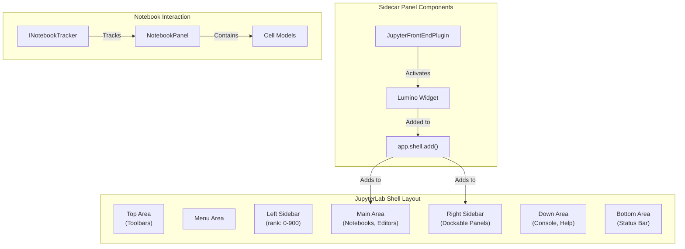

# Sidecar chat with notebook diff interface planning

## User

Take a look at the jupyter server code with the librarian, as well as popular plugin libraries.  I want the ability to have a sidecar chat with a notebook, and have it propose edits or updates to a notebook, but let it have the entire notebook in context by default.  I want to apply a diff to a notebook which is rendered to the user as a diff they can accept or reject inside each cell or that looks just like cursor (do a web search and investigate the diff interface of cursor).  Use the oracle to plan how you might do this, do not write any code yet.  Document your findings in diff-brainstorming.md

## Assistant

I'll research the Jupyter extension architecture, Cursor's diff interface, and plan this feature. Let me gather information in parallel.

**Tool Use:** `librarian`

```json
{
  "query": "How do JupyterLab extensions implement sidecar panels and sidebars? I want to understand the architecture for creating a chat panel that sits alongside a notebook and can interact with notebook content.",
  "context": "Building a sidecar chat feature for a JupyterLab extension that needs to read/write notebook cells and display diffs"
}
```

**Tool Use:** `librarian`

```json
{
  "query": "How do popular JupyterLab AI extensions like jupyter-ai implement chat interfaces and notebook cell editing? What patterns do they use for the sidebar chat UI?",
  "context": "Looking for best practices in JupyterLab AI chat implementations"
}
```

**Tool Use:** `web_search`

```json
{
  "objective": "Cursor AI code editor diff interface - how does it show code changes and let users accept or reject them? I want to understand the visual design and UX of Cursor's diff/apply feature.",
  "search_queries": [
    "Cursor AI diff interface accept reject",
    "Cursor editor inline diff UI",
    "Cursor code changes apply interface"
  ]
}
```

**Tool Use:** `Read`

```json
{
  "path": "/Users/hamel/git/ai-jup/src"
}
```

## User

**Tool Result:** `toolu_vrtx_01GZZdHZAnKg3kztKPD1k95s`

```
Perfect! Now I have comprehensive information to provide a detailed answer. Let me create the final response:

## JupyterLab Sidecar Panels & Sidebars Architecture

Based on my analysis of the JupyterLab codebase and extension examples, here's a comprehensive guide to implementing sidecar panels and sidebars that can interact with notebook content:

### Architecture Overview



### 1. Core Shell Architecture

JupyterLab's shell provides distinct areas where you can add widgets:

```typescript
// From jupyterlab/extension-examples/widgets/src/index.ts
app.shell.add(widget, 'main');        // Main work area
app.shell.add(widget, 'left');        // Left sidebar
app.shell.add(widget, 'right');       // Right sidebar (for sidecars)
app.shell.add(widget, 'top');         // Top toolbar area
app.shell.add(widget, 'down');        // Down area
app.shell.add(widget, 'bottom');      // Status bar area
```

**Shell Area Options with Metadata:**
```typescript
// Split modes for main area
app.shell.add(widget, 'main', {
  mode: 'split-right',      // Split notebook right
  mode: 'split-left',       // Split notebook left
  mode: 'split-top',        // Split notebook top
  mode: 'split-bottom',     // Split notebook bottom
  activate: true,           // Activate widget
  rank: 600                 // Ordering in sidebars (0-500: first-party, 501-899: third-party, 900: default, 1000: extension manager)
});

// Tab before/after another widget
app.shell.add(widget, 'main', {
  ref: widgetId,            // Reference widget ID
  mode: 'tab-before',
  mode: 'tab-after'
});
```

### 2. Sidecar Widget Pattern

The [jupyter-widgets/jupyterlab-sidecar](https://github.com/jupyter-widgets/jupyterlab-sidecar) provides the canonical implementation:

```typescript
// src/widget.ts - Model extending OutputModel
export class SidecarModel extends output.OutputModel {
  defaults() {
    return {
      ...super.defaults(),
      _model_name: SidecarModel.model_name,
      title: 'Sidecar',
      anchor: 'right',        // 'right', 'split-right', 'split-left', 'split-top', 'split-bottom'
      ref: null               // Reference to another sidecar
    };
  }
}

// src/index.ts - Plugin registration
const sidecarPlugin: JupyterFrontEndPlugin<void> = {
  id: '@jupyter-widgets/jupyterlab-sidecar',
  requires: [IJupyterWidgetRegistry],
  activate: (app: JupyterFrontEnd, registry: IJupyterWidgetRegistry) => {
    const SidecarView = class extends output.OutputView {
      async render() {
        const w = this._outputView;
        w.addClass('jupyterlab-sidecar');
        w.title.label = this.model.get('title');
        w.title.closable = true;
        w.id = UUID.uuid4();
        
        const anchor = this.model.get('anchor') || 'right';
        
        if (anchor === 'right') {
          app.shell.add(w, 'right');
        } else {
          app.shell.add(w, 'main', { mode: anchor });
        }
        app.shell.activateById(w.id);
      }
    };
    
    registry.registerWidget({
      name: '@jupyter-widgets/jupyterlab-sidecar',
      exports: { SidecarModel, SidecarView }
    });
  }
};
```

### 3. Creating a Custom Sidebar/Sidecar Panel

Here's the pattern from the [extension-examples repository](https://github.com/jupyterlab/extension-examples):

```typescript
// src/index.ts - Plugin definition
import {
  JupyterFrontEnd,
  JupyterFrontEndPlugin
} from '@jupyterlab/application';
import { ICommandPalette } from '@jupyterlab/apputils';
import { Widget } from '@lumino/widgets';

const chatPanelPlugin: JupyterFrontEndPlugin<void> = {
  id: 'my-extension:chat-panel',
  description: 'Chat panel sidecar for notebooks',
  autoStart: true,
  requires: [ICommandPalette],
  activate: (app: JupyterFrontEnd, palette: ICommandPalette) => {
    const { commands, shell } = app;
    const command = 'chatpanel:open';

    commands.addCommand(command, {
      label: 'Open Chat Panel',
      caption: 'Open AI Chat Sidecar',
      execute: () => {
        const chatPanel = new ChatPanelWidget();
        shell.add(chatPanel, 'right', { rank: 600 });
      }
    });

    palette.addItem({ command, category: 'Chat' });
  }
};

export default chatPanelPlugin;

// Custom widget
class ChatPanelWidget extends Widget {
  constructor() {
    super();
    this.addClass('jp-chat-panel');
    this.id = 'chat-panel-widget';
    this.title.label = 'Chat';
    this.title.closable = true;
    
    // Create your chat UI here
    const content = document.createElement('div');
    content.innerHTML = '<div class="chat-messages"></div><input class="chat-input" />';
    this.node.appendChild(content);
  }

  protected onAfterAttach(msg: Message): void {
    this.node.addEventListener('click', this._onEventClick.bind(this));
  }

  protected onBeforeDetach(msg: Message): void {
    this.node.removeEventListener('click', this._onEventClick.bind(this));
  }

  private _onEventClick(event: Event): void {
    // Handle events
  }
}
```

### 4. Notebook Content Interaction

To read/write notebook cells, use `INotebookTracker`:

```typescript
import { INotebookTracker } from '@jupyterlab/notebook';

const plugin: JupyterFrontEndPlugin<void> = {
  id: 'my-extension:notebook-interaction',
  autoStart: true,
  requires: [INotebookTracker],
  activate: (app: JupyterFrontEnd, tracker: INotebookTracker) => {
    // Access active notebook
    tracker.currentChanged.connect((tracker, notebookPanel) => {
      if (!notebookPanel) return;
      
      const notebook = notebookPanel.content;
      const model = notebookPanel.model;
      
      if (!model) return;

      // Read cells
      model.cells.forEach((cellModel, index) => {
        console.log(`Cell ${index}:`, cellModel.source);
        console.log(`Type:`, cellModel.type); // 'code', 'markdown', 'raw'
      });

      // Access active cell
      const activeCell = tracker.activeCell;
      if (activeCell?.model) {
        console.log('Active cell source:', activeCell.model.source);
        console.log('Cell type:', activeCell.model.type);
        console.log('Metadata:', activeCell.model.getMetadata('mykey'));
      }

      // Listen for cell changes
      model.contentChanged.connect(() => {
        console.log('Notebook content changed');
      });

      // Listen for cell selections
      notebook.selectionChanged.connect(() => {
        const selected = notebook.widgets.filter((cell, i) => 
          notebook.isSelected(cell)
        );
        console.log('Selected cells:', selected);
      });
    });
  }
};
```

### 5. Programmatic Cell Operations

```typescript
import { NotebookActions } from '@jupyterlab/notebook';

// Execute specific cell
NotebookActions.run(notebook, sessionContext);

// Insert cell after active
const newCellModel = notebook.model!.contentFactory.createCodeCell({});
const index = notebook.activeCell 
  ? notebook.model!.cells.indexOf(notebook.activeCell.model)
  : notebook.model!.cells.length;
notebook.model!.cells.insert(index + 1, newCellModel);

// Update cell content
const cell = notebook.model!.cells.get(0);
cell.source = 'print("Hello from chat")';

// Get cell outputs
if (cell.type === 'code') {
  const outputs = (cell as ICodeCellModel).outputs;
  outputs.forEach(output => {
    console.log('Output:', output);
  });
}
```

### 6. Displaying Diffs in a Sidecar

For a chat feature showing code diffs:

```typescript
import { ReactWidget } from '@jupyterlab/apputils';
import React from 'react';

class DiffViewerWidget extends ReactWidget {
  constructor(private oldCode: string, private newCode: string) {
    super();
    this.addClass('jp-diff-viewer');
    this.id = 'diff-viewer';
    this.title.label = 'Changes';
  }

  render() {
    return <DiffViewer old={this.oldCode} new={this.newCode} />;
  }
}

const DiffViewer: React.FC<{old: string; new: string}> = ({old, new: newCode}) => {
  const oldLines = old.split('\n');
  const newLines = newCode.split('\n');
  
  return (
    <div className="diff-container">
      <div className="old-code">
        <h3>Before</h3>
        {oldLines.map((line, i) => (
          <div key={`old-${i}`} className="diff-line">{line}</div>
        ))}
      </div>
      <div className="new-code">
        <h3>After</h3>
        {newLines.map((line, i) => (
          <div key={`new-${i}`} className="diff-line">{line}</div>
        ))}
      </div>
    </div>
  );
};
```

### 7. React Widget Pattern (Recommended for Chat UI)

```typescript
import { ReactWidget } from '@jupyterlab/apputils';
import React, { useState } from 'react';

class ChatPanelWidget extends ReactWidget {
  constructor(private tracker: INotebookTracker) {
    super();
    this.id = 'chat-panel';
    this.title.label = 'Chat';
    this.addClass('jp-chat-panel');
  }

  render(): JSX.Element {
    return <ChatPanel tracker={this.tracker} />;
  }
}

interface Message {
  role: 'user' | 'assistant';
  content: string;
}

const ChatPanel: React.FC<{tracker: INotebookTracker}> = ({tracker}) => {
  const [messages, setMessages] = useState<Message[]>([]);
  const [input, setInput] = useState('');

  const handleSend = async () => {
    const notebook = tracker.currentWidget;
    if (!notebook?.model) return;

    // Get notebook context
    const cells = Array.from(notebook.model.cells).map(cell => ({
      type: cell.type,
      source: cell.source
    }));

    // Send to API with notebook context
    const response = await fetch('/api/chat', {
      method: 'POST',
      body: JSON.stringify({
        message: input,
        notebookContext: cells,
        activeCell: cells[0]
      })
    });

    const data = await response.json();
    setMessages(prev => [
      ...prev,
      { role: 'user', content: input },
      { role: 'assistant', content: data.response }
    ]);
    setInput('');
  };

  return (
    <div className="chat-container">
      <div className="messages">
        {messages.map((msg, i) => (
          <div key={i} className={`message ${msg.role}`}>
            {msg.content}
          </div>
        ))}
      </div>
      <input
        value={input}
        onChange={e => setInput(e.target.value)}
        onKeyPress={e => e.key === 'Enter' && handleSend()}
        placeholder="Ask about the notebook..."
      />
      <button onClick={handleSend}>Send</button>
    </div>
  );
};
```

### 8. Complete Extension Structure

Your extension should follow this layout:

```
my-chat-extension/
├── src/
│   ├── index.ts                 # Plugin entry point
│   ├── panel.ts                 # Panel/widget class
│   ├── style/
│   │   └── index.css            # Styles
│   └── types.d.ts               # TypeScript definitions
├── package.json                 # npm config
├── setup.py                     # Python config
├── tsconfig.json                # TypeScript config
└── schema/
    └── plugin.json              # Settings schema
```

### 9. Key Integration Points

| Feature | API | Use Case |
|---------|-----|----------|
| **Shell areas** | `app.shell.add(widget, area, options)` | Add panels to UI |
| **Notebook tracking** | `INotebookTracker` | Monitor active notebook |
| **Cell access** | `notebookPanel.model.cells` | Read/write cells |
| **Cell selection** | `notebook.selectionChanged` | Track selected cells |
| **Cell changes** | `cellModel.contentChanged` | Listen for edits |
| **Commands** | `app.commands.addCommand()` | User actions |
| **Signals** | `Signal<T, U>` | Pub/sub events |
| **Settings** | `ISettingRegistry` | User preferences |

This architecture enables you to build a chat sidecar that seamlessly integrates with JupyterLab notebooks, allowing users to read current cell content, request modifications, and view diffs all within the IDE.
```

**Tool Result:** `toolu_vrtx_01PHSCmycHuKbHd7Zx5GmWe4`

```
Excellent! Now I have a comprehensive understanding. Let me create the complete analysis:

## JupyterLab AI Chat Implementation Patterns

Based on my analysis of the official [jupyter-chat](https://github.com/jupyterlab/jupyter-chat) and [jupyter-ai](https://github.com/jupyterlab/jupyter-ai) repositories, here are the key architectural patterns and best practices used by popular JupyterLab AI extensions:

---

## Architecture Overview

```
┌─────────────────────────────────────────────────────────────────────┐
│                      JupyterLab Application                         │
├─────────────────────────────────────────────────────────────────────┤
│                                                                     │
│  ┌──────────────────────────────────────────────────────────────┐  │
│  │             Chat Sidebar (MultiChatPanel)                   │  │
│  │  - Manages multiple chat sections                           │  │
│  │  - Drag-and-drop support for cells/files                    │  │
│  └──────────────────────────────────────────────────────────────┘  │
│                              │                                       │
│                              ▼                                       │
│  ┌──────────────────────────────────────────────────────────────┐  │
│  │              ChatWidget (ReactWidget)                        │  │
│  │  ┌────────────────────────────────────────────────────────┐  │  │
│  │  │  Chat Component (React)                               │  │  │
│  │  │  ┌──────────────────────────────────────────────────┐ │  │  │
│  │  │  │ ChatMessages (Message List)                      │ │  │  │
│  │  │  │ - Renders message history with stacking         │ │  │  │
│  │  │  │ - IntersectionObserver for viewport tracking    │ │  │  │
│  │  │  │ - Unread message management                     │ │  │  │
│  │  │  └──────────────────────────────────────────────────┘ │  │  │
│  │  │  ┌──────────────────────────────────────────────────┐ │  │  │
│  │  │  │ ChatInput + Toolbar                              │ │  │  │
│  │  │  │ - MUI Autocomplete for chat commands             │ │  │  │
│  │  │  │ - Attachments preview                           │ │  │  │
│  │  │  │ - Extensible toolbar registry                   │ │  │  │
│  │  │  └──────────────────────────────────────────────────┘ │  │  │
│  │  └────────────────────────────────────────────────────────┘  │  │
│  │                                                               │  │
│  │  IChatModel (Data Model)                                      │  │
│  │  - Messages array                                             │  │
│  │  - Input model (IInputModel)                                  │  │
│  │  - Writers tracking (real-time collaboration)                 │  │
│  │  - Config management                                          │  │
│  └──────────────────────────────────────────────────────────────┘  │
│                                                                     │
│  ┌──────────────────────────────────────────────────────────────┐  │
│  │           Service Providers & Registries                     │  │
│  │                                                              │  │
│  │  • IChatCommandRegistry                                      │  │
│  │    - Manages chat command providers (@mentions, emojis)    │  │
│  │  • IInputToolbarRegistry                                    │  │
│  │    - Custom toolbar buttons (send, attach, cancel)         │  │
│  │  • IAttachmentOpenerRegistry                               │  │
│  │    - File and notebook attachment handlers                 │  │
│  │  • IMessageFooterRegistry                                  │  │
│  │    - Custom message footer components                      │  │
│  │  • IActiveCellManager                                      │  │
│  │    - Notebook cell access & manipulation                   │  │
│  │  • ISelectionWatcher                                       │  │
│  │    - Tracks selected code in editor                        │  │
│  └──────────────────────────────────────────────────────────────┘  │
│                                                                     │
│  ┌──────────────────────────────────────────────────────────────┐  │
│  │         Shared Document (YChat via YDoc)                     │  │
│  │         - Collaborative editing support                      │  │
│  └──────────────────────────────────────────────────────────────┘  │
└─────────────────────────────────────────────────────────────────────┘
```

---

## Core Components & Patterns

### 1. **Chat Component Structure** ([chat.tsx](https://github.com/jupyterlab/jupyter-chat/blob/main/packages/jupyter-chat/src/components/chat.tsx))

The main `Chat` component follows a hierarchical pattern:

```typescript
export function Chat(props: Chat.IOptions): JSX.Element {
  const [view, setView] = useState<Chat.View>(Chat.View.chat);
  
  return (
    <JlThemeProvider themeManager={props.themeManager ?? null}>
      <Box sx={{ /* styling */ }}>
        {/* Top bar with settings navigation */}
        <Box sx={{ display: 'flex', justifyContent: 'space-between' }}>
          {/* Back button or spacer */}
          {/* Settings button */}
        </Box>
        
        {/* Body switches between chat and settings views */}
        {view === Chat.View.chat && <ChatBody {...props} />}
        {view === Chat.View.settings && props.settingsPanel && (
          <props.settingsPanel />
        )}
      </Box>
    </JlThemeProvider>
  );
}
```

**Key patterns:**
- View state switching (chat ↔ settings)
- Theme provider integration with JupyterLab
- Composable settings panel support
- Context passing via React Provider

---

### 2. **Message Rendering with Real-time Viewport Tracking** ([messages.tsx](https://github.com/jupyterlab/jupyter-chat/blob/main/packages/jupyter-chat/src/components/messages/messages.tsx))

The messages component uses multiple sophisticated patterns:

```typescript
export function ChatMessages(): JSX.Element {
  const [messages, setMessages] = useState<IChatMessage[]>(model.messages);
  const listRef = useRef<(HTMLDivElement | null)[]>([]);
  const renderedPromise = useRef<PromiseDelegate<void>[]>([]);
  const [allRendered, setAllRendered] = useState<boolean>(false);

  // 1. Fetch history on mount
  useEffect(() => {
    if (!model.getHistory) return;
    model.getHistory()
      .then(history => setMessages(history.messages))
      .catch(e => console.error(e));
  }, [model]);

  // 2. Listen to real-time message updates
  useEffect(() => {
    function handleChatEvents() {
      setMessages([...model.messages]);
    }
    model.messagesUpdated.connect(handleChatEvents);
    return () => {
      model.messagesUpdated.disconnect(handleChatEvents);
    };
  }, [model]);

  // 3. IntersectionObserver for unread message tracking
  useEffect(() => {
    const observer = new IntersectionObserver(entries => {
      if (!allRendered) {
        Promise.all(renderedPromise.current.map(p => p.promise)).then(() => {
          setAllRendered(true);
        });
      }

      const unread = [...model.unreadMessages];
      let unreadModified = false;
      const inViewport = [...(model.messagesInViewport ?? [])];
      
      entries.forEach(entry => {
        const index = parseInt(entry.target.getAttribute('data-index') ?? '');
        if (!isNaN(index)) {
          if (!entry.isIntersecting && inViewport.includes(index)) {
            inViewport.splice(inViewport.indexOf(index), 1);
          } else if (entry.isIntersecting && !inViewport.includes(index)) {
            inViewport.push(index);
          }
          // Mark as read when visible
          if (unread.includes(index) && entry.isIntersecting) {
            unread.splice(unread.indexOf(index), 1);
            unreadModified = true;
          }
        }
      });

      model.messagesInViewport = inViewport;
      if (allRendered && unreadModified) {
        model.unreadMessages = unread;
      }
    });

    listRef.current.forEach(item => {
      if (item) observer.observe(item);
    });

    return () => {
      listRef.current.forEach(item => {
        if (item) observer.unobserve(item);
      });
    };
  }, [messages, allRendered]);
}
```

**Best practices:**
- **History fetching**: Async data loading on mount
- **Real-time sync**: Signal-based model updates using Lumino
- **Viewport tracking**: IntersectionObserver API for efficient unread detection
- **Promise delegation**: PromiseDelegate for rendering completion coordination
- **Message stacking**: Consecutive messages from same user are grouped

---

### 3. **Chat Input with Extensible Toolbar** ([chat-input.tsx](https://github.com/jupyterlab/jupyter-chat/blob/main/packages/jupyter-chat/src/components/input/chat-input.tsx))

The input component demonstrates a highly extensible architecture:

```typescript
export function ChatInput(props: ChatInput.IProps): JSX.Element {
  const { model } = props;
  const { area, chatCommandRegistry, inputToolbarRegistry } = useChatContext();
  
  const [input, setInput] = useState<string>(model.value);
  const chatCommands = useChatCommands(model, chatCommandRegistry);
  const [sendWithShiftEnter, setSendWithShiftEnter] = useState<boolean>(
    model.config.sendWithShiftEnter ?? false
  );
  const [toolbarElements, setToolbarElements] = useState<
    InputToolbarRegistry.IToolbarItem[]
  >([]);

  // Watch for toolbar registry changes
  useEffect(() => {
    const updateToolbar = () => {
      setToolbarElements(inputToolbarRegistry?.getItems() || []);
    };
    inputToolbarRegistry?.itemsChanged.connect(updateToolbar);
    updateToolbar();
    return () => {
      inputToolbarRegistry?.itemsChanged.disconnect(updateToolbar);
    };
  }, [inputToolbarRegistry]);

  // Handle Enter key with configurable send behavior
  async function handleKeyDown(event: React.KeyboardEvent<HTMLInputElement>) {
    if (event.key !== 'Enter') return;

    // Prevent sending when command menu is open
    if (chatCommands.menu.open) return;

    event.stopPropagation();
    if (!input.trim()) {
      event.preventDefault();
      return;
    }

    // Configurable send shortcut (Enter vs Shift+Enter)
    if (
      (sendWithShiftEnter && event.shiftKey) ||
      (!sendWithShiftEnter && !event.shiftKey)
    ) {
      await chatCommandRegistry?.onSubmit(model);
      model.send(model.value);
      event.stopPropagation();
      event.preventDefault();
    }
  }

  return (
    <Box sx={props.sx} className={clsx(INPUT_BOX_CLASS)}>
      <Box sx={{ /* border styling */ }}>
        {/* Attachment previews */}
        {attachments.length > 0 && (
          <AttachmentPreviewList
            attachments={attachments}
            onRemove={model.removeAttachment}
          />
        )}
        
        {/* Autocomplete with chat commands */}
        <Autocomplete {...chatCommands.autocompleteProps}>
          <TextField
            multiline
            maxRows={10}
            onKeyDown={handleKeyDown}
            placeholder="Type a chat message, @ to mention..."
            onInputChange={(_, newValue, reason) => {
              if (reason === 'selectOption' || reason === 'reset' || reason === 'blur') {
                return;
              }
              model.value = newValue;
            }}
          />
        </Autocomplete>
        
        {/* Extensible toolbar */}
        <Box className={INPUT_TOOLBAR_CLASS}>
          {toolbarElements.map((item, index) => (
            <item.element
              key={index}
              model={model}
              chatCommandRegistry={chatCommandRegistry}
              chatModel={chatModel}
              edit={props.edit}
            />
          ))}
        </Box>
      </Box>
      <InputWritingIndicator writers={writers} />
    </Box>
  );
}
```

**Key architectural patterns:**
- **Command palette**: MUI Autocomplete integration with chat command providers
- **Extensible toolbar**: Registry-based button system (see below)
- **Real-time writers**: Displays who is currently typing
- **Keyboard handling**: Sophisticated event handling for Send button behavior
- **Attachment support**: Drag-and-drop file/cell attachment management

---

### 4. **Extensible Input Toolbar Registry** ([toolbar-registry.tsx](https://github.com/jupyterlab/jupyter-chat/blob/main/packages/jupyter-chat/src/components/input/toolbar-registry.tsx))

This is the extensibility pattern used by the chat input:

```typescript
export interface IInputToolbarRegistry {
  readonly itemsChanged: ISignal<IInputToolbarRegistry, void>;
  get(name: string): InputToolbarRegistry.IToolbarItem | undefined;
  getItems(): InputToolbarRegistry.IToolbarItem[];
  addItem(name: string, item: InputToolbarRegistry.IToolbarItem): void;
  hide(name: string): void;
  show(name: string): void;
}

export class InputToolbarRegistry implements IInputToolbarRegistry {
  private _items = new Map<string, InputToolbarRegistry.IToolbarItem>();
  private _itemsChanged = new Signal<this, void>(this);

  addItem(name: string, item: InputToolbarRegistry.IToolbarItem): void {
    if (!this._items.has(name)) {
      this._items.set(name, item);
      this._itemsChanged.emit(); // Notify UI to re-render
    }
  }

  getItems(): InputToolbarRegistry.IToolbarItem[] {
    return Array.from(this._items.values())
      .filter(item => !item.hidden)
      .sort((a, b) => a.position - b.position);
  }
}

export namespace InputToolbarRegistry {
  export interface IToolbarItem {
    element: React.FunctionComponent<IToolbarItemProps>;
    position: number;
    hidden?: boolean;
  }

  export interface IToolbarItemProps {
    model: IInputModel;
    chatCommandRegistry?: IChatCommandRegistry;
    chatModel?: IChatModel;
    edit?: boolean;
  }

  // Default toolbar with built-in buttons
  export function defaultToolbarRegistry(): InputToolbarRegistry {
    const registry = new InputToolbarRegistry();
    registry.addItem('send', {
      element: SendButton,
      position: 100
    });
    registry.addItem('saveEdit', {
      element: SaveEditButton,
      position: 95
    });
    registry.addItem('attach', {
      element: AttachButton,
      position: 20
    });
    registry.addItem('cancel', {
      element: CancelButton,
      position: 10
    });
    return registry;
  }
}
```

**Extension pattern:**
1. Get or create toolbar registry
2. Add custom buttons via `addItem(name, {element, position})`
3. UI automatically re-renders when `itemsChanged` signal fires
4. Buttons receive `model`, `chatCommandRegistry`, and `chatModel` props

---

### 5. **Chat Commands Registry** ([chat-commands.ts](https://github.com/jupyterlab/jupyter-chat/blob/main/packages/jupyter-chat/src/registers/chat-commands.ts))

Enables extensions to provide autocomplete commands (e.g., @mentions, emoji):

```typescript
export interface IChatCommandRegistry {
  addProvider(provider: IChatCommandProvider): void;
  getProviders(): IChatCommandProvider[];
  onSubmit(inputModel: IInputModel): Promise<void>;
}

export interface IChatCommandProvider {
  id: string;
  
  // Return completions for the current word
  listCommandCompletions(inputModel: IInputModel): Promise<ChatCommand[]>;
  
  // Handle command execution when user presses Enter
  onSubmit(inputModel: IInputModel): Promise<void>;
}

export type ChatCommand = {
  name: string;                    // What user types to trigger
  providerId: string;
  icon?: LabIcon | JSX.Element;
  description?: string;
  replaceWith?: string;            // Text to replace current word
  spaceOnAccept?: boolean;          // Add space after replacement
};
```

**Usage flow:**
1. User types `@` → `listCommandCompletions()` called
2. Shows matching users → user selects one
3. `onSubmit()` processes the mention when message is sent

---

### 6. **Chat Data Model** ([model.ts](https://github.com/jupyterlab/jupyter-chat/blob/main/packages/jupyter-chat/src/model.ts))

Core data management using Lumino signals for reactivity:

```typescript
export interface IChatModel extends IDisposable {
  readonly messages: IChatMessage[];
  readonly input: IInputModel;
  readonly writers: IChatModel.IWriter[];
  readonly user?: IUser;
  readonly unreadMessages: number[];
  readonly messagesInViewport?: number[];

  // Signals for reactive updates
  readonly messagesUpdated: ISignal<IChatModel, void>;
  readonly configChanged: ISignal<IChatModel, IConfig>;
  readonly unreadChanged?: ISignal<IChatModel, number[]>;
  readonly writersChanged?: ISignal<IChatModel, IChatModel.IWriter[]>;

  // Message management
  sendMessage(message: INewMessage): Promise<boolean | void> | boolean | void;
  updateMessage?(id: string, message: IChatMessage): Promise<boolean | void> | boolean | void;
  deleteMessage?(id: string): Promise<boolean | void> | boolean | void;
  getHistory?(): Promise<IChatHistory>;
  clearMessages(): void;

  // Message insertion handlers
  messageAdded(message: IChatMessage): void;
  messagesInserted(index: number, messages: IChatMessage[]): void;
  messagesDeleted(index: number, count: number): void;

  // Real-time collaboration
  updateWriters(writers: IChatModel.IWriter[]): void;

  // Message editing
  getEditionModel(messageID: string): IInputModel | undefined;
  getEditionModels(): IInputModel[];
  addEditionModel(messageID: string, inputModel: IInputModel): void;
}
```

**Signal-based reactivity pattern:**
- Components subscribe to `messagesUpdated` signal
- When model changes, signal emits and components re-render
- Unread tracking uses `lastRead` timestamp in localStorage

---

### 7. **Notebook Cell Integration** ([active-cell-manager.ts](https://github.com/jupyterlab/jupyter-chat/blob/main/packages/jupyter-chat/src/active-cell-manager.ts))

Enables chat to read/manipulate notebook cells:

```typescript
export interface IActiveCellManager {
  readonly available: boolean;
  readonly activeCellError: CellError | null;
  readonly availabilityChanged: ISignal<this, boolean>;
  readonly activeCellErrorChanged: ISignal<this, CellError | null>;

  // Read cell content
  getContent(withError: boolean): CellContent | CellWithErrorContent | null;

  // Insert/replace cell content
  insertAbove(content: string): void;
  insertBelow(content: string): void;
  replace(content: string): Promise<void>;
}

export class ActiveCellManager implements IActiveCellManager {
  constructor(options: { tracker: INotebookTracker; shell: JupyterFrontEnd.IShell }) {
    this._notebookTracker = options.tracker;
    this._notebookTracker.activeCellChanged.connect(this._onActiveCellChanged);
  }

  getContent(withError = false): CellContent | CellWithErrorContent | null {
    const sharedModel = this._notebookTracker.activeCell?.model.sharedModel;
    if (!sharedModel) return null;

    if (!withError) {
      return {
        type: sharedModel.cell_type,
        source: sharedModel.getSource(),
        language: this._notebookTracker.currentWidget?.model?.defaultKernelLanguage
      };
    }

    // With error: includes execution error details
    const error = this._activeCellError;
    if (error) {
      return {
        type: 'code',
        source: sharedModel.getSource(),
        error: {
          name: error.ename,
          value: error.evalue,
          traceback: error.traceback
        }
      };
    }
    return null;
  }

  insertAbove(content: string): void {
    const notebookPanel = this._notebookTracker.currentWidget;
    if (!notebookPanel?.isVisible) return;
    NotebookActions.insertAbove(notebookPanel.content);
    this.replace(content);
  }

  insertBelow(content: string): void {
    const notebookPanel = this._notebookTracker.currentWidget;
    if (!notebookPanel?.isVisible) return;
    NotebookActions.insertBelow(notebookPanel.content);
    this.replace(content);
  }

  async replace(content: string): Promise<void> {
    const activeCell = this._notebookTracker.activeCell;
    if (!activeCell) return;
    await activeCell.ready;
    activeCell.editor?.model.sharedModel.setSource(content);
  }
}
```

**Notebook integration patterns:**
- Tracks active cell via `INotebookTracker`
- Detects cell execution errors via `stateChanged` signals
- Uses `SharedModel` API for cell modification (collaborative-safe)
- Cell insertion uses `NotebookActions` for consistency

---

### 8. **Drag-and-Drop Support** ([chat-widget.tsx](https://github.com/jupyterlab/jupyter-chat/blob/main/packages/jupyter-chat/src/widgets/chat-widget.tsx))

Sophisticated drag-and-drop implementation for cells and files:

```typescript
export class ChatWidget extends ReactWidget {
  constructor(options: Chat.IOptions) {
    super();
    // Listen for message clicks to auto-focus input
    this.node.addEventListener('click', (event: MouseEvent) => {
      const target = event.target as HTMLElement;
      const message = target.closest(`.${MESSAGE_CLASS}`);
      if (message) {
        const selection = window.getSelection();
        // Only focus if no text is selected
        if (!selection || selection.toString().trim() === '') {
          this.model.input.focus();
        }
      }
    });
  }

  protected onAfterAttach(msg: Message): void {
    super.onAfterAttach(msg);
    // Register drag handlers
    this.node.addEventListener('lm-dragover', this, true);
    this.node.addEventListener('lm-dragenter', this, true);
    this.node.addEventListener('lm-drop', this, true);
    this.node.addEventListener('lm-dragleave', this, true);
  }

  handleEvent(event: Event): void {
    if (!(event instanceof Drag.Event)) return;

    switch (event.type) {
      case 'lm-dragover':
        this._handleDrag(event);
        break;
      case 'lm-drop':
        this._handleDrop(event);
        break;
    }
  }

  private _handleDrop(event: Drag.Event): void {
    event.preventDefault();
    const types = event.mimeData.types();

    if (types.includes(NOTEBOOK_CELL_MIME)) {
      this._processCellDrop(event);
    } else if (types.includes(FILE_BROWSER_MIME)) {
      this._processFileDrop(event);
    }
  }

  private _processCellDrop(event: Drag.Event): void {
    const cellData = event.mimeData.getData(NOTEBOOK_CELL_MIME) as ICell[];
    const cells = Array.isArray(cellData) ? cellData : [cellData];
    const notebookPath = this._findNotebookPath(cells[0].id);

    const validCells: INotebookAttachmentCell[] = cells.map(cell => ({
      id: cell.id,
      input_type: isCode(cell) ? 'code' : isMarkdown(cell) ? 'markdown' : 'raw'
    }));

    const attachment: INotebookAttachment = {
      type: 'notebook',
      value: notebookPath,
      cells: validCells
    };
    const inputModel = this._getInputFromEvent(event);
    inputModel?.addAttachment?.(attachment);
  }

  private _findNotebookPath(cellId: string): string | null {
    const activeCellManager = this.model.input.activeCellManager as ActiveCellManager;
    const notebookTracker = (activeCellManager as any)._notebookTracker;

    // Check current notebook first
    if (notebookTracker.currentWidget) {
      const cells = notebookTracker.currentWidget.content.widgets;
      if (cells.find((c: Cell) => c.model.id === cellId)) {
        return notebookTracker.currentWidget.context.path;
      }
    }

    // Then check all open notebooks
    for (const notebook of notebookTracker.widgets || []) {
      const cells = notebook.content.widgets;
      if (cells.find((c: Cell) => c.model.id === cellId)) {
        return notebook.context.path;
      }
    }
    return null;
  }
}
```

**MIME types handled:**
- `application/vnd.jupyter.cells` - Notebook cells
- `application/x-jupyter-icontentsrich` - File browser items
- `application/vnd.lumino.widget-factory` - TabBar file drags

---

### 9. **JupyterLab Plugin Architecture** ([index.ts - extension](https://github.com/jupyterlab/jupyter-chat/blob/main/packages/jupyterlab-chat-extension/src/index.ts))

The extension demonstrates plugin composition patterns:

```typescript
export default [
  activeCellManager,         // Provide IActiveCellManager token
  attachmentOpeners,         // Provide IAttachmentOpenerRegistry token
  chatConfig,               // Provide IWidgetConfig token
  chatCommands,             // Register chat UI commands
  chatCommandRegistryPlugin, // Provide IChatCommandRegistry token
  chatPanel,                // Provide IChatPanel (MultiChatPanel) token
  chatTracker,              // Provide IChatTracker token
  docFactories,             // Chat document factories
  footerRegistry,           // Provide IMessageFooterRegistry token
  inputToolbarFactory,      // Provide IInputToolbarRegistryFactory token
  selectionWatcher,         // Provide ISelectionWatcher token
  emojiCommandsPlugin,      // Chat command provider for emoji
  mentionCommandsPlugin     // Chat command provider for @mentions
];
```

**Key plugin patterns:**

1. **Token-based dependency injection:**
   ```typescript
   const activeCellManager: JupyterFrontEndPlugin<IActiveCellManager> = {
     id: 'jupyterlab-chat-extension:activeCellManager',
     autoStart: true,
     requires: [INotebookTracker],
     provides: IActiveCellManagerToken,
     activate: (app, notebookTracker) => {
       return new ActiveCellManager({ tracker: notebookTracker, shell: app.shell });
     }
   };
   ```

2. **Side panel widget registration:**
   ```typescript
   app.shell.add(chatPanel, 'left', { rank: 2000 });
   ```

3. **Command registration:**
   ```typescript
   commands.addCommand(CommandIDs.createChat, {
     label: 'Create a new chat',
     execute: async (args) => { /* ... */ }
   });
   ```

4. **Settings integration:**
   ```typescript
   settingRegistry.load(pluginId).then(setting => {
     loadSetting(setting);
     setting.changed.connect(loadSetting);
   });
   ```

---

## UI Pattern Summary

### **Sidebar vs Main Area Layout**

```
Area-specific styling adjusts padding and margins:

const horizontalPadding = area === 'sidebar' ? 1.5 : 2;
const messageMargin = area === 'main' ? '25%' : '10%';  // User messages indent
```

### **Message Stacking**

By default, consecutive messages from the same sender are "stacked" (no header repetition):

```typescript
if (this._config.stackMessages) {
  this._messages.slice(1).forEach((message, idx) => {
    const previousUser = this._messages[idx].sender.username;
    message.stacked = previousUser === message.sender.username;
  });
}
```

### **Real-time Unread Tracking**

Uses localStorage + IntersectionObserver:

```typescript
get lastRead(): number {
  const storage = JSON.parse(
    localStorage.getItem(`@jupyter/chat:${this._id}`) || '{}'
  );
  return storage.lastRead ?? 0;
}

// Unread = messages with time > lastRead that haven't been shown
unreadIndexes = messages
  .filter(msg => msg.time > lastRead)
  .map((msg, idx) => index + idx);
```

---

## Best Practices Summary

| Pattern | Implementation | Benefit |
|---------|----------------|---------|
| **Signal-based reactivity** | Lumino `ISignal` for model changes | Decoupled, efficient updates |
| **Extensible registries** | Toolbar, commands, footers, attachment openers | Third-party extensions |
| **Token-based DI** | JupyterLab plugin tokens | Type-safe dependency injection |
| **Component context** | React Context for props drilling | Clean component props |
| **Real-time tracking** | IntersectionObserver for viewport | Efficient unread detection |
| **Drag-and-drop MIME types** | Lumino Drag.Event MIME detection | Interoperability |
| **Shared models** | YDoc SharedModel for cells | Collaborative editing |
| **Promise delegation** | PromiseDelegate for async coordination | Rendering completion tracking |
| **Message editing** | Separate input models per message | Multi-message edit support |
| **Error tracking** | Cell stateChanged signals for execution errors | Error display in chat |

---

## Extension Points for Custom Implementations

Jupyter-ai extends this base with:

1. **
```

**Tool Result:** `toolu_vrtx_01GseTVQwUGvnjLoCbhBzLch`

```
[
  {
    "title": "Features · Cursor",
    "url": "https://cursor.com/features",
    "excerpts": [
      "Features\n\n# The best way to build software. [Download for macOS ⤓](/download)\n\n[Try mobile agent →](/agents)\n\n### Agent\n\nDelegate coding tasks so you can focus on higher-level direction. This element contains an interactive demo for sighted users. It's a demonstration of Cursor's IDE showing AI-powered coding assistance features. The interface is displayed over a scenic painted landscape wallpaper, giving the demo an artistic backdrop. Cursor\n\nGet Cursor\n\nIn Progress 4\n\nEnterprise Order Management System\n\nGenerating Analyze Tab vs Agent Usage Patterns\n\nGenerating PyTorch MNIST Experiments\n\nGenerating Fix PR Comments Fetching Issue\n\nGenerating\n\nReady for Review 2\n\nSet up Cursor Rules for Dashboard\n\n\\+37 \\-0 · Set up Cursor Rules for Dashboard Bioinformatics Tools\n\n\\+135 \\-21 · Bioinformatics Tools\n\nAnalyze Tab vs Agent Usage Patterns\n\nHelp me understand how teams split their focus between the tab view and the agents panel across our workspaces.\nAgent GPT-5\n\n## Codebase understanding\n\nCursor's codebase embedding model gives Agent deep understanding and recall. Where are these menu label colors defined? ## Top model access\n\nChoose freely between frontier models from OpenAI, Anthropic, Gemini, and xAI. Auto Suggested Composer 1 GPT-5 High Fast ✓ Claude Sonnet 4.5 Claude Opus 4.5 Gemini 3 Pro Grok Code\n\n## Scoped changes\n\nMake targeted edits or run terminal commands with natural language. Interactive demo with multiple windows showing Cursor's AI-powered features. Get Cursor\n\nsequence\\_alignment.py\n\ntest\\_alignment.py\n\n```\nfrom typing import Tuple   MATCH_SCORE = 2 MISMATCH_SCORE = -1 GAP_PENALTY = -2   def nw_align(s: str, t: str) -> int: \"\"\"Basic Needleman-Wunsch global alignment.\"\"\"\nn, m = len(s), len(t) dp = [[0] * (m + 1) for _ in range(n + 1)] # Initialize gap penalties for i in range(1, n + 1): dp[i][0] = i * GAP_PENALTY for j in range(1, m + 1): dp[0][j] = j * GAP_PENALTY for i in range(1, n + 1): for j in range(1, m + 1): match = dp[i-1][j-1] + (MATCH_SCORE if s[i-1] == t[j-1] else MISMATCH_SCORE) delete = dp[i-1][j] + GAP_PENALTY insert = dp[i][j-1] + GAP_PENALTY dp[i][j] = max(match, delete, insert) return dp[n][m]\n```\n\n### Tab\n\nOur custom autocomplete model predicts your next actions. This element contains an interactive demo for sighted users. It's a demonstration of Cursor's IDE showing AI-powered coding assistance features. The interface is displayed over a scenic painted landscape wallpaper, giving the demo an artistic backdrop.\nCursor\n\nGet Cursor\n\nDashboard.tsx\n\nSupportChat.tsx\n\n```\n\"use client\";   import React, { useState } from \"react\"; import Navigation from \"./Navigation\"; import SupportChat from \"./SupportChat\";   export default function Dashboard() {     return ( <div className=\"flex h-[600px] border rounded-lg overflow-hidden\"> <div className=\"w-64 border-r\"> </div> <div className=\"w-80 border-l\"> <SupportChat /> </div> </div> ); }\n```\n\n## Multi-line edits\n\nGet suggested edits across multiple lines. Interactive demo with multiple windows showing Cursor's AI-powered features. Get Cursor\n\nChangeManagement.tsx\n\n```\nconst VERSION = \"8.2.3\" const RELEASE_TAG = \"release-8.2.3\"   export function ChangeManagement() { const metadata = { version: VERSION, tag: RELEASE_TAG, }   return ( <main className=\"change-management\"> <header> <h1>What's New in Version {VERSION}</h1> </header> </main> ) }\n```\n\n## Smart rewrites\n\nType naturally, Cursor will finish your thought.\nInteractive demo with multiple windows showing Cursor's AI-powered features. Get Cursor\n\nphoneNumberUtils.ts\n\n```\nexport function normalizeNANPDigits(input: string): string { const onlyDigits = input.replace(/D/g, \"\"); return onlyDigits.length === 11 && onlyDigits.startsWith(\"1\") ? onlyDigits.slice(1) : onlyDigits; }   export function formatUSPhone(input: string): string { // format (000) 000-0000 const digits = input.replace(/D/g, \"\"); const core = digits.length === 11 && digits.startsWith(\"1\") ? digits.slice(1) : digits; if (core.length !== 10) return input.trim(); const area = core.slice(0, 3); const prefix = core.slice(3, 6); const line = core.slice(6); return \"(\" + area + \") \" + prefix + \"-\" + line; }\n```\n\n## Tab, Tab, Tab\n\nFly through edits at your cursor and across files. Interactive demo with multiple windows showing Cursor's AI-powered features.\nGet Cursor\n\nChangeManagement.tsx\n\n```\nconst VERSION = \"8.2.3\" const RELEASE_TAG = \"release-8.2.3\"   export function ChangeManagement() { const metadata = { version: VERSION, tag: RELEASE_TAG, }   return ( <main className=\"change-management\"> <header> <h1>What's New in Version {VERSION}</h1> </header> </main> ) }\n```\n\nTab to Changelog.tsx\n\n[### Across the entire development process Start tasks from Slack, issue tracker, mobile and more. Finish off in the IDE. Try agents on web and mobile ↗](/agents)\n\nThis element contains an interactive demo for sighted users. It's a demonstration of Cursor integrated within Slack, showing AI-powered assistance inside team communication. The interface is displayed over a scenic painted landscape wallpaper, giving the demo an artistic backdrop.\nSlack\n\n# \\\n\n8 members\n\ndylan\n\nsmall thing but would be really good to have anchor links on the website for releases\n\n4 replies\n\ndylan\n\nwanna be able to go to cursor.com/changelog.0 to see 1.0 changelog\n\neric\n\nchecks out\n\n@cursor can you take a stab? Cursor APP\n\nI implemented direct linking for changelog entries and updated Node.js version constraints across the project to improve compatibility and maintainability. View PR Open in Cursor Open in Web\n\ndylan\n\nNice @eric can you take a look? cursor.com/agents\n\nAgent GPT-5\n\nryos\n\nmain\n\nIn Progress 4\n\nEnterprise Order Management System\n\nGenerating Analyze Tab vs Agent Usage Patterns\n\nGenerating PyTorch MNIST Experiments\n\nGenerating Fix PR Comments Fetching Issue\n\nGenerating\n\nReady for Review 2\n\nBioinformatics Tools\n\n\\+135 \\-21 · Bioinformatics Tools Set up Cursor Rules for Dashboard\n\n\\+37 \\-0 · Set up Cursor Rules for Dashboard\n\n[## IDE Manual to agentic coding, in one familiar editor.\n ... \nIt's a demonstration of Cursor integrated within GitHub, showing AI-powered code review and debugging assistance. The interface is displayed over a scenic painted landscape wallpaper, giving the demo an artistic backdrop. GitHub Pull Request Get Bugbot cursor bot reviewed 1m ago src/vs/workbench/composer/browser/components/ComposerUnifiedDropdown.tsx 3292 \\- {selectedMode().keybinding} 3293 \\+ {composerOpenModeToggleKeybinding} cursor bot 1m ago Bug: Function Returns Object Instead of String (Logic bug) The `composerOpenModeToggleKeybinding` is a function that needs to be called to get its value. Using it directly causes the keybinding display condition to always be truthy. Fix in Cursor Fix in Web](/bugbot)\n\n## Powerful, yet flexible\n\nConfigure Cursor so you can do your best work. [### 1-click import Import extensions, themes, and keybindings directly from VS Code.\n](https://cursor.com/docs/configuration/migrations/vscode)\n\n[### MCP servers Connect external tools and data sources directly to Cursor. ](https://cursor.com/docs/context/mcp)\n\n[### Rules & memories Customize how the models behave with reusable, scoped instructions. next.mdc ``` --- Description: Rules for the dashboard application Globs: apps/dashboard/**/* --- # Dashboard Application Rules ## Instructions: Follow Next.js App Router best practices Use React Server Components by default Implement type-safe server actions Follow mobile-first responsive design with Tailwind CSS Use shadcn/ui components with Radix UI primitives Implement proper error boundaries and loading states Optimize for Core Web Vitals ## Component Structure: 1. Exports 2. Types/Interfaces 3. Server actions (if any) 4. Component logic 5. Helper functions 6.\nStatic content ## Naming: Use kebab-case for directories PascalCase for components camelCase for functions and variables Use descriptive names with auxiliary verbs (isLoading, hasError) @file apps/dashboard/tsconfig.json @file apps/dashboard/.env ```](https://cursor.com/docs/context/rules)\n\n[### Custom commands Use and manage reusable prompts within your team. Agent GPT-5 check-compiler-errors and / | check-compiler-errors code-review commit fix-merge-conflicts plan pr weekly-review](https://cursor.com/docs/agent/chat/commands)\n\n## Changelog\n\n[2\\.3 Layout Customization and Stability Improvements](/changelog/2-3)\n\n[Enterprise Insights, Billing Groups, Service Accounts, and Improved Security Controls](/changelog/enterprise-dec-2025)\n\n[2\\.2 Debug Mode, Plan Mode Improvements, Multi-Agent Judging, and Pinned Chats](/changelog/2-2)\n\n[2\\.1 Improved Plan Mode, AI Code Review in Editor, and Instant Grep](/changelog/2-1)\n\n[See what's new in Cursor →](/changelog)\n\n## Try Cursor now.\n[Download for macOS ⤓](/download)\n\n[Try mobile agent →](/agents)\n\n© 2025 Cursor 🛡 [SOC 2 Certified](/security)\n\n🌐 English ↓\n\n* English ✓\n* 简体中文\n* 日本語\n* 繁體中文\n\nFeatures\n\n# The best way to build software. [Download for macOS ⤓](/download)\n\n[Try mobile agent →](/agents)\n\n### Agent\n\nDelegate coding tasks so you can focus on higher-level direction. This element contains an interactive demo for sighted users. It's a demonstration of Cursor's IDE showing AI-powered coding assistance features. The interface is displayed over a scenic painted landscape wallpaper, giving the demo an artistic backdrop.\n ... \ncursor.com/agents\n\nAgent GPT-5\n\nryos\n\nmain\n\nIn Progress 4\n\nEnterprise Order Management System\n\nGenerating Analyze Tab vs Agent Usage Patterns\n\nGenerating PyTorch MNIST Experiments\n\nGenerating Fix PR Comments Fetching Issue\n\nGenerating\n\nReady for Review 2\n\nBioinformatics Tools\n\n\\+135 \\-21 · Bioinformatics Tools Set up Cursor Rules for Dashboard\n\n\\+37 \\-0 · Set up Cursor Rules for Dashboard\n\n[## IDE Manual to agentic coding, in one familiar editor. Download → Interactive demo with multiple windows showing Cursor's AI-powered features.\n ... \nIt's a demonstration of Cursor integrated within GitHub, showing AI-powered code review and debugging assistance. The interface is displayed over a scenic painted landscape wallpaper, giving the demo an artistic backdrop. GitHub Pull Request Get Bugbot cursor bot reviewed 1m ago src/vs/workbench/composer/browser/components/ComposerUnifiedDropdown.tsx 3292 \\- {selectedMode().keybinding} 3293 \\+ {composerOpenModeToggleKeybinding} cursor bot 1m ago Bug: Function Returns Object Instead of String (Logic bug) The `composerOpenModeToggleKeybinding` is a function that needs to be called to get its value. Using it directly causes the keybinding display condition to always be truthy. Fix in Cursor Fix in Web](/bugbot)\n\n## Powerful, yet flexible\n\nConfigure Cursor so you can do your best work. [### 1-click import Import extensions, themes, and keybindings directly from VS Code.\n ... \nStatic content ## Naming: Use kebab-case for directories PascalCase for components camelCase for functions and variables Use descriptive names with auxiliary verbs (isLoading, hasError) @file apps/dashboard/tsconfig.json @file apps/dashboard/.env ```](https://cursor.com/docs/context/rules)\n\n[### Custom commands Use and manage reusable prompts within your team. Agent GPT-5 check-compiler-errors and / | check-compiler-errors code-review commit fix-merge-conflicts plan pr weekly-review](https://cursor.com/docs/agent/chat/commands)\n\n## Changelog\n\n[2\\.3 Layout Customization and Stability Improvements](/changelog/2-3)\n\n[Enterprise Insights, Billing Groups, Service Accounts, and Improved Security Controls](/changelog/enterprise-dec-2025)\n\n[2\\.2 Debug Mode, Plan Mode Improvements, Multi-Agent Judging, and Pinned Chats](/changelog/2-2)\n\n[2\\.1 Improved Plan Mode, AI Code Review in Editor, and Instant Grep](/changelog/2-1)\n\n[See what's new in Cursor →](/changelog)\n\n## Try Cursor now."
    ]
  },
  {
    "title": "A visual editor for the Cursor Browser",
    "url": "https://cursor.com/blog/browser-visual-editor",
    "excerpts": [
      "[Blog](/blog) / [product](/blog/topic/product)\n\n# A visual editor for the Cursor Browser\n\nby Jason Ginsberg & Ryo Lu in [product](/blog/topic/product)\n\n### Contents\n\n* [Rearrange with drag-and-drop]()\n* [Test component states directly]()\n* [Adjust properties with visual controls]()\n* [Point and prompt]()\n* [Up the abstraction hierarchy]()\n\nWe're excited to release a visual editor for the Cursor Browser. It brings together your web app, codebase, and powerful visual editing tools, all in the same window. You can drag elements around, inspect components and props directly, and describe changes while pointing and clicking. Now, interfaces in your product are more immediate and intuitive, closing the gap between design and code.\n\n### [\\#]() Rearrange with drag-and-drop\n\nThe visual editor lets you manipulate a site's layout and structure directly by dragging and dropping rendered elements across the DOM tree.\n\nThis unifies visual design with coding. You can swap the order of buttons, rotate sections, and test different grid configurations without ever context-switching. Once the visual design matches what you had in mind, tell the agent to apply it. The agent will locate the relevant components and update the underlying code for you.\n\n### [\\#]() Test component states directly\n\nMany modern apps are built in React, where components have properties to control different component states. The visual editor makes it easy to surface these props in the sidebar so you can make changes across different variants of a component.\n\n### [\\#]() Adjust properties with visual controls\n\nThe visual editor sidebar lets you fine-tune styles with sliders, palettes, and your own color tokens and design system. Every tweak is fully interactive: live color pickers that preview your choices, as well as controls to rearrange grids, flexbox layouts, and typography with precision.\n\n### [\\#]() Point and prompt\n\nThe visual editor also lets you click on anything in your interface and describe what you want to change. You could click on one element and say, \"make this bigger,\" while on another you prompt, \"turn this red,\" and on a third you type, \"swap their order.\" The agents run in parallel, and within seconds your changes are live.\n\n### [\\#]() Up the abstraction hierarchy\n\nCursor's new visual editor unifies your work across design and code, helping you better articulate what you want so that execution isn't limited by mechanics.\n\nWe see a future where agents are even more deeply connected to building apps on the web, and humans express their ideas through interfaces that connect thought to code more directly. These features are a step in that direction.\n\nRead the [Browser docs](https://cursor.com/docs/agent/browser) . Learn about all the new features in [Cursor 2.2](https://cursor.com/changelog/2-2) .\n\nFiled under: [product](/blog/topic/product)\n\nAuthors:Jason Ginsberg & Ryo Lu\n\n[← Previous post Introducing Debug Mode: Agents with runtime logs](/blog/debug-mode) [Next post → Graphite is joining Cursor](/blog/graphite)\n\n© 2025 Cursor 🛡 [SOC 2 Certified](/security)\n\n🌐 English ↓\n\n* English ✓\n* 简体中文\n* 日本語\n* 繁體中文\n\n[Blog](/blog) / [product](/blog/topic/product)\n\n# A visual editor for the Cursor Browser\n\nby Jason Ginsberg & Ryo Lu in [product](/blog/topic/product)\n\n### Contents\n\n* [Rearrange with drag-and-drop]()\n* [Test component states directly]()\n* [Adjust properties with visual controls]()\n* [Point and prompt]()\n* [Up the abstraction hierarchy]()\n\nWe're excited to release a visual editor for the Cursor Browser. It brings together your web app, codebase, and powerful visual editing tools, all in the same window. You can drag elements around, inspect components and props directly, and describe changes while pointing and clicking. Now, interfaces in your product are more immediate and intuitive, closing the gap between design and code.\n\n### [\\#]() Rearrange with drag-and-drop\n\nThe visual editor lets you manipulate a site's layout and structure directly by dragging and dropping rendered elements across the DOM tree.\n\nThis unifies visual design with coding. You can swap the order of buttons, rotate sections, and test different grid configurations without ever context-switching. Once the visual design matches what you had in mind, tell the agent to apply it. The agent will locate the relevant components and update the underlying code for you.\n\n### [\\#]() Test component states directly\n\nMany modern apps are built in React, where components have properties to control different component states. The visual editor makes it easy to surface these props in the sidebar so you can make changes across different variants of a component.\n\n### [\\#]() Adjust properties with visual controls\n\nThe visual editor sidebar lets you fine-tune styles with sliders, palettes, and your own color tokens and design system. Every tweak is fully interactive: live color pickers that preview your choices, as well as controls to rearrange grids, flexbox layouts, and typography with precision.\n\n### [\\#]() Point and prompt\n\nThe visual editor also lets you click on anything in your interface and describe what you want to change. You could click on one element and say, \"make this bigger,\" while on another you prompt, \"turn this red,\" and on a third you type, \"swap their order.\" The agents run in parallel, and within seconds your changes are live.\n\n### [\\#]() Up the abstraction hierarchy\n\nCursor's new visual editor unifies your work across design and code, helping you better articulate what you want so that execution isn't limited by mechanics.\n\nWe see a future where agents are even more deeply connected to building apps on the web, and humans express their ideas through interfaces that connect thought to code more directly. These features are a step in that direction.\n\nRead the [Browser docs](https://cursor.com/docs/agent/browser) . Learn about all the new features in [Cursor 2.2](https://cursor.com/changelog/2-2) .\n\nFiled under: [product](/blog/topic/product)\n\nAuthors:Jason Ginsberg & Ryo Lu\n\n[← Previous post Introducing Debug Mode: Agents with runtime logs](/blog/debug-mode) [Next post → Graphite is joining Cursor](/blog/graphite)\n\n© 2025 Cursor 🛡 [SOC 2 Certified](/security)\n\n🌐 English ↓\n\n* English ✓\n* 简体中文\n* 日本語\n* 繁體中文\n\nA visual editor for the Cursor Browser · Cursor\n"
    ]
  },
  {
    "title": "Why is the UI automatically changing to the next file when I ...",
    "url": "https://www.reddit.com/r/cursor/comments/1odcy7s/why_is_the_ui_automatically_changing_to_the_next/",
    "excerpts": [
      "Reviewing the changes before accepting is irrelevant. I'm not done looking at the file after changes are accepted. Cursor now assumes I am done ...Read more"
    ]
  },
  {
    "title": "Code Review with Cursor CLI | Cursor Docs",
    "url": "https://cursor.com/docs/cli/cookbook/code-review",
    "excerpts": [
      "[Skip to main content]()\n\n[](/docs)\n\n[Docs](/docs) [API](/docs/api) [Learn](/learn)\n\nSearch docs... ⌘K\n\nAsk AI ⌘I\n\n[Sign in](https://cursor.com/dashboard)\n\n## Command Palette\n\nSearch for a command to run...\n\n## Get Started\n\n[Welcome](/docs) [Quickstart](/docs/get-started/quickstart) [Concepts](/docs/get-started/concepts) [Models](/docs/models) [Pricing](/docs/account/pricing)\n\n## Core\n\n[Tab](/docs/tab/overview) Agent Cloud CLI Inline Edit [Rules](/docs/context/rules) [Bugbot](/docs/bugbot)\n\n## Context\n\n[Codebase Indexing](/docs/context/codebase-indexing) [Ignore files](/docs/context/ignore-files) Model Context Protocol (MCP) [@ Mentions](/docs/context/mentions)\n\n## Integrations\n\n[Slack](/docs/integrations/slack) [Linear](/docs/integrations/linear) [GitHub](/docs/integrations/github) [Git](/docs/integrations/git) [GitLab](/docs/integrations/gitlab) [Deeplinks](/docs/integrations/deeplinks)\n\n## Configuration\n\n[Extensions](/docs/configuration/extensions) [Keyboard Shortcuts](/docs/configuration/kbd) [Themes](/docs/configuration/themes) [Shell Commands](/docs/configuration/shell) [Parallel Agents](/docs/configuration/worktrees) Languages Migrations\n\n## Account\n\nBilling [Update Access](/docs/account/update-access) Teams Enterprise\n\n## Cookbook\n\n[Building an MCP Server](/docs/cookbook/building-mcp-server) [Web Development](/docs/cookbook/web-development) [Data Science](/docs/cookbook/data-science) [Large Codebases](/docs/cookbook/large-codebases) [Mermaid Diagrams](/docs/cookbook/mermaid-diagrams) [Using Bugbot rules](/docs/cookbook/bugbot-rules)\n\n## Troubleshooting\n\n[Common Issues](/docs/troubleshooting/common-issues) [Getting a Request ID](/docs/troubleshooting/request-reporting) [Troubleshooting Guide](/docs/troubleshooting/troubleshooting-guide) [Downloads](/docs/downloads)\n\nCore\n\n# Code Review with Cursor CLI\n\nThis tutorial shows you how to set up code review using Cursor CLI in GitHub Actions. The workflow will analyze pull requests, identify issues, and post feedback as comments.\n\nFor most users, we recommend using [Bugbot](/docs/bugbot) instead. Bugbot\nprovides managed automated code review with no setup required. This CLI\napproach is useful to explore capabilities and for advanced customization.\n\n### Example: Full workflow file\n\n  \n## [Configure authentication]()\n\n[Set up your API key and repository secrets](/docs/cli/github-actions) to authenticate Cursor CLI in GitHub Actions.\n\n## [Set up agent permissions]()\n\nCreate a configuration file to control what actions the agent can perform. This prevents unintended operations like pushing code or creating pull requests.\n\nCreate `.cursor/cli.json` in your repository root:\n\n```\n{   \"permissions\" : {     \"deny\" : [       \"Shell(git push)\" ,       \"Shell(gh pr create)\" ,       \"Write(**)\"     ]   } }\n```\n\nThis configuration allows the agent to read files and use the GitHub CLI for comments, but prevents it from making changes to your repository. See the [permissions reference](/docs/cli/reference/permissions) for more configuration options.\n\n## [Build the GitHub Actions workflow]()\n\nNow let's build the workflow step by step.\n\n### [Set up the workflow trigger]()\n\nCreate `.github/workflows/cursor-code-review.yml` and configure it to run on pull requests:\n\n```\nname :  Cursor Code Review on :   pull_request :     types : [ opened ,  synchronize ,  reopened ,  ready_for_review ] jobs :   code-review :     runs-on :  ubuntu-latest     permissions :       contents :  read       pull-requests :  write     steps :\n```\n\n### [Checkout the repository]()\n\nAdd the checkout step to access the pull request code:\n\n```\n-  name :  Checkout repository   uses :  actions/checkout@v4   with :     fetch-depth :  0     ref :  ${{ github.event.pull_request.head.sha }}\n```\n\n### [Install Cursor CLI]()\n\nAdd the CLI installation step:\n\n```\n-  name :  Install Cursor CLI   run :  |     curl https://cursor.com/install -fsS | bash     echo \"$HOME/.cursor/bin\" >> $GITHUB_PATH\n```\n\n### [Configure the review agent]()\n\nBefore implementing the full review step, let's understand the anatomy of our review prompt. This section outlines how we want the agent to behave:\n\n**Objective** :\nWe want the agent to review the current PR diff and flag only clear, high-severity issues, then leave very short inline comments (1-2 sentences) on changed lines only with a brief summary at the end. This keeps the signal-to-noise ratio balanced.\n\n**Format** :\nWe want comments that are short and to the point. We use emojis to make scanning comments easier, and we want a high-level summary of the full review at the end.\n\n**Submission** :\nWhen the review is done, we want the agent to include a short comment based on what was found during the review. The agent should submit one review containing inline comments plus a concise summary.\n\n**Edge cases** :\nWe need to handle: - Existing comments being resolved: The agent should mark them as done when addressed - Avoid duplicates: The agent should skip commenting if similar feedback already exists on or near the same lines\n\n**Final prompt** :\nThe complete prompt combines all these behavioral requirements to create focused, actionable feedback\n\nNow let's implement the review agent step:\n\n```\n-  name :  Perform code review   env :     CURSOR_API_KEY :  ${{ secrets.CURSOR_API_KEY }}     GH_TOKEN :  ${{ github.token }}   run :  |     cursor-agent --force --model \"$MODEL\" --output-format=text --print \"You are operating in a GitHub Actions runner performing automated code review. The gh CLI is available and authenticated via GH_TOKEN. You may comment on pull requests.     Context:     - Repo: ${{ github.repository }}     - PR Number: ${{ github.event.pull_request.number }}     - PR Head SHA: ${{ github.event.pull_request.head.sha }}     - PR Base SHA: ${{ github.event.pull_request.base.sha }}     Objectives:     1) Re-check existing review comments and reply resolved when addressed     2) Review the current PR diff and flag only clear, high-severity issues     3) Leave very short inline comments (1-2 sentences) on changed lines only and a brief summary at the end     Procedure:     - Get existing comments: gh pr view --json comments     - Get diff: gh pr diff     - If a previously reported issue appears fixed by nearby changes, reply: ✅ This issue appears to be resolved by the recent changes     - Avoid duplicates: skip if similar feedback already exists on or near the same lines     Commenting rules:     - Max 10 inline comments total; prioritize the most critical issues     - One issue per comment; place on the exact changed line     - Natural tone, specific and actionable; do not mention automated or high-confidence     - Use emojis: 🚨 Critical 🔒 Security ⚡ Performance ⚠️ Logic ✅ Resolved ✨ Improvement     Submission:     - Submit one review containing inline comments plus a concise summary     - Use only: gh pr review --comment     - Do not use: gh pr review --approve or --request-changes\"\n```\n\n```\n. ├── .cursor/ │   └── cli.json ├── .github/ │   └── workflows/ │       └── cursor-code-review.yml\n```\n\n## [Test your reviewer]()\n\nCreate a test pull request to verify the workflow works and the agent posts review comments with emoji feedback.\n\n## [Next steps]()\n\nYou now have a working automated code review system. Consider these enhancements:\n\n* Set up additional workflows for [fixing CI failures](/docs/cli/cookbook/fix-ci)\n* Configure different review levels for different branches\n* Integrate with your team's existing code review process\n* Customize the agent's behavior for different file types or directories\n\n### Advanced: Blocking reviews\n\n* [Checkout the repository]()\n* [Install Cursor CLI]()\n* [Configure the review agent]()\n* [Test your reviewer]()\n* [Next steps]()\n\nCopy page\n\nShare feedback\n\nExplain more\n\nAgent\n\nSonnet 4.5\n\nTokenizer Off Context: 0/200k ( 0 %)\n\nOpen chat\n"
    ]
  },
  {
    "title": "Review | Cursor Docs",
    "url": "https://cursor.com/docs/agent/review",
    "excerpts": [
      "[Skip to main content]()\n\n[](/docs)\n\n[Docs](/docs) [API](/docs/api) [Learn](/learn)\n\nSearch docs... ⌘K\n\nAsk AI ⌘I\n\n[Sign in](https://cursor.com/dashboard)\n\n## Command Palette\n\nSearch for a command to run...\n\n## Get Started\n\n[Welcome](/docs) [Quickstart](/docs/get-started/quickstart) [Concepts](/docs/get-started/concepts) [Models](/docs/models) [Pricing](/docs/account/pricing)\n\n## Core\n\n[Tab](/docs/tab/overview) Agent Cloud CLI Inline Edit [Rules](/docs/context/rules) [Bugbot](/docs/bugbot)\n\n## Context\n\n[Codebase Indexing](/docs/context/codebase-indexing) [Ignore files](/docs/context/ignore-files) Model Context Protocol (MCP) [@ Mentions](/docs/context/mentions) [Skills](/docs/context/skills)\n\n## Integrations\n\n[Slack](/docs/integrations/slack) [Linear](/docs/integrations/linear) [GitHub](/docs/integrations/github) [Git](/docs/integrations/git) [GitLab](/docs/integrations/gitlab) [Deeplinks](/docs/integrations/deeplinks)\n\n## Configuration\n\n[Extensions](/docs/configuration/extensions) [Keyboard Shortcuts](/docs/configuration/kbd) [Themes](/docs/configuration/themes) [Shell Commands](/docs/configuration/shell) [Parallel Agents](/docs/configuration/worktrees) Languages Migrations\n\n## Account\n\nBilling [Update Access](/docs/account/update-access) Teams Enterprise\n\n## Cookbook\n\n[Building an MCP Server](/docs/cookbook/building-mcp-server) [Web Development](/docs/cookbook/web-development) [Data Science](/docs/cookbook/data-science) [Large Codebases](/docs/cookbook/large-codebases) [Mermaid Diagrams](/docs/cookbook/mermaid-diagrams) [Using Bugbot rules](/docs/cookbook/bugbot-rules)\n\n## Troubleshooting\n\n[Common Issues](/docs/troubleshooting/common-issues) [Getting a Request ID](/docs/troubleshooting/request-reporting) [Troubleshooting Guide](/docs/troubleshooting/troubleshooting-guide) [Downloads](/docs/downloads)\n\nCore\n\n# Review\n\nWhen Agent generates code changes, they're presented in a review interface that shows additions and deletions with color-coded lines. This allows you to examine and control which changes are applied to your codebase.\n\nThe review interface displays code changes in a familiar diff format:\n\n## [Diffs]()\n\n|Type |Meaning |Example |\n| --- | --- | --- |\n|**Added lines** |New code additions |`+ const newVariable = 'hello';` |\n|**Deleted lines** |Code removals |`- const oldVariable = 'goodbye';` |\n|**Context lines** |Unchanged surrounding code |`function example()` |\n\n## [Agent Review]()\n\nAgent Review runs Cursor Agent in a specialized mode focused on catching bugs in your diffs. This tool analyzes proposed changes line-by-line and flags issues before you merge.\n\n> **Want automatic reviews on your PRs?**  \n> Check out [Bugbot](/docs/bugbot) , which applies advanced analysis to catch issues early and suggest improvements automatically on every pull request.\n> \n> \n\nThere are two ways to use Agent Review: in the agent diff and in the source control tab.\n\n### [Agent diff]()\n\nReview the output of an agent diff: after a response, click **Review** , then click **Find Issues** to analyze the proposed edits and suggest follow-ups.\n\n### [Source control]()\n\nReview all changes against your main branch: open the Source Control tab and run Agent Review to review all local changes compared to your main branch.\n\n### [Billing]()\n\nRunning Agent Review triggers an agent run and is billed as a usage-based request.\n\n### [Settings]()\n\nYou can configure Agent Review in the Cursor settings.\n\n|Setting |Description |\n| --- | --- |\n|**Auto-run on commit** |Scan your code for bugs automatically after each commit |\n|**Include submodules** |Include changes from Git submodules in the review |\n|**Include untracked files** |Include untracked files (not yet added to Git) in the review |\n\n## [Review UI]()\n\nAfter generation completes, you'll see a prompt to review all changes before proceeding. This gives you an overview of what will be modified.\n\n### [File-by-file]()\n\nA floating review bar appears at the bottom of your screen, allowing you to:\n\n* **Accept** or **reject** changes for the current file\n* Navigate to the **next file** with pending changes\n\n### [Selective acceptance]()\n\nFor fine-grained control:\n\n* To accept most changes: reject unwanted lines, then click **Accept all**\n* To reject most changes: accept wanted lines, then click **Reject all**\n\nEnglish\n\n* English\n* 简体中文\n* 日本語\n* 繁體中文\n* Español\n* Français\n* Português\n* 한국어\n* Русский\n* Türkçe\n* Bahasa Indonesia\n* Deutsch\n\nCopy page\n\nShare feedback\n\nExplain more\n\nAgent\n\nSonnet 4.5\n\nTokenizer Off Context: 0/200k ( 0 %)\n\nOpen chat\n"
    ]
  }
]
```

**Tool Result:** `toolu_vrtx_01XhBzv6mVWvu3XmpBrHhXCg`

```
{
  "absolutePath": "/Users/hamel/git/ai-jup/src",
  "content": "__mocks__/\ncellTypeSwitcher.test.ts\ncellTypeSwitcher.tsx\nimageExtraction.test.ts\nindex.ts\nkernelConnector.ts\npromptCell.ts\npromptModel.test.ts\npromptModel.ts\npromptParser.test.ts\npromptParser.ts\nsettings.test.ts\nsettings.ts\ntokens.test.ts\ntokens.ts\ntoolResultRenderer.test.ts\ntoolResultRenderer.ts",
  "isDirectory": true,
  "directoryEntries": [
    "__mocks__/",
    "cellTypeSwitcher.test.ts",
    "cellTypeSwitcher.tsx",
    "imageExtraction.test.ts",
    "index.ts",
    "kernelConnector.ts",
    "promptCell.ts",
    "promptModel.test.ts",
    "promptModel.ts",
    "promptParser.test.ts",
    "promptParser.ts",
    "settings.test.ts",
    "settings.ts",
    "tokens.test.ts",
    "tokens.ts",
    "toolResultRenderer.test.ts",
    "toolResultRenderer.ts"
  ]
}
```

## Assistant

Now let me search for more specific information about Cursor's inline diff UI and read the current extension structure.

**Tool Use:** `read_web_page`

```json
{
  "url": "https://cursor.com/docs/agent/review",
  "objective": "Understand Cursor's diff review interface - how it shows inline diffs, accept/reject buttons per line or file, and the UX for reviewing AI-generated code changes"
}
```

**Tool Use:** `Read`

```json
{
  "path": "/Users/hamel/git/ai-jup/src/index.ts"
}
```

**Tool Use:** `Read`

```json
{
  "path": "/Users/hamel/git/ai-jup/ai_jup"
}
```

## User

**Tool Result:** `toolu_vrtx_016TVXvrzG1mUnxL3Wt9hNJD`

```
[Skip to main content]()
[](/docs)
[Docs](/docs) [API](/docs/api) [Learn](/learn)
Search docs... ⌘K
Ask AI ⌘I
[Sign in](https://cursor.com/dashboard)

 ... 
Section Title: Command Palette > Core
Content:
[Tab](/docs/tab/overview) Agent Cloud CLI Inline Edit [Rules](/docs/context/rules) [Bugbot](/docs/bugbot)

Section Title: Command Palette > Context
Content:
[Codebase Indexing](/docs/context/codebase-indexing) [Ignore files](/docs/context/ignore-files) Model Context Protocol (MCP) [@ Mentions](/docs/context/mentions)

Section Title: Command Palette > Integrations
Content:
[Slack](/docs/integrations/slack) [Linear](/docs/integrations/linear) [GitHub](/docs/integrations/github) [Git](/docs/integrations/git) [GitLab](/docs/integrations/gitlab) [Deeplinks](/docs/integrations/deeplinks)

Section Title: Command Palette > Configuration
Content:
[Extensions](/docs/configuration/extensions) [Keyboard Shortcuts](/docs/configuration/kbd) [Themes](/docs/configuration/themes) [Shell Commands](/docs/configuration/shell) [Parallel Agents](/docs/configuration/worktrees) Languages Migrations

 ... 
Section Title: Command Palette > Cookbook
Content:
[Building an MCP Server](/docs/cookbook/building-mcp-server) [Web Development](/docs/cookbook/web-development) [Data Science](/docs/cookbook/data-science) [Large Codebases](/docs/cookbook/large-codebases) [Mermaid Diagrams](/docs/cookbook/mermaid-diagrams) [Using Bugbot rules](/docs/cookbook/bugbot-rules)

 ... 
Section Title: Review > [Diffs]()
Content:
| Type | Meaning | Example |
| **Added lines** | New code additions | `+ const newVariable = 'hello';` |
| **Deleted lines** | Code removals | `- const oldVariable = 'goodbye';` |
| **Context lines** | Unchanged surrounding code | `function example()` |

Section Title: Review
Content:
When Agent generates code changes, they're presented in a review interface that shows additions and deletions with color-coded lines. This allows you to examine and control which changes are applied to your codebase.
The review interface displays code changes in a familiar diff format:

Section Title: Review > [Agent Review]()
Content:
Agent Review runs Cursor Agent in a specialized mode focused on catching bugs in your diffs. This tool analyzes proposed changes line-by-line and flags issues before you merge.
**Want automatic reviews on your PRs?**  
Check out [Bugbot](/docs/bugbot) , which applies advanced analysis to catch issues early and suggest improvements automatically on every pull request.
There are two ways to use Agent Review: in the agent diff and in the source control tab.

Section Title: Review > [Agent Review]() > [Agent diff]()
Content:
Review the output of an agent diff: after a response, click **Review** , then click **Find Issues** to analyze the proposed edits and suggest follow-ups.

Section Title: Review > [Agent Review]() > [Source control]()
Content:
Review all changes against your main branch: open the Source Control tab and run Agent Review to review all local changes compared to your main branch.

 ... 
Section Title: Review > [Agent Review]() > [Settings]()
Content:
| Setting | Description |
| **Auto-run on commit** | Scan your code for bugs automatically after each commit |
| **Include submodules** | Include changes from Git submodules in the review |
| **Include untracked files** | Include untracked files (not yet added to Git) in the review |

Section Title: Review > [Agent Review]() > [Settings]()
Content:
You can configure Agent Review in the Cursor settings.

Section Title: Review > [Review UI]()
Content:
After generation completes, you'll see a prompt to review all changes before proceeding. This gives you an overview of what will be modified.

Section Title: Review > [Review UI]() > [File-by-file]()
Content:
A floating review bar appears at the bottom of your screen, allowing you to:
**Accept** or **reject** changes for the current file
Navigate to the **next file** with pending changes

Section Title: Review > [Review UI]() > [Selective acceptance]()
Content:
For fine-grained control:
To accept most changes: reject unwanted lines, then click **Accept all**
To reject most changes: accept wanted lines, then click **Reject all**
English
English
简体中文
日本語
繁體中文
Español
Français
Português
한국어
Русский
Türkçe
Bahasa Indonesia
Deutsch
Copy page
Share feedback
Explain more
Agent
Sonnet 4.5
Tokenizer Off Context: 0/200k ( 0 %)
Open chat

```

**Tool Result:** `toolu_vrtx_011SSxzChPJ45anuXjRNtSUx`

```
{
  "absolutePath": "/Users/hamel/git/ai-jup/src/index.ts",
  "content": "1: /**\n2:  * AI-powered Jupyter Lab extension with prompt cells.\n3:  * \n4:  * Features:\n5:  * - $variable syntax to reference kernel variables in prompts\n6:  * - &function syntax to give AI access to kernel functions as tools\n7:  * - Prompt cells that see all preceding cells and kernel state\n8:  */\n9: \n10: import {\n11:   JupyterFrontEnd,\n12:   JupyterFrontEndPlugin\n13: } from '@jupyterlab/application';\n14: \n15: import { INotebookTracker, NotebookPanel, INotebookWidgetFactory, NotebookWidgetFactory } from '@jupyterlab/notebook';\n16: import { ICommandPalette, ToolbarButton, IToolbarWidgetRegistry } from '@jupyterlab/apputils';\n17: import { IMainMenu } from '@jupyterlab/mainmenu';\n18: import { ISettingRegistry } from '@jupyterlab/settingregistry';\n19: import { ITranslator } from '@jupyterlab/translation';\n20: import { addIcon } from '@jupyterlab/ui-components';\n21: import { PromptCellManager } from './promptCell';\n22: import { KernelConnector } from './kernelConnector';\n23: import { SettingsManager } from './settings';\n24: import { CustomCellTypeSwitcher } from './cellTypeSwitcher';\n25: import {\n26:   IPromptCellManager,\n27:   IExtensionSettings,\n28:   IKernelConnectorFactory\n29: } from './tokens';\n30: \n31: const PLUGIN_ID = 'ai-jup:plugin';\n32: \n33: /**\n34:  * Settings plugin that provides IExtensionSettings.\n35:  */\n36: const settingsPlugin: JupyterFrontEndPlugin<IExtensionSettings> = {\n37:   id: 'ai-jup:settings',\n38:   description: 'Provides AI-Jup extension settings',\n39:   autoStart: true,\n40:   requires: [],\n41:   optional: [ISettingRegistry],\n42:   provides: IExtensionSettings,\n43:   activate: async (\n44:     app: JupyterFrontEnd,\n45:     settingRegistry: ISettingRegistry | null\n46:   ): Promise<IExtensionSettings> => {\n47:     const settingsManager = new SettingsManager();\n48:     \n49:     if (settingRegistry) {\n50:       await settingsManager.initialize(settingRegistry);\n51:       console.log('[ai-jup] Settings loaded:', settingsManager.toJSON());\n52:     } else {\n53:       console.log('[ai-jup] No setting registry available, using defaults');\n54:     }\n55:     \n56:     return settingsManager;\n57:   }\n58: };\n59: \n60: /**\n61:  * Kernel connector factory plugin.\n62:  */\n63: const kernelConnectorPlugin: JupyterFrontEndPlugin<IKernelConnectorFactory> = {\n64:   id: 'ai-jup:kernel-connector',\n65:   description: 'Provides kernel connector factory',\n66:   autoStart: true,\n67:   provides: IKernelConnectorFactory,\n68:   activate: (): IKernelConnectorFactory => {\n69:     return {\n70:       create: (sessionContext: unknown) => new KernelConnector(sessionContext as import('@jupyterlab/apputils').ISessionContext)\n71:     };\n72:   }\n73: };\n74: \n75: /**\n76:  * Prompt cell manager plugin.\n77:  */\n78: const promptCellManagerPlugin: JupyterFrontEndPlugin<IPromptCellManager> = {\n79:   id: 'ai-jup:prompt-cell-manager',\n80:   description: 'Manages AI prompt cells',\n81:   autoStart: true,\n82:   requires: [IExtensionSettings],\n83:   provides: IPromptCellManager,\n84:   activate: (\n85:     app: JupyterFrontEnd,\n86:     settings: IExtensionSettings\n87:   ): IPromptCellManager => {\n88:     const manager = new PromptCellManager();\n89:     manager.setSettings(settings);\n90:     return manager;\n91:   }\n92: };\n93: \n94: /**\n95:  * Main plugin that sets up commands and UI.\n96:  */\n97: const mainPlugin: JupyterFrontEndPlugin<void> = {\n98:   id: PLUGIN_ID,\n99:   description: 'AI-powered prompt cells for JupyterLab',\n100:   autoStart: true,\n101:   requires: [INotebookTracker, IPromptCellManager, IKernelConnectorFactory],\n102:   optional: [ICommandPalette, IMainMenu],\n103:   activate: (\n104:     app: JupyterFrontEnd,\n105:     notebookTracker: INotebookTracker,\n106:     promptCellManager: IPromptCellManager,\n107:     connectorFactory: IKernelConnectorFactory,\n108:     palette: ICommandPalette | null,\n109:     mainMenu: IMainMenu | null\n110:   ) => {\n111:     console.log('AI-Jup extension activated');\n112: \n113:     // Command to insert a new prompt cell\n114:     const insertPromptCommand = 'ai-jup:insert-prompt-cell';\n115:     app.commands.addCommand(insertPromptCommand, {\n116:       label: 'Insert AI Prompt Cell',\n117:       caption: 'Insert a new AI prompt cell below the current cell',\n118:       execute: () => {\n119:         const panel = notebookTracker.currentWidget;\n120:         if (!panel) {\n121:           return;\n122:         }\n123:         promptCellManager.insertPromptCell(panel);\n124:       }\n125:     });\n126: \n127:     // Command to run prompt cell\n128:     const runPromptCommand = 'ai-jup:run-prompt';\n129:     app.commands.addCommand(runPromptCommand, {\n130:       label: 'Run AI Prompt',\n131:       caption: 'Execute the current prompt cell',\n132:       execute: async () => {\n133:         const panel = notebookTracker.currentWidget;\n134:         if (!panel) {\n135:           return;\n136:         }\n137:         await promptCellManager.executePromptCell(panel);\n138:       }\n139:     });\n140: \n141:     // Add keyboard shortcuts\n142:     app.commands.addKeyBinding({\n143:       command: insertPromptCommand,\n144:       keys: ['Accel Shift P'],\n145:       selector: '.jp-Notebook'\n146:     });\n147: \n148:     // \"P\" in command mode inserts prompt cell (like \"M\" for markdown, \"Y\" for code)\n149:     app.commands.addKeyBinding({\n150:       command: insertPromptCommand,\n151:       keys: ['P'],\n152:       selector: '.jp-Notebook.jp-mod-commandMode:not(.jp-mod-readWrite) :focus'\n153:     });\n154: \n155:     // Shift+Enter on prompt cells runs AI instead of normal execution\n156:     app.commands.addKeyBinding({\n157:       command: runPromptCommand,\n158:       keys: ['Shift Enter'],\n159:       selector: '.jp-Notebook.jp-mod-editMode .jp-Cell.ai-jup-prompt-cell'\n160:     });\n161: \n162:     app.commands.addKeyBinding({\n163:       command: runPromptCommand,\n164:       keys: ['Shift Enter'],\n165:       selector: '.jp-Notebook.jp-mod-commandMode .jp-Cell.jp-mod-selected.ai-jup-prompt-cell'\n166:     });\n167: \n168:     // Add to command palette\n169:     if (palette) {\n170:       palette.addItem({\n171:         command: insertPromptCommand,\n172:         category: 'AI'\n173:       });\n174:       palette.addItem({\n175:         command: runPromptCommand,\n176:         category: 'AI'\n177:       });\n178:     }\n179: \n180:     // Add to Edit menu\n181:     if (mainMenu) {\n182:       mainMenu.editMenu.addGroup([\n183:         { command: insertPromptCommand },\n184:         { command: runPromptCommand }\n185:       ], 20);\n186:     }\n187: \n188:     // Helper to set up a notebook panel\n189:     const setupPanel = (panel: NotebookPanel) => {\n190:       const doSetup = () => {\n191:         // Skip if notebook was closed before context became ready\n192:         if (panel.isDisposed) {\n193:           return;\n194:         }\n195:         \n196:         // Add toolbar button for inserting prompt cells\n197:         const button = new ToolbarButton({\n198:           icon: addIcon,\n199:           onClick: () => {\n200:             promptCellManager.insertPromptCell(panel);\n201:           },\n202:           tooltip: 'Insert AI Prompt Cell (Cmd/Ctrl+Shift+P)',\n203:           label: 'AI Prompt'\n204:         });\n205:         panel.toolbar.insertAfter('cellType', 'ai-jup-insert', button);\n206:         \n207:         // Use requestAnimationFrame to wait for cells to be rendered\n208:         requestAnimationFrame(() => {\n209:           if (panel.isDisposed) {\n210:             return;\n211:           }\n212:           const connector = connectorFactory.create(panel.sessionContext);\n213:           promptCellManager.setupNotebook(panel, connector);\n214:         });\n215:       };\n216:       if (panel.context.isReady) {\n217:         doSetup();\n218:       } else {\n219:         panel.context.ready.then(doSetup);\n220:       }\n221:     };\n222: \n223:     // Track new notebooks\n224:     notebookTracker.widgetAdded.connect((_, panel) => setupPanel(panel));\n225: \n226:     // Process existing notebooks\n227:     notebookTracker.forEach(setupPanel);\n228:   }\n229: };\n230: \n231: /**\n232:  * Plugin that replaces the cell type dropdown with one that includes \"Prompt\".\n233:  */\n234: const cellTypeSwitcherPlugin: JupyterFrontEndPlugin<void> = {\n235:   id: 'ai-jup:cell-type-switcher',\n236:   description: 'Adds Prompt option to cell type dropdown',\n237:   autoStart: true,\n238:   requires: [IToolbarWidgetRegistry, IPromptCellManager, INotebookWidgetFactory],\n239:   optional: [ITranslator],\n240:   activate: (\n241:     app: JupyterFrontEnd,\n242:     toolbarRegistry: IToolbarWidgetRegistry,\n243:     promptCellManager: IPromptCellManager,\n244:     _notebookWidgetFactory: NotebookWidgetFactory.IFactory,\n245:     translator: ITranslator | null\n246:   ) => {\n247:     console.log('[ai-jup] Registering custom cell type switcher (after notebook widget factory)');\n248:     \n249:     const oldFactory = toolbarRegistry.addFactory<NotebookPanel>(\n250:       'Notebook',\n251:       'cellType',\n252:       (panel: NotebookPanel) => {\n253:         console.log('[ai-jup] Creating CustomCellTypeSwitcher for panel:', panel.id);\n254:         return new CustomCellTypeSwitcher(panel, promptCellManager, translator ?? undefined);\n255:       }\n256:     );\n257:     \n258:     console.log('[ai-jup] Replaced cellType factory, old factory was:', oldFactory ? 'present' : 'none');\n259:   }\n260: };\n261: \n262: export default [settingsPlugin, kernelConnectorPlugin, promptCellManagerPlugin, cellTypeSwitcherPlugin, mainPlugin];"
}
```

**Tool Result:** `toolu_vrtx_014bXgLw2nbzY9iYNrxSn9c5`

```
{
  "absolutePath": "/Users/hamel/git/ai-jup/ai_jup",
  "content": "__pycache__/\nlabextension/\n__init__.py\n_version.py\nhandlers.py",
  "isDirectory": true,
  "directoryEntries": [
    "__pycache__/",
    "labextension/",
    "__init__.py",
    "_version.py",
    "handlers.py"
  ]
}
```

## Assistant

Let me read the Python handlers and search for diff rendering libraries that work well in JupyterLab.

**Tool Use:** `Read`

```json
{
  "path": "/Users/hamel/git/ai-jup/ai_jup/handlers.py"
}
```

**Tool Use:** `web_search`

```json
{
  "objective": "JupyterLab diff view library - how to show side-by-side or inline code diffs in JupyterLab extension, possibly using monaco diff editor or codemirror diff",
  "search_queries": [
    "jupyterlab diff extension",
    "codemirror diff view",
    "monaco diff editor jupyterlab"
  ]
}
```

## User

**Tool Result:** `toolu_vrtx_01EKZmJXegXKNVzaGdyZE1k3`

```
{
  "absolutePath": "/Users/hamel/git/ai-jup/ai_jup/handlers.py",
  "content": "1: \"\"\"Server handlers for AI prompt processing.\"\"\"\n2: import json\n3: import os\n4: import re\n5: \n6: from jupyter_server.base.handlers import APIHandler\n7: from jupyter_server.utils import url_path_join\n8: from tornado.web import authenticated\n9: from tornado.iostream import StreamClosedError\n10: \n11: # Regex for validating tool names (Python identifiers)\n12: TOOL_NAME_RE = re.compile(r\"^[A-Za-z_][A-Za-z0-9_]*$\")\n13: \n14: try:\n15:     import anthropic\n16:     HAS_ANTHROPIC = True\n17: except ImportError:\n18:     HAS_ANTHROPIC = False\n19: \n20: \n21: class PromptHandler(APIHandler):\n22:     \"\"\"Handler for AI prompt requests with streaming support.\"\"\"\n23: \n24:     @authenticated\n25:     async def post(self):\n26:         \"\"\"Process a prompt and stream the response with optional tool loop.\"\"\"\n27:         try:\n28:             data = self.get_json_body() or {}\n29:             if not isinstance(data, dict):\n30:                 self.set_status(400)\n31:                 self.finish({\"error\": \"Invalid JSON body\"})\n32:                 return\n33:             prompt = data.get(\"prompt\", \"\")\n34:             context = data.get(\"context\", {})\n35:             variables = context.get(\"variables\", {})\n36:             functions = context.get(\"functions\", {})\n37:             preceding_code = context.get(\"preceding_code\", \"\")\n38:             images = context.get(\"images\", [])  # Multimodal image context\n39:             model = data.get(\"model\", \"claude-sonnet-4-20250514\")\n40:             kernel_id = data.get(\"kernel_id\")  # For server-side tool execution\n41:             max_steps = int(data.get(\"max_steps\", 1))  # Max tool loop iterations\n42: \n43:             system_prompt = self._build_system_prompt(preceding_code, variables, functions, images)\n44:             \n45:             self.set_header(\"Content-Type\", \"text/event-stream\")\n46:             self.set_header(\"Cache-Control\", \"no-cache\")\n47:             self.set_header(\"Connection\", \"keep-alive\")\n48: \n49:             if not HAS_ANTHROPIC:\n50:                 self.set_status(500)\n51:                 self.finish({\"error\": \"anthropic package not installed\"})\n52:                 return\n53: \n54:             api_key = os.environ.get(\"ANTHROPIC_API_KEY\")\n55:             if not api_key:\n56:                 self.set_status(500)\n57:                 self.finish({\"error\": \"ANTHROPIC_API_KEY environment variable not set\"})\n58:                 return\n59: \n60:             client = anthropic.Anthropic(api_key=api_key)\n61:             \n62:             tools = self._build_tools(functions)\n63:             \n64:             # Get kernel for tool execution if max_steps >= 1\n65:             kernel = None\n66:             if max_steps >= 1 and kernel_id:\n67:                 kernel_manager = self.settings.get(\"kernel_manager\")\n68:                 if kernel_manager:\n69:                     kernel = kernel_manager.get_kernel(kernel_id)\n70:             \n71:             messages = [{\"role\": \"user\", \"content\": prompt}]\n72:             steps = 0\n73:             \n74:             while True:\n75:                 current_tool_call = None\n76:                 current_text_block = None\n77:                 tool_input_buffer = \"\"\n78:                 text_buffer = \"\"\n79:                 assistant_content = []\n80:                 \n81:                 with client.messages.stream(\n82:                     model=model,\n83:                     max_tokens=4096,\n84:                     system=system_prompt,\n85:                     messages=messages,\n86:                     tools=tools if tools else anthropic.NOT_GIVEN,\n87:                 ) as stream:\n88:                     for event in stream:\n89:                         if hasattr(event, 'type'):\n90:                             if event.type == 'content_block_delta':\n91:                                 # Handle both text and tool input deltas\n92:                                 if hasattr(event.delta, 'text'):\n93:                                     text_buffer += event.delta.text\n94:                                     await self._write_sse({\"text\": event.delta.text})\n95:                                 if hasattr(event.delta, 'partial_json') and current_tool_call:\n96:                                     tool_input_buffer += event.delta.partial_json\n97:                                     await self._write_sse({\"tool_input\": event.delta.partial_json})\n98:                             elif event.type == 'content_block_start':\n99:                                 if hasattr(event.content_block, 'type'):\n100:                                     if event.content_block.type == 'tool_use':\n101:                                         current_tool_call = {\n102:                                             \"id\": event.content_block.id,\n103:                                             \"name\": event.content_block.name\n104:                                         }\n105:                                         tool_input_buffer = \"\"\n106:                                         await self._write_sse({\n107:                                             \"tool_call\": {\n108:                                                 \"name\": event.content_block.name,\n109:                                                 \"id\": event.content_block.id\n110:                                             }\n111:                                         })\n112:                                     elif event.content_block.type == 'text':\n113:                                         current_text_block = True\n114:                                         text_buffer = \"\"\n115:                             elif event.type == 'content_block_stop':\n116:                                 # Capture completed content blocks for message history\n117:                                 if current_tool_call:\n118:                                     try:\n119:                                         tool_args = json.loads(tool_input_buffer or \"{}\")\n120:                                     except json.JSONDecodeError:\n121:                                         tool_args = {\"__invalid_json__\": True, \"__raw__\": tool_input_buffer}\n122:                                     assistant_content.append({\n123:                                         \"type\": \"tool_use\",\n124:                                         \"id\": current_tool_call[\"id\"],\n125:                                         \"name\": current_tool_call[\"name\"],\n126:                                         \"input\": tool_args\n127:                                     })\n128:                                     current_tool_call = None\n129:                                     tool_input_buffer = \"\"\n130:                                 elif current_text_block and text_buffer:\n131:                                     assistant_content.append({\n132:                                         \"type\": \"text\",\n133:                                         \"text\": text_buffer\n134:                                     })\n135:                                     current_text_block = None\n136:                                     text_buffer = \"\"\n137:                             elif event.type == 'message_stop':\n138:                                 pass  # Handled after stream closes\n139:                 \n140:                 # Find tool use blocks in assistant_content\n141:                 tool_use_blocks = [b for b in assistant_content if b.get(\"type\") == \"tool_use\"]\n142:                 \n143:                 # Check if we should execute tools and loop\n144:                 if not tool_use_blocks or steps >= max_steps or not kernel:\n145:                     await self._write_sse({\"done\": True})\n146:                     break\n147:                 \n148:                 # Execute ALL tool use blocks and collect results\n149:                 tool_results = []\n150:                 should_break = False\n151:                 \n152:                 for tool_block in tool_use_blocks:\n153:                     tool_name = tool_block[\"name\"]\n154:                     tool_args = tool_block[\"input\"]\n155:                     tool_id = tool_block[\"id\"]\n156:                     \n157:                     # Check for invalid JSON that was marked during parsing\n158:                     if isinstance(tool_args, dict) and tool_args.get(\"__invalid_json__\"):\n159:                         await self._write_sse({\"error\": f\"Invalid tool input JSON for {tool_name}\"})\n160:                         should_break = True\n161:                         break\n162:                     \n163:                     # Validate tool name format (must be a valid Python identifier)\n164:                     if not TOOL_NAME_RE.match(tool_name):\n165:                         await self._write_sse({\"error\": f\"Invalid tool name: {tool_name}\"})\n166:                         should_break = True\n167:                         break\n168:                     \n169:                     # Validate tool name against registered functions\n170:                     if tool_name not in functions:\n171:                         await self._write_sse({\"error\": f\"Unknown tool: {tool_name}\"})\n172:                         should_break = True\n173:                         break\n174:                     \n175:                     # Execute tool in kernel\n176:                     tool_result = await self._execute_tool_in_kernel(kernel, tool_name, tool_args)\n177:                     \n178:                     # Stream tool result to frontend\n179:                     await self._write_sse({\n180:                         \"tool_result\": {\n181:                             \"id\": tool_id,\n182:                             \"name\": tool_name,\n183:                             \"result\": tool_result\n184:                         }\n185:                     })\n186:                     \n187:                     # Format result content for LLM context\n188:                     if tool_result.get(\"status\") == \"error\":\n189:                         result_text = f\"Error: {tool_result.get('error', 'Unknown error')}\"\n190:                     else:\n191:                         result_content = tool_result.get(\"result\", {})\n192:                         if isinstance(result_content, dict):\n193:                             if result_content.get(\"type\") == \"text\":\n194:                                 result_text = result_content.get(\"content\", \"\")\n195:                             elif result_content.get(\"type\") == \"html\":\n196:                                 result_text = f\"[HTML output: {len(result_content.get('content', ''))} chars]\"\n197:                             elif result_content.get(\"type\") == \"image\":\n198:                                 result_text = \"[Image output]\"\n199:                             else:\n200:                                 result_text = json.dumps(result_content)\n201:                         else:\n202:                             result_text = str(result_content)\n203:                     \n204:                     tool_results.append({\n205:                         \"type\": \"tool_result\",\n206:                         \"tool_use_id\": tool_id,\n207:                         \"content\": result_text\n208:                     })\n209:                 \n210:                 if should_break:\n211:                     await self._write_sse({\"done\": True})\n212:                     break\n213:                 \n214:                 # Build messages for next LLM call\n215:                 # Add assistant message with ALL tool uses\n216:                 messages.append({\n217:                     \"role\": \"assistant\",\n218:                     \"content\": assistant_content\n219:                 })\n220:                 \n221:                 # Add ALL tool results in a single user message\n222:                 messages.append({\n223:                     \"role\": \"user\",\n224:                     \"content\": tool_results\n225:                 })\n226:                 \n227:                 steps += 1\n228: \n229:             self.finish()\n230: \n231:         except StreamClosedError:\n232:             # Client disconnected; nothing to do\n233:             pass\n234:         except Exception as e:\n235:             self.log.error(f\"Error processing prompt: {e}\")\n236:             try:\n237:                 await self._write_sse({\"error\": str(e)})\n238:             except (Exception, StreamClosedError):\n239:                 pass\n240:             try:\n241:                 self.finish()\n242:             except StreamClosedError:\n243:                 pass\n244: \n245:     async def _write_sse(self, data: dict):\n246:         \"\"\"Write a server-sent event.\"\"\"\n247:         try:\n248:             self.write(f\"data: {json.dumps(data)}\\n\\n\")\n249:             await self.flush()\n250:         except StreamClosedError:\n[... omitted lines 251 to 567 ...]\n568:             }))\n569:             return\n570:         \n571:         # Validate tool name format (must be a valid Python identifier)\n572:         if not TOOL_NAME_RE.match(tool_name):\n573:             self.finish(json.dumps({\n574:                 \"error\": f\"Invalid tool name: {tool_name}\",\n575:                 \"status\": \"error\"\n576:             }))\n577:             return\n578:         \n579:         if not kernel_id:\n580:             self.finish(json.dumps({\n581:                 \"error\": \"kernel_id is required\",\n582:                 \"status\": \"error\"\n583:             }))\n584:             return\n585:         \n586:         # Validate tool name against allowed tools if provided\n587:         if allowed_tools is not None and tool_name not in allowed_tools:\n588:             self.finish(json.dumps({\n589:                 \"error\": f\"Tool '{tool_name}' is not in allowed tools\",\n590:                 \"status\": \"error\"\n591:             }))\n592:             return\n593:         \n594:         # Get kernel manager from settings\n595:         kernel_manager = self.settings.get(\"kernel_manager\")\n596:         if not kernel_manager:\n597:             self.finish(json.dumps({\n598:                 \"error\": \"Kernel manager not available\",\n599:                 \"status\": \"error\"\n600:             }))\n601:             return\n602:         \n603:         try:\n604:             # Get the kernel\n605:             kernel = kernel_manager.get_kernel(kernel_id)\n606:             if not kernel:\n607:                 self.finish(json.dumps({\n608:                     \"error\": f\"Kernel {kernel_id} not found\",\n609:                     \"status\": \"error\"\n610:                 }))\n611:                 return\n612:             \n613:             # Build the function call code with validation and rich result handling\n614:             args_str = \", \".join(\n615:                 f\"{k}={json.dumps(v)}\" for k, v in tool_input.items()\n616:             )\n617:             \n618:             # Use globals().get() for safe function lookup instead of direct interpolation\n619:             # Includes timeout protection (from toolslm pattern)\n620:             timeout = 60  # seconds\n621:             code = f\"\"\"\n622: import json as _json_mod\n623: import base64 as _b64\n624: import signal as _signal_mod\n625: \n626: def _timeout_handler(*args):\n627:     raise TimeoutError(\"Tool execution timed out after {timeout} seconds\")\n628: \n629: try:\n630:     # Set up timeout (Unix only, gracefully ignored on Windows)\n631:     try:\n632:         _signal_mod.signal(_signal_mod.SIGALRM, _timeout_handler)\n633:         _signal_mod.alarm({timeout})\n634:     except (AttributeError, ValueError):\n635:         pass  # Windows or unsupported platform\n636:     \n637:     _fn_name = {json.dumps(tool_name)}\n638:     _fn = globals().get(_fn_name)\n639:     if _fn is None or not callable(_fn):\n640:         raise NameError(f\"Tool '{{_fn_name}}' not found or not callable\")\n641:     \n642:     _result = _fn({args_str})\n643:     \n644:     # Rich result handling\n645:     try:\n646:         # 1. Matplotlib-like figures with savefig() - check FIRST since they have _repr_html_ that returns None\n647:         if hasattr(_result, 'savefig'):\n648:             import io as _io\n649:             _buf = _io.BytesIO()\n650:             _result.savefig(_buf, format='png', bbox_inches='tight')\n651:             _buf.seek(0)\n652:             _content = {{\n653:                 \"type\": \"image\",\n654:                 \"format\": \"png\",\n655:                 \"content\": _b64.b64encode(_buf.getvalue()).decode(\"ascii\")\n656:             }}\n657:         # 2. Objects that expose PNG directly\n658:         elif hasattr(_result, '_repr_png_'):\n659:             _png_data = _result._repr_png_()\n660:             if _png_data:\n661:                 _content = {{\n662:                     \"type\": \"image\",\n663:                     \"format\": \"png\",\n664:                     \"content\": _b64.b64encode(_png_data).decode(\"ascii\")\n665:                 }}\n666:             else:\n667:                 _content = {{\"type\": \"text\", \"content\": repr(_result)[:500]}}\n668:         # 3. Rich HTML (DataFrame, IPython objects, etc.) - check that it returns non-None\n669:         elif hasattr(_result, '_repr_html_'):\n670:             _html = _result._repr_html_()\n671:             if _html:\n672:                 _content = {{\n673:                     \"type\": \"html\",\n674:                     \"content\": _html[:10000]\n675:                 }}\n676:             else:\n677:                 _content = {{\"type\": \"text\", \"content\": repr(_result)[:500]}}\n678:         # 4. Fallback to text repr\n679:         else:\n680:             _repr = repr(_result)[:500]\n681:             _content = {{\n682:                 \"type\": \"text\",\n683:                 \"content\": _repr\n684:             }}\n685:     except Exception as _conv_e:\n686:         _content = {{\n687:             \"type\": \"text\",\n688:             \"content\": \"Error converting result: \" + str(_conv_e) + \" | repr: \" + repr(_result)[:500]\n689:         }}\n690:     \n691:     print(_json_mod.dumps({{\"result\": _content, \"status\": \"success\"}}))\n692: except TimeoutError as _te:\n693:     print(_json_mod.dumps({{\"error\": str(_te), \"status\": \"error\"}}))\n694: except Exception as _e:\n695:     print(_json_mod.dumps({{\"error\": str(_e), \"status\": \"error\"}}))\n696: finally:\n697:     try:\n698:         _signal_mod.alarm(0)  # Cancel the alarm\n699:     except (AttributeError, ValueError, NameError):\n700:         pass\n701: \"\"\"\n702:             \n703:             # Execute code and capture output\n704:             output = []\n705:             \n706:             # Get a client from the kernel manager\n707:             client = kernel.client()\n708:             client.start_channels()\n709:             \n710:             import asyncio\n711:             import inspect\n712:             \n713:             async def get_msg_async(timeout=1):\n714:                 \"\"\"Helper to handle both async and sync client APIs.\"\"\"\n715:                 result = client.get_iopub_msg(timeout=timeout)\n716:                 if inspect.isawaitable(result):\n717:                     return await result\n718:                 return result\n719:             \n720:             try:\n721:                 # Execute code and wait for result\n722:                 msg_id = client.execute(code, store_history=False, stop_on_error=False)\n723:                 \n724:                 # Collect output with timeout\n725:                 deadline = asyncio.get_event_loop().time() + 60  # 60 second timeout\n726:                 \n727:                 while True:\n728:                     if asyncio.get_event_loop().time() > deadline:\n729:                         self.finish(json.dumps({\"error\": \"Timeout\", \"status\": \"error\"}))\n730:                         return\n731:                     \n732:                     try:\n733:                         msg = await get_msg_async(timeout=1)\n734:                     except Exception:\n735:                         continue\n736:                     \n737:                     msg_type = msg.get(\"msg_type\", \"\")\n738:                     parent_id = msg.get(\"parent_header\", {}).get(\"msg_id\", \"\")\n739:                     \n740:                     if parent_id != msg_id:\n741:                         continue\n742:                     \n743:                     content = msg.get(\"content\", {})\n744:                     \n745:                     if msg_type == \"stream\" and content.get(\"name\") == \"stdout\":\n746:                         output.append(content.get(\"text\", \"\"))\n747:                     elif msg_type == \"execute_result\":\n748:                         data = content.get(\"data\", {})\n749:                         if \"text/plain\" in data:\n750:                             output.append(data[\"text/plain\"])\n751:                     elif msg_type == \"error\":\n752:                         error_msg = \"\\n\".join(content.get(\"traceback\", [\"Unknown error\"]))\n753:                         self.finish(json.dumps({\"error\": error_msg, \"status\": \"error\"}))\n754:                         return\n755:                     elif msg_type in (\"execute_reply\", \"status\") and content.get(\"execution_state\") == \"idle\":\n756:                         if output:\n757:                             break\n758:                         try:\n759:                             msg = await get_msg_async(timeout=0.5)\n760:                             if msg.get(\"parent_header\", {}).get(\"msg_id\") == msg_id:\n761:                                 if msg.get(\"msg_type\") == \"stream\":\n762:                                     output.append(msg.get(\"content\", {}).get(\"text\", \"\"))\n763:                         except Exception:\n764:                             pass\n765:                         break\n766:                 \n767:                 # Parse the output\n768:                 result_text = \"\".join(output).strip()\n769:                 if result_text:\n770:                     try:\n771:                         result = json.loads(result_text)\n772:                         self.finish(json.dumps(result))\n773:                     except json.JSONDecodeError:\n774:                         self.finish(json.dumps({\n775:                             \"result\": {\"type\": \"text\", \"content\": result_text},\n776:                             \"status\": \"success\"\n777:                         }))\n778:                 else:\n779:                     self.finish(json.dumps({\n780:                         \"result\": {\"type\": \"text\", \"content\": \"No output\"},\n781:                         \"status\": \"success\"\n782:                     }))\n783:             finally:\n784:                 client.stop_channels()\n785:                 \n786:         except Exception as e:\n787:             self.log.error(f\"Error executing tool {tool_name}: {e}\")\n788:             self.finish(json.dumps({\n789:                 \"error\": str(e),\n790:                 \"status\": \"error\"\n791:             }))\n792: \n793: \n794: class ModelsHandler(APIHandler):\n795:     \"\"\"Handler for listing available models.\"\"\"\n796: \n797:     @authenticated\n798:     def get(self):\n799:         models = [\n800:             {\"id\": \"claude-sonnet-4-20250514\", \"name\": \"Claude Sonnet 4\"},\n801:             {\"id\": \"claude-3-5-sonnet-20241022\", \"name\": \"Claude 3.5 Sonnet\"},\n802:             {\"id\": \"claude-3-haiku-20240307\", \"name\": \"Claude 3 Haiku\"},\n803:         ]\n804:         self.finish(json.dumps({\"models\": models}))\n805: \n806: \n807: def setup_handlers(web_app):\n808:     \"\"\"Setup API handlers.\"\"\"\n809:     host_pattern = \".*$\"\n810:     base_url = web_app.settings[\"base_url\"]\n811:     \n812:     handlers = [\n813:         (url_path_join(base_url, \"ai-jup\", \"prompt\"), PromptHandler),\n814:         (url_path_join(base_url, \"ai-jup\", \"tool-execute\"), ToolExecuteHandler),\n815:         (url_path_join(base_url, \"ai-jup\", \"models\"), ModelsHandler),\n816:     ]\n817:     web_app.add_handlers(host_pattern, handlers)"
}
```

**Tool Result:** `toolu_vrtx_01QzoTHrq8ey6HegVukZafK8`

```
[
  {
    "title": "Diffing and merging notebooks — Jupyter Enhancement Proposals",
    "url": "https://jupyter.org/enhancement-proposals/08-notebook-diff/notebook-diff.html",
    "excerpts": [
      "[Skip to main content]()\n\nBack to top\n\n`Ctrl` \\+ `K`\n\n* [Repository](https://github.com/jupyter/enhancement-proposals \"Source repository\")\n* [Suggest edit](https://github.com/jupyter/enhancement-proposals/edit/master/08-notebook-diff/notebook-diff.md \"Suggest edit\")\n* [Open issue](https://github.com/jupyter/enhancement-proposals/issues/new?title=Issue%20on%20page%20%2F08-notebook-diff/notebook-diff.html&body=Your%20issue%20content%20here. \"Open an issue\")\n\n* [.md](../_sources/08-notebook-diff/notebook-diff.md \"Download source file\")\n* .pdf\n\n# Diffing and merging notebooks [\\#]( \"Link to this heading\")\n\n## Problem [\\#]( \"Link to this heading\")\n\nDiffing and merging notebooks is not properly handled by standard linebased diff and merge tools.\n## Proposed Enhancement [\\#]( \"Link to this heading\")\n\n* Make a package containing tools for diff and merge of notebooks\n* Command line functionality:\n  \n    + A command nbdiff with diff output as json or pretty-printed to console\n    + A command nbmerge which should be git compatible\n    + Command line tools for interactive resolution of merge conflicts\n    + Optional launching of web gui for interactive resolution of merge conflicts\n    + All command line functionality is also available through the Python package\n* Web gui functionality:\n  \n    + A simple server with a web api to access diff and merge functionality\n    + A web gui for displaying notebook diffs\n    + A web gui for displaying notebook merge conflicts\n    + A web gui for interactive resolution of notebook merge conflicts\n* Plugin framework for mime type specific diffing\n\n## Detailed Explanation [\\#]( \"Link to this heading\")\n\nPreliminary work resides in [nbdime](https://github.com/martinal/nbdime) .\nFundamentally, we envision use cases mainly in the categories\nof a merge command for version control integration, and\ndiff command for inspecting changes and automated regression\ntesting. At the core of it all is the diff algorithms, which\nmust handle not only text in source cells but also a number of\ndata formats based on mime types in output cells. Cell source is usually the primary content, and output can presumably\nbe regenerated. In general it is not possible to guarantee that merged\nsources and merged output is consistent or makes any kind of\nsense. For many use cases options to silently drop output instead of\nrequiring conflict resolution will produce a smoother workflow. However such data loss should only happen when explicitly requested.\n### Basic use cases of notebook diff [\\#]( \"Link to this heading\")\n\n* View difference between two versions of a file: `nbdiff base.ipynb remote.ipynb`\n* Store difference between two versions of a file to a patch file `nbdiff base.ipynb remote.ipynb patch.json`\n* Compute diff of notebooks for use in a regression test framework:\n\n```\n  import nbdime \n  di = nbdime . diff_notebooks ( a , b ) \n  assert not di\n```\n\n* View difference of output cells after re-executing notebook\n\nVariations will be added on demand with arguments to the nbdiff command, e.g. :\n\n* View diff of sources only\n* View diff of output cells (basic text diff of output cells, image diff with external tool)\n\n### Basic use cases of notebook merge [\\#]( \"Link to this heading\")\n\nThe main use case for the merge tool will be a git-compatible commandline merge tool:\n\n```\n    nbmerge base . ipynb local . ipynb remote . ipynb merged .\nipynb\n```\n\nwhich can be called from git and launch a console tool or web gui for conflict resolution if needed. Ideally the web gui can reuse as much as possible from Jupyter Notebook. Goals:\n\n* Trouble free automatic merge when no merge conflicts occur\n* Optional behaviour to drop conflicting output, execution counts, and eventual other secondary data\n* Easy to use interactive conflict resolution\n\n### Notes on initial implementation [\\#]( \"Link to this heading\")\n\n* An initial version of diff gui can simply show e.g. two differing\n  images side by side, but later versions should do something more\n  clever. * An initial version of merge can simply join or optionally delete\n  conflicting output. * An initial version of conflict resolution can be to output a\n  notebook with conflicts marked within cells, to be manually edited\n  as a regular jupyter notebook.\n## Diff format [\\#]( \"Link to this heading\")\n\nThe diff object represents the difference between two objects A and\nB as a list of operations (ops) to apply to A to obtain B. Each\noperation is represented as a dict with at least two items:\n\n```\n{ \"op\" : < opname > , \"key\" : < key > }\n```\n\nThe objects A and B are either mappings (dicts) or sequences (lists),\nand a different set of ops are legal for mappings and sequences. Depending on the op, the operation dict usually contains an\nadditional argument, documented below. ### Diff format for mappings [\\#]( \"Link to this heading\")\n\nFor mappings, the key is always a string.\nValid ops are:\n\n* `{ \"op\": \"remove\",   \"key\": <string> }` : delete existing value at key\n* `{ \"op\": \"add\",      \"key\": <string>, \"value\": <value> }` : insert new value at key not previously existing\n* `{ \"op\": \"replace\", \"key\": <string>, \"value\": <value> }` : replace existing value at key with new value\n* `{ \"op\": \"patch\",    \"key\": <string>, \"diff\": <diffobject> }` : patch existing value at key with another diffobject\n\n### Diff format for sequences (list and string) [\\#]( \"Link to this heading\")\n\nFor sequences the key is always an integer index.\n ... \nThis way JSONPatch can represent the diff object as\n  a single list instead of the ‘tree’ of lists that nbdime uses. The\n  advantage of the recursive approach is that e.g. all changes to a cell\n  are grouped and do not need to be collected. * JSONPatch uses indices that relate to the intermediate (partially\n  patched) object, meaning transformation number n cannot be interpreted\n  without going through the transformations up to n-1. In nbdime the\n  indices relate to the base object, which means ‘delete cell 7’ means\n  deleting cell 7 of the base notebook independently of the previous\n  transformations in the diff. A conversion function can fairly easily be implemented. ## High level diff algorithm approach [\\#]( \"Link to this heading\")\n\nThe package will contain both generic and notebook-specific variants of diff algorithms.\nThe generic diff algorithms will handle most json-compatible objects:\n\n* Arbitrary nested structures of dicts and lists are allowed\n* Leaf values can be any strings and numbers\n* Dict keys must always be strings\n\nThe generic variants will by extension produce correct diffs for\nnotebooks, but the notebook-specific variants aim to produce more\nmeaningful diffs. “Meaningful” is a subjective concept and the\nalgorithm descriptions below are therefore fairly high-level with\nmany details left up to the implementation. ### Handling nested structures by alignment and recursion [\\#]( \"Link to this heading\")\n\nThe diff of objects A and B is computed recursively, handling dicts\nand lists with different algorithms. ### Diff approach for dicts [\\#]( \"Link to this heading\")\n\nWhen computing the diff of two dicts, items are always aligned by key\nvalue, i.e. under no circumstances are values under different keys\ncompared or diffed. This makes both diff and merge quite\nstraightforward.\nModified leaf values that are both a list or both a\ndict will be diffed recursively, with the diff object recording a\n“patch” operation. Any other modified leaf values are considered\nreplaced. ### Diff approach for lists [\\#]( \"Link to this heading\")\n\nWe wish to diff sequences and also recurse and diff aligned elements\nwithin the sequences. The core approach is to first align elements,\nrequiring some heuristic for comparing elements, and then recursively\ndiff the elements that are determined equal. _These heuristics will contain the bulk of the notebook-specific diff algorithm customizations._\n\nThe most used approach for computing linebased diffs of source code is\nto solve the longest common subsequence (lcs) problem or some\nvariation of it. We extend the vanilla LCS problem by allowing\ncustomizable predicates for approximate equality of two items,\nallowing e.g.\na source cell predicate to determine that two pieces of\nsource code are approximately equal and should be considered the same\ncell, or an output cell predicate to determine that two bitmap images\nare almost equal. In addition we have an experimental multilevel algorithm that employs\na basic LCS algorithm with a sequence of increasingly relaxed equality\npredicates, allowing e.g. prioritizing equality of source+output over\njust equality of source. Note that determining good heuristics and\nrefining the above mentioned algorithms will be a significant part of\nthe work and some experimentation must be allowed. In particular the\nbehaviour of the multilevel approach must be investigated further and\nother approaches could be considered..\n\n### Displaying metadata diffs [\\#]( \"Link to this heading\")\n\nThe notebook format has metadata in various locations,\nincluding on each cell, output, and top-level on the notebook. These are dictionaries with potentially arbitrary JSON content.\nComputing metadata diffs is not different from any other dictionary diff. However, metadata generally does not have a visual representation in the live notebook,\nbut it must be indicated in the diff view if there are changes. We will explore various represenentations of metadata changes in the notebook view. The most primitive would be to display the raw dictionary diff as a JSON field in the notebook view,\nnear the displayable item the metadata is associated with. ### Note about the potential addition of a “move” transformation [\\#]( \"Link to this heading\")\n\nIn the current implementation there is no “move” operation. Furthermore we make some assumptions on the structure of the json\nobjects and what kind of transformations are meaningful in a diff. Items swapping position in a list will be considered added and removed\ninstead of moved, but in a future iteration adding a “move” operation\nis an option to be considered.\nThe main use case for this would be to\nresolve merges without conflicts when cells in a notebook are\nreordered on one side and modified on the other side. Even if we add the move operation, values will never be moved between\nkeys in a dict, e.g. :\n\n```\ndiff({\"a\":\"x\", \"b\":\"y\"}, {\"a\":\"y\", \"b\":\"x\"})\n```\n\nwill be:\n\n```\n[{\"op\": \"replace\", \"key\": \"a\", \"value\": \"y\"},\n {\"op\": \"replace\", \"key\": \"b\", \"value\": \"x\"}]\n```\n\nIn a notebook context this means for example that data will never be\nconsidered to move across input cells and output cells. ## Merge format [\\#]( \"Link to this heading\")\n\nA merge takes as input a base object (notebook) and local and remote\nobjects (notebooks) that are modified versions of base. The merge\ncomputes the diffs base->local and base->remote and tries to apply all\nchanges from each diff to base.\nThe merge returns a merged object\n(notebook) contains all successfully applied changes from both sides,\nand two diff objects merged->local and merged->remote which contain\nthe remaining conflicting changes that need manual resolution. ## Pros and Cons [\\#]( \"Link to this heading\")\n\nPros associated with this implementation include:\n\n* Improved workflows when placing notebooks in version control systems\n* Possibility to use notebooks for self-documenting regression tests\n\nCons associated with this implementation include:\n\n* Vanilla git installs will not receive the improved behaviour, i.e. this will require installation of the package. To reduce the weight of this issue the package should avoid unneeded heavy dependencies."
    ]
  },
  {
    "title": "How to use CodeMirror in JupyterLab Extension",
    "url": "https://discourse.jupyter.org/t/how-to-use-codemirror-in-jupyterlab-extension/27630",
    "excerpts": [
      "Aug 16, 2024 · I'm trying to play around and use the native Jupyterlab CodeEditor in my extension. However I struggle with what I believe a change in the API with the 4.0. Missing: diff | Show results with: diff"
    ]
  },
  {
    "title": "A JupyterLab extension providing the Monaco editor - GitHub",
    "url": "https://github.com/jupyterlab/jupyterlab-monaco",
    "excerpts": [
      "A JupyterLab extension providing the Monaco editor. The current state of this extension is merely a 'proof-of-concept' implementation and nowhere near ..."
    ]
  },
  {
    "title": "GitHub - jupyter/nbdime: Tools for diffing and merging of Jupyter notebooks.",
    "url": "https://github.com/jupyter/nbdime",
    "excerpts": [
      "[Skip to content]()\n\n## Navigation Menu\n\nToggle navigation\n\n[](/)\n\n[Sign in](/login?return_to=https%3A%2F%2Fgithub.com%2Fjupyter%2Fnbdime)\n\nAppearance settings\n\n* Platform\n  \n        + AI CODE CREATION\n        \n        - [GitHub Copilot Write better code with AI](https://github.com/features/copilot)\n        - [GitHub Spark Build and deploy intelligent apps](https://github.com/features/spark)\n        - [GitHub Models Manage and compare prompts](https://github.com/features/models)\n        - [MCP Registry <sup>New</sup> Integrate external tools](https://github.com/mcp)\n    + DEVELOPER WORKFLOWS\n        \n        - [Actions Automate any workflow](https://github.com/features/actions)\n        - [Codespaces Instant dev environments](https://github.com/features/codespaces)\n        - [Issues Plan and track work](https://github.com/features/issues)\n        - [Code Review Manage code changes](https://github.com/features/code-review)\n    + APPLICATION SECURITY\n        \n        - [GitHub Advanced\nSecurity Find and fix vulnerabilities](https://github.com/security/advanced-security)\n        - [Code security Secure your code as you build](https://github.com/security/advanced-security/code-security)\n        - [Secret protection Stop leaks before they start](https://github.com/security/advanced-security/secret-protection)\n    + EXPLORE\n        \n        - [Why GitHub](https://github.com/why-github)\n        - [Documentation](https://docs.github.com)\n        - [Blog](https://github.blog)\n        - [Changelog](https://github.blog/changelog)\n        - [Marketplace](https://github.com/marketplace)\n  \n  [View all features](https://github.com/features)\n* Solutions\n  \n        + BY COMPANY SIZE\n        \n        - [Enterprises](https://github.com/enterprise)\n        - [Small and medium teams](https://github.com/team)\n        - [Startups](https://github.com/enterprise/startups)\n        - [Nonprofits](https://github.com/solutions/industry/nonprofits)\n    + BY USE CASE\n        \n        - [App\nModernization](https://github.com/solutions/use-case/app-modernization)\n        - [DevSecOps](https://github.com/solutions/use-case/devsecops)\n        - [DevOps](https://github.com/solutions/use-case/devops)\n        - [CI/CD](https://github.com/solutions/use-case/ci-cd)\n        - [View all use cases](https://github.com/solutions/use-case)\n    + BY INDUSTRY\n        \n        - [Healthcare](https://github.com/solutions/industry/healthcare)\n        - [Financial services](https://github.com/solutions/industry/financial-services)\n        - [Manufacturing](https://github.com/solutions/industry/manufacturing)\n        - [Government](https://github.com/solutions/industry/government)\n        - [View all industries](https://github.com/solutions/industry)\n  \n  [View all solutions](https://github.com/solutions)\n* Resources\n  \n        + EXPLORE BY TOPIC\n        \n        - [AI](https://github.com/resources/articles?topic=ai)\n        - [Software\nDevelopment](https://github.com/resources/articles?topic=software-development)\n        - [DevOps](https://github.com/resources/articles?topic=devops)\n        - [Security](https://github.com/resources/articles?topic=security)\n        - [View all topics](https://github.com/resources/articles)\n    + EXPLORE BY TYPE\n        \n        - [Customer stories](https://github.com/customer-stories)\n        - [Events & webinars](https://github.com/resources/events)\n        - [Ebooks & reports](https://github.com/resources/whitepapers)\n        - [Business insights](https://github.com/solutions/executive-insights)\n        - [GitHub Skills](https://skills.github.com)\n    + SUPPORT & SERVICES\n        \n        - [Documentation](https://docs.github.com)\n        - [Customer support](https://support.github.com)\n        - [Community forum](https://github.com/orgs/community/discussions)\n        - [Trust center](https://github.com/trust-center)\n        - [Partners](https://github.com/partners)\n* Open Source\n ... \nSupport Enterprise-grade 24/7 support](https://github.com/premium-support)\n* [Pricing](https://github.com/pricing)\n\nSearch or jump to...\n\n# Search code, repositories, users, issues, pull requests...\n\nSearch\n\nClear\n\n[Search syntax tips](https://docs.github.com/search-github/github-code-search/understanding-github-code-search-syntax)\n\n[Sign in](/login?return_to=https%3A%2F%2Fgithub.com%2Fjupyter%2Fnbdime)\n\n[Sign up](/signup?ref_cta=Sign+up&ref_loc=header+logged+out&ref_page=%2F%3Cuser-name%3E%2F%3Crepo-name%3E&source=header-repo&source_repo=jupyter%2Fnbdime)\n\nAppearance settings\n\nResetting focus\n\nYou signed in with another tab or window. Reload to refresh your session. You signed out in another tab or window. Reload to refresh your session. You switched accounts on another tab or window. Reload to refresh your session.\n ... \n[nbdime.readthedocs.io](http://nbdime.readthedocs.io \"http://nbdime.readthedocs.io\")\n\n### License\n\n[View license](/jupyter/nbdime/blob/main/LICENSE.md)\n\n[2\\.8k stars](/jupyter/nbdime/stargazers) [183 forks](/jupyter/nbdime/forks) [Branches](/jupyter/nbdime/branches) [Tags](/jupyter/nbdime/tags) [Activity](/jupyter/nbdime/activity)\n\n[Star](/login?return_to=%2Fjupyter%2Fnbdime)\n\n[Notifications](/login?return_to=%2Fjupyter%2Fnbdime) You must be signed in to change notification settings\n\n* [Code](/jupyter/nbdime)\n* [Issues 86](/jupyter/nbdime/issues)\n* [Pull requests 17](/jupyter/nbdime/pulls)\n* [Actions](/jupyter/nbdime/actions)\n* [Projects 0](/jupyter/nbdime/projects)\n* [Wiki](/jupyter/nbdime/wiki)\n* [Security ### Uh oh! There was an error while loading. Please reload this page .\n](/jupyter/nbdime/security)\n* [Insights](/jupyter/nbdime/pulse)\n\nAdditional navigation options * [Code](/jupyter/nbdime)\n* [Issues](/jupyter/nbdime/issues)\n* [Pull requests](/jupyter/nbdime/pulls)\n* [Actions](/jupyter/nbdime/actions)\n* [Projects](/jupyter/nbdime/projects)\n* [Wiki](/jupyter/nbdime/wiki)\n* [Security](/jupyter/nbdime/security)\n* [Insights](/jupyter/nbdime/pulse)\n\n# jupyter/nbdime\n\nmain\n\n[Branches](/jupyter/nbdime/branches) [Tags](/jupyter/nbdime/tags)\n\n[](/jupyter/nbdime/branches) [](/jupyter/nbdime/tags)\n\nGo to file\n\nCode\n\nOpen more actions menu\n\n## Folders and files\n\n|Name |Name |Last commit message |Last commit date |\n| --- | --- | --- | --- |\n|## Latest commit\n\n## History\n\n[2,149 Commits](/jupyter/nbdime/commits/main/)\n\n[](/jupyter/nbdime/commits/main/) |\n|[.github](/jupyter/nbdime/tree/main/.github \".github\") |[.github](/jupyter/nbdime/tree/main/.github \".github\") | | |\n|[docs](/jupyter/nbdime/tree/main/docs \"docs\") |[docs](/jupyter/nbdime/tree/main/docs \"docs\") | |\n ... \n|[lerna.json](/jupyter/nbdime/blob/main/lerna.json \"lerna.json\") | | |\n|[package-lock.json](/jupyter/nbdime/blob/main/package-lock.json \"package-lock.json\") |[package-lock.json](/jupyter/nbdime/blob/main/package-lock.json \"package-lock.json\") | | |\n|[package.json](/jupyter/nbdime/blob/main/package.json \"package.json\") |[package.json](/jupyter/nbdime/blob/main/package.json \"package.json\") | | |\n|[pyproject.toml](/jupyter/nbdime/blob/main/pyproject.toml \"pyproject.toml\") |[pyproject.toml](/jupyter/nbdime/blob/main/pyproject.toml \"pyproject.toml\") | | |\n|[setup.py](/jupyter/nbdime/blob/main/setup.py \"setup.py\") |[setup.py](/jupyter/nbdime/blob/main/setup.py \"setup.py\") | | |\n|[tsconfig.json](/jupyter/nbdime/blob/main/tsconfig.json \"tsconfig.json\") |[tsconfig.json](/jupyter/nbdime/blob/main/tsconfig.json \"tsconfig.json\") | | |\n|[tsconfig\\_base.json](/jupyter/nbdime/blob/main/tsconfig_base.json \"tsconfig_base.json\") |[tsconfig\\_base.json](/jupyter/nbdime/blob/main/tsconfig_base.json\n\"tsconfig_base.json\") | | |\n|View all files |\n\n## Repository files navigation\n\n* [README](#)\n* [Code of conduct](#)\n* [Contributing](#)\n* [License](#)\n* [Security](#)\n\n**[Installation]()** | **[Documentation]()** | **[Contributing]()** | **[Development Install]()** | **[Testing]()** | **[License]()** | **[Getting help]()**\n\n# [nbdime](https://github.com/jupyter/nbdime) Jupyter Notebook Diff and Merge tools\n\n[]()\n\n[](https://github.com/jupyter/nbdime/actions/workflows/tests.yml) [](https://codecov.io/github/jupyter/nbdime?branch=main) [](http://nbdime.readthedocs.io/en/latest/?badge=latest) [](https://groups.google.com/forum/#!forum/jupyter)\n\n`nbdime` provides tools for diffing and merging of [Jupyter Notebooks](https://jupyter-notebook.readthedocs.io) .\n* `nbdiff` compare notebooks in a terminal-friendly way\n* `nbmerge` three-way merge of notebooks with automatic conflict resolution\n* `nbdiff-web` shows you a rich rendered diff of notebooks\n* `nbmerge-web` gives you a web-based three-way merge tool for notebooks\n* `nbshow` present a single notebook in a terminal-friendly way\n\nDiffing notebooks in the terminal:\n\n[](/jupyter/nbdime/blob/main/docs/source/images/nbdiff-terminal.png)\n\nMerging notebooks in a browser:\n\n[](/jupyter/nbdime/blob/main/docs/source/images/nbmerge-web.png)\n\n## Installation\n\n[]()\n\nInstall nbdime with pip:\n\n```\npip install nbdime\n```\n\nSee [the installation docs](https://nbdime.readthedocs.io/en/latest/installing.html) for more installation details and development installation instructions. ## Documentation\n\n[]()\n\nSee the latest documentation at <https://nbdime.readthedocs.io> . See also description and discussion in the [Jupyter Enhancement Proposal](https://github.com/jupyter/enhancement-proposals/pull/8) .\n ... \n## Testing\n\n[]()\n\nInstall the test requirements:\n\n```\npip install nbdime[test]\n```\n\nTo run Python tests locally, enter on the command line: `pytest`\n\nTo run Javascript tests locally, enter: `npm test`\n\nInstall the [codecov browser extension](https://github.com/codecov/browser-extension) to view test coverage in the source browser on github. See [testing](https://nbdime.readthedocs.io/en/latest/testing.html) documentation for additional detail. ## License\n\n[]()\n\nWe use a shared copyright model that enables all contributors to maintain the\ncopyright on their contributions. All code is licensed under the terms of the revised BSD license. ## Getting help\n\n[]()\n\nWe encourage you to ask questions on the [mailing list](https://groups.google.com/forum/#!forum/jupyter) .\n ... \n[nbdime.readthedocs.io](http://nbdime.readthedocs.io \"http://nbdime.readthedocs.io\")\n\n### Topics\n\n[git](/topics/git \"Topic: git\") [diff](/topics/diff \"Topic: diff\") [jupyter](/topics/jupyter \"Topic: jupyter\") [version-control](/topics/version-control \"Topic: version-control\") [jupyter-notebook](/topics/jupyter-notebook \"Topic: jupyter-notebook\") [mercurial](/topics/mercurial \"Topic: mercurial\") [merge](/topics/merge \"Topic: merge\") [vcs](/topics/vcs \"Topic: vcs\") [diffing](/topics/diffing \"Topic: diffing\") [hg](/topics/hg \"Topic: hg\") [mergetool](/topics/mergetool \"Topic: mergetool\") [merge-driver](/topics/merge-driver \"Topic: merge-driver\") [jupyterlab-extension](/topics/jupyterlab-extension \"Topic: jupyterlab-extension\")\n\n### Resources\n\n[Readme]()\n\n### License\n\n[View license]()\n\n### Code of conduct\n\n[Code of conduct]()\n\n### Contributing\n\n[Contributing]()\n\n### Security policy\n\n[Security policy]()\n\n### Uh oh! There was an error while loading. Please reload this page ."
    ]
  },
  {
    "title": "Diff plugin · Issue #2028 · jupyterlab/jupyterlab · GitHub",
    "url": "https://github.com/jupyterlab/jupyterlab/issues/2028",
    "excerpts": [
      "Skip to content\nYou signed in with another tab or window. Reload to refresh your session. You signed out in another tab or window. Reload to refresh your session. You switched accounts on another tab or window. Reload to refresh your session.\nDismiss alert\njupyterlab / jupyterlab Public\n    * Uh oh!\nThere was an error while loading. Please reload this page .\n    * Notifications\nYou must be signed in to change notification settings\n    * Fork 3.7k\n    * Star 14.8k\n\nDiff plugin   #2028\nNew issue\nCopy link\nNew issue\nCopy link\nOpen\nOpen\nDiff plugin #2028\nCopy link\nLabels\nenhancement help wanted tag:Extension Idea Ideas for interesting extensions that live outside of JupyterLab core. Ideas for interesting extensions that live outside of JupyterLab core.\nMilestone\nFuture\nDescription\njasongrout\nopened\non Apr 6, 2017\nIssue body actions\nOften I wish I could easily diff two text selections without creating two temporary text files. It would be great to have a simple plugin which launches a diffing widget. It could start with two textareas side by side. Paste text into each side and press the 'diff' button, and the textareas are replaced with a side-by-side diff, and the diff button becomes an edit button.\nEven better if the diffs are editable.\nThis is certainly not high priority compared to the underlying platform. I just wanted to capture the idea for the plugin here in case someone wants a small self-contained project.\nMetadata\nMetadata\nAssignees No one assigned\n\n\nLabels\nenhancement help wanted tag:Extension Idea Ideas for interesting extensions that live outside of JupyterLab core. Ideas for interesting extensions that live outside of JupyterLab core.\nType No type\nProjects No projects\nMilestone\n    * Future No due date\n\nRelationships None yet\nDevelopment No branches or pull requests\nIssue actions\n\n\nFooter\n© 2025 GitHub, Inc.\nFooter navigation\n    * Terms\n    * Privacy\n    * Security\n    * Status\n    * Docs\n    * Contact\n    * Manage cookies\n    * Do not share my personal information\n\nYou can’t perform that action at this time."
    ]
  }
]
```

## Assistant

Now I have enough research. Let me consult the Oracle to plan the implementation.

**Tool Use:** `oracle`

```json
{
  "task": "Plan the implementation of a sidecar chat feature for ai-jup JupyterLab extension that:\n\n1. Opens as a sidebar/sidecar panel alongside notebooks\n2. Has the entire notebook content in context by default\n3. Can propose edits to notebook cells\n4. Shows diffs to users that they can accept/reject per-cell (similar to Cursor's diff interface)\n\nBased on research, here's what we know:\n- JupyterLab uses `app.shell.add(widget, 'right')` for sidecars\n- `INotebookTracker` provides access to notebook cells\n- jupyter-chat library provides good patterns for chat UI (ReactWidget, Signal-based reactivity, toolbar registries)\n- Cursor's diff interface shows: color-coded added/deleted lines, file-by-file review, selective acceptance per line, floating review bar\n- nbdime provides notebook-aware diffing algorithms\n\nThe current ai-jup extension already has:\n- Prompt cells with `$variable` and `&function` syntax\n- Python backend handlers for Anthropic API streaming\n- Kernel connector for executing code\n\nPlease provide a detailed implementation plan covering:\n1. Architecture for the sidecar chat widget\n2. How to serialize notebook context for LLM\n3. Diff representation format for cell changes\n4. UI component design for the diff review interface (per-cell accept/reject)\n5. Integration with existing ai-jup infrastructure\n6. Key technical challenges and solutions",
  "context": "This is for a JupyterLab 4.x extension. The user wants a Cursor-like experience where AI proposes changes and the user can accept/reject them inline.",
  "files": [
    "src/index.ts",
    "ai_jup/handlers.py"
  ]
}
```

## User

**Tool Result:** `toolu_vrtx_01L9PDLq8zznCH3WS2FuyWz2`

```
1) TL;DR  
Add a React-based sidecar widget that tracks the active notebook, serializes its cells into the LLM context, and lets the model return a structured “edit plan” (per-cell edits). On the frontend, apply that plan to a cloned notebook model, run an nbdime diff, and render a per-cell diff viewer with Accept/Reject actions that update the real notebook cells.

Effort: XL (>2d) for a polished Cursor-like UX, M–L (1–2d) for a solid first version (chat + basic per-cell diff/accept).

---

## 2) Recommended approach (simple path)

### 1. Architecture for the sidecar chat widget

**1.1. New plugin for chat sidecar**

Create a new JupyterLab plugin (e.g. `chatSidecarPlugin`) in `index.ts` or a new file:

- `id: 'ai-jup:chat-sidecar'`
- `autoStart: true`
- `requires: [INotebookTracker, IExtensionSettings, IKernelConnectorFactory]`
- `optional: [ICommandPalette, IMainMenu, IToolbarWidgetRegistry]`

Activate:

```ts
activate: (
  app: JupyterFrontEnd,
  notebookTracker: INotebookTracker,
  settings: IExtensionSettings,
  connectorFactory: IKernelConnectorFactory,
  palette: ICommandPalette | null,
  mainMenu: IMainMenu | null
) => {
  const chatManager = new NotebookChatManager({ app, notebookTracker, settings, connectorFactory });

  const openChatCommand = 'ai-jup:open-chat-sidecar';
  app.commands.addCommand(openChatCommand, {
    label: 'Open AI Chat Sidecar',
    execute: () => chatManager.openForCurrentNotebook()
  });

  if (palette) { /* add to palette */ }
  if (mainMenu) { /* optional menu item */ }

  // Optional: toolbar button in each Notebook
  notebookTracker.widgetAdded.connect((_, panel) => {
    panel.toolbar.insertAfter(
      'cellType',
      'ai-jup-chat-sidecar',
      chatManager.createToolbarButton(panel)
    );
  });
}
```

**1.2. NotebookChatManager**

A small controller that:

- Tracks `INotebookTracker.currentChanged`.
- Keeps a `Map<string, ChatSidecarWidget>` keyed by notebook context path.
- `openForCurrentNotebook()`:
  - Find or create a `ChatSidecarWidget` bound to the current `NotebookPanel`.
  - Call `app.shell.add(widget, 'right', { rank: 900 })` to show it as side panel.
- Handles per-notebook chat sessions (so each notebook has its own chat history and diff state).

**1.3. ChatSidecarWidget**

- Extends `ReactWidget` (or the base widget used by `jupyter-chat`).
- Constructor takes:

  ```ts
  interface ChatSidecarProps {
    notebookPanel: NotebookPanel;
    chatModel: ChatModel;
  }
  ```

- `ChatModel`:
  - Observable list of `messages` (user/assistant, streaming status).
  - Current `notebookPanel` reference.
  - Methods:
    - `sendMessage({ text, mode })`
    - `proposeEdits(prompt: string)` → triggers LLM in “edit” mode and produces a `NotebookEditPlan` (see section 3).
- React tree similar to `jupyter-chat`:
  - `ChatRoot`
    - `ChatHeader` (title, active notebook name, “use whole notebook” toggle).
    - `MessageList` (chat bubbles).
    - `DiffReviewPanel` (conditionally shown under messages that contain a patch).
    - `ChatInput` (text area + send button + “Generate edits” button).

Use `Signal` or a simple observable store (as in jupyter-chat) for reactivity between model and widget.

---

### 2. How to serialize notebook context for LLM

Goal: “entire notebook content in context by default” but with a format that is:

- Easy for LLM to understand and reference.
- Easy to map back to actual cells (via `cell.id`).

**2.1. Extract notebook JSON**

In the frontend, when sending a chat request:

```ts
function serializeNotebook(panel: NotebookPanel): SerializedNotebook {
  const nbModel = panel.context.model;
  const nbJson = nbModel.toJSON(); // nbformat-like
  // nbJson.cells is an array of nbformat cell objects
  return {
    path: panel.context.path,
    cells: nbJson.cells.map((cell: any, index: number) => ({
      index,
      id: cell.id || String(index),
      cell_type: cell.cell_type,
      source: Array.isArray(cell.source) ? cell.source.join('') : cell.source,
      execution_count: cell.execution_count ?? null,
      metadata: cell.metadata || {}
    }))
  };
}
```

Store this `SerializedNotebook` on the ChatModel for:

- Sending to the backend as “context”.
- Applying patches (we’ll use ids/indices to update the real notebook).

**2.2. Textual form for the LLM**

Convert `SerializedNotebook` into a compact textual representation:

```ts
function notebookToPromptText(nb: SerializedNotebook): string {
  return nb.cells.map(c => {
    const truncated = truncateCellSource(c.source, 4000); // optional safety
    return [
      `# Cell ${c.index} [id=${c.id}] (type=${c.cell_type})`,
      truncated,
      ''
    ].join('\n');
  }).join('\n');
}
```

On the client, send to backend as:

```ts
const serializedNotebook = serializeNotebook(panel);
const notebookText = notebookToPromptText(serializedNotebook);

fetch('/ai-jup/prompt', {
  method: 'POST',
  body: JSON.stringify({
    prompt: userPrompt,
    context: {
      // reuse existing context fields as appropriate
      preceding_code: notebookText,
      notebook_cells: serializedNotebook.cells, // optional, for server-side use
      variables: {/* if needed */},
      functions: {/* if needed */},
      mode: 'chat-notebook-edit' // new flag
    },
    kernel_id: panel.sessionContext.session?.kernel?.id
  })
});
```

**2.3. System prompt changes**

In `handlers.py`, extend `_build_system_prompt` to:

- Detect `context.get("mode") == "chat-notebook-edit"`.
- Embed additional instructions:

  - The notebook is provided as `# Cell N [id=...]`.
  - To propose edits, output a JSON patch in a strict schema (see next section), wrapped between markers (e.g. `<<<AI_JUP_PATCH_START>>>` and `<<<AI_JUP_PATCH_END>>>`).
  - Only refer to cells by `id` (preferred) or by `index` as a fallback.

This keeps prompt cells functioning as before while enabling special behavior for chat-edit mode.

---

### 3. Diff representation format for cell changes

Define a simple, LLM-friendly “edit plan” format that maps cleanly to the notebook model:

```ts
type CellEditKind = 'modify' | 'insert_before' | 'insert_after' | 'delete';

interface CellEditBase {
  kind: CellEditKind;
  target_cell_id?: string; // for modify/delete/insert_* (ref cell)
  target_cell_index?: number; // fallback if id missing
}

interface ModifyCellEdit extends CellEditBase {
  kind: 'modify';
  new_source: string;
  new_cell_type?: 'code' | 'markdown';
}

interface InsertCellEdit extends CellEditBase {
  kind: 'insert_before' | 'insert_after';
  new_cell_type: 'code' | 'markdown';
  new_source: string;
}

interface DeleteCellEdit extends CellEditBase {
  kind: 'delete';
}

interface NotebookEditPlan {
  reason?: string;        // optional explanation for UI
  edits: (ModifyCellEdit | InsertCellEdit | DeleteCellEdit)[];
}
```

**LLM contract (system prompt snippet):**

- After general reasoning, the assistant must output:

  ```text
  <<<AI_JUP_PATCH_START>>>
  { ...NotebookEditPlan JSON... }
  <<<AI_JUP_PATCH_END>>>
  ```

- `edits` must be ordered; they will be applied in order.
- Use `target_cell_id` if present in the notebook text (`id=...` label), otherwise use `target_cell_index`.

**Frontend parsing:**

- The streaming UI shows the assistant’s text as usual.
- After streaming ends, ChatModel concatenates all text chunks for that assistant message, then:

  ```ts
  const match = fullText.match(/<<<AI_JUP_PATCH_START>>>([\s\S]*?)<<<AI_JUP_PATCH_END>>>/);
  if (match) {
    const jsonStr = match[1].trim();
    const plan: NotebookEditPlan = JSON.parse(jsonStr);
    chatModel.attachEditPlanToLastAssistantMessage(plan);
  }
  ```

- If JSON parse fails, mark the message as “invalid patch” and show an error banner in the diff UI.

**Applying the plan (to build a “proposed notebook”)**

- Copy the `SerializedNotebook.cells` array.
- Apply `edits` sequentially:

  - Resolve `target_cell_id` to index using a `Map<string, number>`.
  - For `modify`: update `source` (and type if provided) on that logical copy.
  - For `insert_*`: splice a new cell object into the array.
  - For `delete`: remove the cell.

- Produce `proposedCells` (new `SerializedNotebook`).

This proposed version is never directly written into the real notebook until the user accepts changes; it’s only used for diffing & preview.

---

### 4. UI component design for diff review (per-cell accept/reject)

Target: Cursor-like but scoped to cells; simplest first.

**4.1. Data model for diffs**

Once we have `originalCells` and `proposedCells`, run a notebook diff using nbdime (JS side):

- JupyterLab ships JS nbdime; roughly:

  ```ts
  import { diff_notebooks } from '@jupyterlab/nbdime'; // or similar
  const nbOrig = { cells: originalCells.map(toNbformatCell) };
  const nbNew = { cells: proposedCells.map(toNbformatCell) };
  const nbDiff = diff_notebooks(nbOrig, nbNew);
  ```

  (Exact imports may differ; this is a planning-level sketch.)

- Adapt `nbDiff` into a list of `CellDiffModel`:

  ```ts
  interface CellDiffModel {
    original?: SerializedCell; // undefined for insert
    proposed?: SerializedCell; // undefined for delete
    diffType: 'modify' | 'insert' | 'delete';
    index: number; // position in proposed notebook
  }
  ```

- Each `CellDiffModel` is what the UI renders and what Accept/Reject operates on.

**4.2. DiffReviewPanel component**

For each assistant message with an attached `NotebookEditPlan`:

- Show a `DiffSummaryBar`:
  - “X cells modified, Y added, Z deleted”.
  - Actions: `Accept all`, `Reject all`, `Next change`, `Prev change`.
- Render a list of `CellDiffView` components, one per `CellDiffModel`.

**4.3. CellDiffView component**

- Header:
  - `Cell N (id=...) [code/markdown]`
  - Badge for change type (“Modified”, “Added”, “Deleted”).
  - Buttons: `Accept change`, `Reject change`.
- Body:
  - Two code panes (or inline): Original vs Proposed.
  - Use either:
    - CodeMirror merge view (if easy to reuse from JupyterLab), or
    - Custom line diff (simple first implementation):
      - Compute line diff (e.g. a tiny JS diff lib).
      - Render lines with:
        - Green background for added.
        - Red background for removed.
        - Neutral for unchanged.
      - Use monospace font and gutter like CodeMirror.

Actions:

- `Accept change`:
  - Apply the corresponding edit(s) to the real `NotebookPanel`:
    - For modify:
      - Find cell by id/index in `panel.content.model.cells`, set `.value.text = proposed.source`.
    - For insert:
      - Use `panel.content.model.cells.insert(index, newCellModel)`.
    - For delete:
      - `model.cells.remove(index)`.
  - Mark this diff as `accepted` and maybe visually collapse or show badge.

- `Reject change`:
  - Do nothing to notebook.
  - Mark diff `rejected` and collapse.

Implementation detail: To avoid recomputing diffs after each accept, treat the “proposed changes” as being applied relative to the original notebook snapshot. Applying them one by one to the live notebook is fine; we do not re-diff, we just mark their status in the UI.

**4.4. Floating review bar**

Add a small fixed bar at the bottom of the sidecar:

- Shows remaining unreviewed changes count.
- `Accept all remaining` / `Reject all remaining`.
- Navigation buttons.

This is independent of individual `CellDiffView` and uses the `CellDiffModel` + status (`pending` | `accepted` | `rejected`) maintained in a `DiffSessionModel` inside ChatModel.

---

### 5. Integration with existing ai-jup infrastructure

**5.1. Reuse PromptHandler and streaming**

- Use the existing `/ai-jup/prompt` endpoint and SSE protocol:
  - The chat sidecar is just another client of PromptHandler.
  - Add an optional `context.mode` to distinguish:
    - `'prompt-cell'` (existing behavior).
    - `'chat-notebook-edit'` (new behavior for sidecar).
- In `PromptHandler._build_system_prompt`, branch on `mode`:
  - For chat-notebook-edit:
    - Explain the notebook serialization.
    - Define the `NotebookEditPlan` JSON schema and patch markers.
    - Encourage the model to *only* include a patch when user explicitly asks for edits.

No changes needed to streaming loop or tool execution; chat sidecar just interprets the streamed text differently.

**5.2. KernelConnector and tools**

- When sending from chat:

  ```ts
  const kernel_id = panel.sessionContext.session?.kernel?.id;
  ```

- Pass `kernel_id` so tools (via `&function`) continue to work from chat as they do from prompt cells.
- Reuse `IKernelConnectorFactory` if you later want to run some client-side helper tools (e.g. “run this patch then show outputs”), but not needed for first version.

**5.3. Settings integration**

- Use `IExtensionSettings` to store:
  - Default model for chat sidecar (may differ from prompt cells).
  - Max notebook tokens / truncation behavior.
  - Whether to always include entire notebook or only cells above current selection.

---

### 6. Key technical challenges and solutions

**6.1. LLM reliability for JSON patches**

- Problem: Model might output malformed JSON or skip markers.
- Mitigations:
  - Strict “edit mode” system instructions with explicit examples.
  - Post-process:
    - Only attempt JSON parse between markers.
    - If parse fails, show an error and display the raw text; let user manually copy changes if needed.
  - Optionally add a second “validator” call in the future, but skip for v1 to keep it simple.

**6.2. Keeping cell references stable**

- Problem: User may edit or reorder cells between snapshot (sent to LLM) and applying patch.
- Strategy:
  - Use `cell.id` whenever possible; it survives reordering.
  - When applying patch:
    - Resolve `target_cell_id` on the current notebook.
    - If not found, mark that edit as “out of date” and show a warning in the diff UI for that cell.
  - For bulk reorder actions by the user, the patch may partially apply; that’s acceptable for v1.

**6.3. Performance on large notebooks**

- Entire notebook in context can be big.
- Mitigations:
  - Client-side truncation:
    - Limit each cell’s `source` to N characters (e.g. 4000).
    - Possibly limit to first/last K cells unless user toggles “Full notebook”.
  - System prompt: tell the model that some cells may be truncated and to focus on sections around referenced cells.

**6.4. nbdime integration on the frontend**

- JupyterLab already integrates with nbdime; but the exact JS API may require some digging.
- For v1:
  - You can skip nbdime and implement a simpler diff:
    - Compare original and proposed cells by id/index.
    - Build `CellDiffModel` simply as “modified if source changed”.
    - For line highlighting, use a small stand-alone diff library (e.g. `diff` npm package) that you bundle in your extension.
  - Once stable, refactor to use nbdime for true notebook-aware diffs (metadata, outputs, etc.).

**6.5. Streaming vs patch extraction**

- The stream sends text chunks as they arrive.
- Plan:
  - Render streaming text in the message bubble normally.
  - After `{"done": true}`, finalize the message text and then run the regex + JSON parse.
  - If a patch is present, attach the resulting `DiffSessionModel` to that message and cause the React tree to render the `DiffReviewPanel`.

**6.6. UX coherence with existing prompt cells**

- Avoid confusing overlap between prompt cells and sidecar.
- Approach:
  - Treat sidecar as conversational, higher-level edits across the notebook.
  - Keep prompt cells focused on local prompts with implicit context.
  - Make it clear in labels: “AI Chat (whole notebook)” vs “AI Prompt Cell”.

---

## 7) When to consider the advanced path

Consider a more complex design later if:

- Users frequently edit notebooks between generating and applying patches and you see many conflicts → you might need a server-side notebook revision store and patch application with optimistic locking.
- You need multi-user or collaborative review of AI patches → integrate with JupyterLab’s document collaboration and use nbdime server-side for patches.
- You want very fine-grained, inline per-line acceptance within a single cell → build a true CodeMirror-based diff editor with interactive line acceptance and cursor-based “apply this hunk”.

---

## 8) Optional advanced path (outline only)

- Define a formal JSON Patch-like schema (e.g. RFC 6902 style) for notebooks and have the server enforce/validate and apply it.
- Use nbdime server-side:
  - LLM returns a “proposed full notebook” (not just edits).
  - Server computes `nbdime.diff_notebooks` and sends a compressed diff to the client.
- Add a dedicated “AI changes” tab in the right sidebar using JupyterLab component factories for a unified diff viewer shared with git/nbdime UIs.
- Support version history: each applied patch becomes a new checkpoint; allow revert via JupyterLab’s document history.

For now, the simpler, client-side edit-plan + per-cell diff UI described above is enough to deliver a Cursor-like experience with relatively low complexity and strong integration with your existing `ai-jup` handlers and prompt infrastructure.
```

## Assistant

Now I have comprehensive research and a detailed plan. Let me create the brainstorming document.

**Tool Use:** `create_file`

```json
{
  "path": "/Users/hamel/git/ai-jup/diff-brainstorming.md",
  "content": "# Sidecar Chat with Notebook Diff Review - Brainstorming\n\n## Overview\n\nThis document outlines the design for adding a **sidecar chat panel** to ai-jup that:\n1. Sits alongside notebooks in a right sidebar\n2. Has the **entire notebook in context** by default\n3. Proposes edits/updates to notebook cells\n4. Renders **per-cell diffs** the user can accept or reject (Cursor-style UX)\n\n---\n\n## Research Findings\n\n### JupyterLab Sidecar Architecture\n\nFrom analyzing JupyterLab's extension patterns and the jupyter-chat library:\n\n- **Shell areas**: Use `app.shell.add(widget, 'right', { rank: 900 })` for sidecar panels\n- **Notebook tracking**: `INotebookTracker` provides access to active notebook and cells\n- **Cell access**: `notebookPanel.model.cells` for read/write, `cell.sharedModel.setSource()` for edits\n- **Widget pattern**: Extend `ReactWidget` for React-based UI components\n- **Signal reactivity**: Use Lumino `Signal` for model→view updates (same pattern as jupyter-chat)\n\n### Cursor's Diff Interface\n\nBased on Cursor's documentation and feature pages:\n\n| Feature | Description |\n|---------|-------------|\n| **Color-coded lines** | Green for additions, red for deletions, neutral for context |\n| **File-by-file review** | Floating review bar at bottom with Accept/Reject per file |\n| **Selective acceptance** | Can accept/reject individual lines within a file |\n| **Review workflow** | \"Accept all\" or \"Reject all\" + navigate between changes |\n\nFor notebooks, we adapt this to **per-cell** granularity instead of per-file.\n\n### nbdime (Notebook Diff/Merge)\n\nThe official Jupyter tool for notebook diffing:\n- `diff_notebooks(base, remote)` produces structured diff operations\n- Understands cell types, metadata, outputs\n- Has JupyterLab extension integration\n- Operations: `add`, `remove`, `replace`, `patch` (recursive)\n\nFor v1, we can use a simpler approach (direct source comparison) and upgrade to nbdime later.\n\n---\n\n## Architecture\n\n### High-Level Components\n\n```\n┌─────────────────────────────────────────────────────────────────────┐\n│                      JupyterLab Application                         │\n├─────────────────────────────────────────────────────────────────────┤\n│                                                                     │\n│  ┌──────────────────────────────────────────────────────────────┐  │\n│  │  Main Area (Notebook)              │  Right Sidebar          │  │\n│  │  ┌────────────────────────────┐    │  ┌────────────────────┐ │  │\n│  │  │ Cell 0 [code]              │    │  │ ChatSidecarWidget  │ │  │\n│  │  │ Cell 1 [markdown]          │    │  │ ┌────────────────┐ │ │  │\n│  │  │ Cell 2 [code]              │    │  │ │ ChatHeader     │ │ │  │\n│  │  │ ...                        │    │  │ │ (notebook name)│ │ │  │\n│  │  └────────────────────────────┘    │  │ ├────────────────┤ │ │  │\n│  │                                    │  │ │ MessageList    │ │ │  │\n│  │                                    │  │ │ (chat bubbles) │ │ │  │\n│  │                                    │  │ ├────────────────┤ │ │  │\n│  │                                    │  │ │ DiffReviewPanel│ │ │  │\n│  │                                    │  │ │ (per-cell diffs│ │ │  │\n│  │                                    │  │ │  accept/reject)│ │ │  │\n│  │                                    │  │ ├────────────────┤ │ │  │\n│  │                                    │  │ │ ChatInput      │ │ │  │\n│  │                                    │  │ └────────────────┘ │ │  │\n│  │                                    │  └────────────────────┘ │  │\n│  └──────────────────────────────────────────────────────────────┘  │\n└─────────────────────────────────────────────────────────────────────┘\n```\n\n### New Files/Modules\n\n```\nsrc/\n├── chat/\n│   ├── ChatSidecarWidget.tsx      # Main ReactWidget for sidecar\n│   ├── ChatModel.ts               # Chat state: messages, edits, streaming\n│   ├── NotebookChatManager.ts     # Controller for per-notebook chat sessions\n│   ├── components/\n│   │   ├── ChatHeader.tsx         # Title bar with notebook name\n│   │   ├── MessageList.tsx        # Chat message bubbles\n│   │   ├── ChatInput.tsx          # Text input + send button\n│   │   ├── DiffReviewPanel.tsx    # Container for all cell diffs\n│   │   ├── CellDiffView.tsx       # Single cell diff with accept/reject\n│   │   └── DiffSummaryBar.tsx     # \"3 cells modified\" + bulk actions\n│   ├── diffUtils.ts               # Line-level diff computation\n│   └── notebookSerializer.ts      # Serialize notebook for LLM context\n├── chatSidecarPlugin.ts           # JupyterLab plugin registration\n└── index.ts                       # (add new plugin to exports)\n```\n\n---\n\n## Implementation Plan\n\n### 1. Notebook Serialization for LLM Context\n\n**Goal**: Give LLM the entire notebook in a format it can understand and reference.\n\n```typescript\ninterface SerializedCell {\n  index: number;\n  id: string;              // Stable cell ID (survives reordering)\n  cell_type: 'code' | 'markdown' | 'raw';\n  source: string;\n  execution_count?: number;\n}\n\ninterface SerializedNotebook {\n  path: string;\n  cells: SerializedCell[];\n}\n\nfunction serializeNotebook(panel: NotebookPanel): SerializedNotebook {\n  const nbModel = panel.context.model;\n  const nbJson = nbModel.toJSON();\n  return {\n    path: panel.context.path,\n    cells: nbJson.cells.map((cell, index) => ({\n      index,\n      id: cell.id || String(index),\n      cell_type: cell.cell_type,\n      source: Array.isArray(cell.source) ? cell.source.join('') : cell.source,\n      execution_count: cell.execution_count ?? undefined\n    }))\n  };\n}\n\n// Text format for LLM prompt\nfunction notebookToPromptText(nb: SerializedNotebook): string {\n  return nb.cells.map(c => \n    `# Cell ${c.index} [id=${c.id}] (${c.cell_type})\\n${c.source}\\n`\n  ).join('\\n');\n}\n```\n\n### 2. Edit Plan Format (LLM → Frontend)\n\nThe LLM outputs edits in a structured JSON format:\n\n```typescript\ntype CellEditKind = 'modify' | 'insert_before' | 'insert_after' | 'delete';\n\ninterface ModifyCellEdit {\n  kind: 'modify';\n  target_cell_id: string;\n  new_source: string;\n  new_cell_type?: 'code' | 'markdown';\n}\n\ninterface InsertCellEdit {\n  kind: 'insert_before' | 'insert_after';\n  target_cell_id: string;       // Reference cell\n  new_cell_type: 'code' | 'markdown';\n  new_source: string;\n}\n\ninterface DeleteCellEdit {\n  kind: 'delete';\n  target_cell_id: string;\n}\n\ntype CellEdit = ModifyCellEdit | InsertCellEdit | DeleteCellEdit;\n\ninterface NotebookEditPlan {\n  reason?: string;              // Explanation for the user\n  edits: CellEdit[];\n}\n```\n\n**LLM output format** (in assistant message):\n\n```\nHere's what I'll change:\n\n<<<AI_JUP_PATCH_START>>>\n{\n  \"reason\": \"Added error handling and fixed the loop\",\n  \"edits\": [\n    {\n      \"kind\": \"modify\",\n      \"target_cell_id\": \"abc123\",\n      \"new_source\": \"def process_data(df):\\n    try:\\n        ...\\n    except Exception as e:\\n        print(f'Error: {e}')\"\n    },\n    {\n      \"kind\": \"insert_after\",\n      \"target_cell_id\": \"abc123\",\n      \"new_cell_type\": \"markdown\",\n      \"new_source\": \"## Data Processing Results\"\n    }\n  ]\n}\n<<<AI_JUP_PATCH_END>>>\n```\n\n### 3. Diff Model for UI\n\nAfter parsing the edit plan, build diff models for the UI:\n\n```typescript\ninterface CellDiffModel {\n  id: string;                   // Unique diff ID\n  targetCellId: string;         // Which cell this affects\n  diffType: 'modify' | 'insert' | 'delete';\n  original?: SerializedCell;    // undefined for insert\n  proposed?: SerializedCell;    // undefined for delete\n  lineDiff?: LineDiff[];        // For modify: per-line changes\n  status: 'pending' | 'accepted' | 'rejected';\n}\n\ninterface LineDiff {\n  type: 'add' | 'remove' | 'unchanged';\n  content: string;\n  lineNumber: number;\n}\n\ninterface DiffSessionModel {\n  notebookSnapshot: SerializedNotebook;  // State when edit was generated\n  editPlan: NotebookEditPlan;\n  cellDiffs: CellDiffModel[];\n  pendingCount: number;\n  acceptedCount: number;\n  rejectedCount: number;\n}\n```\n\n### 4. UI Components\n\n#### CellDiffView (Cursor-like per-cell diff)\n\n```\n┌─────────────────────────────────────────────────────────┐\n│ Cell 2 [code] - Modified                    [✓] [✗]    │\n├─────────────────────────────────────────────────────────┤\n│   1  │ def process_data(df):                            │\n│ - 2  │     for item in df:                   (red bg)   │\n│ + 2  │     for idx, item in enumerate(df):   (green bg) │\n│   3  │         result = transform(item)                 │\n│ + 4  │         print(f\"Processing {idx}\")    (green bg) │\n│   5  │     return result                                │\n└─────────────────────────────────────────────────────────┘\n```\n\nKey features:\n- **Line numbers** with gutter\n- **Color coding**: green for additions, red for deletions\n- **Accept/Reject buttons** per cell\n- **Collapse after action** (or show badge)\n\n#### DiffSummaryBar (floating at bottom)\n\n```\n┌─────────────────────────────────────────────────────────┐\n│ 3 changes remaining  │ [Accept All] [Reject All] [↑][↓]│\n└─────────────────────────────────────────────────────────┘\n```\n\n### 5. Applying Changes to Notebook\n\nWhen user clicks \"Accept\" on a cell diff:\n\n```typescript\nfunction applyCellEdit(\n  panel: NotebookPanel,\n  edit: CellEdit,\n  cellIdMap: Map<string, number>  // id → current index\n): void {\n  const notebook = panel.content;\n  const model = notebook.model;\n  \n  const targetIndex = cellIdMap.get(edit.target_cell_id);\n  if (targetIndex === undefined) {\n    console.warn(`Cell ${edit.target_cell_id} not found`);\n    return;\n  }\n\n  switch (edit.kind) {\n    case 'modify': {\n      const cell = model.cells.get(targetIndex);\n      cell.sharedModel.setSource(edit.new_source);\n      if (edit.new_cell_type && cell.type !== edit.new_cell_type) {\n        // Type change requires cell replacement\n        NotebookActions.changeCellType(notebook, edit.new_cell_type);\n      }\n      break;\n    }\n    case 'insert_before':\n    case 'insert_after': {\n      const insertIndex = edit.kind === 'insert_before' \n        ? targetIndex \n        : targetIndex + 1;\n      const newCell = model.contentFactory.createCell(\n        edit.new_cell_type,\n        { source: edit.new_source }\n      );\n      model.cells.insert(insertIndex, newCell);\n      break;\n    }\n    case 'delete': {\n      model.cells.remove(targetIndex);\n      break;\n    }\n  }\n}\n```\n\n### 6. Backend Changes\n\nExtend `handlers.py` to support chat mode:\n\n```python\n# In _build_system_prompt()\nmode = context.get(\"mode\", \"prompt-cell\")\n\nif mode == \"chat-notebook-edit\":\n    system_prompt += \"\"\"\n## Notebook Context\nThe user's notebook is provided below. Each cell is labeled with its index and ID.\n\nWhen proposing changes, output a JSON patch between these markers:\n<<<AI_JUP_PATCH_START>>>\n{\n  \"reason\": \"Brief explanation\",\n  \"edits\": [\n    {\"kind\": \"modify\", \"target_cell_id\": \"...\", \"new_source\": \"...\"},\n    {\"kind\": \"insert_after\", \"target_cell_id\": \"...\", \"new_cell_type\": \"code\", \"new_source\": \"...\"},\n    {\"kind\": \"delete\", \"target_cell_id\": \"...\"}\n  ]\n}\n<<<AI_JUP_PATCH_END>>>\n\nOnly include a patch when the user explicitly asks for code changes.\nFor questions/explanations, respond normally without a patch.\n\"\"\"\n```\n\n---\n\n## Technical Challenges & Solutions\n\n### Challenge 1: LLM JSON Reliability\n\n**Problem**: Model might output malformed JSON or skip markers.\n\n**Solutions**:\n- Strict system prompt with examples\n- Only parse between markers (ignore other text)\n- If parse fails, show error banner + raw text\n- Future: Add validation/retry logic\n\n### Challenge 2: Cell ID Stability\n\n**Problem**: User may edit/reorder cells between snapshot and applying patch.\n\n**Solutions**:\n- Use `cell.id` (stable) over `index` (can change)\n- When applying: resolve ID to current index\n- If cell not found, mark edit as \"outdated\" with warning\n- Consider: timestamp-based staleness detection\n\n### Challenge 3: Large Notebooks\n\n**Problem**: Entire notebook in context can exceed token limits.\n\n**Solutions**:\n- Truncate cell sources to N chars (e.g., 4000)\n- Optional \"summarize\" mode for very long cells\n- UI toggle: \"Include all cells\" vs \"Recent cells only\"\n- Track token usage and warn user\n\n### Challenge 4: Line-Level Diffing\n\n**Problem**: Need to show per-line changes within cells.\n\n**Solutions**:\n- Use `diff` npm package for line-level comparison\n- Simple algorithm: split by newline, compute LCS-based diff\n- Later: upgrade to nbdime for richer diffs (outputs, metadata)\n\n### Challenge 5: Streaming + Patch Extraction\n\n**Problem**: LLM streams text; need to extract JSON after completion.\n\n**Solution**:\n```typescript\n// In ChatModel after stream completes\nonStreamComplete(fullText: string) {\n  const match = fullText.match(\n    /<<<AI_JUP_PATCH_START>>>([\\s\\S]*?)<<<AI_JUP_PATCH_END>>>/\n  );\n  if (match) {\n    try {\n      const plan: NotebookEditPlan = JSON.parse(match[1].trim());\n      this.attachEditPlan(plan);\n    } catch (e) {\n      this.setEditPlanError('Invalid JSON in patch');\n    }\n  }\n}\n```\n\n---\n\n## Implementation Phases\n\n### Phase 1: Basic Sidecar (MVP)\n- [ ] Create ChatSidecarWidget with basic chat UI\n- [ ] Serialize notebook and send to existing `/ai-jup/prompt` endpoint\n- [ ] Display streaming responses\n- [ ] No diff UI yet (text-only responses)\n\n### Phase 2: Edit Plan Parsing\n- [ ] Update system prompt for chat-notebook-edit mode\n- [ ] Parse `NotebookEditPlan` from assistant messages\n- [ ] Build `DiffSessionModel` from edit plan\n\n### Phase 3: Diff Review UI\n- [ ] Implement `CellDiffView` component with line-level diffs\n- [ ] Add accept/reject buttons per cell\n- [ ] Implement `DiffSummaryBar` with bulk actions\n- [ ] Apply accepted changes to notebook\n\n### Phase 4: Polish\n- [ ] Keyboard shortcuts (Enter to accept, Escape to reject)\n- [ ] Navigate between changes with arrow keys\n- [ ] Visual indicators in notebook (highlight modified cells)\n- [ ] Persistence: save chat history per notebook\n- [ ] Settings: model selection, token limits, UI preferences\n\n---\n\n## Comparison with Existing Features\n\n| Feature | Prompt Cells | Sidecar Chat |\n|---------|-------------|--------------|\n| **Context** | Preceding cells + `$var` + `&func` | Entire notebook |\n| **Output** | Inline in notebook | Sidebar panel |\n| **Edits** | Generates new cells below | Proposes diffs to existing cells |\n| **Interaction** | Single-shot | Conversational |\n| **Best for** | Local, focused tasks | Refactoring, cross-cell changes |\n\n---\n\n## Open Questions\n\n1. **Undo support**: Should accepting changes be undoable? (JupyterLab has undo stack)\n2. **Conflict resolution**: What if user edits a cell while a patch is pending?\n3. **Output cells**: Should AI be able to propose clearing/modifying outputs?\n4. **Metadata**: Should we expose cell metadata to the AI?\n5. **Multi-notebook**: Support for cross-notebook context?\n\n---\n\n## References\n\n- [jupyter-chat](https://github.com/jupyterlab/jupyter-chat) - Official JupyterLab chat patterns\n- [jupyter-ai](https://github.com/jupyterlab/jupyter-ai) - AI integration patterns\n- [nbdime](https://github.com/jupyter/nbdime) - Notebook diff/merge tools\n- [Cursor Review Docs](https://cursor.com/docs/agent/review) - Diff review UX patterns\n- [jupyterlab-sidecar](https://github.com/jupyter-widgets/jupyterlab-sidecar) - Sidecar widget patterns\n"
}
```

## User

**Tool Result:** `toolu_vrtx_016wSYMmSQgdrSDYuoK6dDid`

```
Successfully created file /Users/hamel/git/ai-jup/diff-brainstorming.md
```

## Assistant

Created [diff-brainstorming.md](/Users/hamel/git/ai-jup/diff-brainstorming.md) with comprehensive findings from:

1. **Librarian research** on JupyterLab sidecar/sidebar architecture and jupyter-chat patterns
2. **Web search** on Cursor's diff interface (per-line accept/reject, floating review bar, color-coded changes)
3. **Oracle planning** for the full implementation architecture

Key design decisions:
- **Edit Plan format**: LLM outputs structured JSON between markers (`<<<AI_JUP_PATCH_START>>>`)
- **Per-cell diffs**: Adapted from Cursor's per-file pattern to notebook cells
- **Cell ID-based references**: More stable than indices when cells are reordered
- **4-phase implementation**: Basic sidecar → Edit parsing → Diff UI → Polish

## User

in the ui that you brainstormed, how will the user accept/reject each proposed diff?

## Assistant

Based on the brainstorming doc, here's the proposed accept/reject flow:

### Per-Cell Diff UI

Each cell change appears as a card in the `DiffReviewPanel`:

```
┌─────────────────────────────────────────────────────────┐
│ Cell 2 [code] - Modified                    [✓] [✗]    │  ← Accept/Reject buttons
├─────────────────────────────────────────────────────────┤
│   1  │ def process_data(df):                            │
│ - 2  │     for item in df:                   (red bg)   │  ← Deleted line
│ + 2  │     for idx, item in enumerate(df):   (green bg) │  ← Added line
│   3  │         result = transform(item)                 │
└─────────────────────────────────────────────────────────┘
```

**User actions:**
- **[✓] Accept** → Applies that edit to the real notebook cell immediately
- **[✗] Reject** → Discards the change, keeps original

### Bulk Actions (Floating Bar)

At the bottom of the sidecar:

```
┌─────────────────────────────────────────────────────────┐
│ 3 changes remaining  │ [Accept All] [Reject All] [↑][↓]│
└─────────────────────────────────────────────────────────┘
```

- **Accept All** → Applies all pending changes
- **↑/↓** → Navigate between diffs (scrolls to next/prev)

### Alternative: Cursor-style Inline in Notebook?

Another option (not in the doc) would be rendering diffs **inline in the actual notebook cells** with accept/reject buttons directly there—closer to Cursor's in-editor experience. Want me to explore that approach instead?

## User

Can you think of ways that people can undo any changes applied?  That is very necessary in this kind of UI.  Think about it carefully with oracle in terms of what the right UX is and write your notes in the same markdown file. 

## Assistant

I'll consult the Oracle to think through undo UX patterns for this feature.

**Tool Use:** `oracle`

```json
{
  "task": "Design the undo/revert UX for a notebook diff review system where users accept or reject AI-proposed cell changes.\n\nKey requirements:\n1. Users must be able to undo accepted changes (individually or in bulk)\n2. Should feel natural within JupyterLab's existing undo model\n3. Need to handle: cell modifications, insertions, and deletions\n4. Consider both immediate undo (just accepted) and later undo (accepted 5 changes ago)\n\nExplore these approaches:\n1. Leverage JupyterLab's built-in undo stack (Cmd+Z)\n2. Custom \"AI Changes\" history with explicit revert buttons\n3. Snapshot-based approach (save notebook state before applying)\n4. Git-style approach (each AI session = a commit-like checkpoint)\n\nConsider:\n- What happens if user manually edits a cell after accepting an AI change, then wants to undo the AI change?\n- How to handle undo for deleted cells (need to restore them)?\n- Should undo be per-cell or per-session (all changes from one AI response)?\n- Visual indicators showing which cells have pending AI changes that can be reverted\n\nProvide concrete UX recommendations with tradeoffs.",
  "context": "This is for a JupyterLab extension. The sidecar chat proposes edits to notebook cells which users accept/reject. We need robust undo for accepted changes."
}
```

## User

**Tool Result:** `toolu_vrtx_01AzjG9MCPv2NWV2u6pPfrL7`

```
1) TL;DR  
Use JupyterLab’s existing undo stack as the single source of truth, then layer a thin “AI changes” history on top that:  
- groups AI-applied edits into coherent undo units (per-cell and per-session),  
- exposes explicit “Undo AI change” / “Undo this response” buttons,  
- and visually indicates when an AI change is no longer safely undoable without affecting later manual edits.  

Effort: L (1–2 days) for a polished implementation with metadata and UI.

---

2) Recommended approach (simple path)

### A. Conceptual model

1. **Single undo source of truth**  
   - All actual edits (cell insert/modify/delete) go through the existing notebook model and its undo stack.  
   - An “Accept” action is just a series of normal notebook operations, grouped as one undo-able unit where possible.

2. **AI metadata layer (no alternative history)**  
   - Your extension keeps **metadata** describing AI changes:  
     - `sessionId` (AI response)  
     - `changeId` (per cell)  
     - `type`: modify | insert | delete  
     - `cellId` (stable id, not index)  
     - `timestamp`  
     - `undoDepthAfter`: undo stack depth right after applying  
     - `hasSubsequentEdits`: boolean (tracked per cell)  
   - This metadata lets you build a UX on top of the existing undo stack without re-implementing history.

3. **Granularity**  
   - **Per-cell**: each accepted cell change is a single grouped undo entry.  
   - **Per-session**: “Accept all” (or multiple accepts from the same AI response) are also groupable into a session-level “Undo this response” that calls undo multiple times.

---

### B. How to apply AI changes (so undo is robust)

1. **Group each AI-accepted edit into a single undo step**

   For each cell-level “Accept”:
   - Start a compound/transaction if JupyterLab exposes one (e.g., `model.transact`):  
     - For a **modify**: set cell source/metadata/outputs.  
     - For an **insert**: insert the new cell at the target index.  
     - For a **delete**: delete the cell.  
   - End transaction → JupyterLab records this as a single undo step.
   - Immediately after, record in your metadata:
     - `undoDepthAfter = undoManager.stackLength` (or similar)
     - `cellVersionAtAccept = cell.version` (your own counter per cell)

   For “Accept all”:
   - Run all cell-level operations inside **one** transaction, yielding one undo entry for the entire AI response, and also record per-cell metadata that all changes are part of the same `sessionId`.

2. **Hook into cell changes to detect later edits**

   - For each notebook cell, keep a simple integer `aiVersionCounter` you increment on any edit (change in source/outputs/metadata), by listening to cell model change signals.  
   - When you accept an AI change on that cell, store `cellVersionAtAccept`.  
   - Later, if `currentVersion > cellVersionAtAccept`, mark that AI change as “diverged” and show a subtle warning next to its undo control.

---

### C. Undo UX (per-cell, per-session, immediate vs later)

#### 1. Immediate undo of just-accepted change

- **Cmd+Z / Ctrl+Z**  
  - Works as today: the user can press undo to revert the last accepted AI change (or last non-AI edit).  
  - Document this in tooltips:  
    - On “Accept”: show ephemeral hint “Change applied — press Cmd+Z to undo.”

- **Inline “Undo” in the AI panel**  
  After a cell suggestion is accepted:
  - Replace “Accept” with “Accepted ✓  ·  Undo” in the chat/diff UI.
  - Clicking **Undo**:
    - Calls the notebook’s `undo()` once (or up to N times if needed; see below).
    - Assumes that the just-accepted AI change is still at the top of the stack.
  - If the top of the undo stack no longer matches this change (because user has done other things), see “later undo” below.

#### 2. Later undo: reverting a previous AI change

Because the underlying undo stack is linear, there are two practical, simple semantics you can provide:

**a) “Go back to this point in time” (recommended for v1)**  
- In the AI panel, for each accepted change or session, show a **“Undo back to here”** action.  
- When clicked:
  - Compute how many undo steps you need: `steps = currentStackDepth - undoDepthAfter`.
  - Call `undo()` that many times in a loop.
  - Result: the notebook state moves back to right after that AI change was applied; **all later user edits (AI or manual) are also undone.**
- UX messaging:  
  - Label and tooltip clearly:  
    - “Undo back to this change (undoes everything done after it).”

This satisfies “later undo (accepted 5 changes ago)” without reimplementing a non-linear history model.

**b) Per-cell “targeted” undo (with warning)**  
- For each accepted per-cell change, show a **“Undo this AI change”** button even when it’s not the latest change.  
- Clicking it triggers the same “go back to here” behavior as above (i.e., you revert the entire document timeline after that point), not a surgical patch.  
- If `hasSubsequentEdits` is true for that cell, show a warning icon and tooltip:  
  - “This cell has been edited since this AI change. Undo will also revert those later edits.”

This keeps semantics consistent with JupyterLab’s time-based undo while giving users a more direct navigation.

#### 3. Session-level undo

In the chat sidebar, per AI response:

- Show a header chip:  
  - “Applied to 4 cells · Undo response”
- Clicking **Undo response**:  
  - If the response was applied as a single compound transaction, one `undo()` is enough.  
  - If changes were applied incrementally (multiple per response), store the list of their `undoDepthAfter` values and compute how many steps to undo back to the earliest AI operation in that session.

Again, label clearly that this undoes all changes made after that response if necessary.

---

### D. Handling specific edge cases

#### 1. Cell modifications

- **Accept**: apply diff as normal cell edits.  
- **Immediate undo**: Cmd+Z or inline “Undo” → reverts to pre-AI state.  
- **Later undo**:
  - “Undo back to here” → reverts doc to that point in time.  
  - If the cell has later manual edits, you warn that these will also be reverted.

#### 2. Cell insertions

- **Accept**: insert new cell via NotebookActions; one undo step.  
- **Undo**: the cell disappears as expected (JupyterLab already restores previous cell indices).  
- **Later undo**: same as above; user loses any edits they made to that newly inserted cell after insertion — which is consistent with time-based undo.

#### 3. Cell deletions (must restore them)

- **Accept delete**: call the normal delete API; notebook’s undo stack records the deleted cell, contents, and index.  
- **Undo**: calls `undo()`, restoring the deleted cell to its old position with full content.  
- **Later undo**: “Undo back to here” will similarly restore deleted cells when you call undo enough times.

You don’t need to store the full deleted cell data yourself; JupyterLab’s undo already does that. Your metadata just needs to know *where* in the stack this occurred.

#### 4. Manual edits after accepting AI changes

- For **recent** changes:  
  - User: Accept AI change → type manually → presses Cmd+Z:  
    - First undo: manual edit;  
    - Second undo: AI change;  
  - This is exactly how JupyterLab behaves without AI. Document it in user help.

- For **targeted later undo via AI panel**:
  - If the user clicks “Undo this AI change” and there have been edits afterwards:
    - You revert all later edits too (time-travel semantics).
    - Because you track `hasSubsequentEdits`, you can show a small warning icon and ask for confirmation if you want:  
      - “This will undo 3 later edits to this cell. Continue?”

---

### E. Visual indicators

Aim: Users should always know:
- Which cells have AI suggestions,
- Which ones are accepted/reverted/rejected,
- Which accepted AI changes are still directly undoable vs. have diverged.

**In the AI sidebar / diff view:**

For each cell suggestion:
- **Pending**:  
  - Badge: “Suggestion” with buttons [Accept] [Reject].
- **Accepted, no later edits**:  
  - Badge: “Accepted ✓”  
  - Controls: [Undo], maybe [Re-apply] disabled.  
  - Tooltip on Undo: “Undo this change (Cmd+Z).”
- **Accepted, later edits**:  
  - Badge: “Accepted (edited)” with small ⚠ icon.  
  - Controls: [Undo back to here]  
  - Tooltip: “Will undo all changes made after this suggestion (including your own edits).”
- **Reverted**:  
  - Badge: “Reverted” (greyed out).  
  - Show diff as struck-through or collapsed.

**In the notebook body (optional but helpful):**

- For cells touched by AI, show a subtle gutter marker or left-border accent:
  - Color-coded:
    - Blue: has pending suggestion.  
    - Green: last change came from AI and is clean (no later manual edits).  
    - Grey: AI change was reverted.  
    - Yellow: AI + subsequent manual edits (diverged).
- Hovering the marker shows a tooltip:  
  - “AI suggestion applied · Click to view history” (which opens the relevant part of the chat panel).

---

3) Rationale and trade-offs

- **Why primarily use JupyterLab’s undo stack (Approach 1)**  
  - Consistent with user expectations (Cmd+Z works everywhere).  
  - You get correct handling of inserts/deletes/metadata/outputs “for free.”  
  - Lower implementation risk: no need to reimplement a patch/OT system.

- **Why add a thin AI history (Approach 2, light)**  
  - Time-based undo alone is opaque; users quickly lose track of “what will undo next.”  
  - A small metadata layer plus UI gives users “undo back to this AI event” without changing the underlying undo model.

- **Why not snapshot-based (Approach 3) as primary**  
  - Whole-notebook snapshots before each AI session are simple conceptually but heavy in memory and conflict with JupyterLab’s granular undo.  
  - Snapshots also don’t mix well with interleaved manual edits; you’d need 3-way merge logic.

- **Why not Git-style checkpoints (Approach 4)**  
  - Overkill for normal notebook workflows.  
  - Requires integrating diffs, merges, and possibly JupyterLab Git; more mental model for users (“commits” vs. “undo”).  
  - Better as an advanced, opt-in feature for power users who already use git for notebooks.

---

4) Risks and guardrails

1. **User confusion about “Undo this AI change” vs global undo**  
   - Guardrail:  
     - Clear labeling (“Undo back to this change (undoes everything after it)”).  
     - Warnings when later edits would be undone.

2. **Divergence between metadata and real undo stack**  
   - Risk if other extensions manipulate undo or if you miscount undo steps.  
   - Guardrail:  
     - Always compute steps based on current stack depth.  
     - If the stack depth is less than `undoDepthAfter`, disable the corresponding AI-undo controls and mark as “no longer undoable via AI panel; use manual history or git.”

3. **Collaborative / real-time editing** (if using Yjs)  
   - Multiple users may interleave edits.  
   - For first iteration, treat undo as **local** to the client:
     - Make it clear this is “your local undo; in collaborative sessions results may differ.”  
   - If you don’t support collab robustly now, it’s okay to scope it out explicitly.

4. **Performance for large notebooks**  
   - Metadata is lightweight (per-AI-change records), so it should be fine.  
   - Avoid full snapshots per accept.

---

5) When to consider the advanced path

Move beyond this simple model if:

- Users frequently need **surgical revert** of a specific AI delta while keeping later manual edits on that cell.  
- You have strong adoption in collaborative environments where local undo semantics are insufficient.  
- The notebook is heavily version-controlled and users naturally think in terms of “commits” and “branches.”

---

6) Optional advanced path (if/when needed)

If the above proves too limiting:

1. **Per-cell patch-based AI history (refined Approach 2 + 3)**  
   - On accept, store a cell-level diff (structured op list) between pre- and post-AI content.  
   - “Revert AI change” applies the inverse diff to the *current* cell content, attempting a 3-way merge.  
   - Handle conflicts (if the relevant region changed) with a small modal or by showing a resumable diff.  
   - Still keep JupyterLab undo as the ground truth for actual edits; the AI revert becomes just another compound edit on top.

2. **Git-style session checkpoints (Approach 4)**  
   - Each AI session writes a notebook snapshot as a “virtual commit” (stored in metadata, local filesystem, or integrated with jupyterlab-git).  
   - UI exposes “Compare to state before this AI response” and “Restore snapshot.”  
   - This gives power users a checkpointing model, at the cost of more complexity.

---

If you implement the simple path (stack-based undo + AI metadata + clear UI language), you’ll get a robust, predictable undo story that feels native to JupyterLab while avoiding the complexity of custom history or merge engines.
```

## Assistant

Now let me add these undo UX notes to the brainstorming document.

**Tool Use:** `edit_file`

```json
{
  "path": "/Users/hamel/git/ai-jup/diff-brainstorming.md",
  "old_str": "[... old_str omitted in markdown version ...]",
  "new_str": "[... new_str omitted in markdown version ...]"
}
```

## User

**Tool Result:** `toolu_vrtx_01FviA5W4xvf7FZgUuGWziHL`

```
{
  "diff": "````diff\nIndex: /Users/hamel/git/ai-jup/diff-brainstorming.md\n===================================================================\n--- /Users/hamel/git/ai-jup/diff-brainstorming.md\toriginal\n+++ /Users/hamel/git/ai-jup/diff-brainstorming.md\tmodified\n@@ -450,15 +450,247 @@\n | **Best for** | Local, focused tasks | Refactoring, cross-cell changes |\n \n ---\n \n+## Undo/Revert UX Design\n+\n+### Core Principle\n+\n+**Use JupyterLab's existing undo stack as the single source of truth**, then layer a thin \"AI changes\" metadata tracker on top for better UX.\n+\n+### Approach: Stack-Based Undo + AI Metadata\n+\n+```\n+┌─────────────────────────────────────────────────────────────────┐\n+│                    JupyterLab Undo Stack                        │\n+│  (single source of truth for all cell edits)                    │\n+├─────────────────────────────────────────────────────────────────┤\n+│  ... → Manual Edit → AI Change → Manual Edit → AI Change → ... │\n+└─────────────────────────────────────────────────────────────────┘\n+                              ↑\n+┌─────────────────────────────────────────────────────────────────┐\n+│                    AI Changes Metadata                          │\n+│  (lightweight tracking layer - does NOT duplicate history)      │\n+├─────────────────────────────────────────────────────────────────┤\n+│  {                                                              │\n+│    sessionId: \"resp-123\",                                       │\n+│    changeId: \"chg-456\",                                         │\n+│    cellId: \"abc123\",                                            │\n+│    type: \"modify\",                                              │\n+│    undoDepthAfter: 7,      // stack depth after applying        │\n+│    hasSubsequentEdits: false                                    │\n+│  }                                                              │\n+└─────────────────────────────────────────────────────────────────┘\n+```\n+\n+### Undo Mechanisms\n+\n+#### 1. Immediate Undo (Cmd+Z)\n+\n+Works exactly as expected:\n+- User accepts AI change → presses Cmd+Z → change reverts\n+- Show ephemeral hint after accept: *\"Change applied — press Cmd+Z to undo\"*\n+\n+#### 2. Inline \"Undo\" Button (Per-Cell)\n+\n+After accepting a cell change, the UI updates:\n+\n+```\n+Before accept:\n+┌──────────────────────────────────────┐\n+│ Cell 2 [code] - Modified   [✓] [✗]  │  ← Accept / Reject\n+└──────────────────────────────────────┘\n+\n+After accept:\n+┌──────────────────────────────────────┐\n+│ Cell 2 [code] - Accepted ✓  [Undo]  │  ← Undo button appears\n+└──────────────────────────────────────┘\n+```\n+\n+**Undo button behavior:**\n+- If this was the last change → calls `undo()` once\n+- If there were subsequent edits → shows warning, then calls `undo()` N times\n+\n+#### 3. \"Undo Back to Here\" (Later Undo)\n+\n+For changes that aren't at the top of the stack:\n+\n+```\n+┌──────────────────────────────────────────────────────────────┐\n+│ Cell 2 - Accepted (edited) ⚠        [Undo back to here]     │\n+│ ↳ \"This cell has been edited since. Undo will also          │\n+│    revert those later edits.\"                                │\n+└──────────────────────────────────────────────────────────────┘\n+```\n+\n+**Implementation:**\n+```typescript\n+function undoBackToChange(changeMetadata: AIChangeMetadata) {\n+  const stepsToUndo = currentStackDepth - changeMetadata.undoDepthAfter;\n+  for (let i = 0; i < stepsToUndo; i++) {\n+    notebookModel.undo();\n+  }\n+}\n+```\n+\n+#### 4. Session-Level Undo\n+\n+In the chat sidebar, per AI response:\n+\n+```\n+┌──────────────────────────────────────────────────────────────┐\n+│ 🤖 AI Response                                               │\n+│ \"I've updated the data processing function...\"               │\n+│                                                              │\n+│ Applied to 3 cells                    [Undo entire response] │\n+└──────────────────────────────────────────────────────────────┘\n+```\n+\n+**Implementation:**\n+- If \"Accept All\" was used → one compound transaction → one `undo()` call\n+- If individual accepts → track all `undoDepthAfter` values, undo back to earliest\n+\n+### Handling Edge Cases\n+\n+#### Cell Modifications\n+| Scenario | Behavior |\n+|----------|----------|\n+| Immediate undo | Cmd+Z reverts to pre-AI state |\n+| Later undo | \"Undo back to here\" reverts all changes after |\n+| With manual edits after | Warning shown, reverts manual edits too |\n+\n+#### Cell Insertions\n+| Scenario | Behavior |\n+|----------|----------|\n+| Undo insert | Cell disappears (JupyterLab handles index restoration) |\n+| Later undo | Any edits made to inserted cell are also lost |\n+\n+#### Cell Deletions (Critical!)\n+| Scenario | Behavior |\n+|----------|----------|\n+| Undo delete | Cell restored with full content at original position |\n+| Implementation | JupyterLab's undo stack already stores deleted cell data |\n+| No extra work needed | Just call `undo()` - restoration is automatic |\n+\n+#### Manual Edits After AI Change\n+```\n+Timeline: Accept AI → Type manually → Press Cmd+Z\n+Result:   First undo = manual edit\n+          Second undo = AI change\n+```\n+This is standard JupyterLab behavior - document it clearly.\n+\n+### Visual Indicators\n+\n+#### In the Sidecar Panel\n+\n+| State | Badge | Controls | Tooltip |\n+|-------|-------|----------|---------|\n+| Pending | \"Suggestion\" | [Accept] [Reject] | - |\n+| Accepted (clean) | \"Accepted ✓\" | [Undo] | \"Undo this change (Cmd+Z)\" |\n+| Accepted (edited) | \"Accepted ⚠\" | [Undo back to here] | \"Will undo later edits too\" |\n+| Reverted | \"Reverted\" (grey) | - | - |\n+\n+#### In the Notebook (Optional)\n+\n+Add subtle gutter markers on cells with AI history:\n+\n+```\n+┌─────┬────────────────────────────────────────┐\n+│ 🟢 │ def process_data(df):                  │  ← Green: AI change, no edits after\n+│    │     ...                                │\n+├─────┼────────────────────────────────────────┤\n+│ 🟡 │ def validate(x):                       │  ← Yellow: AI change + manual edits\n+│    │     ...                                │\n+├─────┼────────────────────────────────────────┤\n+│    │ # Normal cell                          │  ← No marker: no AI involvement\n+└─────┴────────────────────────────────────────┘\n+```\n+\n+Hover on marker → tooltip: *\"AI suggestion applied · Click to view in chat\"*\n+\n+### Metadata Schema\n+\n+```typescript\n+interface AIChangeMetadata {\n+  sessionId: string;           // Which AI response this came from\n+  changeId: string;            // Unique ID for this specific change\n+  cellId: string;              // Target cell's stable ID\n+  type: 'modify' | 'insert' | 'delete';\n+  timestamp: number;\n+  undoDepthAfter: number;      // Undo stack depth after applying\n+  cellVersionAtAccept: number; // To detect subsequent edits\n+}\n+\n+interface AISessionMetadata {\n+  sessionId: string;\n+  messageId: string;           // Link to chat message\n+  changes: AIChangeMetadata[];\n+  appliedAt: number;\n+}\n+```\n+\n+### Tracking Subsequent Edits\n+\n+```typescript\n+// On any cell change (source, outputs, metadata)\n+function onCellChanged(cell: ICellModel) {\n+  const aiChange = findAIChangeForCell(cell.id);\n+  if (aiChange && cell.version > aiChange.cellVersionAtAccept) {\n+    aiChange.hasSubsequentEdits = true;\n+    // Update UI to show ⚠ indicator\n+  }\n+}\n+```\n+\n+### Why This Approach?\n+\n+| Alternative | Why Not |\n+|-------------|---------|\n+| **Full snapshots** | Memory heavy, conflicts with JupyterLab's granular undo |\n+| **Git-style checkpoints** | Overkill, requires merge logic, more mental model |\n+| **Custom undo stack** | Duplicates work, inconsistent with Cmd+Z behavior |\n+\n+**Benefits of stack-based + metadata:**\n+- Cmd+Z works everywhere (consistent UX)\n+- Deleted cells restored automatically (JupyterLab handles it)\n+- Lightweight metadata (no content duplication)\n+- Clear mental model: time-travel undo\n+\n+### Implementation Guardrails\n+\n+1. **Group AI edits into transactions**\n+   ```typescript\n+   // Apply cell change as single undo unit\n+   model.transact(() => {\n+     cell.sharedModel.setSource(newSource);\n+   });\n+   // Record metadata immediately after\n+   recordAIChange({ undoDepthAfter: undoManager.stackLength, ... });\n+   ```\n+\n+2. **Validate before undo**\n+   ```typescript\n+   function canUndoAIChange(change: AIChangeMetadata): boolean {\n+     // If stack is shorter than expected, change is no longer undoable\n+     return currentStackDepth >= change.undoDepthAfter;\n+   }\n+   ```\n+\n+3. **Clear warnings for destructive actions**\n+   - Always warn when undoing will affect later manual edits\n+   - Consider confirmation dialog for \"Undo entire response\" with many changes\n+\n+---\n+\n ## Open Questions\n \n-1. **Undo support**: Should accepting changes be undoable? (JupyterLab has undo stack)\n+1. ~~**Undo support**: Should accepting changes be undoable?~~ ✅ Designed above\n 2. **Conflict resolution**: What if user edits a cell while a patch is pending?\n 3. **Output cells**: Should AI be able to propose clearing/modifying outputs?\n 4. **Metadata**: Should we expose cell metadata to the AI?\n 5. **Multi-notebook**: Support for cross-notebook context?\n+6. **Collaborative editing**: How does undo work with multiple users (Yjs)?\n \n ---\n \n ## References\n````",
  "lineRange": [
    454,
    692
  ]
}
```

## Assistant

Updated [diff-brainstorming.md](/Users/hamel/git/ai-jup/diff-brainstorming.md#L454-L692) with comprehensive undo UX design.

**Key decisions:**
1. **Leverage JupyterLab's existing undo stack** - Cmd+Z just works, deleted cells restored automatically
2. **Lightweight AI metadata layer** - tracks which undo entries came from AI without duplicating content
3. **Three undo mechanisms:**
   - Immediate: Cmd+Z
   - Per-cell: Inline "Undo" button after accept
   - Later: "Undo back to here" (time-travel, with warnings about reverting later edits)
4. **Visual indicators** - badges showing accepted/edited/reverted state, optional gutter markers in notebook
